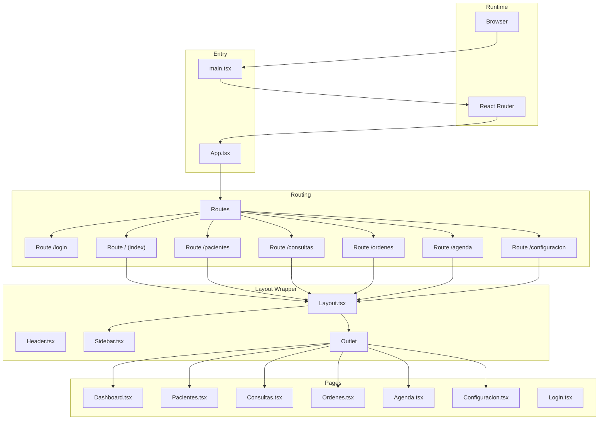
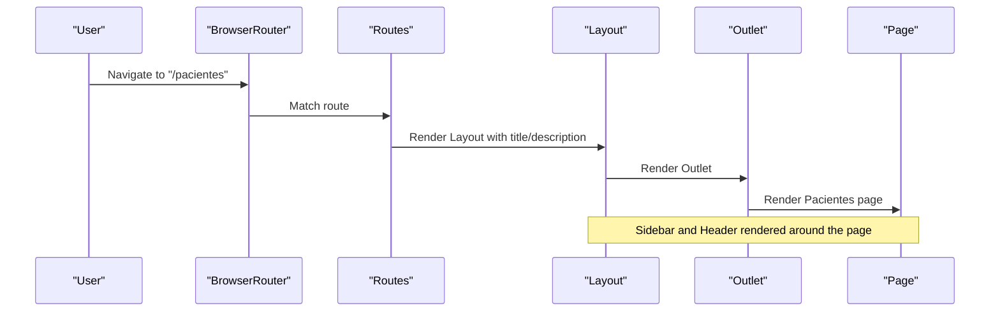
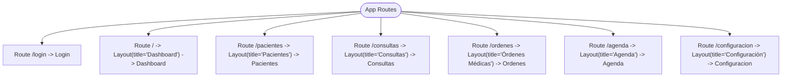
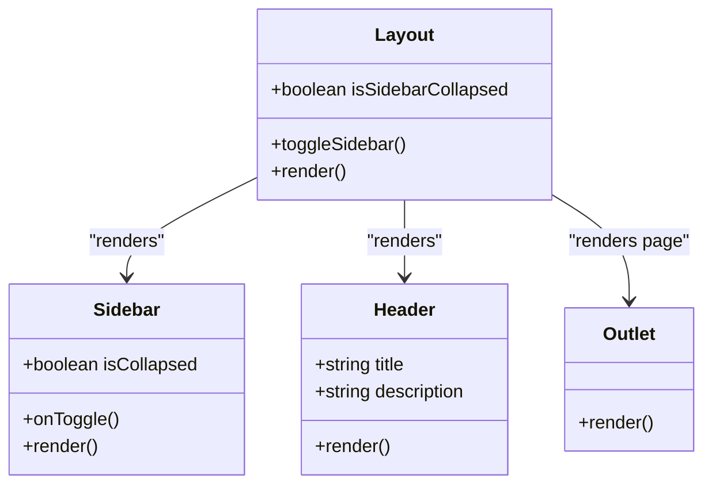
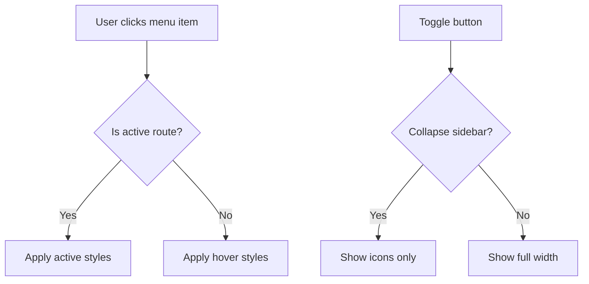
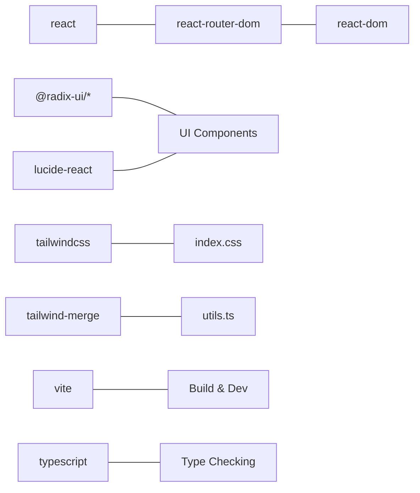

# Application Architecture

<cite>
**Referenced Files in This Document**
- [App.tsx](file://src/App.tsx)
- [main.tsx](file://src/main.tsx)
- [Layout.tsx](file://src/components/layout/Layout.tsx)
- [Header.tsx](file://src/components/layout/Header.tsx)
- [Sidebar.tsx](file://src/components/layout/Sidebar.tsx)
- [button.tsx](file://src/components/ui/button.tsx)
- [utils.ts](file://src/lib/utils.ts)
- [Dashboard.tsx](file://src/pages/Dashboard.tsx)
- [index.ts](file://src/types/index.ts)
- [index.css](file://src/index.css)
- [tailwind.config.ts](file://tailwind.config.ts)
- [vite.config.ts](file://vite.config.ts)
- [tsconfig.json](file://tsconfig.json)
- [package.json](file://package.json)
</cite>

## Table of Contents
1. [Introduction](#introduction)
2. [Project Structure](#project-structure)
3. [Core Components](#core-components)
4. [Architecture Overview](#architecture-overview)
5. [Detailed Component Analysis](#detailed-component-analysis)
6. [Dependency Analysis](#dependency-analysis)
7. [Performance Considerations](#performance-considerations)
8. [Troubleshooting Guide](#troubleshooting-guide)
9. [Conclusion](#conclusion)
10. [Appendices](#appendices)

## Introduction
This document describes the architectural design of the NexaMed frontend application. It focuses on the component hierarchy, the shared layout wrapper approach, nested routing via React Router, and the provider-free navigation context pattern. It also explains the separation of concerns among pages, components, and utilities, along with composition patterns, state management strategies, and responsive/mobile-first design implementation.

## Project Structure
The application follows a feature-based and layer-based organization:
- Entry point initializes the router and renders the app.
- Routing defines nested routes under a shared layout wrapper.
- Layout composes a sidebar and header, with the outlet rendering the current page.
- Pages implement clinic management sections (Dashboard, Patients, Consultations, Orders, Agenda, Configuration).
- UI primitives live under a dedicated components library.
- Utilities centralize cross-cutting helpers (class merging, formatting).
- Types define domain models and shared interfaces.
- Tailwind CSS and Vite configure styling and module resolution.

**Diagram sources**
- [main.tsx:1-14](file://src/main.tsx#L1-L14)
- [App.tsx:1-38](file://src/App.tsx#L1-L38)
- [Layout.tsx:1-35](file://src/components/layout/Layout.tsx#L1-L35)
- [Header.tsx:1-84](file://src/components/layout/Header.tsx#L1-L84)
- [Sidebar.tsx:1-107](file://src/components/layout/Sidebar.tsx#L1-L107)

**Section sources**
- [main.tsx:1-14](file://src/main.tsx#L1-L14)
- [App.tsx:1-38](file://src/App.tsx#L1-L38)
- [vite.config.ts:1-13](file://vite.config.ts#L1-L13)
- [tsconfig.json:1-26](file://tsconfig.json#L1-L26)

## Core Components
- Shared Layout: Provides a collapsible sidebar, sticky header, and outlet for page content. Manages local state for sidebar collapse and computes dynamic margins for responsive layout.
- Header: Renders page title/description, search input, notifications, and user dropdown menu. Uses UI primitives for inputs and buttons.
- Sidebar: Renders navigation items mapped to routes, toggles collapse state, and displays user profile in footer.
- UI Primitives: Reusable components (Button, Input, Card, Badge, Tabs, Dropdown, etc.) with variant and size APIs.
- Utilities: Class merging helper and date/time formatting helpers.
- Pages: Feature-specific views for clinic management (Dashboard, Patients, Consultations, Orders, Agenda, Configuration).

Key composition patterns:
- Composition over inheritance: Layout composes Header and Sidebar; pages render within Outlet.
- Props drilling is minimal: only necessary props are passed down (title, description, isCollapsed, onToggle).
- Local state per component: Sidebar collapse state is held in Layout; pages manage their own state as needed.

State management approach:
- Local component state for UI state (sidebar collapse, form inputs).
- No global state library is used; state remains scoped to components and pages.

**Section sources**
- [Layout.tsx:1-35](file://src/components/layout/Layout.tsx#L1-L35)
- [Header.tsx:1-84](file://src/components/layout/Header.tsx#L1-L84)
- [Sidebar.tsx:1-107](file://src/components/layout/Sidebar.tsx#L1-L107)
- [button.tsx:1-54](file://src/components/ui/button.tsx#L1-L54)
- [utils.ts:1-44](file://src/lib/utils.ts#L1-L44)
- [Dashboard.tsx:1-206](file://src/pages/Dashboard.tsx#L1-L206)

## Architecture Overview
The application uses React Router v6 with nested routing. Each clinic management section is wrapped by a shared Layout component that provides consistent navigation and branding. The routing configuration maps paths to pages and nests them under the Layout wrapper. The Layout component manages sidebar state and applies responsive spacing via Tailwind classes.

**Diagram sources**
- [main.tsx:1-14](file://src/main.tsx#L1-L14)
- [App.tsx:1-38](file://src/App.tsx#L1-L38)
- [Layout.tsx:1-35](file://src/components/layout/Layout.tsx#L1-L35)
- [Sidebar.tsx:1-107](file://src/components/layout/Sidebar.tsx#L1-L107)
- [Header.tsx:1-84](file://src/components/layout/Header.tsx#L1-L84)

## Detailed Component Analysis

### Routing and Nested Layout
- Entry point wraps the app with BrowserRouter and renders App.
- App defines routes for Login and each clinic section, nesting each under Layout with contextual title and description.
- Layout uses Outlet to render the matched page component.

**Diagram sources**
- [App.tsx:1-38](file://src/App.tsx#L1-L38)

**Section sources**
- [main.tsx:1-14](file://src/main.tsx#L1-L14)
- [App.tsx:1-38](file://src/App.tsx#L1-L38)

### Layout Component
- Holds local state for sidebar collapse.
- Computes dynamic margin for content area based on collapsed state.
- Composes Sidebar and Header, and renders the page via Outlet.

**Diagram sources**
- [Layout.tsx:1-35](file://src/components/layout/Layout.tsx#L1-L35)
- [Sidebar.tsx:1-107](file://src/components/layout/Sidebar.tsx#L1-L107)
- [Header.tsx:1-84](file://src/components/layout/Header.tsx#L1-L84)

**Section sources**
- [Layout.tsx:1-35](file://src/components/layout/Layout.tsx#L1-L35)

### Sidebar Navigation
- Defines menu items mapping paths to icons and labels.
- Uses NavLink to reflect active route and apply styles.
- Supports collapsing to icon-only mode with responsive adjustments.

**Diagram sources**
- [Sidebar.tsx:1-107](file://src/components/layout/Sidebar.tsx#L1-L107)

**Section sources**
- [Sidebar.tsx:1-107](file://src/components/layout/Sidebar.tsx#L1-L107)

### Header and User Menu
- Displays page title and optional description.
- Includes search input, notification indicator, and user dropdown menu.
- Uses UI primitives for consistent styling.

**Section sources**
- [Header.tsx:1-84](file://src/components/layout/Header.tsx#L1-L84)

### UI Primitive: Button
- Implements variant and size variants with class merging.
- Supports forwardRef and asChild pattern for composition.

**Section sources**
- [button.tsx:1-54](file://src/components/ui/button.tsx#L1-L54)

### Utilities and Formatting
- Class merging helper integrates clsx and tailwind-merge.
- Date/time formatting helpers support Spanish locale formatting and age calculation.
- Used across components for consistent presentation.

**Section sources**
- [utils.ts:1-44](file://src/lib/utils.ts#L1-L44)

### Page Example: Dashboard
- Demonstrates grid-based layout and card composition.
- Uses utility functions for date formatting.
- Shows local state usage and interactive elements.

**Section sources**
- [Dashboard.tsx:1-206](file://src/pages/Dashboard.tsx#L1-L206)

### Domain Types
- Defines core domain models (User, Consultorio, Paciente, Consulta, OrdenMedica, Archivo, Cita, Suscripcion, DashboardStats).
- Centralizes shared interfaces for type safety across components and pages.

**Section sources**
- [index.ts:1-128](file://src/types/index.ts#L1-L128)

## Dependency Analysis
External libraries and tooling:
- React and React Router for UI and routing.
- Radix UI primitives for accessible components.
- Lucide React for icons.
- Tailwind CSS and Tailwind Merge for styling and class composition.
- Vite for bundling and module resolution.
- TypeScript for type safety.

**Diagram sources**
- [package.json:12-32](file://package.json#L12-L32)
- [vite.config.ts:1-13](file://vite.config.ts#L1-L13)
- [tsconfig.json:1-26](file://tsconfig.json#L1-L26)

**Section sources**
- [package.json:1-49](file://package.json#L1-L49)
- [vite.config.ts:1-13](file://vite.config.ts#L1-L13)
- [tsconfig.json:1-26](file://tsconfig.json#L1-L26)

## Performance Considerations
- Minimal re-renders: Layout holds only the sidebar collapse state; pages manage their own state locally.
- CSS transitions: Smooth sidebar and content transitions leverage Tailwind utilities.
- Responsive breakpoints: Tailwind classes handle responsive layouts without heavy JS.
- Bundle size: Vite with React plugin optimizes builds; aliasing reduces import verbosity.

[No sources needed since this section provides general guidance]

## Troubleshooting Guide
Common issues and resolutions:
- Routing not working: Ensure BrowserRouter wraps the app and routes match the intended paths.
- Layout not rendering: Verify Layout is used as a parent route and Outlet is present.
- Styling inconsistencies: Confirm Tailwind content paths include components and pages; rebuild after changes.
- Module resolution errors: Check Vite alias and TypeScript path mapping for "@/*".

**Section sources**
- [main.tsx:1-14](file://src/main.tsx#L1-L14)
- [App.tsx:1-38](file://src/App.tsx#L1-L38)
- [tailwind.config.ts:1-103](file://tailwind.config.ts#L1-L103)
- [vite.config.ts:1-13](file://vite.config.ts#L1-L13)
- [tsconfig.json:18-21](file://tsconfig.json#L18-L21)

## Conclusion
NexaMed employs a clean, layered architecture with a shared layout wrapper and nested routing to deliver a cohesive clinic management experience. The design emphasizes separation of concerns, composability via UI primitives, and a mobile-first responsive approach. State remains local and scoped, keeping the system predictable and maintainable.

[No sources needed since this section summarizes without analyzing specific files]

## Appendices

### Responsive Design and Mobile-First Approach
- Tailwind configuration enables responsive utilities and custom animations.
- Layout adjusts content margins based on sidebar collapse state.
- Components use responsive variants (hidden on small screens, visible on medium+).

**Section sources**
- [tailwind.config.ts:1-103](file://tailwind.config.ts#L1-L103)
- [Layout.tsx:16-32](file://src/components/layout/Layout.tsx#L16-L32)
- [Header.tsx:34-41](file://src/components/layout/Header.tsx#L34-L41)

### Provider Pattern and Navigation Context
- Navigation context is provided implicitly via React Router’s NavLink and Outlet.
- No custom context providers are used; navigation state is derived from routing.

**Section sources**
- [Sidebar.tsx:67-84](file://src/components/layout/Sidebar.tsx#L67-L84)
- [Layout.tsx:29](file://src/components/layout/Layout.tsx#L29)