# Component Hierarchy

<cite>
**Referenced Files in This Document**
- [main.tsx](file://src/main.tsx)
- [App.tsx](file://src/App.tsx)
- [Layout.tsx](file://src/components/layout/Layout.tsx)
- [Header.tsx](file://src/components/layout/Header.tsx)
- [Sidebar.tsx](file://src/components/layout/Sidebar.tsx)
- [button.tsx](file://src/components/ui/button.tsx)
- [card.tsx](file://src/components/ui/card.tsx)
- [input.tsx](file://src/components/ui/input.tsx)
- [dropdown-menu.tsx](file://src/components/ui/dropdown-menu.tsx)
- [utils.ts](file://src/lib/utils.ts)
- [index.ts](file://src/types/index.ts)
- [Dashboard.tsx](file://src/pages/Dashboard.tsx)
- [Pacientes.tsx](file://src/pages/Pacientes.tsx)
- [Consultas.tsx](file://src/pages/Consultas.tsx)
- [Login.tsx](file://src/pages/Login.tsx)
- [package.json](file://package.json)
</cite>

## Table of Contents
1. [Introduction](#introduction)
2. [Project Structure](#project-structure)
3. [Core Components](#core-components)
4. [Architecture Overview](#architecture-overview)
5. [Detailed Component Analysis](#detailed-component-analysis)
6. [Dependency Analysis](#dependency-analysis)
7. [Performance Considerations](#performance-considerations)
8. [Troubleshooting Guide](#troubleshooting-guide)
9. [Conclusion](#conclusion)

## Introduction
This document explains the component hierarchy and architectural patterns of the NexaMed frontend. It focuses on how App.tsx orchestrates routing and page rendering, how layout wrappers encapsulate shared UI, and how reusable UI components are composed across pages. It also documents prop passing strategies, state management patterns, TypeScript interfaces for type safety, and best practices for component organization.

## Project Structure
The project follows a feature-based organization with clear separation between:
- Pages: route-specific views such as Dashboard, Pacientes, Consultas, and Login
- Layout: shared header, sidebar, and outlet container
- UI: reusable component primitives (Button, Card, Input, DropdownMenu)
- Types: domain interfaces for users, patients, consultations, orders, and related entities
- Utilities: cross-cutting helpers for class merging, formatting, and ID generation

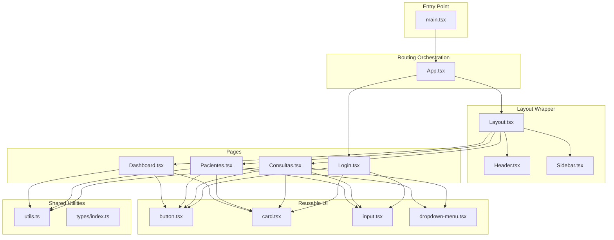

**Diagram sources**
- [main.tsx:1-14](file://src/main.tsx#L1-L14)
- [App.tsx:1-38](file://src/App.tsx#L1-L38)
- [Layout.tsx:1-35](file://src/components/layout/Layout.tsx#L1-L35)
- [Header.tsx:1-84](file://src/components/layout/Header.tsx#L1-L84)
- [Sidebar.tsx:1-107](file://src/components/layout/Sidebar.tsx#L1-L107)
- [Dashboard.tsx:1-206](file://src/pages/Dashboard.tsx#L1-L206)
- [Pacientes.tsx:1-279](file://src/pages/Pacientes.tsx#L1-L279)
- [Consultas.tsx:1-231](file://src/pages/Consultas.tsx#L1-L231)
- [Login.tsx:1-138](file://src/pages/Login.tsx#L1-L138)
- [button.tsx:1-54](file://src/components/ui/button.tsx#L1-L54)
- [card.tsx:1-76](file://src/components/ui/card.tsx#L1-L76)
- [input.tsx:1-25](file://src/components/ui/input.tsx#L1-L25)
- [dropdown-menu.tsx:1-190](file://src/components/ui/dropdown-menu.tsx#L1-L190)
- [utils.ts:1-44](file://src/lib/utils.ts#L1-L44)
- [index.ts:1-128](file://src/types/index.ts#L1-L128)

**Section sources**
- [main.tsx:1-14](file://src/main.tsx#L1-L14)
- [App.tsx:1-38](file://src/App.tsx#L1-L38)

## Core Components
- App.tsx: Central router that defines routes and wraps page components with the Layout wrapper. It sets up nested routes for each page and passes metadata (title, description) to the layout.
- Layout.tsx: Provides the shared shell around pages, managing sidebar collapse state and rendering the outlet for the current page.
- Header.tsx and Sidebar.tsx: Shared header and navigation bar, consuming props from Layout and providing interactive elements.
- Page components: Dashboard, Pacientes, Consultas, and Login render page-specific content and compose reusable UI components.

Key patterns:
- Composition: Pages are rendered inside Layout, which composes Header and Sidebar.
- Props: Layout receives title and description; Sidebar receives toggle callbacks; Header receives title and optional description.
- State: Layout manages local state for sidebar collapse; pages manage their own local state for filters and selections.

**Section sources**
- [App.tsx:11-35](file://src/App.tsx#L11-L35)
- [Layout.tsx:12-34](file://src/components/layout/Layout.tsx#L12-L34)
- [Header.tsx:19-83](file://src/components/layout/Header.tsx#L19-L83)
- [Sidebar.tsx:31-106](file://src/components/layout/Sidebar.tsx#L31-L106)

## Architecture Overview
The runtime architecture centers on React Router v6 with nested routes. App.tsx configures routes and wraps page routes with Layout. Layout renders Header and Sidebar and injects the active page via Outlet. Pages import UI primitives and utilities to implement their views.

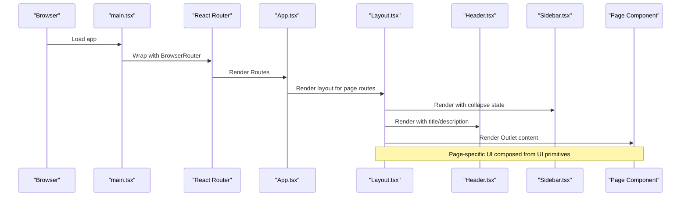

**Diagram sources**
- [main.tsx:7-13](file://src/main.tsx#L7-L13)
- [App.tsx:13-33](file://src/App.tsx#L13-L33)
- [Layout.tsx:15-31](file://src/components/layout/Layout.tsx#L15-L31)
- [Header.tsx:20-81](file://src/components/layout/Header.tsx#L20-L81)
- [Sidebar.tsx:33-103](file://src/components/layout/Sidebar.tsx#L33-L103)

## Detailed Component Analysis

### App.tsx: Routing Orchestration
- Defines top-level routes and nested routes under Layout.
- Passes page metadata (title, description) to Layout for dynamic header content.
- Renders Login outside the layout wrapper.

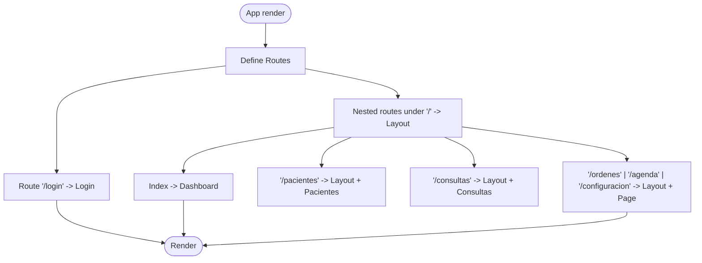

**Diagram sources**
- [App.tsx:13-33](file://src/App.tsx#L13-L33)

**Section sources**
- [App.tsx:11-35](file://src/App.tsx#L11-L35)

### Layout.tsx: Shared Shell and State
- Manages local state for sidebar collapse.
- Composes Sidebar and Header, then renders the active page via Outlet.
- Applies responsive spacing based on sidebar state.

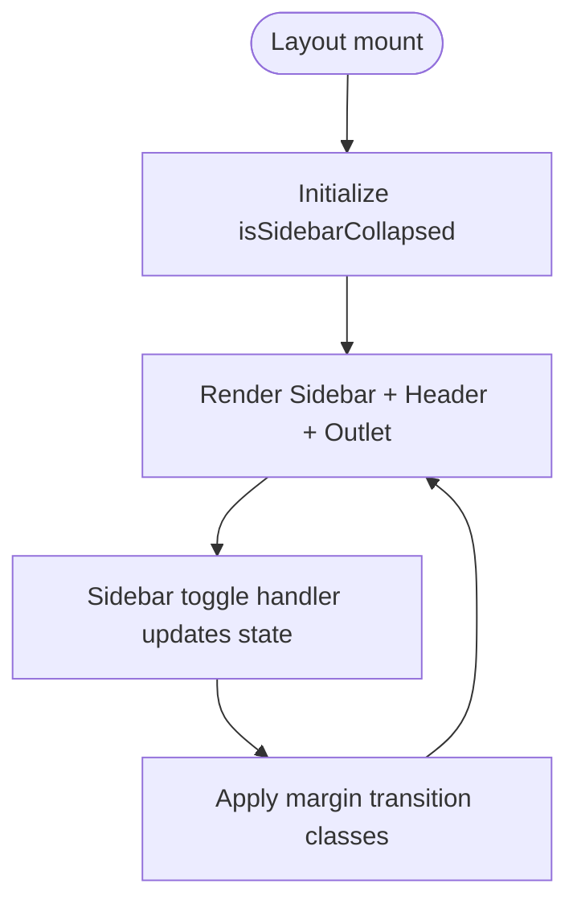

**Diagram sources**
- [Layout.tsx:12-34](file://src/components/layout/Layout.tsx#L12-L34)

**Section sources**
- [Layout.tsx:12-34](file://src/components/layout/Layout.tsx#L12-L34)

### Header.tsx: Page Header Bar
- Receives title and optional description from Layout.
- Composes search input, notifications, and user dropdown menu using UI primitives.

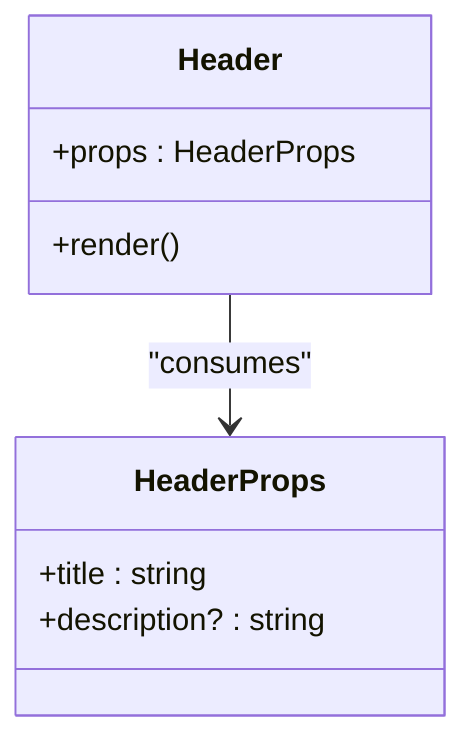

**Diagram sources**
- [Header.tsx:14-17](file://src/components/layout/Header.tsx#L14-L17)

**Section sources**
- [Header.tsx:19-83](file://src/components/layout/Header.tsx#L19-L83)

### Sidebar.tsx: Navigation and Collapsing Behavior
- Receives collapse state and toggle callback from Layout.
- Renders navigation items with active state styling and handles collapse/expand transitions.

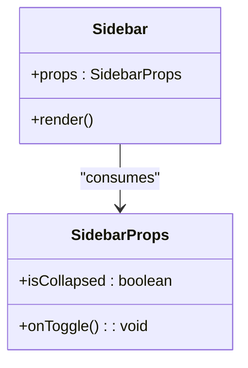

**Diagram sources**
- [Sidebar.tsx:17-20](file://src/components/layout/Sidebar.tsx#L17-L20)

**Section sources**
- [Sidebar.tsx:31-106](file://src/components/layout/Sidebar.tsx#L31-L106)

### Dashboard.tsx: Example Page Composition
- Uses Card, Button, Badge, and icons to present statistics and recent activity.
- Demonstrates local state for animations and utility functions for formatting dates.

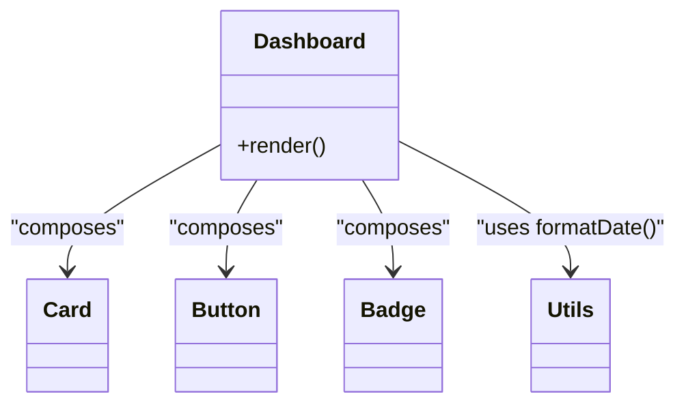

**Diagram sources**
- [Dashboard.tsx:11-14](file://src/pages/Dashboard.tsx#L11-L14)
- [utils.ts:8-15](file://src/lib/utils.ts#L8-L15)

**Section sources**
- [Dashboard.tsx:62-201](file://src/pages/Dashboard.tsx#L62-L201)

### Pacientes.tsx: Filtering and Lists
- Implements search filtering and renders a list of patient cards.
- Uses Input, Button, Card, Badge, DropdownMenu, and utility functions.

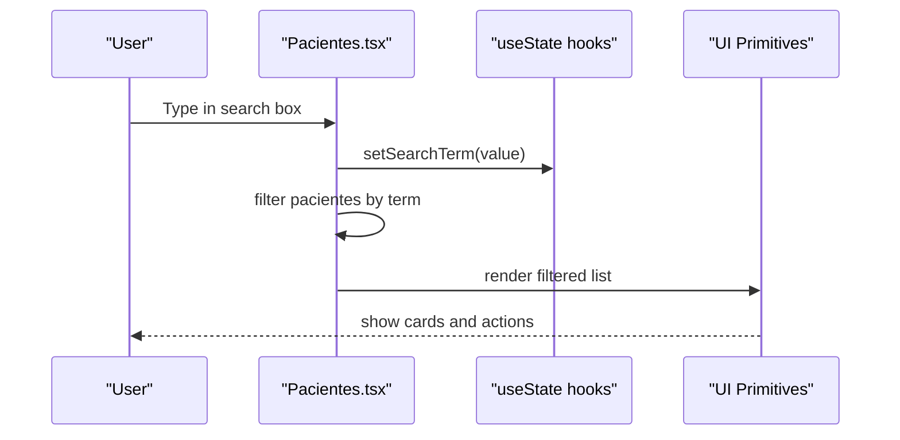

**Diagram sources**
- [Pacientes.tsx:94-101](file://src/pages/Pacientes.tsx#L94-L101)
- [input.tsx:7-21](file://src/components/ui/input.tsx#L7-L21)
- [button.tsx:39-50](file://src/components/ui/button.tsx#L39-L50)
- [card.tsx:4-17](file://src/components/ui/card.tsx#L4-L17)
- [dropdown-menu.tsx:67-83](file://src/components/ui/dropdown-menu.tsx#L67-L83)

**Section sources**
- [Pacientes.tsx:93-278](file://src/pages/Pacientes.tsx#L93-L278)

### Consultas.tsx: Tabs and Filtering
- Uses Tabs to segment consultation records by status.
- Filters data based on search term and active tab, rendering cards with contextual badges.

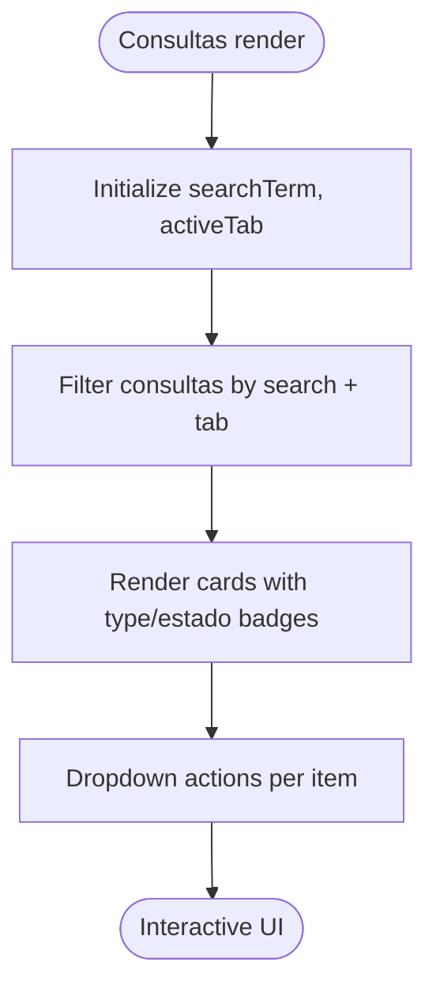

**Diagram sources**
- [Consultas.tsx:77-118](file://src/pages/Consultas.tsx#L77-L118)
- [tabs.tsx:1-200](file://src/components/ui/tabs.tsx#L1-L200)

**Section sources**
- [Consultas.tsx:77-230](file://src/pages/Consultas.tsx#L77-L230)

### Login.tsx: Authentication Form
- Manages form state, toggles password visibility, and simulates submission with navigation after delay.

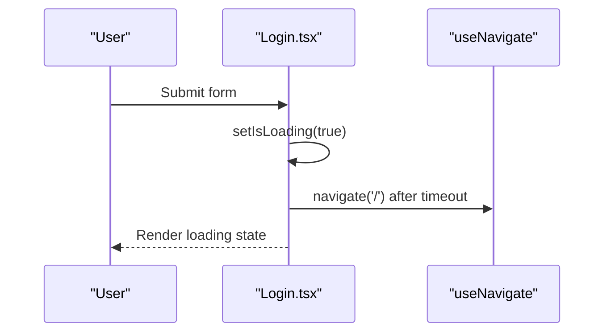

**Diagram sources**
- [Login.tsx:18-27](file://src/pages/Login.tsx#L18-L27)

**Section sources**
- [Login.tsx:9-137](file://src/pages/Login.tsx#L9-L137)

### Reusable UI Components
- Button: Variants and sizes via class variance authority; accepts Radix Slot for composition.
- Card: Header, Title, Description, Content, Footer slots with forward refs.
- Input: Forward ref with consistent styling and focus behavior.
- DropdownMenu: Full primitive set for menus, submenus, and triggers.

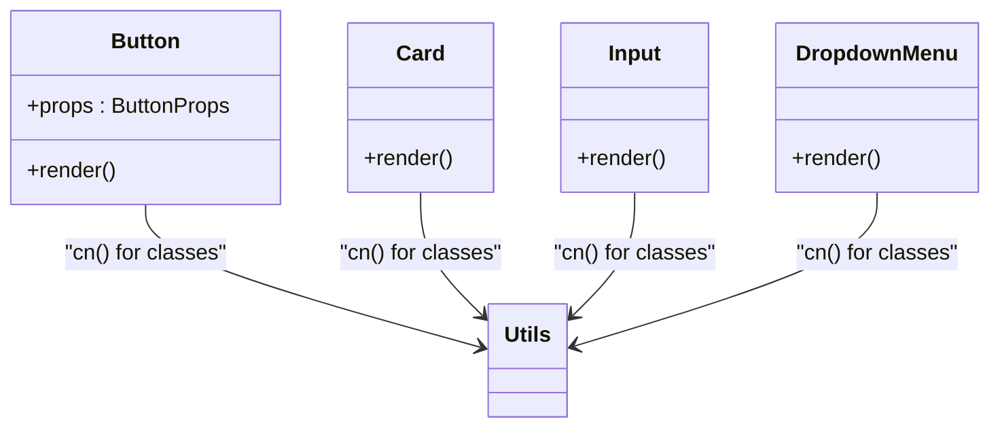

**Diagram sources**
- [button.tsx:39-50](file://src/components/ui/button.tsx#L39-L50)
- [card.tsx:4-75](file://src/components/ui/card.tsx#L4-L75)
- [input.tsx:7-21](file://src/components/ui/input.tsx#L7-L21)
- [dropdown-menu.tsx:67-83](file://src/components/ui/dropdown-menu.tsx#L67-L83)
- [utils.ts:4-6](file://src/lib/utils.ts#L4-L6)

**Section sources**
- [button.tsx:33-53](file://src/components/ui/button.tsx#L33-L53)
- [card.tsx:4-75](file://src/components/ui/card.tsx#L4-L75)
- [input.tsx:4-24](file://src/components/ui/input.tsx#L4-L24)
- [dropdown-menu.tsx:6-190](file://src/components/ui/dropdown-menu.tsx#L6-L190)

### Utilities and Types
- utils.ts: Tailwind-aware class merging, date formatting, age calculation, and ID generation.
- types/index.ts: Domain interfaces for User, Consultorio, Paciente, Consulta, SignosVitales, OrdenMedica, Archivo, Cita, Suscripcion, and DashboardStats.

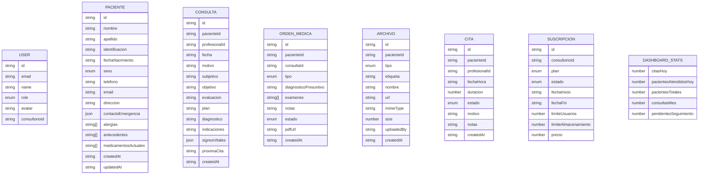

**Diagram sources**
- [index.ts:1-128](file://src/types/index.ts#L1-L128)

**Section sources**
- [utils.ts:4-44](file://src/lib/utils.ts#L4-L44)
- [index.ts:1-128](file://src/types/index.ts#L1-L128)

## Dependency Analysis
External dependencies relevant to component architecture:
- react-router-dom: Routing and navigation
- lucide-react: Icons for UI
- @radix-ui/react-*: Primitive UI components (dropdown, tabs, etc.)
- class-variance-authority, clsx, tailwind-merge: Component styling and variants
- date-fns: Date utilities (referenced in utils)

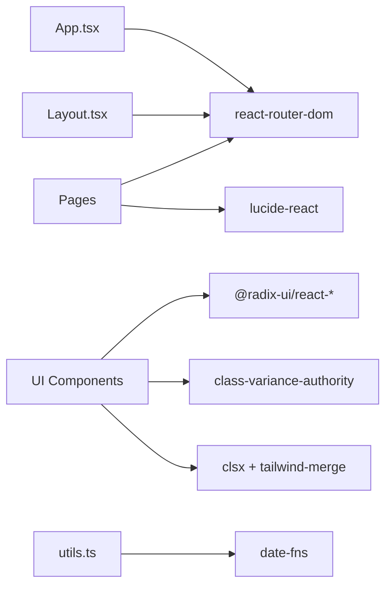

**Diagram sources**
- [package.json:12-32](file://package.json#L12-L32)
- [utils.ts:8-15](file://src/lib/utils.ts#L8-L15)

**Section sources**
- [package.json:12-32](file://package.json#L12-L32)

## Performance Considerations
- Prefer local component state for UI toggles (e.g., sidebar collapse) to avoid unnecessary prop drilling.
- Memoize derived data when lists grow large (e.g., filtered patient or consultation lists).
- Use CSS transitions judiciously; keep animation durations reasonable for smooth UX.
- Lazy-load heavy pages if needed, though current pages appear self-contained.
- Keep UI components pure and delegate heavy computations to utilities or services.

## Troubleshooting Guide
Common issues and remedies:
- Layout not updating after sidebar toggle: Verify state update path and that cn() merges classes correctly.
- Navigation active state not highlighting: Confirm NavLink isActive logic and that menuItems match route paths.
- Form submission not navigating: Ensure useNavigate is called after loading completes and that the route path matches App.tsx.
- Styling conflicts: Use cn() consistently and avoid inline overrides; prefer component variants.

**Section sources**
- [Layout.tsx:13-25](file://src/components/layout/Layout.tsx#L13-L25)
- [Sidebar.tsx:69-84](file://src/components/layout/Sidebar.tsx#L69-L84)
- [Login.tsx:23-26](file://src/pages/Login.tsx#L23-L26)
- [utils.ts:4-6](file://src/lib/utils.ts#L4-L6)

## Conclusion
NexaMed’s component hierarchy cleanly separates page-level concerns from reusable UI primitives, with App.tsx orchestrating routing and Layout.tsx providing a consistent shell. Pages compose UI components and utilities to deliver domain-specific experiences while maintaining type safety through shared interfaces. Following the documented patterns ensures predictable prop passing, manageable state, and scalable component organization.