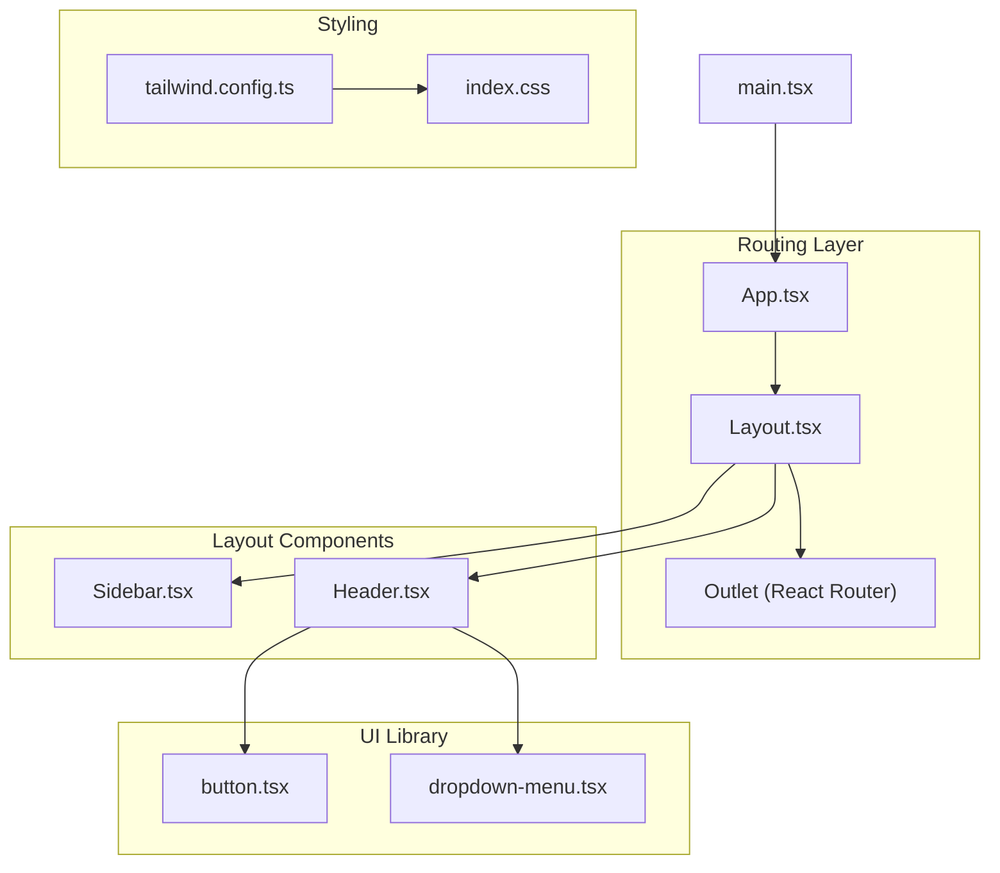
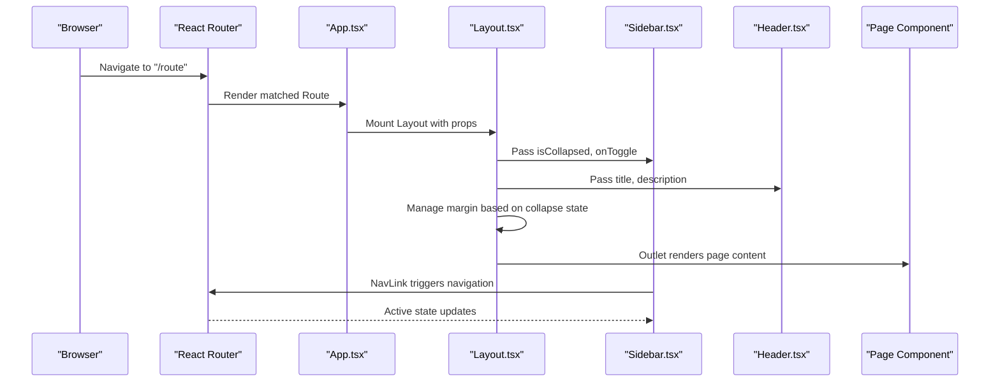
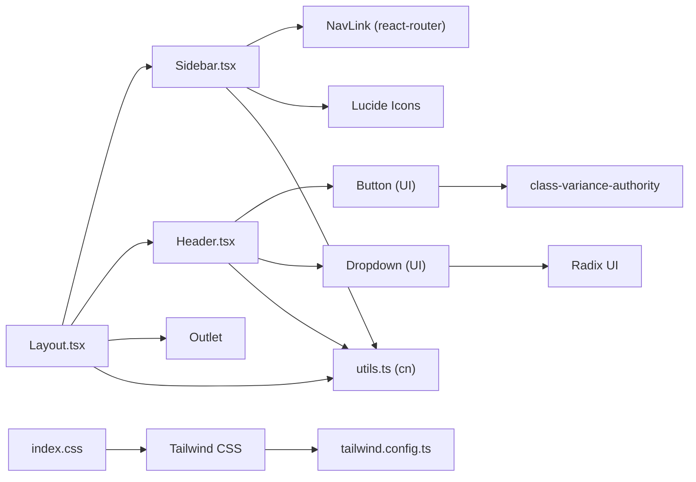
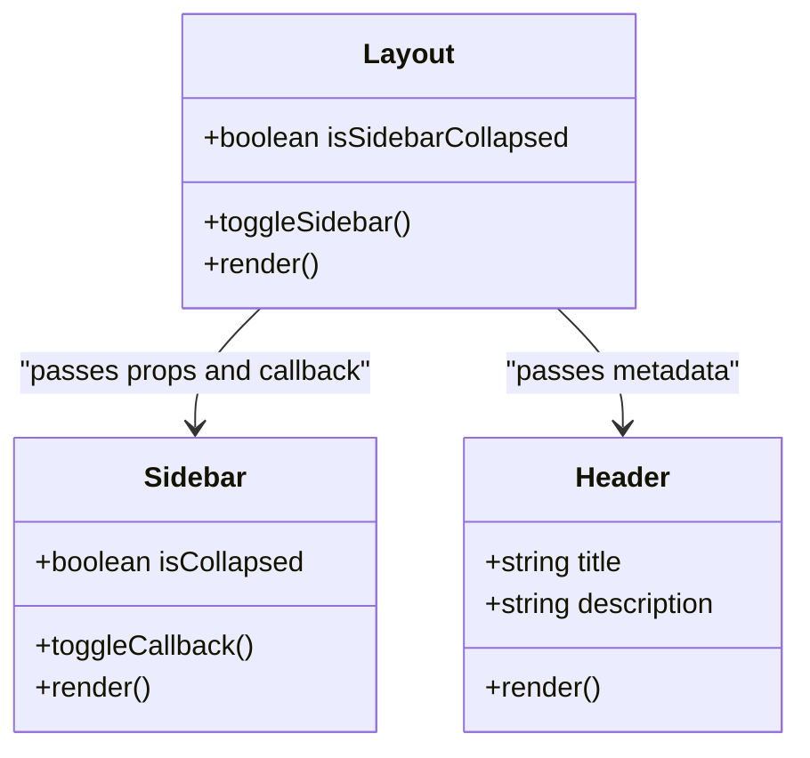
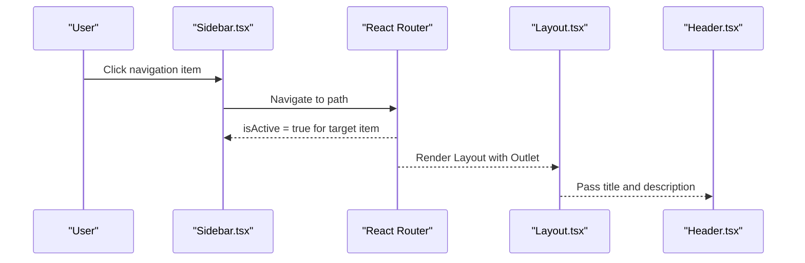
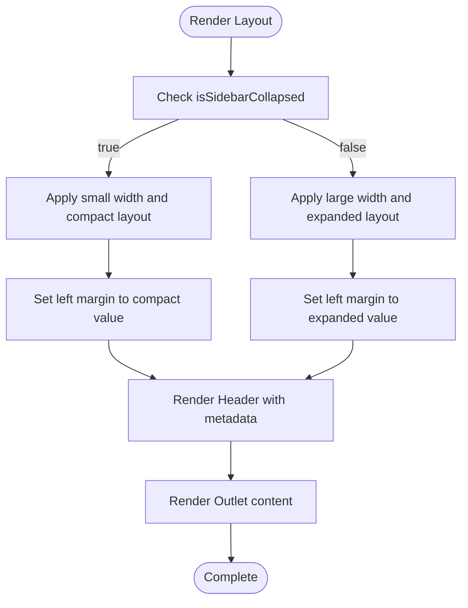

# Layout System

<cite>
**Referenced Files in This Document**
- [Layout.tsx](file://NexaMed-Frontend/src/components/layout/Layout.tsx)
- [Sidebar.tsx](file://NexaMed-Frontend/src/components/layout/Sidebar.tsx)
- [Header.tsx](file://NexaMed-Frontend/src/components/layout/Header.tsx)
- [App.tsx](file://NexaMed-Frontend/src/App.tsx)
- [main.tsx](file://NexaMed-Frontend/src/main.tsx)
- [index.css](file://NexaMed-Frontend/src/index.css)
- [tailwind.config.ts](file://NexaMed-Frontend/tailwind.config.ts)
- [utils.ts](file://NexaMed-Frontend/src/lib/utils.ts)
- [button.tsx](file://NexaMed-Frontend/src/components/ui/button.tsx)
- [dropdown-menu.tsx](file://NexaMed-Frontend/src/components/ui/dropdown-menu.tsx)
- [Dashboard.tsx](file://NexaMed-Frontend/src/pages/Dashboard.tsx)
- [vite.config.ts](file://NexaMed-Frontend/vite.config.ts)
</cite>

## Table of Contents
1. [Introduction](#introduction)
2. [Project Structure](#project-structure)
3. [Core Components](#core-components)
4. [Architecture Overview](#architecture-overview)
5. [Detailed Component Analysis](#detailed-component-analysis)
6. [Dependency Analysis](#dependency-analysis)
7. [Performance Considerations](#performance-considerations)
8. [Troubleshooting Guide](#troubleshooting-guide)
9. [Conclusion](#conclusion)
10. [Appendices](#appendices)

## Introduction
This document explains the NexaMed layout system architecture with a focus on the component hierarchy, responsive design, collapsible sidebar, and Tailwind CSS styling approach. The layout system centers around a main Layout wrapper that composes a fixed Sidebar and a dynamic Header, with page content rendered via React Router’s Outlet. The system emphasizes a mobile-first approach, integrates with the routing system for navigation state synchronization, and provides layout customization through props and shared utilities.

## Project Structure
The layout system resides under the components/layout folder and integrates with the routing system defined in App.tsx. The Tailwind CSS configuration and global styles define the theming and responsive behavior. Utility functions centralize class merging and formatting helpers.

**Diagram sources**
- [App.tsx:11-35](file://NexaMed-Frontend/src/App.tsx#L11-L35)
- [Layout.tsx:12-34](file://NexaMed-Frontend/src/components/layout/Layout.tsx#L12-L34)
- [Sidebar.tsx:31-106](file://NexaMed-Frontend/src/components/layout/Sidebar.tsx#L31-L106)
- [Header.tsx:19-83](file://NexaMed-Frontend/src/components/layout/Header.tsx#L19-L83)
- [button.tsx:6-31](file://NexaMed-Frontend/src/components/ui/button.tsx#L6-L31)
- [dropdown-menu.tsx:6-65](file://NexaMed-Frontend/src/components/ui/dropdown-menu.tsx#L6-L65)
- [tailwind.config.ts:3-102](file://NexaMed-Frontend/tailwind.config.ts#L3-L102)
- [index.css:1-191](file://NexaMed-Frontend/src/index.css#L1-L191)
- [main.tsx:7-13](file://NexaMed-Frontend/src/main.tsx#L7-L13)

**Section sources**
- [App.tsx:11-35](file://NexaMed-Frontend/src/App.tsx#L11-L35)
- [Layout.tsx:12-34](file://NexaMed-Frontend/src/components/layout/Layout.tsx#L12-L34)
- [Sidebar.tsx:31-106](file://NexaMed-Frontend/src/components/layout/Sidebar.tsx#L31-L106)
- [Header.tsx:19-83](file://NexaMed-Frontend/src/components/layout/Header.tsx#L19-L83)
- [tailwind.config.ts:3-102](file://NexaMed-Frontend/tailwind.config.ts#L3-L102)
- [index.css:1-191](file://NexaMed-Frontend/src/index.css#L1-L191)
- [main.tsx:7-13](file://NexaMed-Frontend/src/main.tsx#L7-L13)

## Core Components
- Layout: The main wrapper component that manages sidebar collapse state, applies responsive margins, and renders the page content via Outlet. It receives title and description props to populate the Header.
- Sidebar: Fixed navigation drawer with collapsible width, logo, toggle button, navigation links synchronized with routes, and a user footer.
- Header: Dynamic header area displaying page title and description, search input, notifications, and user dropdown menu.

Key implementation patterns:
- Prop drilling: Layout passes title and description to Header; Layout passes isCollapsed and onToggle to Sidebar.
- State management: Layout maintains isSidebarCollapsed state and toggles it via a callback passed down to Sidebar.
- Composition: Layout composes Sidebar and Header, and renders page content via Outlet.

**Section sources**
- [Layout.tsx:7-34](file://NexaMed-Frontend/src/components/layout/Layout.tsx#L7-L34)
- [Sidebar.tsx:17-29](file://NexaMed-Frontend/src/components/layout/Sidebar.tsx#L17-L29)
- [Header.tsx:14-17](file://NexaMed-Frontend/src/components/layout/Header.tsx#L14-L17)

## Architecture Overview
The layout system follows a predictable flow: the router mounts Layout for each route, Layout initializes sidebar state, renders Sidebar and Header, and delegates page rendering to Outlet. Sidebar’s navigation items are linked to routes, enabling automatic active-state styling via NavLink. The Header displays page metadata and user controls.

**Diagram sources**
- [App.tsx:11-35](file://NexaMed-Frontend/src/App.tsx#L11-L35)
- [Layout.tsx:12-34](file://NexaMed-Frontend/src/components/layout/Layout.tsx#L12-L34)
- [Sidebar.tsx:31-106](file://NexaMed-Frontend/src/components/layout/Sidebar.tsx#L31-L106)
- [Header.tsx:19-83](file://NexaMed-Frontend/src/components/layout/Header.tsx#L19-L83)

## Detailed Component Analysis

### Layout Component
Responsibilities:
- Manages sidebar collapse state with useState.
- Applies responsive left margin to content area based on collapse state.
- Renders Header with page metadata and Outlet for page content.

State and props:
- State: isSidebarCollapsed (boolean).
- Props: title (string), description (optional string).

Responsive behavior:
- Uses Tailwind classes to adjust left margin when collapsed (e.g., ml-20 vs ml-64) and transitions with duration-300.

Integration with routing:
- Wraps page components defined in App.tsx routes.

**Section sources**
- [Layout.tsx:12-34](file://NexaMed-Frontend/src/components/layout/Layout.tsx#L12-L34)
- [App.tsx:15-32](file://NexaMed-Frontend/src/App.tsx#L15-L32)

### Sidebar Component
Responsibilities:
- Fixed position drawer with logo, navigation menu, and user footer.
- Collapsible width controlled by isCollapsed prop.
- Toggle button to switch collapse state.

Navigation:
- menuItems array defines paths, icons, and labels.
- NavLink components render active state based on current route.

Responsive behavior:
- Width transitions between 20 and 64 units; text visibility toggled when collapsed.
- Active item styling uses conditional classes based on isActive.

Accessibility and UX:
- Hover and active states use consistent color tokens and transitions.

**Section sources**
- [Sidebar.tsx:22-29](file://NexaMed-Frontend/src/components/layout/Sidebar.tsx#L22-L29)
- [Sidebar.tsx:67-86](file://NexaMed-Frontend/src/components/layout/Sidebar.tsx#L67-L86)
- [Sidebar.tsx:31-106](file://NexaMed-Frontend/src/components/layout/Sidebar.tsx#L31-L106)

### Header Component
Responsibilities:
- Displays page title and optional description.
- Provides search input (hidden on small screens), notification bell, and user dropdown menu.

UI primitives:
- Uses Button and Dropdown components from the UI library.
- Uses Input component for search.

Responsive behavior:
- Search input is hidden on small screens using md:block.
- Sticky positioning and backdrop blur enhance usability.

**Section sources**
- [Header.tsx:19-83](file://NexaMed-Frontend/src/components/layout/Header.tsx#L19-L83)
- [button.tsx:6-31](file://NexaMed-Frontend/src/components/ui/button.tsx#L6-L31)
- [dropdown-menu.tsx:6-65](file://NexaMed-Frontend/src/components/ui/dropdown-menu.tsx#L6-L65)

### Routing Integration and Navigation State Synchronization
- App.tsx defines routes with Layout wrappers and sets page metadata via props.
- Sidebar uses NavLink to navigate; active state is automatically reflected via isActive.
- Layout’s margin adjusts dynamically based on collapse state, ensuring content alignment.

**Section sources**
- [App.tsx:11-35](file://NexaMed-Frontend/src/App.tsx#L11-L35)
- [Sidebar.tsx:67-86](file://NexaMed-Frontend/src/components/layout/Sidebar.tsx#L67-L86)
- [Layout.tsx:21-31](file://NexaMed-Frontend/src/components/layout/Layout.tsx#L21-L31)

### Tailwind CSS Styling Approach and Responsive Breakpoints
- Theme extension defines semantic tokens, color scales (including a dedicated medical palette), border radius, and keyframe animations.
- Global CSS establishes CSS variables for light and dark modes, gradients, shadows, and transitions.
- Utilities layer adds reusable component-level classes and animation helpers.
- Responsive utilities are used throughout (e.g., md:block in Header).

Breakpoints and responsive patterns:
- md:block indicates medium breakpoint for hiding/showing elements.
- Grid utilities (md:grid-cols-2, lg:grid-cols-4, lg:col-span-4/7) demonstrate layered responsiveness.
- No explicit custom breakpoints are defined in the Tailwind config; defaults apply.

**Section sources**
- [tailwind.config.ts:19-97](file://NexaMed-Frontend/tailwind.config.ts#L19-L97)
- [index.css:5-191](file://NexaMed-Frontend/src/index.css#L5-L191)
- [Header.tsx:34-41](file://NexaMed-Frontend/src/components/layout/Header.tsx#L34-L41)
- [Dashboard.tsx:66-90](file://NexaMed-Frontend/src/pages/Dashboard.tsx#L66-L90)

### Utility Functions and Class Merging
- cn utility merges Tailwind classes safely using clsx and tailwind-merge.
- Used extensively to conditionally combine classes across components.

**Section sources**
- [utils.ts:4-6](file://NexaMed-Frontend/src/lib/utils.ts#L4-L6)
- [Layout.tsx:22-25](file://NexaMed-Frontend/src/components/layout/Layout.tsx#L22-L25)
- [Sidebar.tsx:71-79](file://NexaMed-Frontend/src/components/layout/Sidebar.tsx#L71-L79)

## Dependency Analysis
The layout system exhibits clear separation of concerns:
- Layout depends on Sidebar and Header and composes Outlet.
- Sidebar depends on React Router NavLink for navigation and Lucide icons for visuals.
- Header depends on UI primitives (Button, Dropdown, Input) and Lucide icons.
- UI primitives depend on Radix UI primitives and class variance authority for variants.
- Styling relies on Tailwind CSS and global CSS variables.

**Diagram sources**
- [Layout.tsx:3-5](file://NexaMed-Frontend/src/components/layout/Layout.tsx#L3-L5)
- [Sidebar.tsx:2-15](file://NexaMed-Frontend/src/components/layout/Sidebar.tsx#L2-L15)
- [Header.tsx:1-12](file://NexaMed-Frontend/src/components/layout/Header.tsx#L1-L12)
- [button.tsx:3-4](file://NexaMed-Frontend/src/components/ui/button.tsx#L3-L4)
- [dropdown-menu.tsx:2-4](file://NexaMed-Frontend/src/components/ui/dropdown-menu.tsx#L2-L4)
- [utils.ts:1-6](file://NexaMed-Frontend/src/lib/utils.ts#L1-L6)
- [index.css:1-3](file://NexaMed-Frontend/src/index.css#L1-L3)
- [tailwind.config.ts:1-10](file://NexaMed-Frontend/tailwind.config.ts#L1-L10)

**Section sources**
- [Layout.tsx:3-5](file://NexaMed-Frontend/src/components/layout/Layout.tsx#L3-L5)
- [Sidebar.tsx:2-15](file://NexaMed-Frontend/src/components/layout/Sidebar.tsx#L2-L15)
- [Header.tsx:1-12](file://NexaMed-Frontend/src/components/layout/Header.tsx#L1-L12)
- [button.tsx:3-4](file://NexaMed-Frontend/src/components/ui/button.tsx#L3-L4)
- [dropdown-menu.tsx:2-4](file://NexaMed-Frontend/src/components/ui/dropdown-menu.tsx#L2-L4)
- [utils.ts:1-6](file://NexaMed-Frontend/src/lib/utils.ts#L1-L6)
- [index.css:1-3](file://NexaMed-Frontend/src/index.css#L1-L3)
- [tailwind.config.ts:1-10](file://NexaMed-Frontend/tailwind.config.ts#L1-L10)

## Performance Considerations
- State hoisting: Sidebar state is managed in Layout, minimizing re-renders by passing only necessary props and callbacks.
- Conditional class merging: Using cn reduces unnecessary class concatenation overhead.
- Transition durations: Smooth transitions are applied to layout changes to avoid jank during collapse/expand.
- Grid responsiveness: Using Tailwind grid utilities ensures efficient rendering across breakpoints without custom CSS.

[No sources needed since this section provides general guidance]

## Troubleshooting Guide
Common issues and resolutions:
- Sidebar not collapsing: Verify isCollapsed prop and onToggle callback are passed correctly from Layout to Sidebar and that the toggle button invokes the callback.
- Active navigation highlighting: Ensure menuItems paths match route paths and that NavLink is used for each menu item.
- Header content misalignment: Confirm that Layout’s margin classes (ml-20/ml-64) are applied and that the content area wraps Outlet.
- Responsive behavior: Check md:block usage for elements intended to hide on small screens and verify Tailwind utilities are included in the build.

**Section sources**
- [Layout.tsx:18-25](file://NexaMed-Frontend/src/components/layout/Layout.tsx#L18-L25)
- [Sidebar.tsx:67-86](file://NexaMed-Frontend/src/components/layout/Sidebar.tsx#L67-L86)
- [Header.tsx:34-41](file://NexaMed-Frontend/src/components/layout/Header.tsx#L34-L41)

## Conclusion
The NexaMed layout system provides a clean, modular architecture with a clear separation of concerns. Layout orchestrates state and composition, Sidebar offers collapsible navigation synchronized with routing, and Header delivers dynamic page metadata and user controls. Tailwind CSS and utility functions enable consistent styling and responsive behavior across devices. The system is extensible and follows React best practices for prop drilling and state management.

[No sources needed since this section summarizes without analyzing specific files]

## Appendices

### Class Diagram: Layout Composition

**Diagram sources**
- [Layout.tsx:12-34](file://NexaMed-Frontend/src/components/layout/Layout.tsx#L12-L34)
- [Sidebar.tsx:31-106](file://NexaMed-Frontend/src/components/layout/Sidebar.tsx#L31-L106)
- [Header.tsx:19-83](file://NexaMed-Frontend/src/components/layout/Header.tsx#L19-L83)

### Sequence Diagram: Navigation and Active State

**Diagram sources**
- [Sidebar.tsx:67-86](file://NexaMed-Frontend/src/components/layout/Sidebar.tsx#L67-L86)
- [App.tsx:15-32](file://NexaMed-Frontend/src/App.tsx#L15-L32)
- [Layout.tsx:27-29](file://NexaMed-Frontend/src/components/layout/Layout.tsx#L27-L29)
- [Header.tsx:25-28](file://NexaMed-Frontend/src/components/layout/Header.tsx#L25-L28)

### Responsive Design Flowchart

**Diagram sources**
- [Layout.tsx:13-31](file://NexaMed-Frontend/src/components/layout/Layout.tsx#L13-L31)