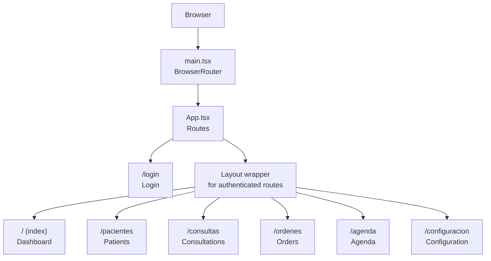
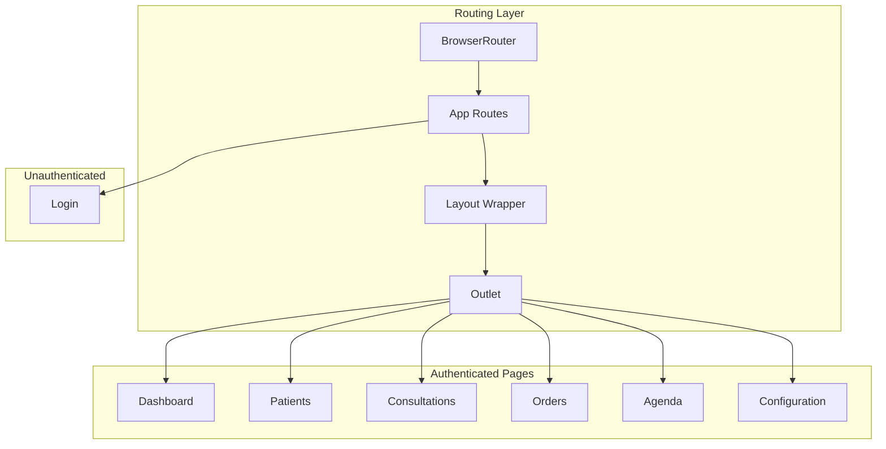
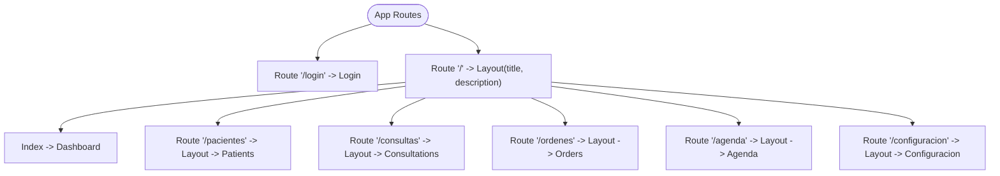
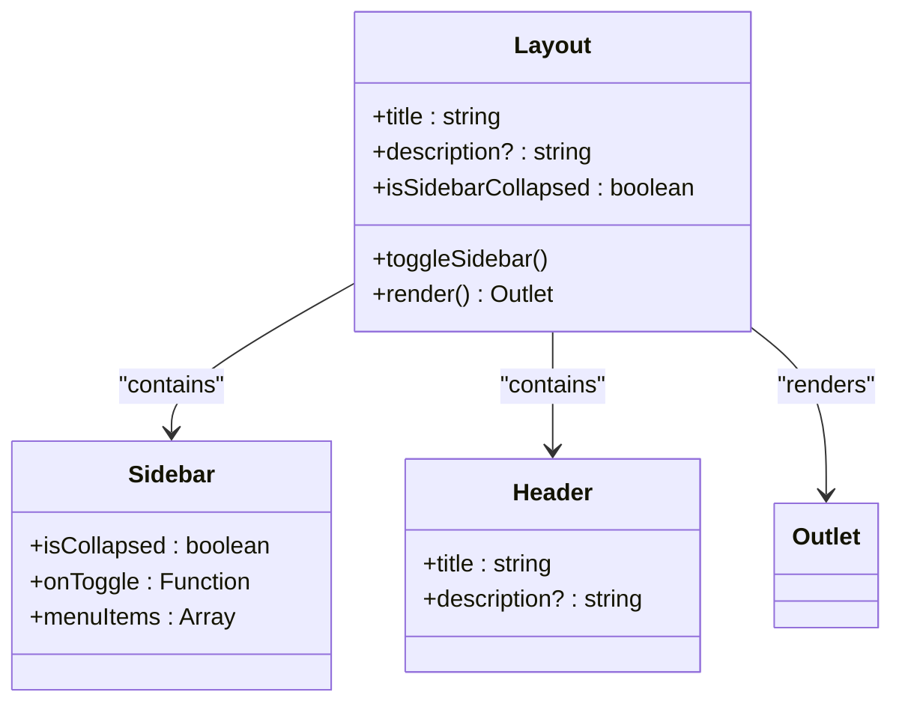
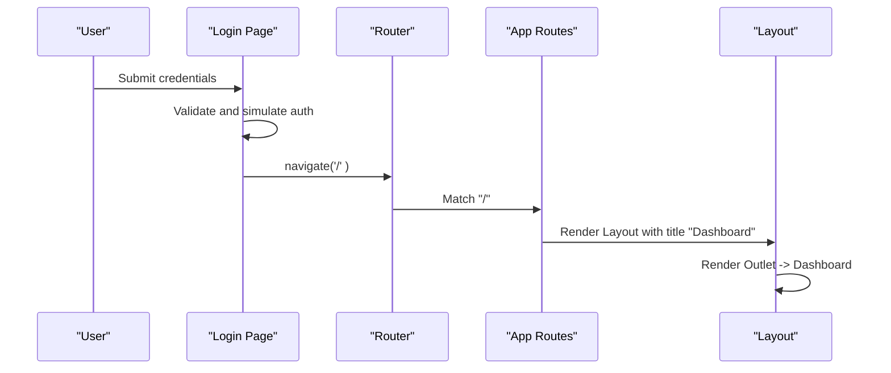
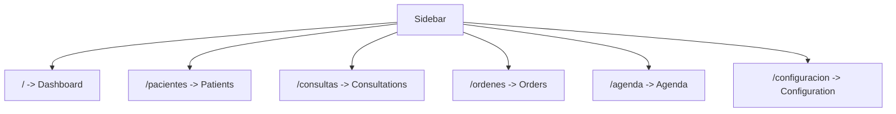
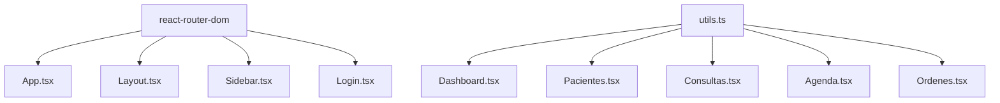

# Routing System

<cite>
**Referenced Files in This Document**
- [App.tsx](file://NexaMed-Frontend/src/App.tsx)
- [main.tsx](file://NexaMed-Frontend/src/main.tsx)
- [Layout.tsx](file://NexaMed-Frontend/src/components/layout/Layout.tsx)
- [Header.tsx](file://NexaMed-Frontend/src/components/layout/Header.tsx)
- [Sidebar.tsx](file://NexaMed-Frontend/src/components/layout/Sidebar.tsx)
- [Dashboard.tsx](file://NexaMed-Frontend/src/pages/Dashboard.tsx)
- [Pacientes.tsx](file://NexaMed-Frontend/src/pages/Pacientes.tsx)
- [Consultas.tsx](file://NexaMed-Frontend/src/pages/Consultas.tsx)
- [Agenda.tsx](file://NexaMed-Frontend/src/pages/Agenda.tsx)
- [Ordenes.tsx](file://NexaMed-Frontend/src/pages/Ordenes.tsx)
- [Login.tsx](file://NexaMed-Frontend/src/pages/Login.tsx)
- [utils.ts](file://NexaMed-Frontend/src/lib/utils.ts)
- [package.json](file://NexaMed-Frontend/package.json)
</cite>

## Table of Contents
1. [Introduction](#introduction)
2. [Project Structure](#project-structure)
3. [Core Components](#core-components)
4. [Architecture Overview](#architecture-overview)
5. [Detailed Component Analysis](#detailed-component-analysis)
6. [Dependency Analysis](#dependency-analysis)
7. [Performance Considerations](#performance-considerations)
8. [Troubleshooting Guide](#troubleshooting-guide)
9. [Conclusion](#conclusion)

## Introduction
This document describes the routing system of the NexaMed clinic management application. It explains how React Router is configured, how routes are structured and nested, and how the layout system integrates with navigation. It covers the routing hierarchy, protected routes, navigation flow between pages such as Dashboard, Patients, Consultations, Agenda, and Orders, and how the system handles programmatic navigation and route guards. It also documents parameter handling, navigation state management, and dynamic route generation strategies.

## Project Structure
The routing system is implemented using React Router v6 and is centered around a single-page application architecture. The application bootstraps the router at the root level and defines all routes in a central location. A shared layout wraps most routes to provide consistent navigation and header behavior.

Key elements:
- Root bootstrap initializes the browser router and renders the App component.
- App component defines all routes and nests them under a shared layout for authenticated sections.
- A dedicated login route exists outside the layout and is used for authentication.
- The layout composes a sidebar and header and exposes an outlet for route rendering.

**Diagram sources**
- [main.tsx:7-13](file://NexaMed-Frontend/src/main.tsx#L7-L13)
- [App.tsx:11-35](file://NexaMed-Frontend/src/App.tsx#L11-L35)

**Section sources**
- [main.tsx:1-14](file://NexaMed-Frontend/src/main.tsx#L1-L14)
- [App.tsx:1-38](file://NexaMed-Frontend/src/App.tsx#L1-L38)

## Core Components
- Router bootstrap: The application wraps the root component with a browser router to enable client-side routing.
- Route definitions: Routes are declared in a single file, mapping paths to page components and layouts.
- Nested routing: Routes for authenticated sections are nested under a shared layout that provides the sidebar and header.
- Programmatic navigation: The login page demonstrates programmatic navigation after form submission.
- Layout integration: The layout component exposes an outlet for rendering the matched route and manages sidebar state.

Key implementation references:
- Router bootstrap and root render: [main.tsx:7-13](file://NexaMed-Frontend/src/main.tsx#L7-L13)
- Route definitions and nesting: [App.tsx:11-35](file://NexaMed-Frontend/src/App.tsx#L11-L35)
- Layout composition and outlet: [Layout.tsx:12-34](file://NexaMed-Frontend/src/components/layout/Layout.tsx#L12-L34)
- Programmatic navigation example: [Login.tsx:18-27](file://NexaMed-Frontend/src/pages/Login.tsx#L18-L27)

**Section sources**
- [main.tsx:1-14](file://NexaMed-Frontend/src/main.tsx#L1-L14)
- [App.tsx:1-38](file://NexaMed-Frontend/src/App.tsx#L1-L38)
- [Layout.tsx:1-35](file://NexaMed-Frontend/src/components/layout/Layout.tsx#L1-L35)
- [Login.tsx:1-138](file://NexaMed-Frontend/src/pages/Login.tsx#L1-L138)

## Architecture Overview
The routing architecture follows a centralized pattern:
- The root component sets up the router.
- A dedicated login route is defined outside the layout.
- All authenticated routes are nested under a layout that provides consistent UI and navigation.
- The layout composes a sidebar and header and renders the matched route via an outlet.

**Diagram sources**
- [main.tsx:7-13](file://NexaMed-Frontend/src/main.tsx#L7-L13)
- [App.tsx:11-35](file://NexaMed-Frontend/src/App.tsx#L11-L35)
- [Layout.tsx:12-34](file://NexaMed-Frontend/src/components/layout/Layout.tsx#L12-L34)

## Detailed Component Analysis

### Route Definitions and Nesting
- Login route: Defined at "/login" and rendered independently of the layout.
- Dashboard route: Defined at "/" and rendered inside the layout with an index route.
- Other authenticated routes: Defined for "/pacientes", "/consultas", "/ordenes", "/agenda", and "/configuracion", each wrapped by the layout.

**Diagram sources**
- [App.tsx:11-35](file://NexaMed-Frontend/src/App.tsx#L11-L35)

**Section sources**
- [App.tsx:1-38](file://NexaMed-Frontend/src/App.tsx#L1-L38)

### Layout System Integration
- Layout component holds the sidebar and header and renders the matched route via an outlet.
- Sidebar provides navigation links that match the route paths and highlights the active item.
- Header displays the current page title and description passed from the route definition.

**Diagram sources**
- [Layout.tsx:12-34](file://NexaMed-Frontend/src/components/layout/Layout.tsx#L12-L34)
- [Sidebar.tsx:31-106](file://NexaMed-Frontend/src/components/layout/Sidebar.tsx#L31-L106)
- [Header.tsx:19-83](file://NexaMed-Frontend/src/components/layout/Header.tsx#L19-L83)

**Section sources**
- [Layout.tsx:1-35](file://NexaMed-Frontend/src/components/layout/Layout.tsx#L1-L35)
- [Sidebar.tsx:1-107](file://NexaMed-Frontend/src/components/layout/Sidebar.tsx#L1-L107)
- [Header.tsx:1-84](file://NexaMed-Frontend/src/components/layout/Header.tsx#L1-L84)

### Protected Routes and Authentication Flow
- The login route is independent of the layout and is used to authenticate users.
- After successful login, the application navigates programmatically to the root path, which renders the dashboard within the layout.
- There are no explicit route guards in the provided code; authentication state would typically be managed externally (e.g., in a context provider) and route guards would be implemented at the application level.

**Diagram sources**
- [Login.tsx:18-27](file://NexaMed-Frontend/src/pages/Login.tsx#L18-L27)
- [App.tsx:15-17](file://NexaMed-Frontend/src/App.tsx#L15-L17)
- [Layout.tsx:12-34](file://NexaMed-Frontend/src/components/layout/Layout.tsx#L12-L34)

**Section sources**
- [Login.tsx:1-138](file://NexaMed-Frontend/src/pages/Login.tsx#L1-L138)
- [App.tsx:1-38](file://NexaMed-Frontend/src/App.tsx#L1-L38)
- [Layout.tsx:1-35](file://NexaMed-Frontend/src/components/layout/Layout.tsx#L1-L35)

### Navigation Flow Between Pages
- Sidebar navigation: The sidebar uses NavLink components to navigate between routes. Active state is handled automatically by the router.
- Programmatic navigation: The login page demonstrates navigating to the root path after form submission.
- Dynamic route generation: The sidebar menu items are defined as a static array, enabling easy extension for new routes.

**Diagram sources**
- [Sidebar.tsx:22-29](file://NexaMed-Frontend/src/components/layout/Sidebar.tsx#L22-L29)
- [App.tsx:15-32](file://NexaMed-Frontend/src/App.tsx#L15-L32)

**Section sources**
- [Sidebar.tsx:1-107](file://NexaMed-Frontend/src/components/layout/Sidebar.tsx#L1-L107)
- [App.tsx:1-38](file://NexaMed-Frontend/src/App.tsx#L1-L38)

### Route-Based Rendering Strategy
- Each route maps to a page component that renders the page content.
- The layout component receives a title and description from the route definition and passes them to the header.
- The outlet renders the matched child route, enabling nested rendering within the layout.

References:
- Route definitions and layout wrapping: [App.tsx:15-32](file://NexaMed-Frontend/src/App.tsx#L15-L32)
- Layout outlet rendering: [Layout.tsx:29](file://NexaMed-Frontend/src/components/layout/Layout.tsx#L29)

**Section sources**
- [App.tsx:1-38](file://NexaMed-Frontend/src/App.tsx#L1-L38)
- [Layout.tsx:1-35](file://NexaMed-Frontend/src/components/layout/Layout.tsx#L1-L35)

### Parameter Handling and Navigation State Management
- The routing system does not define any route parameters in the provided code.
- Navigation state is primarily managed by the router’s internal state and the layout’s local state for sidebar collapse.
- Utility functions for formatting dates and calculating ages are used within page components and do not affect routing parameters.

References:
- Sidebar state management: [Layout.tsx:13](file://NexaMed-Frontend/src/components/layout/Layout.tsx#L13)
- Utility functions: [utils.ts:8-39](file://NexaMed-Frontend/src/lib/utils.ts#L8-L39)

**Section sources**
- [Layout.tsx:1-35](file://NexaMed-Frontend/src/components/layout/Layout.tsx#L1-L35)
- [utils.ts:1-44](file://NexaMed-Frontend/src/lib/utils.ts#L1-L44)

### Programmatic Navigation and Route Guards
- Programmatic navigation: Demonstrated in the login page using the navigate hook to redirect after form submission.
- Route guards: Not present in the provided code. Typical guard implementations would check authentication state and redirect accordingly.

References:
- Programmatic navigation: [Login.tsx:18-27](file://NexaMed-Frontend/src/pages/Login.tsx#L18-L27)

**Section sources**
- [Login.tsx:1-138](file://NexaMed-Frontend/src/pages/Login.tsx#L1-L138)

### Dynamic Route Generation
- The sidebar menu items are defined as a static array, allowing easy addition of new routes by extending this array.
- The layout title and description are passed from the route definition, enabling dynamic page metadata per route.

References:
- Sidebar menu items: [Sidebar.tsx:22-29](file://NexaMed-Frontend/src/components/layout/Sidebar.tsx#L22-L29)
- Layout props: [Layout.tsx:7-10](file://NexaMed-Frontend/src/components/layout/Layout.tsx#L7-L10)
- Route definitions: [App.tsx:15-32](file://NexaMed-Frontend/src/App.tsx#L15-L32)

**Section sources**
- [Sidebar.tsx:1-107](file://NexaMed-Frontend/src/components/layout/Sidebar.tsx#L1-L107)
- [Layout.tsx:1-35](file://NexaMed-Frontend/src/components/layout/Layout.tsx#L1-L35)
- [App.tsx:1-38](file://NexaMed-Frontend/src/App.tsx#L1-L38)

## Dependency Analysis
The routing system relies on React Router DOM and several UI libraries. The primary dependency for routing is react-router-dom. The layout and page components depend on shared UI primitives and utility functions.

**Diagram sources**
- [package.json:12-32](file://NexaMed-Frontend/package.json#L12-L32)
- [App.tsx:1-9](file://NexaMed-Frontend/src/App.tsx#L1-L9)
- [Layout.tsx:1-5](file://NexaMed-Frontend/src/components/layout/Layout.tsx#L1-L5)
- [Sidebar.tsx:1-15](file://NexaMed-Frontend/src/components/layout/Sidebar.tsx#L1-L15)
- [Login.tsx:1-7](file://NexaMed-Frontend/src/pages/Login.tsx#L1-L7)
- [utils.ts:1-6](file://NexaMed-Frontend/src/lib/utils.ts#L1-L6)

**Section sources**
- [package.json:1-49](file://NexaMed-Frontend/package.json#L1-L49)
- [App.tsx:1-38](file://NexaMed-Frontend/src/App.tsx#L1-L38)
- [Layout.tsx:1-35](file://NexaMed-Frontend/src/components/layout/Layout.tsx#L1-L35)
- [Sidebar.tsx:1-107](file://NexaMed-Frontend/src/components/layout/Sidebar.tsx#L1-L107)
- [Login.tsx:1-138](file://NexaMed-Frontend/src/pages/Login.tsx#L1-L138)
- [utils.ts:1-44](file://NexaMed-Frontend/src/lib/utils.ts#L1-L44)

## Performance Considerations
- Route rendering: Using a single layout for authenticated routes reduces component duplication and improves consistency.
- Outlet rendering: The outlet pattern ensures efficient re-rendering of page content without reloading the layout.
- Sidebar state: Local state in the layout for sidebar collapse is lightweight and does not impact routing performance.
- Utility functions: Date formatting and age calculation are performed within components and do not affect routing performance.

[No sources needed since this section provides general guidance]

## Troubleshooting Guide
Common issues and resolutions:
- Login route not rendering: Ensure the login route is defined and not nested under the layout.
- Layout not rendering: Verify that authenticated routes are nested under the layout wrapper and that the outlet is present.
- Sidebar navigation not working: Confirm that the sidebar menu items match the route paths and that NavLink is used for navigation.
- Programmatic navigation not working: Ensure the navigate hook is used correctly and that the target path exists.

**Section sources**
- [App.tsx:1-38](file://NexaMed-Frontend/src/App.tsx#L1-L38)
- [Layout.tsx:1-35](file://NexaMed-Frontend/src/components/layout/Layout.tsx#L1-L35)
- [Sidebar.tsx:1-107](file://NexaMed-Frontend/src/components/layout/Sidebar.tsx#L1-L107)
- [Login.tsx:1-138](file://NexaMed-Frontend/src/pages/Login.tsx#L1-L138)

## Conclusion
The NexaMed routing system uses a clean, centralized approach with React Router v6. Routes are defined in a single file, with authenticated sections nested under a shared layout. The layout integrates a sidebar and header, and the outlet pattern enables seamless route rendering. Programmatic navigation is demonstrated in the login flow, and the system is structured to support future enhancements such as route guards and dynamic route generation through the sidebar menu configuration.