# State Management

<cite>
**Referenced Files in This Document**
- [App.tsx](file://src/App.tsx)
- [main.tsx](file://src/main.tsx)
- [Layout.tsx](file://src/components/layout/Layout.tsx)
- [Header.tsx](file://src/components/layout/Header.tsx)
- [Sidebar.tsx](file://src/components/layout/Sidebar.tsx)
- [Dashboard.tsx](file://src/pages/Dashboard.tsx)
- [Pacientes.tsx](file://src/pages/Pacientes.tsx)
- [Consultas.tsx](file://src/pages/Consultas.tsx)
- [Agenda.tsx](file://src/pages/Agenda.tsx)
- [Ordenes.tsx](file://src/pages/Ordenes.tsx)
- [Configuracion.tsx](file://src/pages/Configuracion.tsx)
- [Login.tsx](file://src/pages/Login.tsx)
- [index.ts](file://src/types/index.ts)
- [utils.ts](file://src/lib/utils.ts)
</cite>

## Table of Contents
1. [Introduction](#introduction)
2. [Project Structure](#project-structure)
3. [Core Components](#core-components)
4. [Architecture Overview](#architecture-overview)
5. [Detailed Component Analysis](#detailed-component-analysis)
6. [Dependency Analysis](#dependency-analysis)
7. [Performance Considerations](#performance-considerations)
8. [Troubleshooting Guide](#troubleshooting-guide)
9. [Conclusion](#conclusion)

## Introduction
This document explains state management patterns in NexaMed’s frontend. It focuses on how React hooks are used for local component state, form state management, and data fetching strategies. It also documents state synchronization between components, prop drilling patterns, and context usage where applicable. The guide covers state management for key features such as patient data, appointment scheduling, and consultation tracking, and includes examples of controlled components, form validation states, and loading/error state handling. Finally, it addresses performance optimization techniques, state normalization, and memory management considerations.

## Project Structure
NexaMed uses a routing-driven structure with a layout wrapper and feature-specific pages. The application bootstraps the router and renders pages based on routes. The layout composes a sidebar and header and provides a container for page content.

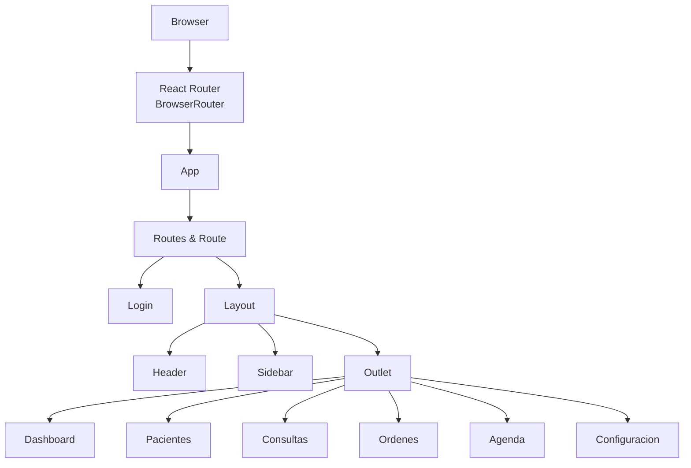

**Diagram sources**
- [main.tsx:7-13](file://src/main.tsx#L7-L13)
- [App.tsx:11-35](file://src/App.tsx#L11-L35)
- [Layout.tsx:12-34](file://src/components/layout/Layout.tsx#L12-L34)

**Section sources**
- [main.tsx:1-14](file://src/main.tsx#L1-L14)
- [App.tsx:1-38](file://src/App.tsx#L1-L38)

## Core Components
This section outlines the primary state management patterns used across the application:

- Local component state with useState
  - Used extensively in pages and layout components for UI state (search filters, active tabs, calendar navigation, form inputs, visibility toggles).
- Controlled components
  - Inputs are controlled via state updates on change handlers, ensuring predictable UI behavior.
- Form state management
  - Login page demonstrates combined form state with separate fields and loading state.
- Data fetching strategies
  - Current pages use static data arrays. Recommended patterns include moving to client-side data fetching with caching and optimistic updates.
- State synchronization
  - Layout manages sidebar collapse state and passes it down to Sidebar. There is minimal prop drilling due to the shallow hierarchy.
- Context usage
  - No global context is currently used. Consider introducing context for shared UI preferences, theme, or user session in future iterations.

Key patterns observed:
- Controlled inputs with useState for form fields and UI toggles.
- Derived state computed from props or local state (e.g., filtered lists).
- Event-driven state updates via handlers.

**Section sources**
- [Dashboard.tsx:1-206](file://src/pages/Dashboard.tsx#L1-L206)
- [Pacientes.tsx:1-279](file://src/pages/Pacientes.tsx#L1-L279)
- [Consultas.tsx:1-231](file://src/pages/Consultas.tsx#L1-L231)
- [Agenda.tsx:1-178](file://src/pages/Agenda.tsx#L1-L178)
- [Ordenes.tsx:1-309](file://src/pages/Ordenes.tsx#L1-L309)
- [Configuracion.tsx:1-297](file://src/pages/Configuracion.tsx#L1-L297)
- [Login.tsx:1-138](file://src/pages/Login.tsx#L1-L138)
- [Layout.tsx:12-34](file://src/components/layout/Layout.tsx#L12-L34)
- [Sidebar.tsx:31-107](file://src/components/layout/Sidebar.tsx#L31-L107)

## Architecture Overview
The state architecture is primarily local and event-driven. Pages own their UI state and derive derived data from props or local state. The layout composes reusable UI elements and maintains a small amount of shared UI state (sidebar collapse).

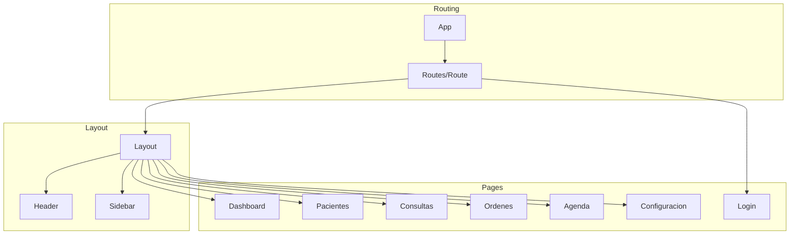

**Diagram sources**
- [App.tsx:11-35](file://src/App.tsx#L11-L35)
- [Layout.tsx:12-34](file://src/components/layout/Layout.tsx#L12-L34)
- [Header.tsx:19-83](file://src/components/layout/Header.tsx#L19-L83)
- [Sidebar.tsx:31-107](file://src/components/layout/Sidebar.tsx#L31-L107)
- [Dashboard.tsx:62-201](file://src/pages/Dashboard.tsx#L62-L201)
- [Pacientes.tsx:93-278](file://src/pages/Pacientes.tsx#L93-L278)
- [Consultas.tsx:77-230](file://src/pages/Consultas.tsx#L77-L230)
- [Agenda.tsx:34-177](file://src/pages/Agenda.tsx#L34-L177)
- [Ordenes.tsx:81-308](file://src/pages/Ordenes.tsx#L81-L308)
- [Configuracion.tsx:19-296](file://src/pages/Configuracion.tsx#L19-L296)
- [Login.tsx:9-137](file://src/pages/Login.tsx#L9-L137)

## Detailed Component Analysis

### Patient Data Feature (Pacientes)
- Local state
  - Search term managed with a controlled input.
  - Static patient dataset stored in component state.
- Derived state
  - Filtered list computed from search term and dataset.
- UI state
  - Empty state rendering when no results match.
- Controlled components
  - Input bound to state via onChange handler.

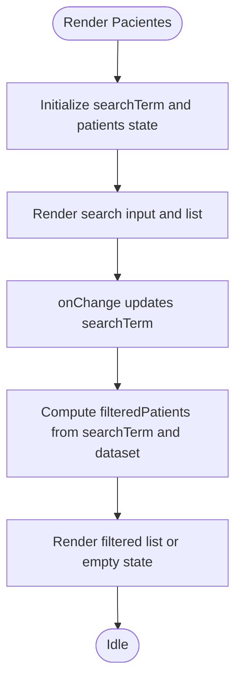

**Diagram sources**
- [Pacientes.tsx:93-101](file://src/pages/Pacientes.tsx#L93-L101)
- [Pacientes.tsx:187-262](file://src/pages/Pacientes.tsx#L187-L262)

**Section sources**
- [Pacientes.tsx:93-278](file://src/pages/Pacientes.tsx#L93-L278)

### Consultation Tracking (Consultas)
- Local state
  - Search term and active tab for filtering.
- Derived state
  - Filtered consultations computed based on search and active tab.
- UI state
  - Tab switching and empty state rendering.
- Controlled components
  - Input and Tabs trigger controlled updates.

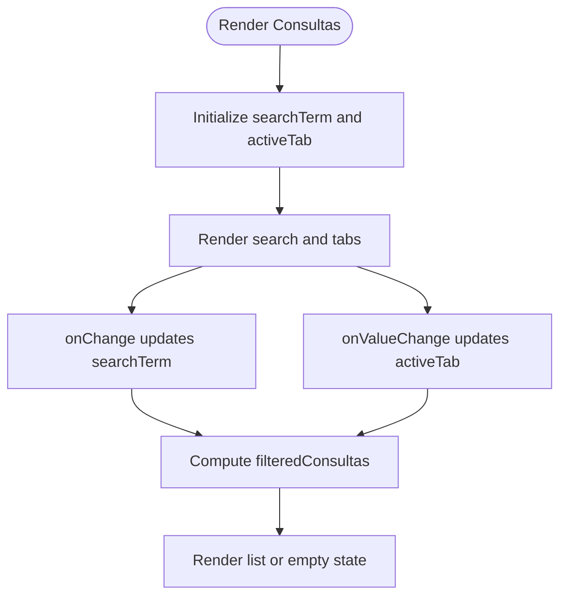

**Diagram sources**
- [Consultas.tsx:77-94](file://src/pages/Consultas.tsx#L77-L94)
- [Consultas.tsx:151-212](file://src/pages/Consultas.tsx#L151-L212)

**Section sources**
- [Consultas.tsx:77-230](file://src/pages/Consultas.tsx#L77-L230)

### Appointment Scheduling (Agenda)
- Local state
  - Current month navigation and selected date.
- Derived state
  - Calendar grid computed from current month boundaries.
- UI state
  - Selected date highlighting and schedule rendering.
- Controlled components
  - Button clicks update current date; selection updates selected date.

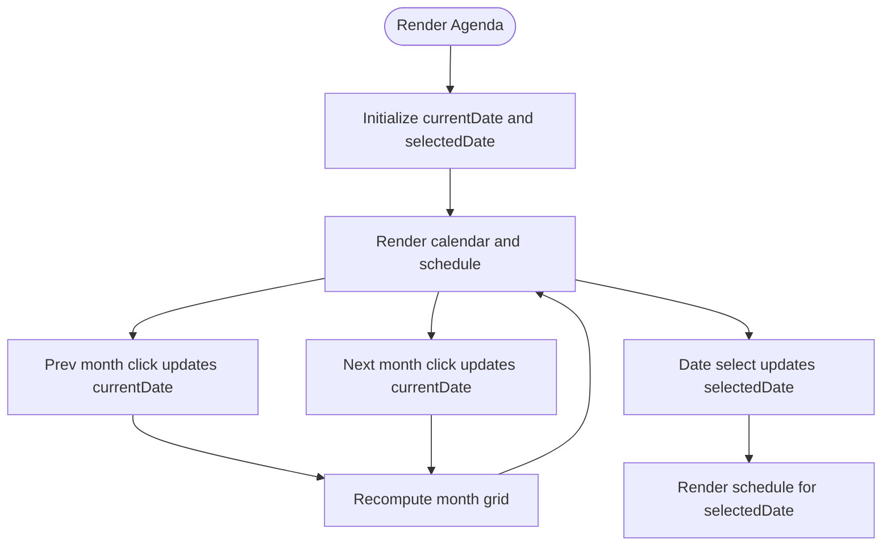

**Diagram sources**
- [Agenda.tsx:34-54](file://src/pages/Agenda.tsx#L34-L54)
- [Agenda.tsx:102-125](file://src/pages/Agenda.tsx#L102-L125)
- [Agenda.tsx:140-170](file://src/pages/Agenda.tsx#L140-L170)

**Section sources**
- [Agenda.tsx:34-177](file://src/pages/Agenda.tsx#L34-L177)

### Order Management (Ordenes)
- Local state
  - Search term and active tab for filtering orders.
- Derived state
  - Filtered orders computed from search and active tab.
- UI state
  - Status badges and action buttons conditioned on order state.
- Controlled components
  - Input and Tabs drive controlled updates.

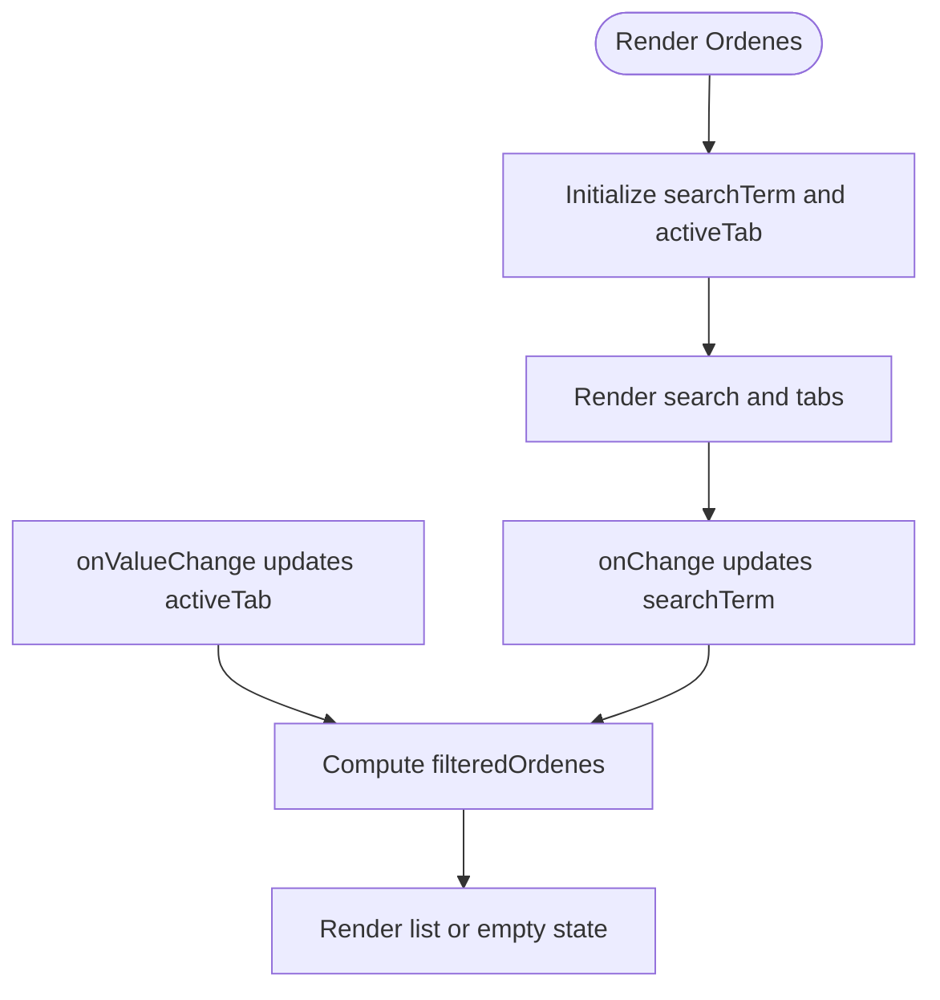

**Diagram sources**
- [Ordenes.tsx:81-91](file://src/pages/Ordenes.tsx#L81-L91)
- [Ordenes.tsx:223-290](file://src/pages/Ordenes.tsx#L223-L290)

**Section sources**
- [Ordenes.tsx:81-308](file://src/pages/Ordenes.tsx#L81-L308)

### Dashboard Overview (Dashboard)
- Local state
  - Uses static data arrays for stats, appointments, and recent patients.
- Derived state
  - Computed values for trends and counts.
- UI state
  - Conditional rendering for alerts and lists.

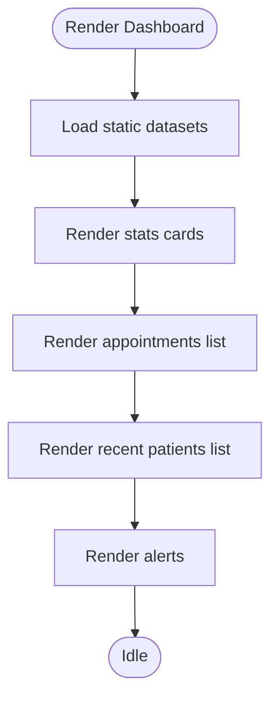

**Diagram sources**
- [Dashboard.tsx:62-201](file://src/pages/Dashboard.tsx#L62-L201)

**Section sources**
- [Dashboard.tsx:62-201](file://src/pages/Dashboard.tsx#L62-L201)

### Login and Form State (Login)
- Local state
  - Visibility toggle for password field, loading flag, and form data object.
- Controlled components
  - Email and password inputs update form state on change.
- Form submission
  - Prevent default, set loading, simulate async operation, then navigate.

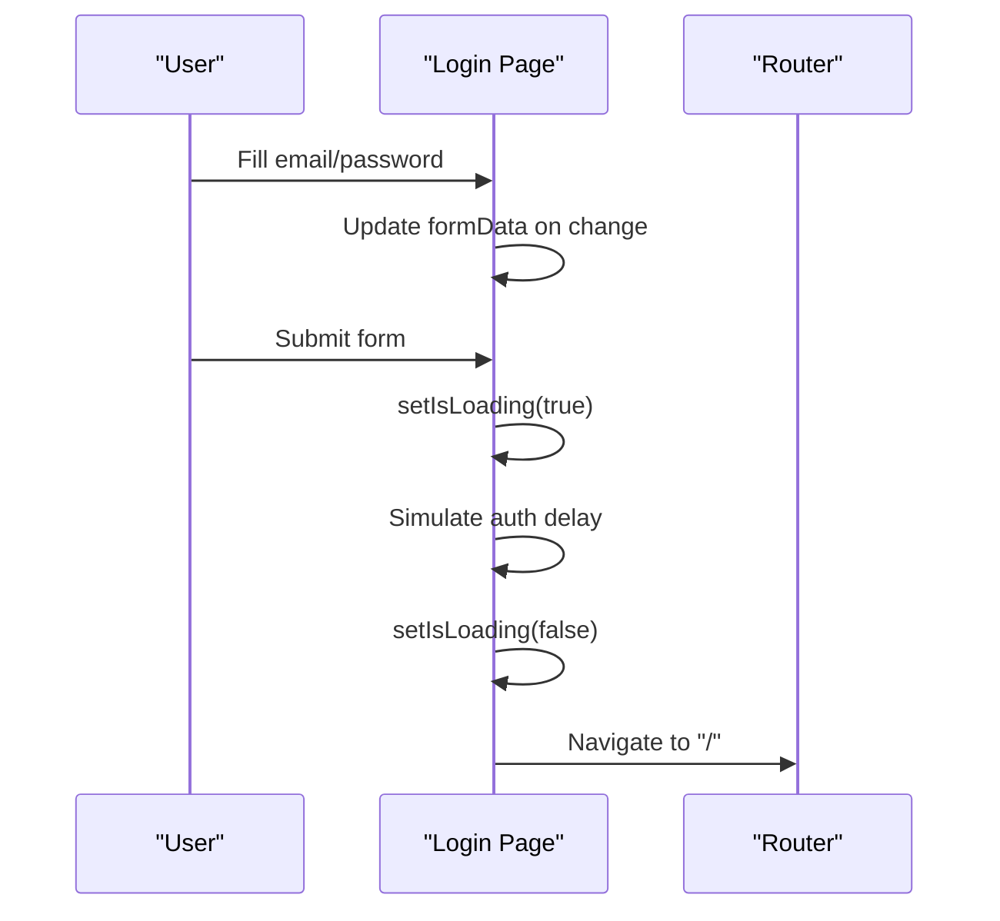

**Diagram sources**
- [Login.tsx:9-27](file://src/pages/Login.tsx#L9-L27)

**Section sources**
- [Login.tsx:9-137](file://src/pages/Login.tsx#L9-L137)

### Layout and Prop Drilling (Layout, Sidebar, Header)
- Local state
  - Layout manages sidebar collapse state and passes callbacks to Sidebar.
- Prop drilling
  - Sidebar receives isCollapsed and onToggle props; Header receives no state props.
- UI synchronization
  - Sidebar collapse affects main content margin via a computed class.

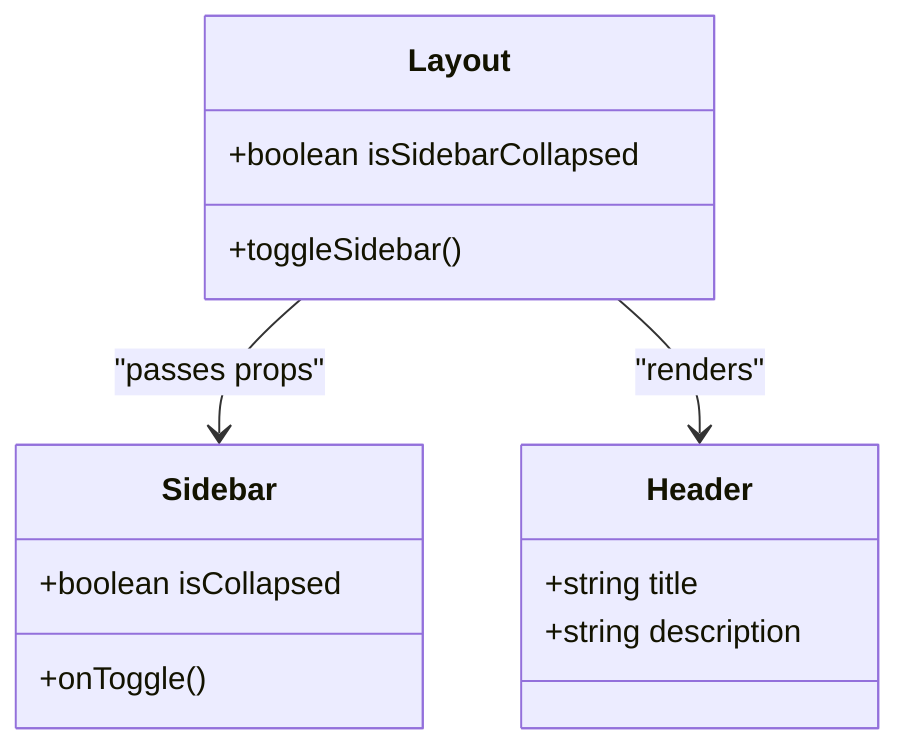

**Diagram sources**
- [Layout.tsx:12-34](file://src/components/layout/Layout.tsx#L12-L34)
- [Sidebar.tsx:31-107](file://src/components/layout/Sidebar.tsx#L31-L107)
- [Header.tsx:19-83](file://src/components/layout/Header.tsx#L19-L83)

**Section sources**
- [Layout.tsx:12-34](file://src/components/layout/Layout.tsx#L12-L34)
- [Sidebar.tsx:31-107](file://src/components/layout/Sidebar.tsx#L31-L107)
- [Header.tsx:19-83](file://src/components/layout/Header.tsx#L19-L83)

### Types and Data Normalization
- Strongly typed domain models define shape of state for patients, consultations, orders, appointments, and related entities.
- Utility functions support formatting and calculations used across components.

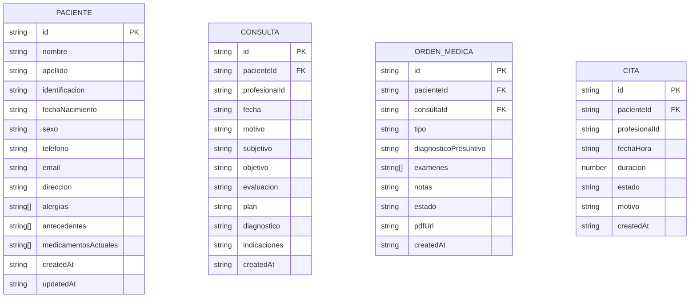

**Diagram sources**
- [index.ts:21-107](file://src/types/index.ts#L21-L107)

**Section sources**
- [index.ts:1-128](file://src/types/index.ts#L1-L128)
- [utils.ts:8-39](file://src/lib/utils.ts#L8-L39)

## Dependency Analysis
- Routing and bootstrap
  - main.tsx wraps the app with BrowserRouter and renders App.
  - App defines routes and mounts Layout wrappers around pages.
- Layout composition
  - Layout composes Sidebar and Header and renders page content via Outlet.
- Component coupling
  - Pages are loosely coupled; they manage their own state and depend on UI primitives.
  - Minimal prop drilling exists due to shallow layout hierarchy.

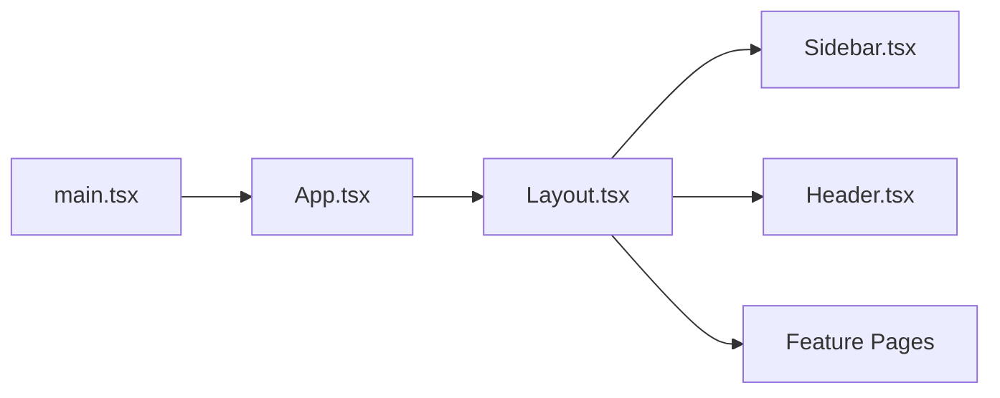

**Diagram sources**
- [main.tsx:7-13](file://src/main.tsx#L7-L13)
- [App.tsx:11-35](file://src/App.tsx#L11-L35)
- [Layout.tsx:12-34](file://src/components/layout/Layout.tsx#L12-L34)

**Section sources**
- [main.tsx:1-14](file://src/main.tsx#L1-L14)
- [App.tsx:1-38](file://src/App.tsx#L1-L38)
- [Layout.tsx:12-34](file://src/components/layout/Layout.tsx#L12-L34)

## Performance Considerations
- Prefer memoized derived computations
  - Use useMemo for expensive derived lists (e.g., filtered patients, consultations, orders) to avoid recomputation on every render.
- Optimize re-renders
  - Split large components into smaller ones to reduce unnecessary re-renders.
  - Use React.useCallback for event handlers passed to child components.
- Virtualize long lists
  - For large datasets, implement virtual scrolling to limit DOM nodes.
- Normalize state
  - Store normalized entities (e.g., patients, consultations) keyed by id to enable efficient updates and reduce duplication.
- Lazy loading and code splitting
  - Keep heavy pages lazy-loaded to improve initial load performance.
- Avoid unnecessary state
  - Prefer deriving values from existing state or props rather than duplicating data.
- Debounce search inputs
  - Debounce search handlers to reduce frequent recomputations during typing.

## Troubleshooting Guide
- Controlled component not updating
  - Ensure the input value is bound to state and onChange updates that state.
  - Verify the event handler updates the correct field in the state object.
- Form submission not working
  - Confirm preventDefault is called and async logic resolves before navigation.
- Empty state not rendering
  - Check derived state conditions and ensure fallback UI is triggered when filtered arrays are empty.
- Calendar navigation issues
  - Verify date computation helpers and ensure state updates propagate to recompute the calendar grid.
- Tabs not filtering
  - Confirm active tab state updates and filtering logic evaluates the correct criteria.

**Section sources**
- [Pacientes.tsx:93-101](file://src/pages/Pacientes.tsx#L93-L101)
- [Consultas.tsx:77-94](file://src/pages/Consultas.tsx#L77-L94)
- [Agenda.tsx:34-54](file://src/pages/Agenda.tsx#L34-L54)
- [Login.tsx:18-27](file://src/pages/Login.tsx#L18-L27)

## Conclusion
NexaMed’s frontend employs straightforward, local state management with React hooks across pages and layout components. Pages use controlled components and derive state from props or local state to render filtered lists and dynamic UIs. The layout composes reusable UI elements with minimal prop drilling. To scale, adopt memoization, normalization, and lazy loading. Introduce global context for cross-cutting concerns like theme and user session. Replace static datasets with client-side data fetching and caching for robust, scalable state management.