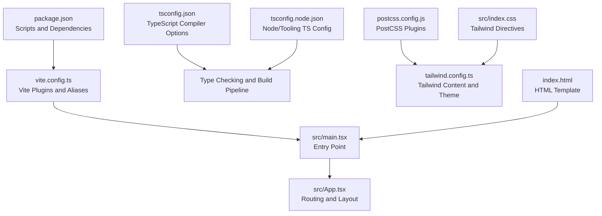
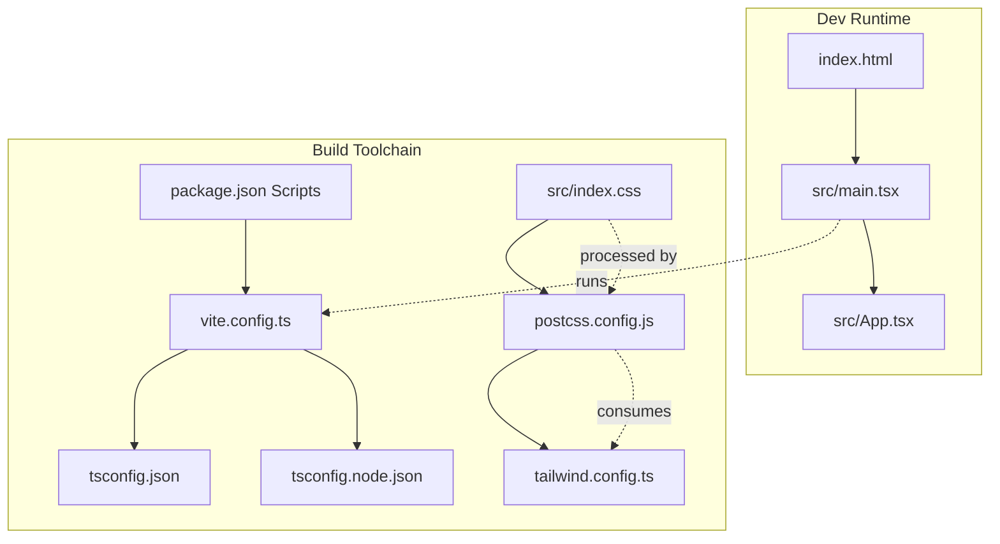
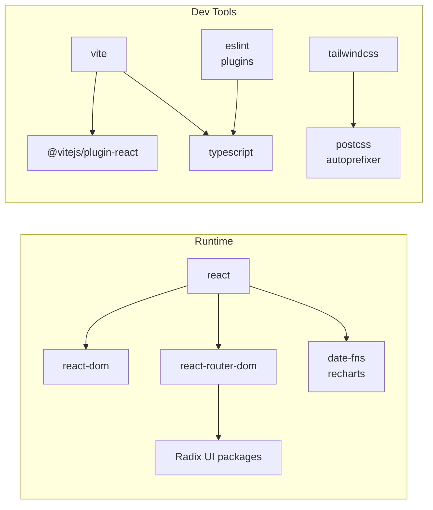

# Build and Development

<cite>
**Referenced Files in This Document**
- [package.json](file://NexaMed-Frontend/package.json)
- [vite.config.ts](file://NexaMed-Frontend/vite.config.ts)
- [tsconfig.json](file://NexaMed-Frontend/tsconfig.json)
- [tsconfig.node.json](file://NexaMed-Frontend/tsconfig.node.json)
- [postcss.config.js](file://NexaMed-Frontend/postcss.config.js)
- [tailwind.config.ts](file://NexaMed-Frontend/tailwind.config.ts)
- [index.html](file://NexaMed-Frontend/index.html)
- [src/main.tsx](file://NexaMed-Frontend/src/main.tsx)
- [src/App.tsx](file://NexaMed-Frontend/src/App.tsx)
- [src/index.css](file://NexaMed-Frontend/src/index.css)
- [src/lib/utils.ts](file://NexaMed-Frontend/src/lib/utils.ts)
- [src/components/ui/button.tsx](file://NexaMed-Frontend/src/components/ui/button.tsx)
</cite>

## Table of Contents
1. [Introduction](#introduction)
2. [Project Structure](#project-structure)
3. [Core Components](#core-components)
4. [Architecture Overview](#architecture-overview)
5. [Detailed Component Analysis](#detailed-component-analysis)
6. [Dependency Analysis](#dependency-analysis)
7. [Performance Considerations](#performance-considerations)
8. [Troubleshooting Guide](#troubleshooting-guide)
9. [Conclusion](#conclusion)
10. [Appendices](#appendices)

## Introduction
This document explains NexaMed’s frontend build system and development workflow. It covers Vite configuration, TypeScript compilation, PostCSS/Tailwind processing, development server setup, build optimization, production bundling, asset handling, dependency management, script commands, and deployment preparation. It also provides best practices, debugging techniques, performance optimization approaches, and troubleshooting strategies grounded in the repository’s actual configuration files.

## Project Structure
The project is a React application using Vite for dev/build, TypeScript for type safety, and Tailwind CSS with PostCSS for styling. Key configuration files define how the app is compiled, transformed, bundled, and served.

**Diagram sources**
- [package.json:1-49](file://NexaMed-Frontend/package.json#L1-L49)
- [vite.config.ts:1-13](file://NexaMed-Frontend/vite.config.ts#L1-L13)
- [tsconfig.json:1-26](file://NexaMed-Frontend/tsconfig.json#L1-L26)
- [tsconfig.node.json:1-11](file://NexaMed-Frontend/tsconfig.node.json#L1-L11)
- [postcss.config.js:1-7](file://NexaMed-Frontend/postcss.config.js#L1-L7)
- [tailwind.config.ts:1-103](file://NexaMed-Frontend/tailwind.config.ts#L1-L103)
- [src/index.css:1-191](file://NexaMed-Frontend/src/index.css#L1-L191)
- [index.html:1-18](file://NexaMed-Frontend/index.html#L1-L18)
- [src/main.tsx:1-14](file://NexaMed-Frontend/src/main.tsx#L1-L14)
- [src/App.tsx:1-38](file://NexaMed-Frontend/src/App.tsx#L1-L38)

**Section sources**
- [package.json:1-49](file://NexaMed-Frontend/package.json#L1-L49)
- [vite.config.ts:1-13](file://NexaMed-Frontend/vite.config.ts#L1-L13)
- [tsconfig.json:1-26](file://NexaMed-Frontend/tsconfig.json#L1-L26)
- [tsconfig.node.json:1-11](file://NexaMed-Frontend/tsconfig.node.json#L1-L11)
- [postcss.config.js:1-7](file://NexaMed-Frontend/postcss.config.js#L1-L7)
- [tailwind.config.ts:1-103](file://NexaMed-Frontend/tailwind.config.ts#L1-L103)
- [src/index.css:1-191](file://NexaMed-Frontend/src/index.css#L1-L191)
- [index.html:1-18](file://NexaMed-Frontend/index.html#L1-L18)
- [src/main.tsx:1-14](file://NexaMed-Frontend/src/main.tsx#L1-L14)
- [src/App.tsx:1-38](file://NexaMed-Frontend/src/App.tsx#L1-L38)

## Core Components
- Vite configuration defines the React plugin and module aliasing for clean imports.
- TypeScript configurations separate browser app settings from tooling settings.
- Tailwind CSS with PostCSS handles design system generation and vendor prefixing.
- The HTML template wires the React root and preconnects fonts for performance.

Key responsibilities:
- Vite: dev server, HMR, bundling, and asset handling.
- TypeScript: type checking and module resolution for the app and tooling.
- Tailwind/PostCSS: CSS authoring, purging, and vendor prefixing.
- Package scripts: dev, build, preview, and lint commands.

**Section sources**
- [vite.config.ts:1-13](file://NexaMed-Frontend/vite.config.ts#L1-L13)
- [tsconfig.json:1-26](file://NexaMed-Frontend/tsconfig.json#L1-L26)
- [tsconfig.node.json:1-11](file://NexaMed-Frontend/tsconfig.node.json#L1-L11)
- [postcss.config.js:1-7](file://NexaMed-Frontend/postcss.config.js#L1-L7)
- [tailwind.config.ts:1-103](file://NexaMed-Frontend/tailwind.config.ts#L1-L103)
- [index.html:1-18](file://NexaMed-Frontend/index.html#L1-L18)

## Architecture Overview
The build pipeline integrates TypeScript compilation, Vite bundling, and PostCSS/Tailwind processing. The runtime wiring connects the HTML template to the React entry point, which mounts the routing tree.

**Diagram sources**
- [package.json:6-11](file://NexaMed-Frontend/package.json#L6-L11)
- [vite.config.ts:1-13](file://NexaMed-Frontend/vite.config.ts#L1-L13)
- [tsconfig.json:1-26](file://NexaMed-Frontend/tsconfig.json#L1-L26)
- [tsconfig.node.json:1-11](file://NexaMed-Frontend/tsconfig.node.json#L1-L11)
- [postcss.config.js:1-7](file://NexaMed-Frontend/postcss.config.js#L1-L7)
- [tailwind.config.ts:1-103](file://NexaMed-Frontend/tailwind.config.ts#L1-L103)
- [src/index.css:1-191](file://NexaMed-Frontend/src/index.css#L1-L191)
- [index.html:1-18](file://NexaMed-Frontend/index.html#L1-L18)
- [src/main.tsx:1-14](file://NexaMed-Frontend/src/main.tsx#L1-L14)
- [src/App.tsx:1-38](file://NexaMed-Frontend/src/App.tsx#L1-L38)

## Detailed Component Analysis

### Vite Configuration
- Plugin: React Fast Refresh and JSX transforms.
- Alias: "@/" resolves to the src directory for ergonomic imports.
- Extensibility: Additional plugins (e.g., for static assets, polyfills) can be added here.

Recommended enhancements:
- Define base path and outDir for production builds.
- Enable code splitting and dynamic imports for route-based lazy loading.
- Configure asset handling (images/fonts) and public folder usage.

**Section sources**
- [vite.config.ts:1-13](file://NexaMed-Frontend/vite.config.ts#L1-L13)

### TypeScript Compilation Settings
- App compiler options:
  - Target and library aligned to modern browsers.
  - Module resolution via bundler for optimal tree-shaking.
  - Strictness flags enabled for safety.
  - Path mapping via baseUrl and paths for "@/*".
- Node/tooling compiler options:
  - ESNext modules and bundler resolution for Vite config.

Best practices:
- Keep isolatedModules and noEmit for Vite dev mode.
- Use composite and skipLibCheck for tooling configs to speed up builds.

**Section sources**
- [tsconfig.json:1-26](file://NexaMed-Frontend/tsconfig.json#L1-L26)
- [tsconfig.node.json:1-11](file://NexaMed-Frontend/tsconfig.node.json#L1-L11)

### PostCSS and Tailwind Processing
- PostCSS plugins:
  - Tailwind CSS for utility-first styles.
  - Autoprefixer for vendor prefixes.
- Tailwind configuration:
  - Dark mode strategy via class.
  - Content globs scanning components/pages/app/src.
  - Custom theme tokens, animations, and color palette.
  - Plugin for enhanced animations.

Optimization tips:
- Keep content globs precise to reduce purge overhead.
- Use layer directives to organize base/components/utilities.
- Prefer CSS variables for theme tokens to minimize rebuilds.

**Section sources**
- [postcss.config.js:1-7](file://NexaMed-Frontend/postcss.config.js#L1-L7)
- [tailwind.config.ts:1-103](file://NexaMed-Frontend/tailwind.config.ts#L1-L103)
- [src/index.css:1-191](file://NexaMed-Frontend/src/index.css#L1-L191)

### Development Server Setup
- Dev command runs Vite’s local server with HMR.
- Entry point mounts React app inside index.html.
- Routing is configured in App.tsx with nested layouts.

Workflow:
- Run dev script to start the server.
- Edit files to see instant updates via HMR.
- Use React DevTools and browser network panel for debugging.

**Section sources**
- [package.json:6-11](file://NexaMed-Frontend/package.json#L6-L11)
- [index.html:1-18](file://NexaMed-Frontend/index.html#L1-L18)
- [src/main.tsx:1-14](file://NexaMed-Frontend/src/main.tsx#L1-L14)
- [src/App.tsx:1-38](file://NexaMed-Frontend/src/App.tsx#L1-L38)

### Build Optimization Strategies and Production Bundling
Current build command:
- TypeScript emit is bypassed; Vite handles bundling.
- Production build uses Vite’s default optimization (minification, code splitting, asset inlining/emit).

Recommended production improvements:
- Set explicit base and outDir in Vite config.
- Enable manualChunks for vendor separation.
- Add asset strategy: keep small assets inline, move larger ones to assets.
- Integrate prerendering for static routes if applicable.
- Add manifest and service worker for PWA-like caching.

**Section sources**
- [package.json:8](file://NexaMed-Frontend/package.json#L8)
- [vite.config.ts:1-13](file://NexaMed-Frontend/vite.config.ts#L1-L13)

### Asset Handling
- Public assets: place under the public directory for direct bundling and hashing.
- CSS: Tailwind directives processed by PostCSS; ensure correct content globs.
- Fonts: preconnect links in HTML improve loading performance.

Guidelines:
- Place images/icons in public for fixed URLs.
- Import small SVGs directly for tree-shaking.
- Use CSS variables and Tailwind utilities to avoid bloated CSS.

**Section sources**
- [index.html:9-11](file://NexaMed-Frontend/index.html#L9-L11)
- [src/index.css:1-191](file://NexaMed-Frontend/src/index.css#L1-L191)

### Development Best Practices
- Use strict TS settings to catch errors early.
- Leverage path aliases for cleaner imports.
- Keep Tailwind content globs narrow to reduce rebuilds.
- Split large components and pages for faster incremental builds.
- Use ESLint with React hooks and refresh plugins for code quality.

**Section sources**
- [tsconfig.json:14-17](file://NexaMed-Frontend/tsconfig.json#L14-L17)
- [tsconfig.json:19-21](file://NexaMed-Frontend/tsconfig.json#L19-L21)
- [tailwind.config.ts:5-10](file://NexaMed-Frontend/tailwind.config.ts#L5-L10)
- [package.json:10](file://NexaMed-Frontend/package.json#L10)

### Debugging Techniques
- Inspect Vite dev server logs for plugin and alias resolution.
- Use browser devtools to profile bundle sizes and hydration costs.
- Verify Tailwind utilities are generated by checking computed styles and purge behavior.
- Confirm alias resolution by importing a component via "@/*".

**Section sources**
- [vite.config.ts:7-11](file://NexaMed-Frontend/vite.config.ts#L7-L11)
- [src/components/ui/button.tsx:1-54](file://NexaMed-Frontend/src/components/ui/button.tsx#L1-L54)

### Performance Optimization Approaches
- Tree shaking: rely on ES modules and bundler module resolution.
- CSS: scoped utilities and minimal global styles; avoid unused utilities.
- Images: optimize and use appropriate formats; lazy load offscreen images.
- Fonts: preconnect and subset critical font weights.
- Bundle analysis: inspect build output to identify large dependencies.

**Section sources**
- [tsconfig.json:8](file://NexaMed-Frontend/tsconfig.json#L8)
- [postcss.config.js:1-7](file://NexaMed-Frontend/postcss.config.js#L1-L7)
- [index.html:9-11](file://NexaMed-Frontend/index.html#L9-L11)

## Dependency Analysis
The project uses React 18, React Router DOM, Radix UI primitives, date utilities, and Recharts. Dev dependencies include Vite, React plugin, TypeScript, ESLint, Tailwind CSS, PostCSS, and related tooling.

**Diagram sources**
- [package.json:12-32](file://NexaMed-Frontend/package.json#L12-L32)
- [package.json:33-47](file://NexaMed-Frontend/package.json#L33-L47)

**Section sources**
- [package.json:12-47](file://NexaMed-Frontend/package.json#L12-L47)

## Performance Considerations
- Use Vite’s built-in minification and code splitting defaults.
- Keep TS strictness for earlier failure detection.
- Narrow Tailwind content globs to reduce CSS size.
- Prefer CSS variables and utility classes to avoid large custom CSS.
- Analyze bundle composition after adding new dependencies.

[No sources needed since this section provides general guidance]

## Troubleshooting Guide
Common issues and resolutions:
- Missing favicon: The HTML references a public icon; ensure it exists or update the path.
- Alias not resolving: Verify the "@"/src alias in Vite config and import paths.
- Tailwind utilities missing: Ensure content globs include all component files and rebuild.
- Type errors in tooling: Confirm tsconfig.node aligns with Vite config usage.
- Lint warnings: Run the lint script and address reported issues.

**Section sources**
- [index.html:5](file://NexaMed-Frontend/index.html#L5)
- [vite.config.ts:7-11](file://NexaMed-Frontend/vite.config.ts#L7-L11)
- [tailwind.config.ts:5-10](file://NexaMed-Frontend/tailwind.config.ts#L5-L10)
- [tsconfig.node.json:1-11](file://NexaMed-Frontend/tsconfig.node.json#L1-L11)
- [package.json:10](file://NexaMed-Frontend/package.json#L10)

## Conclusion
NexaMed’s build system leverages Vite, TypeScript, and Tailwind CSS with PostCSS for a modern, efficient development and production workflow. By aligning configuration with best practices—strict typing, precise content globs, and sensible bundling—you can maintain fast builds, predictable outputs, and a scalable architecture.

[No sources needed since this section summarizes without analyzing specific files]

## Appendices

### Script Commands
- dev: starts the Vite dev server with HMR.
- build: compiles TypeScript and runs Vite production build.
- preview: serves the production build locally for testing.
- lint: runs ESLint on TypeScript/TSX files.

**Section sources**
- [package.json:6-11](file://NexaMed-Frontend/package.json#L6-L11)

### Deployment Preparation Checklist
- Verify production build output and bundle composition.
- Confirm public assets are correctly hashed and served.
- Test preview build locally to simulate production behavior.
- Validate dark mode and responsive breakpoints.
- Set up CI/CD to cache node_modules and optimize install steps.

[No sources needed since this section provides general guidance]