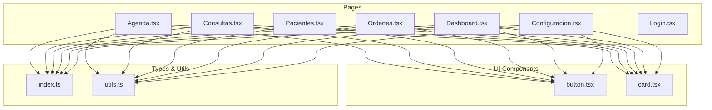
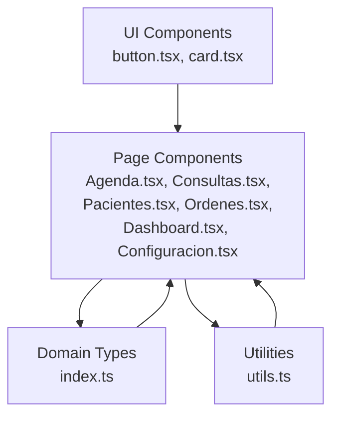
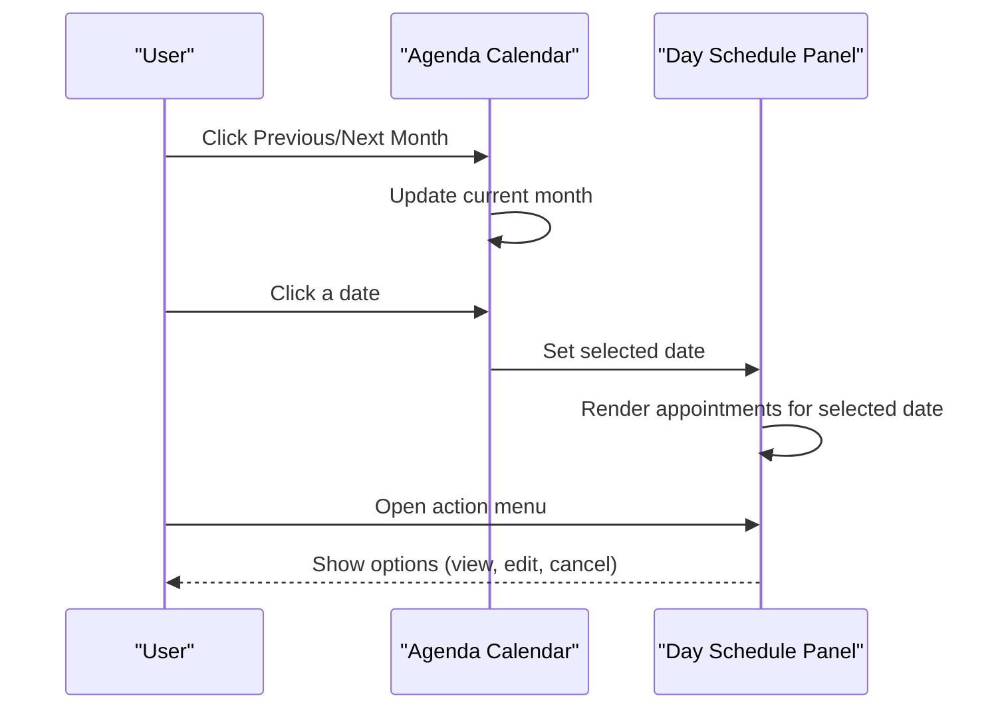
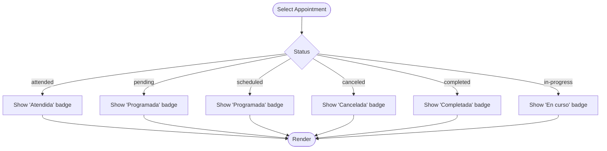
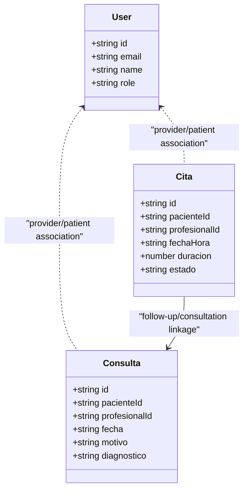
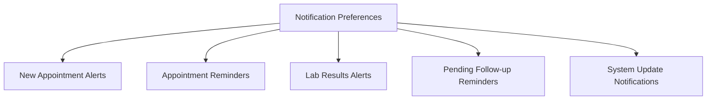
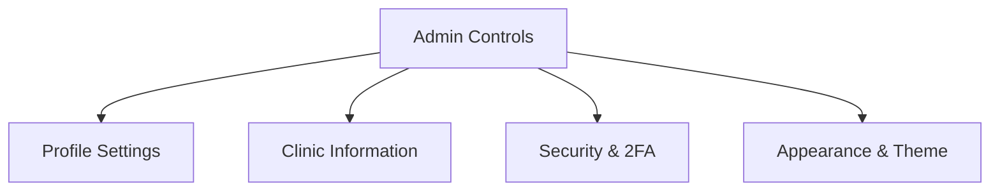
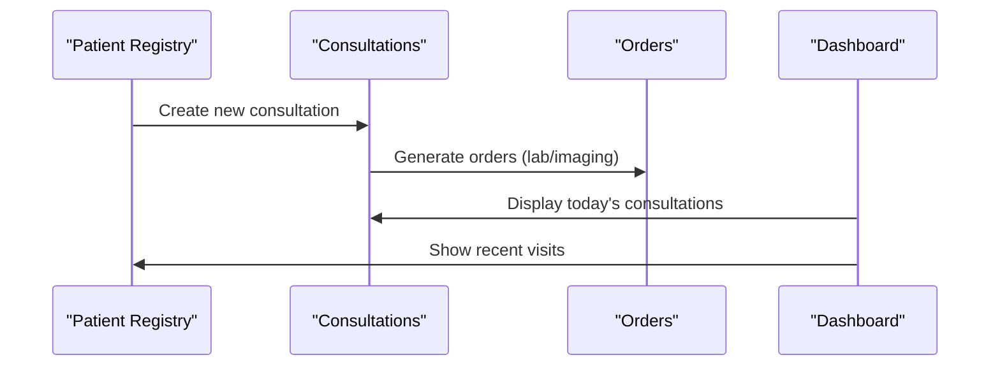
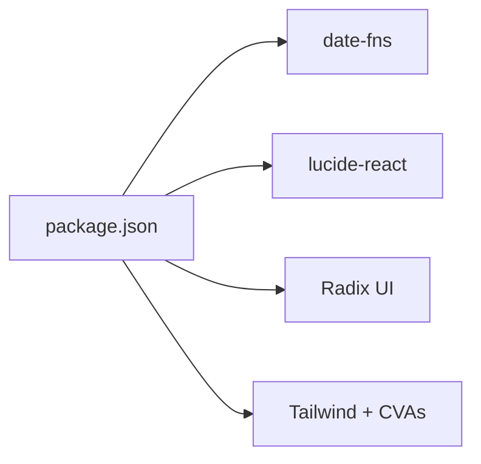

# Appointment Scheduling

<cite>
**Referenced Files in This Document**
- [Agenda.tsx](file://src/pages/Agenda.tsx)
- [Consultas.tsx](file://src/pages/Consultas.tsx)
- [Pacientes.tsx](file://src/pages/Pacientes.tsx)
- [Ordenes.tsx](file://src/pages/Ordenes.tsx)
- [Dashboard.tsx](file://src/pages/Dashboard.tsx)
- [Configuracion.tsx](file://src/pages/Configuracion.tsx)
- [index.ts](file://src/types/index.ts)
- [utils.ts](file://src/lib/utils.ts)
- [button.tsx](file://src/components/ui/button.tsx)
- [card.tsx](file://src/components/ui/card.tsx)
- [package.json](file://package.json)
</cite>

## Table of Contents
1. [Introduction](#introduction)
2. [Project Structure](#project-structure)
3. [Core Components](#core-components)
4. [Architecture Overview](#architecture-overview)
5. [Detailed Component Analysis](#detailed-component-analysis)
6. [Dependency Analysis](#dependency-analysis)
7. [Performance Considerations](#performance-considerations)
8. [Troubleshooting Guide](#troubleshooting-guide)
9. [Conclusion](#conclusion)

## Introduction
This document describes the Appointment Scheduling system within the NexaMed frontend. It focuses on the interactive calendar interface, appointment status management, availability scheduling, and reminder system functionality. It also explains calendar view modes, drag-and-drop scheduling capabilities, conflict detection, and resource allocation. The documentation covers appointment types, duration management, provider availability, and patient capacity limits, along with integration points to patient management, consultation tracking, and notification systems. Administrative controls and approval workflows are included to provide a complete operational picture.

## Project Structure
The frontend is organized around feature-based pages and shared UI primitives:
- Pages: Agenda (calendar), Consultas (consultation tracking), Pacientes (patient registry), Ordenes (orders), Dashboard (overview), Configuracion (settings), Login (authentication)
- Shared UI: Button, Card, and other components
- Types: Strongly typed domain models for users, patients, consultations, orders, and appointments
- Utilities: Formatting helpers for dates and IDs

**Diagram sources**
- [Agenda.tsx:1-178](file://src/pages/Agenda.tsx#L1-L178)
- [Consultas.tsx:1-231](file://src/pages/Consultas.tsx#L1-L231)
- [Pacientes.tsx:1-279](file://src/pages/Pacientes.tsx#L1-L279)
- [Ordenes.tsx:1-309](file://src/pages/Ordenes.tsx#L1-L309)
- [Dashboard.tsx:1-206](file://src/pages/Dashboard.tsx#L1-L206)
- [Configuracion.tsx:1-297](file://src/pages/Configuracion.tsx#L1-L297)
- [button.tsx:1-54](file://src/components/ui/button.tsx#L1-L54)
- [card.tsx:1-76](file://src/components/ui/card.tsx#L1-L76)
- [index.ts:1-128](file://src/types/index.ts#L1-L128)
- [utils.ts:1-44](file://src/lib/utils.ts#L1-L44)

**Section sources**
- [Agenda.tsx:1-178](file://src/pages/Agenda.tsx#L1-L178)
- [Consultas.tsx:1-231](file://src/pages/Consultas.tsx#L1-L231)
- [Pacientes.tsx:1-279](file://src/pages/Pacientes.tsx#L1-L279)
- [Ordenes.tsx:1-309](file://src/pages/Ordenes.tsx#L1-L309)
- [Dashboard.tsx:1-206](file://src/pages/Dashboard.tsx#L1-L206)
- [Configuracion.tsx:1-297](file://src/pages/Configuracion.tsx#L1-L297)
- [button.tsx:1-54](file://src/components/ui/button.tsx#L1-L54)
- [card.tsx:1-76](file://src/components/ui/card.tsx#L1-L76)
- [index.ts:1-128](file://src/types/index.ts#L1-L128)
- [utils.ts:1-44](file://src/lib/utils.ts#L1-L44)

## Core Components
- Interactive Calendar (Agenda): Provides month navigation, day selection, and daily schedule display with appointment entries and actions.
- Consultation Tracking (Consultas): Lists consultations with filtering by status and date, badges for type and status, and action menu.
- Patient Management (Pacientes): Patient registry with search, stats, and action menu for clinical workflows.
- Orders (Ordenes): Laboratory/imaging/interconsultation tracking with status badges and actions.
- Dashboard (Dashboard): Overview cards for today’s appointments, recent patients, and alerts/notifications.
- Configuration (Configuracion): Notification preferences and administrative settings.
- Types (index.ts): Domain models for users, patients, consultations, orders, and appointments.
- Utilities (utils.ts): Date formatting, datetime formatting, age calculation, and ID generation.

**Section sources**
- [Agenda.tsx:34-177](file://src/pages/Agenda.tsx#L34-L177)
- [Consultas.tsx:77-230](file://src/pages/Consultas.tsx#L77-L230)
- [Pacientes.tsx:93-279](file://src/pages/Pacientes.tsx#L93-L279)
- [Ordenes.tsx:81-309](file://src/pages/Ordenes.tsx#L81-L309)
- [Dashboard.tsx:62-201](file://src/pages/Dashboard.tsx#L62-L201)
- [Configuracion.tsx:19-297](file://src/pages/Configuracion.tsx#L19-L297)
- [index.ts:1-128](file://src/types/index.ts#L1-L128)
- [utils.ts:1-44](file://src/lib/utils.ts#L1-L44)

## Architecture Overview
The system follows a component-driven architecture with page-level components rendering lists, forms, and dashboards. Shared UI components encapsulate styling and behavior. Data models define the domain entities. Utilities centralize formatting and calculations. The calendar page orchestrates date navigation and day selection, while other pages integrate with these models and utilities.

**Diagram sources**
- [button.tsx:1-54](file://src/components/ui/button.tsx#L1-L54)
- [card.tsx:1-76](file://src/components/ui/card.tsx#L1-L76)
- [index.ts:1-128](file://src/types/index.ts#L1-L128)
- [utils.ts:1-44](file://src/lib/utils.ts#L1-L44)
- [Agenda.tsx:1-178](file://src/pages/Agenda.tsx#L1-L178)
- [Consultas.tsx:1-231](file://src/pages/Consultas.tsx#L1-L231)
- [Pacientes.tsx:1-279](file://src/pages/Pacientes.tsx#L1-L279)
- [Ordenes.tsx:1-309](file://src/pages/Ordenes.tsx#L1-L309)
- [Dashboard.tsx:1-206](file://src/pages/Dashboard.tsx#L1-L206)
- [Configuracion.tsx:1-297](file://src/pages/Configuracion.tsx#L1-L297)

## Detailed Component Analysis

### Interactive Calendar Interface (Agenda)
The calendar page provides:
- Month navigation with previous/next buttons
- Calendar grid showing days of the month with indicators for days with appointments
- Day selection highlighting and dynamic schedule panel
- Appointment entries with time, duration, patient, type, and status badges
- Action menu per appointment (view, edit, cancel)

**Diagram sources**
- [Agenda.tsx:34-177](file://src/pages/Agenda.tsx#L34-L177)

Key behaviors:
- Navigation uses date-fns to compute month boundaries and iterate days.
- Selected date drives the right-hand schedule panel.
- Status badges reflect appointment state (attended, pending, scheduled, canceled).

**Section sources**
- [Agenda.tsx:34-177](file://src/pages/Agenda.tsx#L34-L177)
- [utils.ts:17-26](file://src/lib/utils.ts#L17-L26)

### Appointment Status Management
Statuses are represented consistently across components:
- Calendar: attended, pending, scheduled, canceled
- Consultations: completed, in-progress, pending
- Orders: completed, pending, canceled

**Diagram sources**
- [Agenda.tsx:45-54](file://src/pages/Agenda.tsx#L45-L54)
- [Consultas.tsx:106-118](file://src/pages/Consultas.tsx#L106-L118)
- [Ordenes.tsx:115-130](file://src/pages/Ordenes.tsx#L115-L130)

**Section sources**
- [Agenda.tsx:45-54](file://src/pages/Agenda.tsx#L45-L54)
- [Consultas.tsx:106-118](file://src/pages/Consultas.tsx#L106-L118)
- [Ordenes.tsx:115-130](file://src/pages/Ordenes.tsx#L115-L130)

### Availability Scheduling and Provider Allocation
Provider availability and allocation are modeled via domain types:
- User: role-based access (admin, doctor, assistant)
- Cita: appointment entity with date/time, duration, status, and associated patient/provider
- Consulta: consultation record linked to patient and professional

**Diagram sources**
- [index.ts:1-128](file://src/types/index.ts#L1-L128)

**Section sources**
- [index.ts:1-128](file://src/types/index.ts#L1-L128)

### Reminder System and Notifications
Notification preferences are configurable in the settings page:
- New appointments
- Appointment reminders
- Lab results
- Pending patients
- System updates

**Diagram sources**
- [Configuracion.tsx:164-193](file://src/pages/Configuracion.tsx#L164-L193)

**Section sources**
- [Configuracion.tsx:164-193](file://src/pages/Configuracion.tsx#L164-L193)

### Approval Workflow and Administrative Controls
Administrative controls are exposed in the configuration page:
- Profile settings (personal/professional info)
- Clinic information (address, hours)
- Security (password change, two-factor auth)
- Appearance customization (theme and accent color)

**Diagram sources**
- [Configuracion.tsx:19-297](file://src/pages/Configuracion.tsx#L19-L297)

**Section sources**
- [Configuracion.tsx:19-297](file://src/pages/Configuracion.tsx#L19-L297)

### Integration with Patient Management and Consultation Tracking
- Patient registry supports search and quick actions to create consultations.
- Consultation tracking integrates with patient records and orders.
- Dashboard surfaces today’s appointments and recent patients.

**Diagram sources**
- [Pacientes.tsx:240-258](file://src/pages/Pacientes.tsx#L240-L258)
- [Consultas.tsx:150-212](file://src/pages/Consultas.tsx#L150-L212)
- [Ordenes.tsx:223-289](file://src/pages/Ordenes.tsx#L223-L289)
- [Dashboard.tsx:94-181](file://src/pages/Dashboard.tsx#L94-L181)

**Section sources**
- [Pacientes.tsx:240-258](file://src/pages/Pacientes.tsx#L240-L258)
- [Consultas.tsx:150-212](file://src/pages/Consultas.tsx#L150-L212)
- [Ordenes.tsx:223-289](file://src/pages/Ordenes.tsx#L223-L289)
- [Dashboard.tsx:94-181](file://src/pages/Dashboard.tsx#L94-L181)

## Dependency Analysis
External libraries and their roles:
- date-fns: calendar computations (month start/end, iteration, formatting)
- lucide-react: UI icons
- Radix UI: dropdown menus, tabs, avatars, separators, etc.
- Tailwind and class variance authority: styling and variants

**Diagram sources**
- [package.json:12-32](file://package.json#L12-L32)

**Section sources**
- [package.json:12-32](file://package.json#L12-L32)

## Performance Considerations
- Calendar rendering: The calendar iterates over days in the month; for large date ranges, virtualization or pagination could reduce DOM nodes.
- Filtering and sorting: Consultations and orders pages filter client-side; consider server-side filtering for large datasets.
- Badge rendering: Status badges are computed per item; memoization or caching can help if lists grow large.
- Date formatting: Centralized formatting utilities avoid repeated locale computations.

## Troubleshooting Guide
Common issues and resolutions:
- Incorrect date formatting: Verify locale usage and date inputs passed to formatting utilities.
- Missing status badges: Ensure status values match the expected keys in badge configuration maps.
- Action menu not appearing: Confirm dropdown components are properly imported and rendered.
- Notification preferences not saving: Validate form state and backend integration if applicable.

**Section sources**
- [utils.ts:8-26](file://src/lib/utils.ts#L8-L26)
- [Agenda.tsx:45-54](file://src/pages/Agenda.tsx#L45-L54)
- [Consultas.tsx:106-118](file://src/pages/Consultas.tsx#L106-L118)
- [Ordenes.tsx:115-130](file://src/pages/Ordenes.tsx#L115-L130)

## Conclusion
The Appointment Scheduling system provides a cohesive set of features centered on an interactive calendar, robust status management, and integrated workflows across patients, consultations, and orders. With configurable notifications and administrative controls, it supports efficient clinic operations. Future enhancements could include server-side filtering, drag-and-drop scheduling, and real-time conflict detection to further improve usability and reliability.