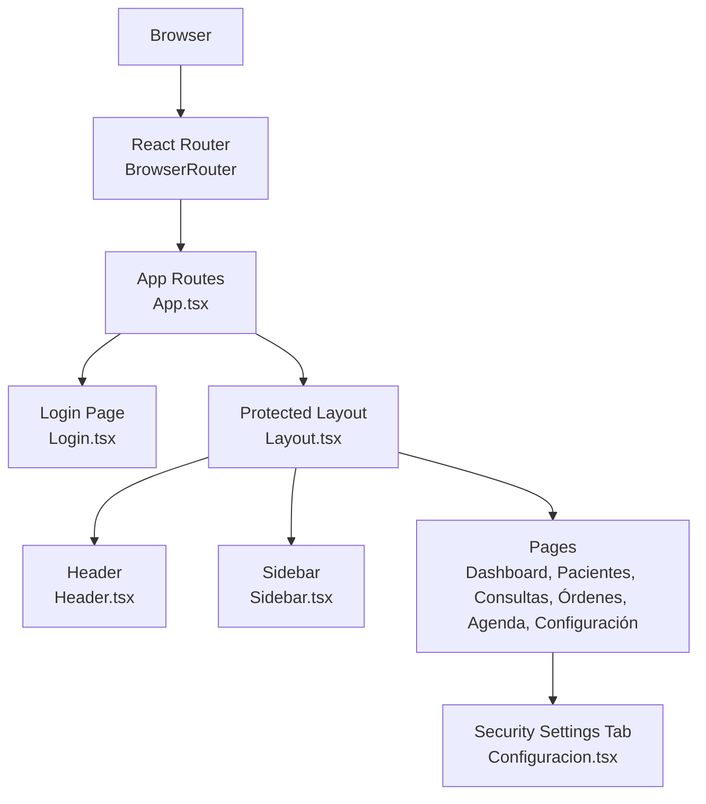
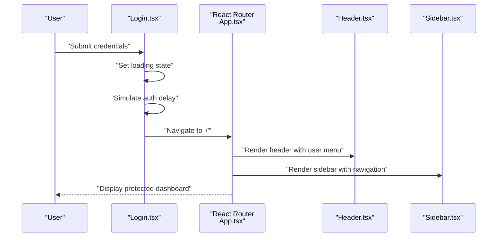
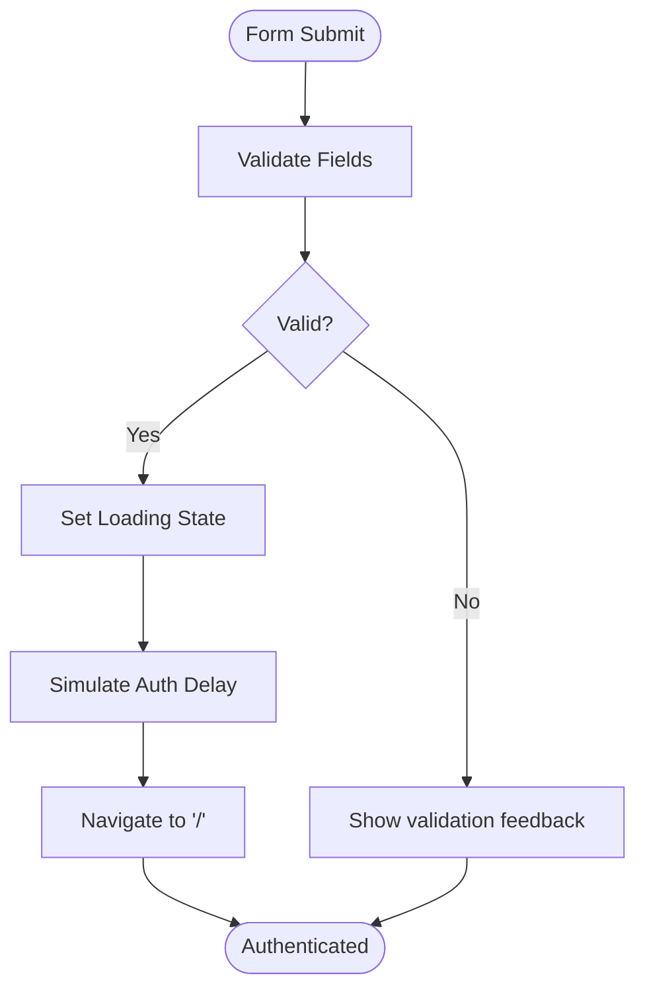
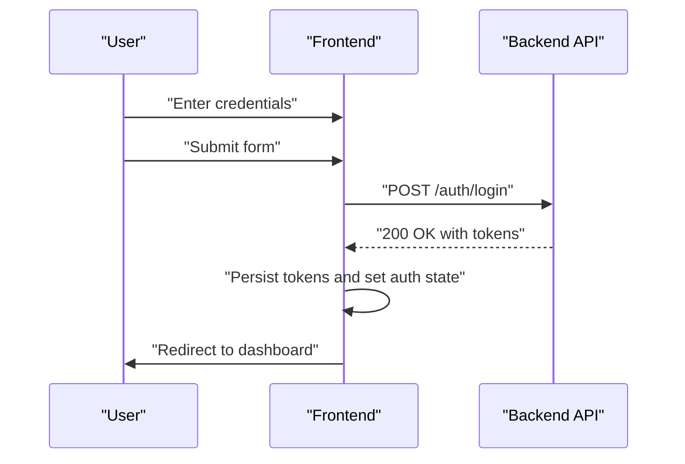
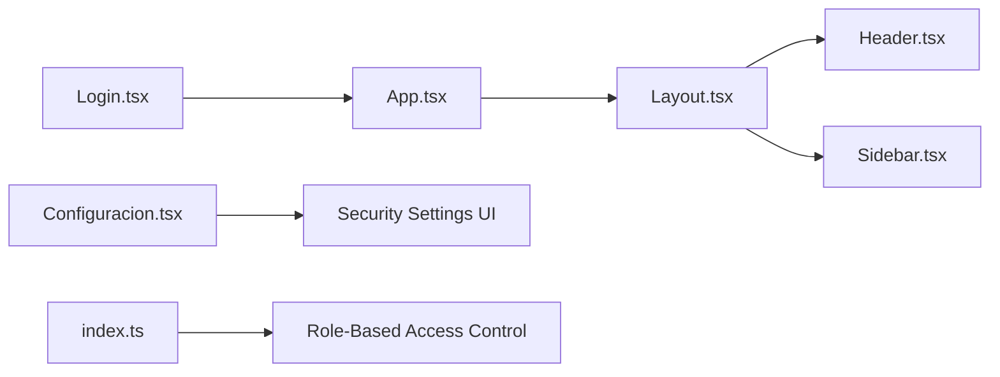

# Authentication & Security

<cite>
**Referenced Files in This Document**
- [Login.tsx](file://src/pages/Login.tsx)
- [App.tsx](file://src/App.tsx)
- [main.tsx](file://src/main.tsx)
- [Layout.tsx](file://src/components/layout/Layout.tsx)
- [Header.tsx](file://src/components/layout/Header.tsx)
- [Sidebar.tsx](file://src/components/layout/Sidebar.tsx)
- [Configuracion.tsx](file://src/pages/Configuracion.tsx)
- [index.ts](file://src/types/index.ts)
- [button.tsx](file://src/components/ui/button.tsx)
- [input.tsx](file://src/components/ui/input.tsx)
- [package.json](file://package.json)
</cite>

## Table of Contents
1. [Introduction](#introduction)
2. [Project Structure](#project-structure)
3. [Core Components](#core-components)
4. [Architecture Overview](#architecture-overview)
5. [Detailed Component Analysis](#detailed-component-analysis)
6. [Dependency Analysis](#dependency-analysis)
7. [Performance Considerations](#performance-considerations)
8. [Troubleshooting Guide](#troubleshooting-guide)
9. [Conclusion](#conclusion)
10. [Appendices](#appendices)

## Introduction
This document describes the Authentication and Security system for the NexaMed frontend application. It focuses on the login interface, session management, user authentication flow, access control mechanisms, password policies, multi-factor authentication options, and security best practices. It also covers user role management, permission inheritance, audit logging, session timeout handling, secure token management, and integration with healthcare compliance requirements. Finally, it explains the relationship between authentication and protected route access across the application.

## Project Structure
The frontend is a React application bootstrapped with Vite and TypeScript. Routing is handled by React Router. Authentication and navigation are implemented through dedicated pages and layout components. UI primitives are built with shared components.



**Diagram sources**
- [main.tsx:1-14](file://src/main.tsx#L1-L14)
- [App.tsx:1-38](file://src/App.tsx#L1-L38)
- [Login.tsx:1-138](file://src/pages/Login.tsx#L1-L138)
- [Layout.tsx:1-35](file://src/components/layout/Layout.tsx#L1-L35)
- [Header.tsx:1-84](file://src/components/layout/Header.tsx#L1-L84)
- [Sidebar.tsx:1-42](file://src/components/layout/Sidebar.tsx#L1-L42)
- [Configuracion.tsx:1-297](file://src/pages/Configuracion.tsx#L1-L297)

**Section sources**
- [main.tsx:1-14](file://src/main.tsx#L1-L14)
- [App.tsx:1-38](file://src/App.tsx#L1-L38)

## Core Components
- Login page: Provides the login form with email/password fields, show/hide password toggle, loading state, and navigation on successful submission.
- Protected layout: Wraps authenticated routes with header and sidebar navigation.
- Security settings: Exposes password change and two-factor authentication configuration UI.
- Types: Defines the User model with role enumeration used for access control.

Key implementation references:
- Login form and navigation: [Login.tsx:18-27](file://src/pages/Login.tsx#L18-L27)
- Protected routing: [App.tsx:14-32](file://src/App.tsx#L14-L32)
- Layout wrapper: [Layout.tsx:12-34](file://src/components/layout/Layout.tsx#L12-L34)
- User role model: [index.ts:1-8](file://src/types/index.ts#L1-L8)
- Security settings UI: [Configuracion.tsx:196-246](file://src/pages/Configuracion.tsx#L196-L246)

**Section sources**
- [Login.tsx:1-138](file://src/pages/Login.tsx#L1-L138)
- [App.tsx:1-38](file://src/App.tsx#L1-L38)
- [Layout.tsx:1-35](file://src/components/layout/Layout.tsx#L1-L35)
- [Configuracion.tsx:1-297](file://src/pages/Configuracion.tsx#L1-L297)
- [index.ts:1-128](file://src/types/index.ts#L1-L128)

## Architecture Overview
The current frontend implements a client-side authentication simulation. On successful login, the app navigates to the dashboard. No server-side authentication, tokens, or session persistence are present in the frontend code. Access control relies on route protection via React Router nested routes under the Layout wrapper.



**Diagram sources**
- [Login.tsx:18-27](file://src/pages/Login.tsx#L18-L27)
- [App.tsx:14-32](file://src/App.tsx#L14-L32)
- [Header.tsx:19-83](file://src/components/layout/Header.tsx#L19-L83)
- [Sidebar.tsx:31-42](file://src/components/layout/Sidebar.tsx#L31-L42)

## Detailed Component Analysis

### Login Interface
The login interface captures email and password, toggles password visibility, disables the submit button during loading, and simulates authentication before navigating to the dashboard. The form uses shared UI components for inputs and buttons.



**Diagram sources**
- [Login.tsx:18-27](file://src/pages/Login.tsx#L18-L27)
- [input.tsx:1-25](file://src/components/ui/input.tsx#L1-L25)
- [button.tsx:1-54](file://src/components/ui/button.tsx#L1-L54)

**Section sources**
- [Login.tsx:1-138](file://src/pages/Login.tsx#L1-L138)
- [input.tsx:1-25](file://src/components/ui/input.tsx#L1-L25)
- [button.tsx:1-54](file://src/components/ui/button.tsx#L1-L54)

### Session Management and Access Control
- Current behavior: After login, the app navigates to the dashboard. There is no client-side session persistence, token management, or explicit logout mechanism in the frontend code.
- Access control: Routes are grouped under a Layout wrapper. Protected pages are rendered within this layout. The application does not enforce role-based access control in the frontend code.

Recommendations for implementation (to be implemented in coordination with backend):
- Centralized authentication state management (e.g., context or state library).
- Token storage with secure, httpOnly cookies for production.
- Automatic token refresh and logout handlers.
- Route guards using React Router to redirect unauthenticated users to the login page.
- Role-based rendering of UI elements and navigation items.

**Section sources**
- [App.tsx:14-32](file://src/App.tsx#L14-L32)
- [Layout.tsx:12-34](file://src/components/layout/Layout.tsx#L12-L34)

### User Authentication Flow
The frontend simulates authentication. To integrate with a real backend:
- Replace the simulated login with an API call to an authentication endpoint.
- Store authentication state and tokens securely.
- Implement a logout action that clears state and redirects to the login page.



[No sources needed since this diagram shows conceptual workflow, not actual code structure]

### Password Policies and Multi-Factor Authentication
- Password policy UI: The security settings tab exposes a form for changing passwords and enabling two-factor authentication. The UI indicates that 2FA can be configured.
- Implementation note: The current frontend code does not enforce password complexity rules or handle 2FA flows. These would be implemented with backend APIs and secure token handling.

**Section sources**
- [Configuracion.tsx:196-246](file://src/pages/Configuracion.tsx#L196-L246)

### Security Best Practices
- Input validation and sanitization should be enforced on the backend; the frontend should treat all inputs as untrusted.
- Use HTTPS and secure cookies for token transport.
- Implement CSRF protection and Content Security Policy headers on the backend.
- Sanitize and validate all user-generated content on the backend.
- Regularly update dependencies and scan for vulnerabilities.

[No sources needed since this section provides general guidance]

### User Role Management and Permission Inheritance
- Role model: The User type defines roles: admin, doctor, assistant. This enables role-based UI and access control decisions.
- Recommendation: Implement role-based access control (RBAC) in the frontend to conditionally render navigation items, buttons, and features based on the user’s role.

```mermaid
classDiagram
class User {
+string id
+string email
+string name
+string role
+string avatar
+string consultorioId
}
class Roles {
<<enumeration>>
"admin"
"doctor"
"assistant"
}
User --> Roles : "has role"
```

**Diagram sources**
- [index.ts:1-8](file://src/types/index.ts#L1-L8)

**Section sources**
- [index.ts:1-8](file://src/types/index.ts#L1-L8)

### Audit Logging
- Current state: The frontend does not implement audit logging.
- Recommendation: Integrate with backend audit endpoints to log authentication events, password changes, and sensitive actions. Frontend can trigger logs upon user actions and display confirmation messages.

[No sources needed since this section provides general guidance]

### Session Timeout Handling
- Current state: No session timeout handling exists in the frontend.
- Recommendation: Implement automatic logout after inactivity using timers and background heartbeat checks. Prompt users before timeout and optionally extend sessions.

[No sources needed since this section provides general guidance]

### Secure Token Management
- Current state: Tokens are not managed in the frontend code.
- Recommendation: Store tokens in secure, httpOnly cookies; avoid storing secrets in local storage. Use short-lived access tokens with refresh tokens obtained via a dedicated endpoint.

[No sources needed since this section provides general guidance]

### Healthcare Compliance Integration
- Current state: No HIPAA or similar compliance features are implemented in the frontend.
- Recommendations:
  - Enforce strong encryption for data at rest and in transit.
  - Implement audit trails for all patient-related actions.
  - Add granular access controls aligned with role-based permissions.
  - Ensure secure deletion and anonymization capabilities.

[No sources needed since this section provides general guidance]

## Dependency Analysis
The authentication and security system interacts with routing, layout, and UI components. The following diagram highlights key dependencies.



**Diagram sources**
- [Login.tsx:1-138](file://src/pages/Login.tsx#L1-L138)
- [App.tsx:1-38](file://src/App.tsx#L1-L38)
- [Layout.tsx:1-35](file://src/components/layout/Layout.tsx#L1-L35)
- [Header.tsx:1-84](file://src/components/layout/Header.tsx#L1-L84)
- [Sidebar.tsx:1-42](file://src/components/layout/Sidebar.tsx#L1-L42)
- [Configuracion.tsx:1-297](file://src/pages/Configuracion.tsx#L1-L297)
- [index.ts:1-128](file://src/types/index.ts#L1-L128)

**Section sources**
- [package.json:1-49](file://package.json#L1-L49)

## Performance Considerations
- Minimize re-renders by memoizing UI components and avoiding unnecessary prop drilling.
- Lazy-load heavy components and pages to improve initial load times.
- Debounce or throttle form submissions to reduce network requests.
- Use efficient state updates and avoid synchronous heavy computations in render cycles.

[No sources needed since this section provides general guidance]

## Troubleshooting Guide
Common issues and resolutions:
- Login form not submitting: Verify event handlers and form validation. Ensure the submit handler prevents default behavior and sets loading states appropriately.
- Navigation fails after login: Confirm route definitions and that navigation occurs only after successful authentication.
- UI components not rendering correctly: Check Tailwind and Radix UI dependencies and ensure proper imports.

**Section sources**
- [Login.tsx:18-27](file://src/pages/Login.tsx#L18-L27)
- [App.tsx:14-32](file://src/App.tsx#L14-L32)

## Conclusion
The current frontend implements a basic login simulation and a protected layout for authenticated routes. To achieve a robust, production-ready authentication and security system, integrate with backend authentication services, implement secure token management, add role-based access control, and incorporate session timeout handling and audit logging. Align security measures with healthcare compliance requirements and adopt industry best practices for data protection and privacy.

## Appendices
- Dependencies relevant to UI and routing: [package.json:12-32](file://package.json#L12-L32)