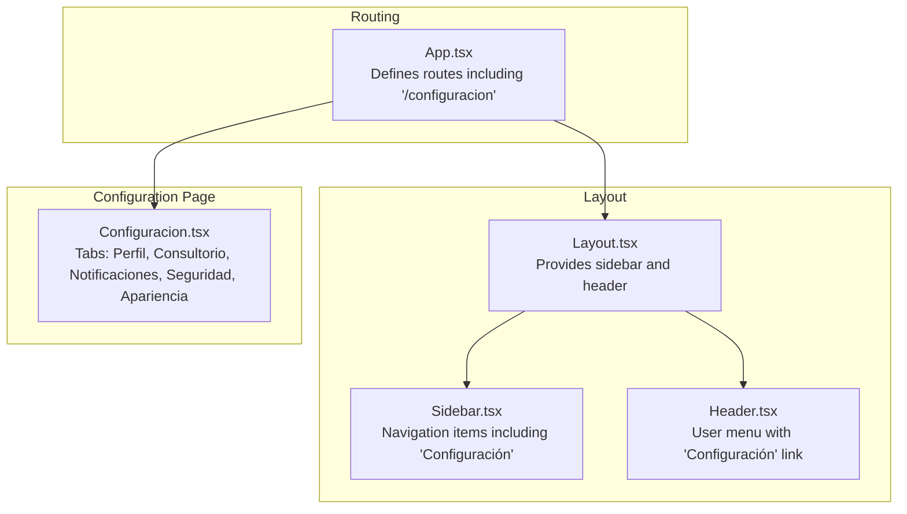
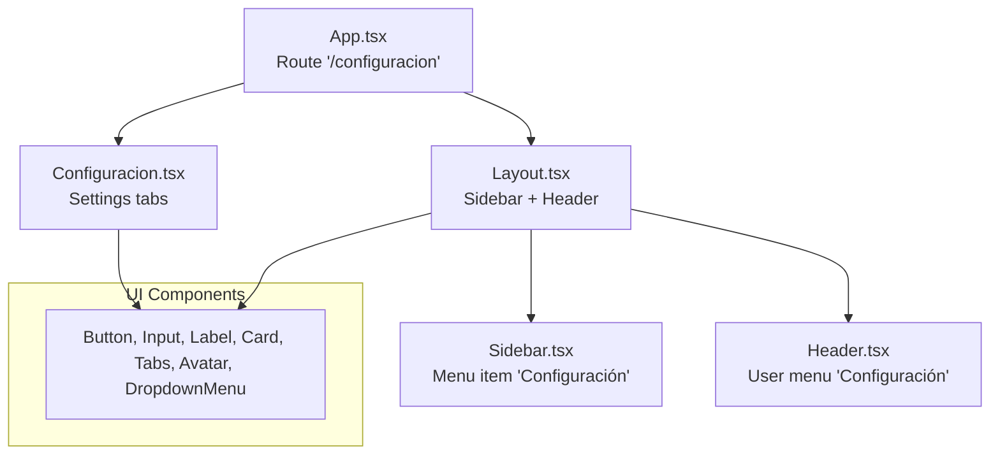
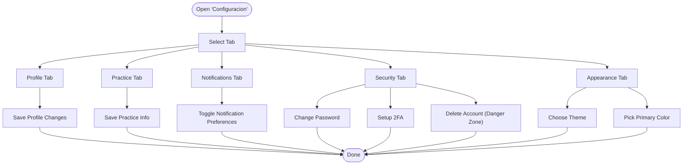
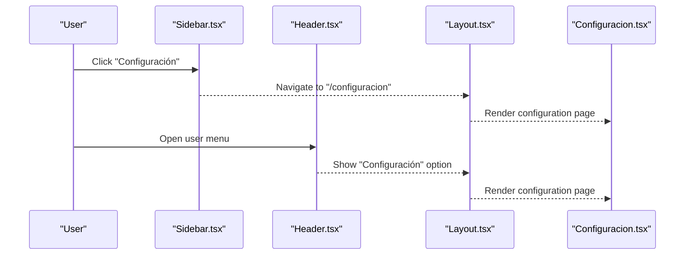
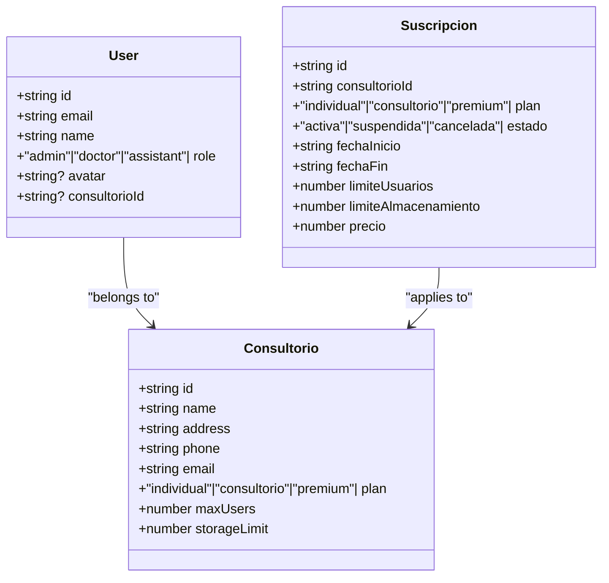
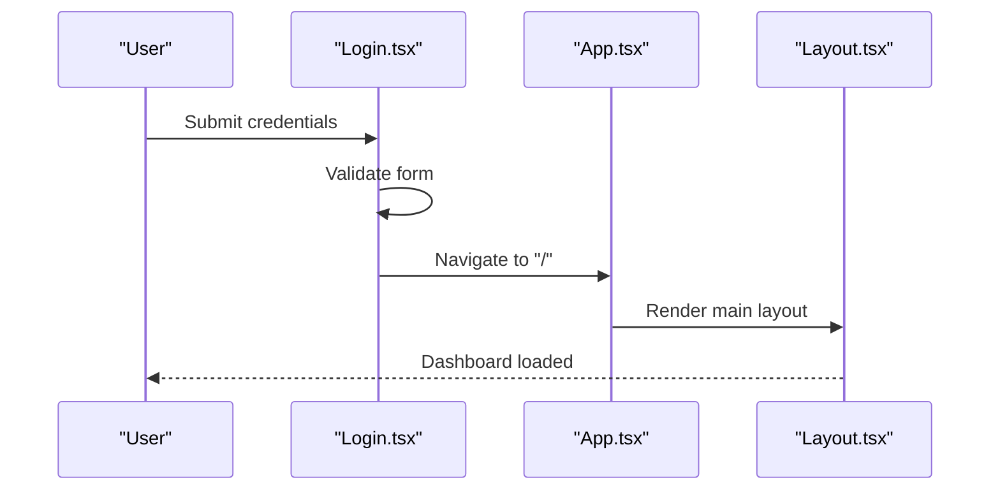
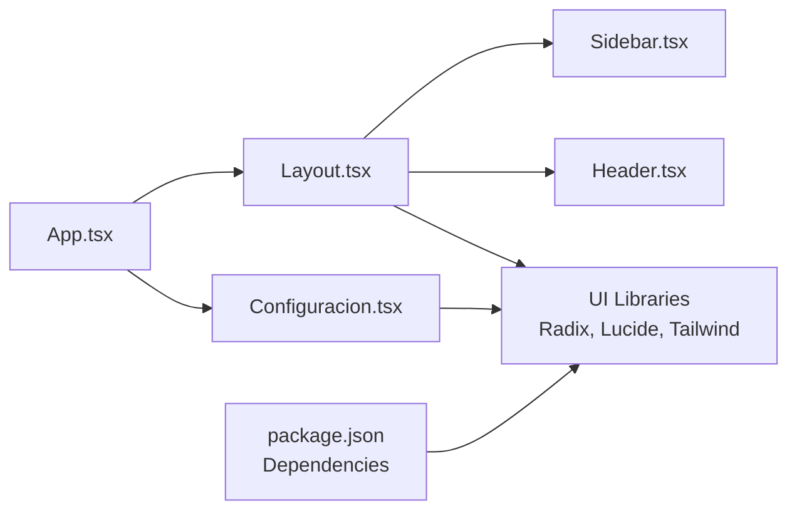

# Configuration & Settings

<cite>
**Referenced Files in This Document**
- [Configuracion.tsx](file://NexaMed-Frontend/src/pages/Configuracion.tsx)
- [App.tsx](file://NexaMed-Frontend/src/App.tsx)
- [Layout.tsx](file://NexaMed-Frontend/src/components/layout/Layout.tsx)
- [Header.tsx](file://NexaMed-Frontend/src/components/layout/Header.tsx)
- [Sidebar.tsx](file://NexaMed-Frontend/src/components/layout/Sidebar.tsx)
- [index.ts](file://NexaMed-Frontend/src/types/index.ts)
- [Login.tsx](file://NexaMed-Frontend/src/pages/Login.tsx)
- [package.json](file://NexaMed-Frontend/package.json)
</cite>

## Table of Contents
1. [Introduction](#introduction)
2. [Project Structure](#project-structure)
3. [Core Components](#core-components)
4. [Architecture Overview](#architecture-overview)
5. [Detailed Component Analysis](#detailed-component-analysis)
6. [Dependency Analysis](#dependency-analysis)
7. [Performance Considerations](#performance-considerations)
8. [Troubleshooting Guide](#troubleshooting-guide)
9. [Conclusion](#conclusion)

## Introduction
This document describes the Configuration and Settings system for the NexaMed frontend application. It focuses on how users manage personal profile information, practice details, notification preferences, security settings, and appearance customization. It also explains the current routing and layout structure that exposes the configuration interface, outlines the data models that support roles, subscriptions, and practice information, and provides guidance for extending the system with backend integrations and administrative controls.

## Project Structure
The configuration experience is implemented as a dedicated page integrated into the application's routing and layout system. The configuration page is organized into logical tabs for Profile, Practice, Notifications, Security, and Appearance. Supporting components provide navigation, header actions, and layout behavior.

**Diagram sources**
- [App.tsx:11-35](file://NexaMed-Frontend/src/App.tsx#L11-L35)
- [Layout.tsx:12-34](file://NexaMed-Frontend/src/components/layout/Layout.tsx#L12-L34)
- [Sidebar.tsx:31-106](file://NexaMed-Frontend/src/components/layout/Sidebar.tsx#L31-L106)
- [Header.tsx:19-83](file://NexaMed-Frontend/src/components/layout/Header.tsx#L19-L83)
- [Configuracion.tsx:19-296](file://NexaMed-Frontend/src/pages/Configuracion.tsx#L19-L296)

**Section sources**
- [App.tsx:11-35](file://NexaMed-Frontend/src/App.tsx#L11-L35)
- [Layout.tsx:12-34](file://NexaMed-Frontend/src/components/layout/Layout.tsx#L12-L34)
- [Sidebar.tsx:31-106](file://NexaMed-Frontend/src/components/layout/Sidebar.tsx#L31-L106)
- [Header.tsx:19-83](file://NexaMed-Frontend/src/components/layout/Header.tsx#L19-L83)
- [Configuracion.tsx:19-296](file://NexaMed-Frontend/src/pages/Configuracion.tsx#L19-L296)

## Core Components
- Configuration Page: Centralized settings hub with five tabs covering user profile, practice information, notifications, security, and appearance.
- Layout and Navigation: Sidebar and header integrate configuration access into the main application flow.
- Data Models: TypeScript interfaces define roles, subscription plans, and practice metadata that inform configuration capabilities and validations.

Key functional areas:
- Profile tab: Personal and professional details, avatar upload area, save action.
- Practice tab: Clinic/office information including name, tax ID, address, contact, and hours.
- Notifications tab: Toggle switches for appointment reminders, lab results, pending patients, and system updates.
- Security tab: Password change form, two-factor authentication setup, and account deletion prompt.
- Appearance tab: Theme selection (light, dark, system) and primary color picker.

**Section sources**
- [Configuracion.tsx:49-115](file://NexaMed-Frontend/src/pages/Configuracion.tsx#L49-L115)
- [Configuracion.tsx:118-162](file://NexaMed-Frontend/src/pages/Configuracion.tsx#L118-L162)
- [Configuracion.tsx:165-194](file://NexaMed-Frontend/src/pages/Configuracion.tsx#L165-L194)
- [Configuracion.tsx:197-246](file://NexaMed-Frontend/src/pages/Configuracion.tsx#L197-L246)
- [Configuracion.tsx:249-292](file://NexaMed-Frontend/src/pages/Configuracion.tsx#L249-L292)

## Architecture Overview
The configuration system is client-side UI-driven. Routing integrates the configuration page under the main layout, while the sidebar and header provide consistent navigation and user context. The configuration page uses reusable UI components for forms, cards, tabs, and inputs.

**Diagram sources**
- [App.tsx:30-32](file://NexaMed-Frontend/src/App.tsx#L30-L32)
- [Layout.tsx:12-34](file://NexaMed-Frontend/src/components/layout/Layout.tsx#L12-L34)
- [Sidebar.tsx:22-29](file://NexaMed-Frontend/src/components/layout/Sidebar.tsx#L22-L29)
- [Header.tsx:50-78](file://NexaMed-Frontend/src/components/layout/Header.tsx#L50-L78)
- [Configuracion.tsx:11-17](file://NexaMed-Frontend/src/pages/Configuracion.tsx#L11-L17)

## Detailed Component Analysis

### Configuration Page (Configuracion.tsx)
The configuration page organizes settings into five logical tabs:
- Profile: Displays avatar placeholder, personal/professional info fields, and a save action.
- Practice: Collects clinic/office details including legal ID, address, phone, email, and schedule.
- Notifications: Provides toggles for appointment alerts, reminders, lab results, follow-ups, and system updates.
- Security: Includes password change fields, 2FA setup, and account deletion prompt.
- Appearance: Offers theme selection and primary color customization.

**Diagram sources**
- [Configuracion.tsx:19-296](file://NexaMed-Frontend/src/pages/Configuracion.tsx#L19-L296)

**Section sources**
- [Configuracion.tsx:19-296](file://NexaMed-Frontend/src/pages/Configuracion.tsx#L19-L296)

### Layout and Navigation Integration
The configuration page is embedded within the main layout, ensuring consistent navigation and user context:
- Sidebar includes a direct link to the configuration page.
- Header provides user menu access to configuration.
- The layout manages responsive sidebar collapse and content area spacing.

**Diagram sources**
- [Sidebar.tsx:22-29](file://NexaMed-Frontend/src/components/layout/Sidebar.tsx#L22-L29)
- [Header.tsx:50-78](file://NexaMed-Frontend/src/components/layout/Header.tsx#L50-L78)
- [Layout.tsx:12-34](file://NexaMed-Frontend/src/components/layout/Layout.tsx#L12-L34)
- [App.tsx:30-32](file://NexaMed-Frontend/src/App.tsx#L30-L32)

**Section sources**
- [Sidebar.tsx:22-29](file://NexaMed-Frontend/src/components/layout/Sidebar.tsx#L22-L29)
- [Header.tsx:50-78](file://NexaMed-Frontend/src/components/layout/Header.tsx#L50-L78)
- [Layout.tsx:12-34](file://NexaMed-Frontend/src/components/layout/Layout.tsx#L12-L34)
- [App.tsx:30-32](file://NexaMed-Frontend/src/App.tsx#L30-L32)

### Role-Based Access and Subscription Models
The application defines user roles and subscription plans that influence configuration capabilities and system limits:
- Roles: admin, doctor, assistant.
- Subscription plans: individual, consultorio, premium.
- Practice metadata: name, address, phone, email, plan, user/storage limits.

These models inform which configuration options are visible or editable and how many users or storage resources are permitted.

**Diagram sources**
- [index.ts:1-128](file://NexaMed-Frontend/src/types/index.ts#L1-L128)

**Section sources**
- [index.ts:1-128](file://NexaMed-Frontend/src/types/index.ts#L1-L128)

### Authentication Flow and Security Context
While the configuration page includes a security tab, the login flow demonstrates the current authentication mechanism. The login page simulates authentication and redirects to the dashboard, indicating where security-related configuration would integrate with backend services.

**Diagram sources**
- [Login.tsx:18-27](file://NexaMed-Frontend/src/pages/Login.tsx#L18-L27)
- [App.tsx:14-17](file://NexaMed-Frontend/src/App.tsx#L14-L17)
- [Layout.tsx:12-34](file://NexaMed-Frontend/src/components/layout/Layout.tsx#L12-L34)

**Section sources**
- [Login.tsx:18-27](file://NexaMed-Frontend/src/pages/Login.tsx#L18-L27)
- [App.tsx:14-17](file://NexaMed-Frontend/src/App.tsx#L14-L17)
- [Layout.tsx:12-34](file://NexaMed-Frontend/src/components/layout/Layout.tsx#L12-L34)

## Dependency Analysis
The configuration system relies on shared UI primitives and routing infrastructure. The configuration page imports UI components for forms, cards, tabs, and inputs, while the layout composes the sidebar and header.

**Diagram sources**
- [package.json:12-32](file://NexaMed-Frontend/package.json#L12-L32)
- [App.tsx:11-35](file://NexaMed-Frontend/src/App.tsx#L11-L35)
- [Layout.tsx:12-34](file://NexaMed-Frontend/src/components/layout/Layout.tsx#L12-L34)
- [Sidebar.tsx:31-106](file://NexaMed-Frontend/src/components/layout/Sidebar.tsx#L31-L106)
- [Header.tsx:19-83](file://NexaMed-Frontend/src/components/layout/Header.tsx#L19-L83)
- [Configuracion.tsx:11-17](file://NexaMed-Frontend/src/pages/Configuracion.tsx#L11-L17)

**Section sources**
- [package.json:12-32](file://NexaMed-Frontend/package.json#L12-L32)
- [App.tsx:11-35](file://NexaMed-Frontend/src/App.tsx#L11-L35)
- [Layout.tsx:12-34](file://NexaMed-Frontend/src/components/layout/Layout.tsx#L12-L34)
- [Sidebar.tsx:31-106](file://NexaMed-Frontend/src/components/layout/Sidebar.tsx#L31-L106)
- [Header.tsx:19-83](file://NexaMed-Frontend/src/components/layout/Header.tsx#L19-L83)
- [Configuracion.tsx:11-17](file://NexaMed-Frontend/src/pages/Configuracion.tsx#L11-L17)

## Performance Considerations
- Client-side rendering: The configuration page is rendered entirely in the browser; keep form updates lightweight and avoid unnecessary re-renders by using controlled components and state hooks effectively.
- Theme and color switching: Instant theme changes are fast; persist user preferences to local storage to avoid repeated computations.
- Image uploads: Avatar upload UI exists; defer actual upload logic to backend APIs to avoid blocking the UI thread.

## Troubleshooting Guide
Common issues and resolutions:
- Configuration not accessible: Verify the route for "/configuracion" is present and the sidebar/header links resolve to the correct path.
- Forms not saving: Ensure form handlers are wired up; the current configuration page uses default values and placeholder buttons—implement submission handlers to persist changes.
- Theme/color not applying: Confirm theme classes are applied consistently across the app and that user preferences are stored and retrieved appropriately.
- Authentication integration: The login flow currently simulates authentication; connect the login handler to backend endpoints to enable real authentication and secure configuration access.

**Section sources**
- [App.tsx:30-32](file://NexaMed-Frontend/src/App.tsx#L30-L32)
- [Sidebar.tsx:22-29](file://NexaMed-Frontend/src/components/layout/Sidebar.tsx#L22-L29)
- [Header.tsx:50-78](file://NexaMed-Frontend/src/components/layout/Header.tsx#L50-L78)
- [Configuracion.tsx:108-112](file://NexaMed-Frontend/src/pages/Configuracion.tsx#L108-L112)
- [Configuracion.tsx:222-223](file://NexaMed-Frontend/src/pages/Configuracion.tsx#L222-L223)
- [Configuracion.tsx:232](file://NexaMed-Frontend/src/pages/Configuracion.tsx#L232)
- [Configuracion.tsx:242](file://NexaMed-Frontend/src/pages/Configuracion.tsx#L242)
- [Login.tsx:18-27](file://NexaMed-Frontend/src/pages/Login.tsx#L18-L27)

## Conclusion
The Configuration and Settings system in NexaMed is structured around a dedicated page with five tabs covering profile, practice, notifications, security, and appearance. It integrates seamlessly with the main layout and navigation, leveraging reusable UI components. The TypeScript models define roles and subscription plans that inform configuration capabilities and resource limits. To complete the system, implement backend integrations for saving settings, authenticating users, enforcing role-based permissions, and managing subscription states. This will enable robust administrative controls, secure configuration changes, and scalable practice management.