# Core Features

<cite>
**Referenced Files in This Document**
- [App.tsx](file://NexaMed-Frontend/src/App.tsx)
- [main.tsx](file://NexaMed-Frontend/src/main.tsx)
- [Layout.tsx](file://NexaMed-Frontend/src/components/layout/Layout.tsx)
- [Header.tsx](file://NexaMed-Frontend/src/components/layout/Header.tsx)
- [Sidebar.tsx](file://NexaMed-Frontend/src/components/layout/Sidebar.tsx)
- [Dashboard.tsx](file://NexaMed-Frontend/src/pages/Dashboard.tsx)
- [Login.tsx](file://NexaMed-Frontend/src/pages/Login.tsx)
- [Pacientes.tsx](file://NexaMed-Frontend/src/pages/Pacientes.tsx)
- [Agenda.tsx](file://NexaMed-Frontend/src/pages/Agenda.tsx)
- [Consultas.tsx](file://NexaMed-Frontend/src/pages/Consultas.tsx)
- [Ordenes.tsx](file://NexaMed-Frontend/src/pages/Ordenes.tsx)
- [Configuracion.tsx](file://NexaMed-Frontend/src/pages/Configuracion.tsx)
- [utils.ts](file://NexaMed-Frontend/src/lib/utils.ts)
- [button.tsx](file://NexaMed-Frontend/src/components/ui/button.tsx)
- [index.ts](file://NexaMed-Frontend/src/types/index.ts)
- [package.json](file://NexaMed-Frontend/package.json)
</cite>

## Table of Contents
1. [Introduction](#introduction)
2. [Project Structure](#project-structure)
3. [Core Components](#core-components)
4. [Architecture Overview](#architecture-overview)
5. [Detailed Component Analysis](#detailed-component-analysis)
6. [Dependency Analysis](#dependency-analysis)
7. [Performance Considerations](#performance-considerations)
8. [Troubleshooting Guide](#troubleshooting-guide)
9. [Conclusion](#conclusion)

## Introduction
This document describes NexaMed's core features and functionality as implemented in the frontend. It covers the major modules—Dashboard analytics, Patient Management, Appointment Scheduling, Medical Consultation tracking, Order Management, Configuration settings, and Authentication—and explains how they interconnect to support a complete medical clinic workflow. It also documents user roles and permissions, common workflows, and integration patterns between features.

## Project Structure
NexaMed is a React application bootstrapped with Vite and TypeScript, styled with Tailwind CSS and Radix UI primitives. Routing is handled by React Router DOM. The app follows a feature-based structure under src/, with dedicated pages for each module and shared UI components and layout elements.

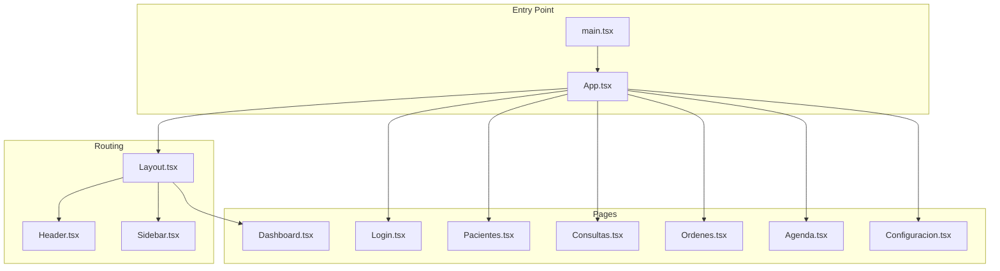

**Diagram sources**
- [main.tsx:1-14](file://NexaMed-Frontend/src/main.tsx#L1-L14)
- [App.tsx:1-38](file://NexaMed-Frontend/src/App.tsx#L1-L38)
- [Layout.tsx:1-35](file://NexaMed-Frontend/src/components/layout/Layout.tsx#L1-L35)
- [Header.tsx:1-84](file://NexaMed-Frontend/src/components/layout/Header.tsx#L1-L84)
- [Sidebar.tsx:1-107](file://NexaMed-Frontend/src/components/layout/Sidebar.tsx#L1-L107)
- [Dashboard.tsx:1-206](file://NexaMed-Frontend/src/pages/Dashboard.tsx#L1-L206)
- [Login.tsx:1-138](file://NexaMed-Frontend/src/pages/Login.tsx#L1-L138)
- [Pacientes.tsx:1-279](file://NexaMed-Frontend/src/pages/Pacientes.tsx#L1-L279)
- [Consultas.tsx:1-231](file://NexaMed-Frontend/src/pages/Consultas.tsx#L1-L231)
- [Ordenes.tsx:1-309](file://NexaMed-Frontend/src/pages/Ordenes.tsx#L1-L309)
- [Agenda.tsx:1-178](file://NexaMed-Frontend/src/pages/Agenda.tsx#L1-L178)
- [Configuracion.tsx:1-297](file://NexaMed-Frontend/src/pages/Configuracion.tsx#L1-L297)

**Section sources**
- [main.tsx:1-14](file://NexaMed-Frontend/src/main.tsx#L1-L14)
- [App.tsx:1-38](file://NexaMed-Frontend/src/App.tsx#L1-L38)
- [package.json:1-49](file://NexaMed-Frontend/package.json#L1-L49)

## Core Components
- Routing and navigation: Centralized routes define accessible pages and nested layouts.
- Shared layout: A responsive header and collapsible sidebar provide consistent navigation and branding.
- Utility functions: Formatting helpers for dates and ages, and ID generation.
- UI primitives: Reusable components like Button, Card, Badge, Tabs, DropdownMenu, and Input.

These components form the backbone of the application, enabling consistent UX and efficient development across modules.

**Section sources**
- [App.tsx:11-35](file://NexaMed-Frontend/src/App.tsx#L11-L35)
- [Layout.tsx:12-34](file://NexaMed-Frontend/src/components/layout/Layout.tsx#L12-L34)
- [Header.tsx:19-83](file://NexaMed-Frontend/src/components/layout/Header.tsx#L19-L83)
- [Sidebar.tsx:31-106](file://NexaMed-Frontend/src/components/layout/Sidebar.tsx#L31-L106)
- [utils.ts:4-44](file://NexaMed-Frontend/src/lib/utils.ts#L4-L44)
- [button.tsx:6-54](file://NexaMed-Frontend/src/components/ui/button.tsx#L6-L54)

## Architecture Overview
NexaMed uses a client-side routing model with a single-page application architecture. The layout composes the sidebar and header, while pages render content. Utilities centralize formatting and ID generation. Types define domain models for patients, consultations, orders, appointments, and more.

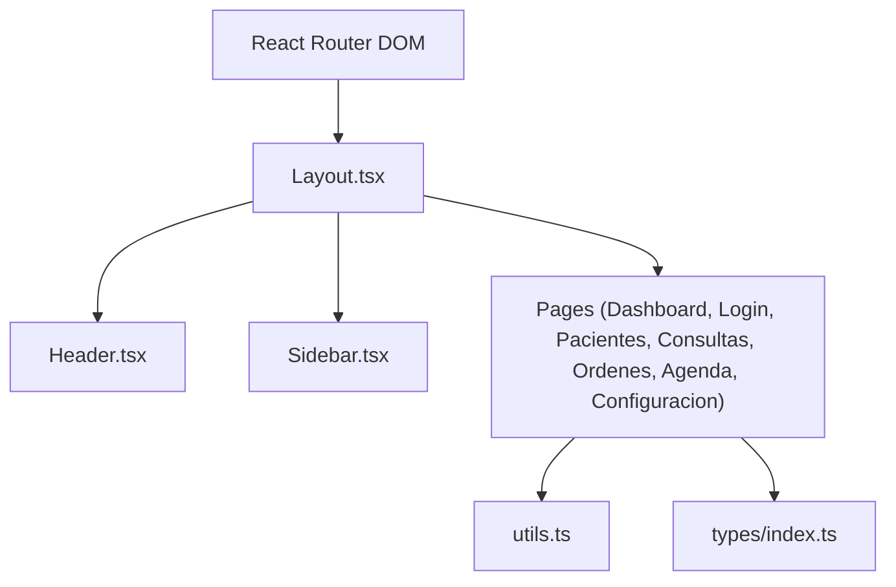

**Diagram sources**
- [App.tsx:1-38](file://NexaMed-Frontend/src/App.tsx#L1-L38)
- [Layout.tsx:1-35](file://NexaMed-Frontend/src/components/layout/Layout.tsx#L1-L35)
- [Header.tsx:1-84](file://NexaMed-Frontend/src/components/layout/Header.tsx#L1-L84)
- [Sidebar.tsx:1-107](file://NexaMed-Frontend/src/components/layout/Sidebar.tsx#L1-L107)
- [Dashboard.tsx:1-206](file://NexaMed-Frontend/src/pages/Dashboard.tsx#L1-L206)
- [Login.tsx:1-138](file://NexaMed-Frontend/src/pages/Login.tsx#L1-L138)
- [Pacientes.tsx:1-279](file://NexaMed-Frontend/src/pages/Pacientes.tsx#L1-L279)
- [Consultas.tsx:1-231](file://NexaMed-Frontend/src/pages/Consultas.tsx#L1-L231)
- [Ordenes.tsx:1-309](file://NexaMed-Frontend/src/pages/Ordenes.tsx#L1-L309)
- [Agenda.tsx:1-178](file://NexaMed-Frontend/src/pages/Agenda.tsx#L1-L178)
- [Configuracion.tsx:1-297](file://NexaMed-Frontend/src/pages/Configuracion.tsx#L1-L297)
- [utils.ts:1-44](file://NexaMed-Frontend/src/lib/utils.ts#L1-L44)
- [index.ts:1-128](file://NexaMed-Frontend/src/types/index.ts#L1-L128)

## Detailed Component Analysis

### Authentication System
- Purpose: Secure access to the application with a login form and navigation redirection.
- Scope: Email/password login simulation, loading states, and navigation to dashboard upon successful login.
- Integration: Routes protect access; after login, users are redirected to the dashboard.

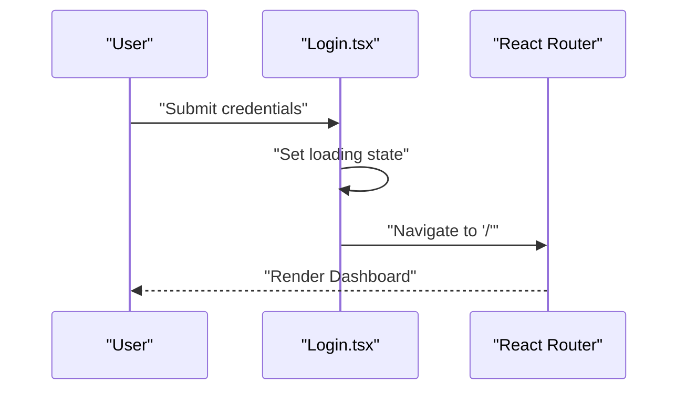

**Diagram sources**
- [Login.tsx:18-27](file://NexaMed-Frontend/src/pages/Login.tsx#L18-L27)
- [App.tsx:14-17](file://NexaMed-Frontend/src/App.tsx#L14-L17)

**Section sources**
- [Login.tsx:9-137](file://NexaMed-Frontend/src/pages/Login.tsx#L9-L137)
- [App.tsx:14-17](file://NexaMed-Frontend/src/App.tsx#L14-L17)

### Dashboard Analytics
- Purpose: Provide an overview of clinic metrics, upcoming appointments, and recent patient activity.
- Scope: Statistics cards, daily schedule, recent patients, and alerts.
- Integration: Links to related modules (Agenda, Patients).

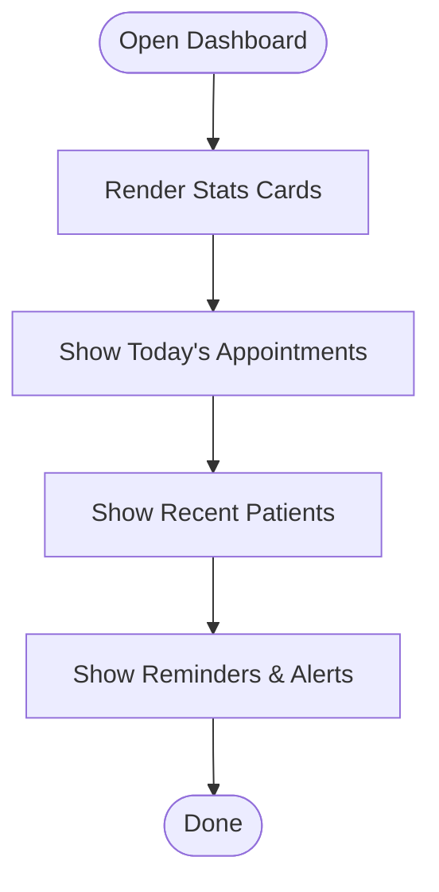

**Diagram sources**
- [Dashboard.tsx:62-201](file://NexaMed-Frontend/src/pages/Dashboard.tsx#L62-L201)

**Section sources**
- [Dashboard.tsx:16-206](file://NexaMed-Frontend/src/pages/Dashboard.tsx#L16-L206)

### Patient Management
- Purpose: Manage patient records, search/filter, and quick actions.
- Scope: Patient list with allergies/conditions, search by name/ID/phone, and action dropdowns.
- Integration: Links to create consultations, view medical records, and edit profiles.

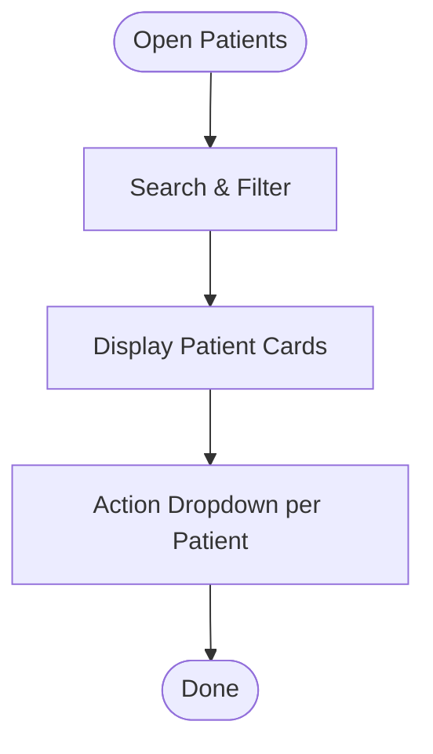

**Diagram sources**
- [Pacientes.tsx:93-279](file://NexaMed-Frontend/src/pages/Pacientes.tsx#L93-L279)

**Section sources**
- [Pacientes.tsx:24-279](file://NexaMed-Frontend/src/pages/Pacientes.tsx#L24-L279)

### Appointment Scheduling
- Purpose: Visualize and manage the clinic calendar and daily schedules.
- Scope: Month navigation, calendar grid, selected day view, and appointment actions.
- Integration: Create new appointments, view/edit/cancel.

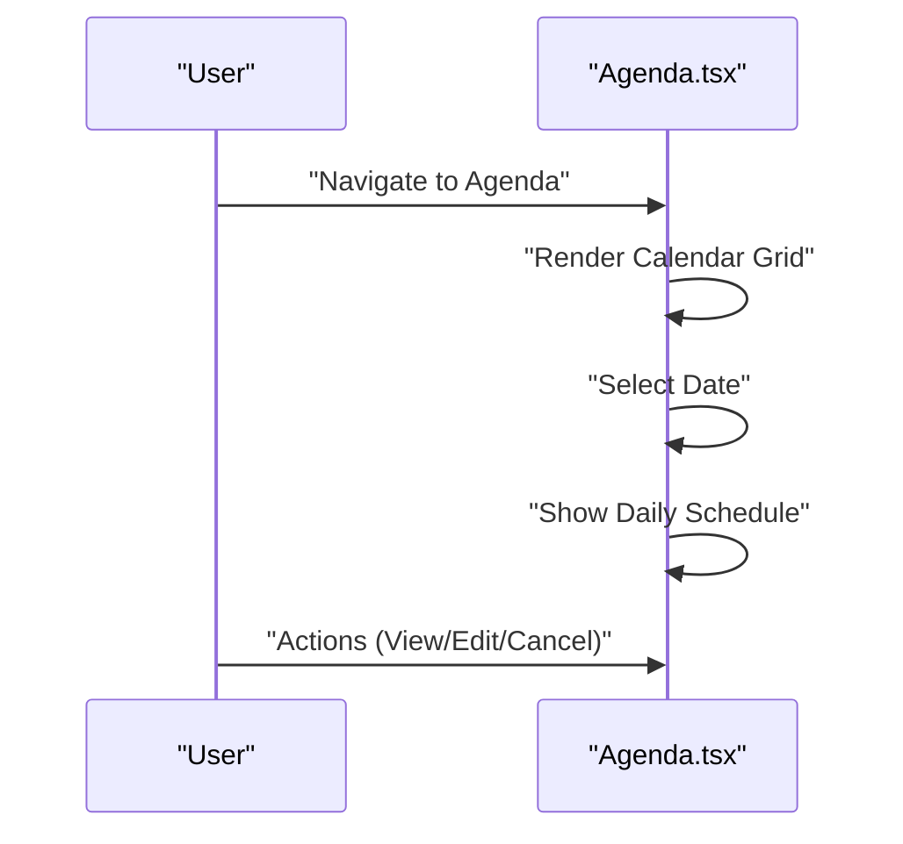

**Diagram sources**
- [Agenda.tsx:34-178](file://NexaMed-Frontend/src/pages/Agenda.tsx#L34-L178)

**Section sources**
- [Agenda.tsx:23-178](file://NexaMed-Frontend/src/pages/Agenda.tsx#L23-L178)

### Medical Consultation Tracking
- Purpose: Track consultation history, statuses, and types.
- Scope: Search, tabs filtering (all/today/completed/pending), and action dropdowns.
- Integration: Link to order creation, patient record viewing.

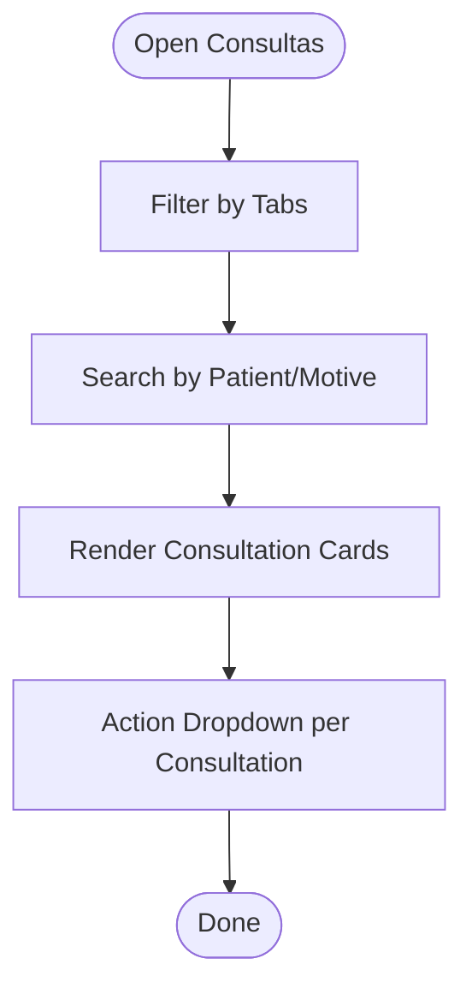

**Diagram sources**
- [Consultas.tsx:77-231](file://NexaMed-Frontend/src/pages/Consultas.tsx#L77-L231)

**Section sources**
- [Consultas.tsx:24-231](file://NexaMed-Frontend/src/pages/Consultas.tsx#L24-L231)

### Order Management
- Purpose: Manage medical orders (laboratory, imaging, interconsultation).
- Scope: Search, tabs filtering (all/pending/completed/cancelled), status badges, and actions.
- Integration: Download results for completed orders.

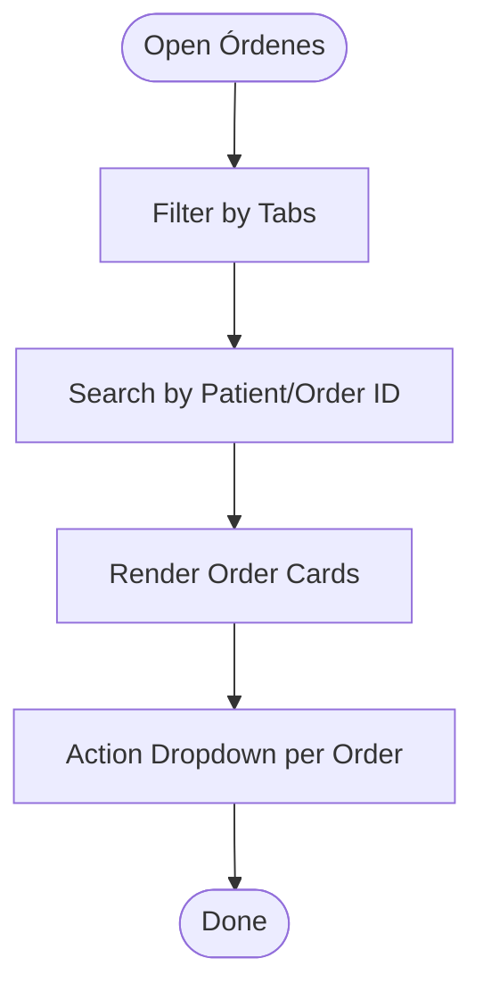

**Diagram sources**
- [Ordenes.tsx:81-309](file://NexaMed-Frontend/src/pages/Ordenes.tsx#L81-L309)

**Section sources**
- [Ordenes.tsx:28-309](file://NexaMed-Frontend/src/pages/Ordenes.tsx#L28-L309)

### Configuration Settings
- Purpose: Configure profile, clinic info, notifications, security, and appearance.
- Scope: Tabbed settings with forms, toggles, and theme/color customization.
- Integration: Save changes and apply preferences.

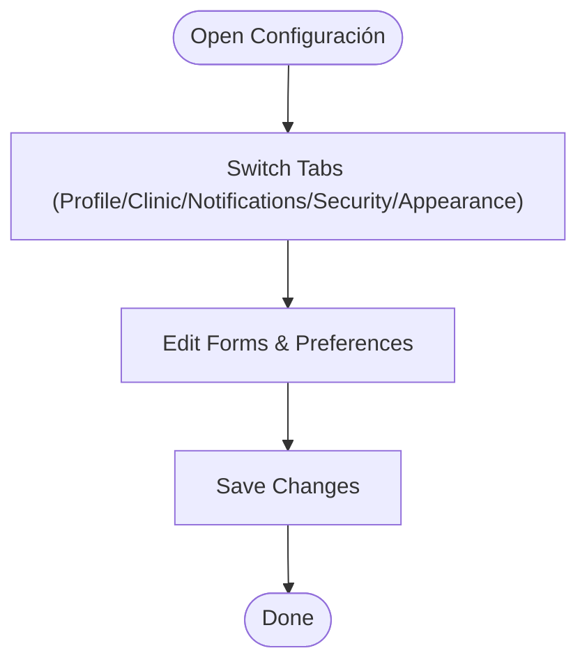

**Diagram sources**
- [Configuracion.tsx:19-297](file://NexaMed-Frontend/src/pages/Configuracion.tsx#L19-L297)

**Section sources**
- [Configuracion.tsx:19-297](file://NexaMed-Frontend/src/pages/Configuracion.tsx#L19-L297)

### User Roles and Permissions
- The application defines a User type with role values: admin, doctor, assistant.
- These roles inform access control and feature availability across modules.
- Current UI does not enforce role-based visibility; future enhancements can gate menus and actions based on role.

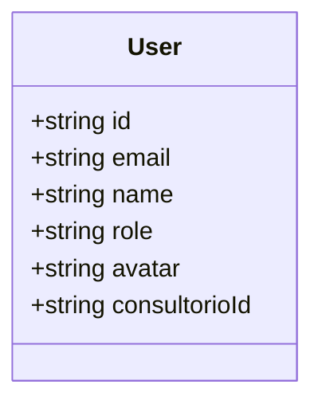

**Diagram sources**
- [index.ts:1-8](file://NexaMed-Frontend/src/types/index.ts#L1-L8)

**Section sources**
- [index.ts:1-8](file://NexaMed-Frontend/src/types/index.ts#L1-L8)

### Common Workflows and Interconnections
- New Patient Flow: Login → Patients → Search/New → Create Profile → Attach Allergies/Conditions → Link to Consultations.
- Schedule Appointment: Agenda → Select Date → Add Appointment → Link to Patient.
- Conduct Consultation: Consultations → Select Pending → Edit/Complete → Generate Orders.
- Manage Orders: Orders → Filter by Status → Download Results → Update Patient Records.
- Dashboard Integration: Dashboard links to Agenda, Patients, and Alerts drive daily operations.

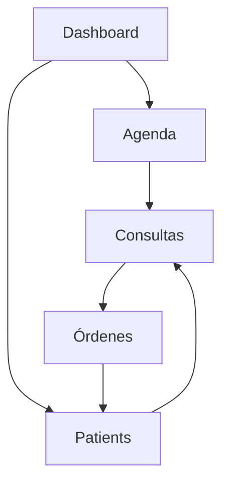

**Diagram sources**
- [Dashboard.tsx:62-201](file://NexaMed-Frontend/src/pages/Dashboard.tsx#L62-L201)
- [Agenda.tsx:34-178](file://NexaMed-Frontend/src/pages/Agenda.tsx#L34-L178)
- [Pacientes.tsx:93-279](file://NexaMed-Frontend/src/pages/Pacientes.tsx#L93-L279)
- [Consultas.tsx:77-231](file://NexaMed-Frontend/src/pages/Consultas.tsx#L77-L231)
- [Ordenes.tsx:81-309](file://NexaMed-Frontend/src/pages/Ordenes.tsx#L81-L309)

## Dependency Analysis
- Routing: React Router DOM manages routes and nested layouts.
- Styling: Tailwind CSS with Radix UI components for accessible UI.
- Icons: Lucide React for consistent iconography.
- Charts: Recharts for dashboard visualizations.
- Date handling: date-fns for formatting and calendar logic.

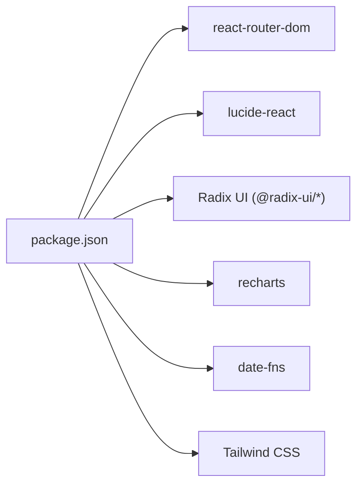

**Diagram sources**
- [package.json:12-31](file://NexaMed-Frontend/package.json#L12-L31)

**Section sources**
- [package.json:1-49](file://NexaMed-Frontend/package.json#L1-L49)

## Performance Considerations
- Virtualization: For large lists (patients, consultations, orders), consider virtualizing long lists to improve rendering performance.
- Memoization: Use memoization for computed stats and formatted dates to avoid unnecessary recalculations.
- Lazy loading: Split modules into lazy-loaded chunks to reduce initial bundle size.
- Image optimization: Compress avatars and attachments; defer non-critical images.
- Debouncing: Debounce search inputs to limit re-renders during typing.

## Troubleshooting Guide
- Login issues: Verify route redirection and loading state handling in the login page.
- Navigation problems: Ensure Sidebar and Header are properly integrated with Layout and routes.
- Date formatting: Confirm locale and format helpers for consistent date displays across modules.
- Action dropdowns: Validate that action handlers (edit, delete, mark complete) are wired correctly in each module.

**Section sources**
- [Login.tsx:18-27](file://NexaMed-Frontend/src/pages/Login.tsx#L18-L27)
- [Layout.tsx:12-34](file://NexaMed-Frontend/src/components/layout/Layout.tsx#L12-L34)
- [utils.ts:8-26](file://NexaMed-Frontend/src/lib/utils.ts#L8-L26)
- [Pacientes.tsx:243-258](file://NexaMed-Frontend/src/pages/Pacientes.tsx#L243-L258)
- [Consultas.tsx:196-209](file://NexaMed-Frontend/src/pages/Consultas.tsx#L196-L209)
- [Ordenes.tsx:269-286](file://NexaMed-Frontend/src/pages/Ordenes.tsx#L269-L286)

## Conclusion
NexaMed’s frontend provides a cohesive foundation for managing a medical clinic, with clear separation of concerns across modules. The layout and routing enable seamless navigation, while utilities and typed models support predictable data handling. Future enhancements can focus on role-based access control, performance optimizations, and deeper integrations between modules to streamline workflows.