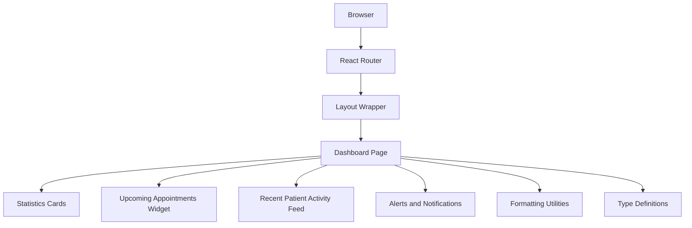
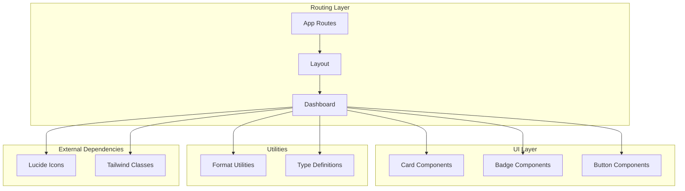
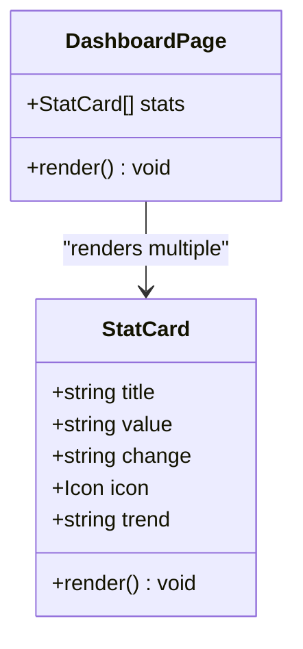
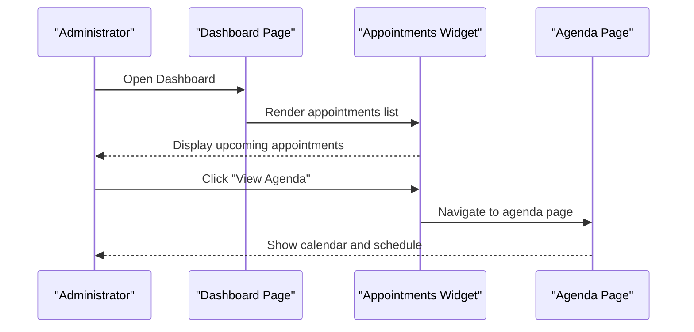
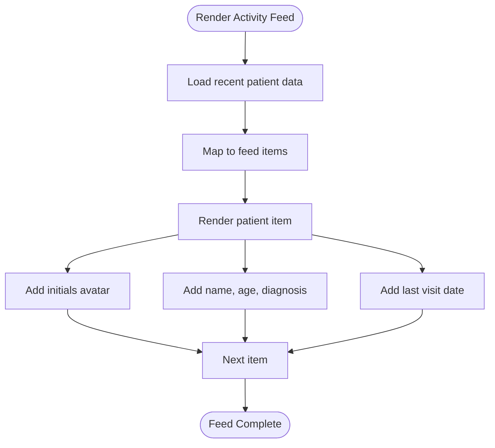
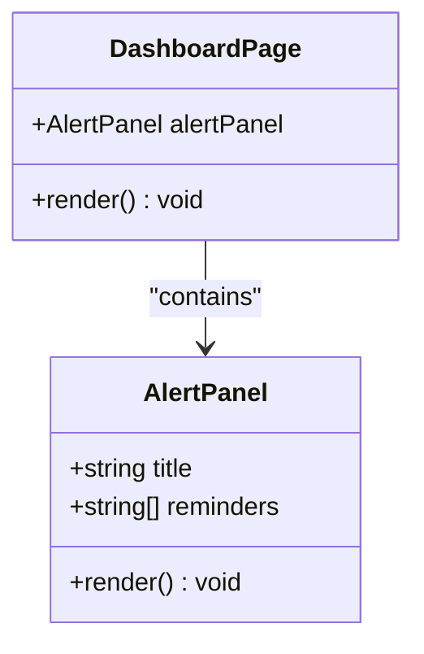
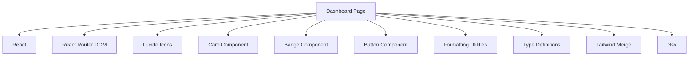

# Dashboard Analytics

<cite>
**Referenced Files in This Document**
- [Dashboard.tsx](file://src/pages/Dashboard.tsx)
- [index.ts](file://src/types/index.ts)
- [utils.ts](file://src/lib/utils.ts)
- [card.tsx](file://src/components/ui/card.tsx)
- [App.tsx](file://src/App.tsx)
- [main.tsx](file://src/main.tsx)
- [Agenda.tsx](file://src/pages/Agenda.tsx)
- [Configuracion.tsx](file://src/pages/Configuracion.tsx)
- [Consultas.tsx](file://src/pages/Consultas.tsx)
- [Ordenes.tsx](file://src/pages/Ordenes.tsx)
- [package.json](file://package.json)
</cite>

## Table of Contents
1. [Introduction](#introduction)
2. [Project Structure](#project-structure)
3. [Core Components](#core-components)
4. [Architecture Overview](#architecture-overview)
5. [Detailed Component Analysis](#detailed-component-analysis)
6. [Dependency Analysis](#dependency-analysis)
7. [Performance Considerations](#performance-considerations)
8. [Troubleshooting Guide](#troubleshooting-guide)
9. [Conclusion](#conclusion)

## Introduction
This document provides comprehensive documentation for the Dashboard Analytics feature in the NexaMed frontend application. It explains the analytics overview system, statistics cards display, upcoming appointments widget, recent patient activity feed, and alert system functionality. It also documents real-time data visualization components, key performance indicators, clinic metrics presentation, customization options, data refresh mechanisms, and integration with backend analytics services. Finally, it includes practical examples for administrators to interpret dashboard insights for clinic management decisions.

## Project Structure
The dashboard analytics feature is implemented as a single-page React component integrated into the application routing system. Supporting utilities and UI components provide consistent styling and formatting across the dashboard.

**Diagram sources**
- [App.tsx:11-35](file://src/App.tsx#L11-L35)
- [Dashboard.tsx:62-201](file://src/pages/Dashboard.tsx#L62-L201)
- [utils.ts:8-26](file://src/lib/utils.ts#L8-L26)
- [index.ts:121-127](file://src/types/index.ts#L121-L127)

**Section sources**
- [App.tsx:11-35](file://src/App.tsx#L11-L35)
- [main.tsx:7-13](file://src/main.tsx#L7-L13)

## Core Components
The dashboard is composed of four primary analytics components:

- Statistics Cards: Present key clinic metrics with trend indicators
- Upcoming Appointments Widget: Displays scheduled appointments for the current day
- Recent Patient Activity Feed: Shows recent patient visits and diagnoses
- Alerts and Notifications: Highlights important reminders and system alerts

Each component leverages shared UI primitives and formatting utilities for consistent presentation.

**Section sources**
- [Dashboard.tsx:16-90](file://src/pages/Dashboard.tsx#L16-L90)
- [Dashboard.tsx:94-181](file://src/pages/Dashboard.tsx#L94-L181)
- [Dashboard.tsx:183-198](file://src/pages/Dashboard.tsx#L183-L198)
- [card.tsx:4-76](file://src/components/ui/card.tsx#L4-L76)
- [utils.ts:8-26](file://src/lib/utils.ts#L8-L26)

## Architecture Overview
The dashboard integrates with the application's routing system and uses shared UI components and utilities. The page renders static demo data for demonstration purposes, while the underlying structure supports future integration with backend analytics services.

**Diagram sources**
- [App.tsx:11-35](file://src/App.tsx#L11-L35)
- [Dashboard.tsx:11-14](file://src/pages/Dashboard.tsx#L11-L14)
- [card.tsx:4-76](file://src/components/ui/card.tsx#L4-L76)
- [utils.ts:8-26](file://src/lib/utils.ts#L8-L26)
- [package.json:12-31](file://package.json#L12-L31)

## Detailed Component Analysis

### Statistics Cards Display
The statistics cards present key performance indicators for the clinic, including total patients, consultations today, scheduled appointments, and pending orders. Each card displays:
- Metric title and value
- Trend indicator (up, down, neutral)
- Icon representing the metric category
- Percentage change from previous day

Implementation highlights:
- Uses a predefined array of metric objects
- Applies color-coded trend indicators
- Integrates with the shared Card component for consistent styling

**Diagram sources**
- [Dashboard.tsx:16-45](file://src/pages/Dashboard.tsx#L16-L45)
- [card.tsx:4-76](file://src/components/ui/card.tsx#L4-L76)

**Section sources**
- [Dashboard.tsx:16-90](file://src/pages/Dashboard.tsx#L16-L90)
- [card.tsx:4-76](file://src/components/ui/card.tsx#L4-L76)

### Upcoming Appointments Widget
The upcoming appointments widget displays scheduled appointments for the current day, including patient names, appointment times, reasons, and status indicators. Features include:
- Today's date header
- Action button to view the full agenda
- Status badges for appointment states
- Responsive layout spanning multiple columns on larger screens

**Diagram sources**
- [Dashboard.tsx:94-140](file://src/pages/Dashboard.tsx#L94-L140)
- [Agenda.tsx:34-178](file://src/pages/Agenda.tsx#L34-L178)

**Section sources**
- [Dashboard.tsx:94-140](file://src/pages/Dashboard.tsx#L94-L140)
- [Agenda.tsx:34-178](file://src/pages/Agenda.tsx#L34-L178)

### Recent Patient Activity Feed
The recent patient activity feed showcases the latest patient visits with demographic details and diagnosis summaries. Each feed item includes:
- Patient initials avatar
- Name and age
- Latest diagnosis
- Last visit date

**Diagram sources**
- [Dashboard.tsx:142-181](file://src/pages/Dashboard.tsx#L142-L181)

**Section sources**
- [Dashboard.tsx:142-181](file://src/pages/Dashboard.tsx#L142-L181)

### Alerts and Notifications System
The alerts and notifications component presents important reminders and system alerts in a highlighted panel. The current implementation includes:
- Amber-colored border and background
- Alert icon and title
- List of daily reminders

**Diagram sources**
- [Dashboard.tsx:183-198](file://src/pages/Dashboard.tsx#L183-L198)

**Section sources**
- [Dashboard.tsx:183-198](file://src/pages/Dashboard.tsx#L183-L198)

### Real-Time Data Visualization Components
While the current dashboard uses static demo data, the architecture supports real-time data visualization through the following mechanisms:
- Shared formatting utilities for consistent date/time presentation
- Type definitions for structured data exchange
- Modular component design enabling easy integration with external APIs

Key supporting utilities:
- Date formatting for consistent display across components
- Type-safe interfaces for analytics data structures

**Section sources**
- [utils.ts:8-26](file://src/lib/utils.ts#L8-L26)
- [index.ts:121-127](file://src/types/index.ts#L121-L127)

## Dependency Analysis
The dashboard analytics feature relies on several external dependencies and internal modules:

**Diagram sources**
- [package.json:12-31](file://package.json#L12-L31)
- [Dashboard.tsx:11-14](file://src/pages/Dashboard.tsx#L11-L14)
- [card.tsx:4-76](file://src/components/ui/card.tsx#L4-L76)

**Section sources**
- [package.json:12-31](file://package.json#L12-L31)
- [Dashboard.tsx:11-14](file://src/pages/Dashboard.tsx#L11-L14)

## Performance Considerations
- Static data rendering: The current implementation uses static arrays, minimizing network overhead and ensuring fast initial load times.
- Component composition: Modular components reduce re-rendering scope and improve maintainability.
- Utility reuse: Centralized formatting utilities prevent redundant computations across components.
- Future optimization opportunities: Introduce virtualization for large datasets, implement caching strategies, and leverage React.memo for expensive components.

## Troubleshooting Guide
Common issues and resolutions for the dashboard analytics feature:

- Incorrect date formatting: Verify locale settings in formatting utilities and ensure consistent date handling across components.
- Missing icons: Confirm Lucide React installation and proper import statements in components.
- Styling inconsistencies: Check Tailwind configuration and ensure consistent class usage across components.
- Navigation issues: Validate route configuration and ensure proper layout wrapping for the dashboard page.

**Section sources**
- [utils.ts:8-26](file://src/lib/utils.ts#L8-L26)
- [App.tsx:11-35](file://src/App.tsx#L11-L35)

## Conclusion
The Dashboard Analytics feature provides administrators with a comprehensive overview of clinic operations through intuitive widgets and panels. While currently utilizing static demo data, the modular architecture and shared utilities enable seamless integration with backend analytics services. Administrators can leverage the dashboard to monitor key performance indicators, manage daily schedules, track recent patient activities, and stay informed through targeted alerts. The clean separation of concerns and reusable components support future enhancements for real-time data visualization and advanced analytics capabilities.