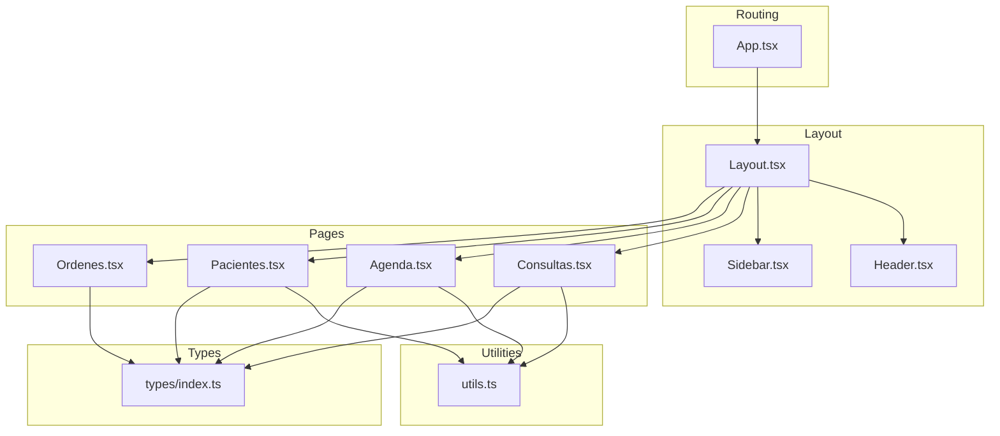
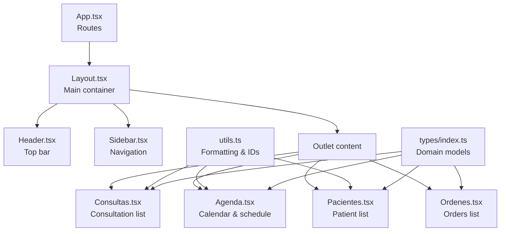
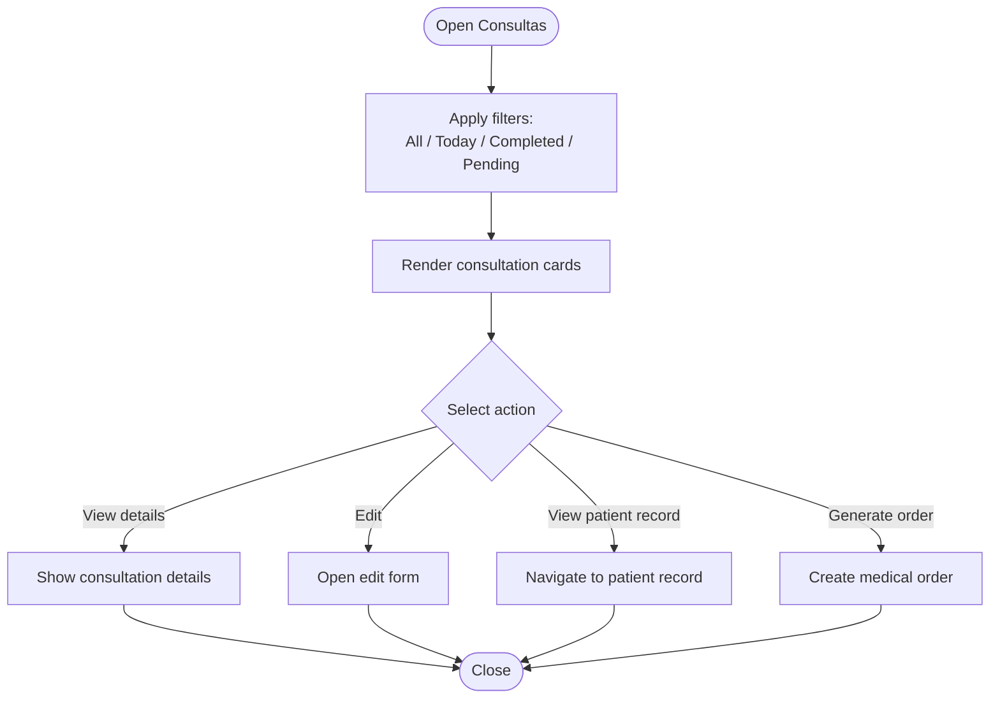
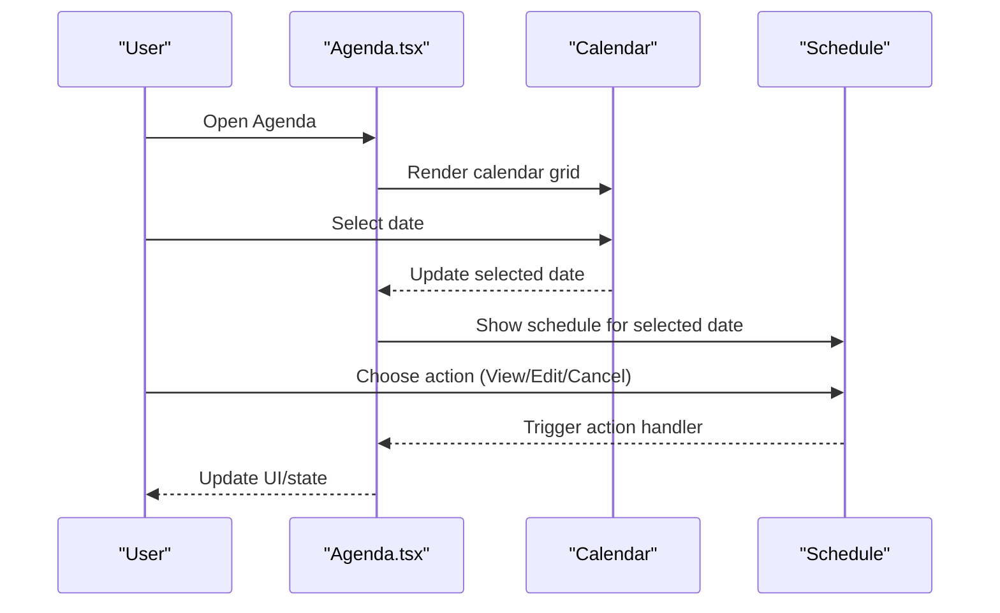
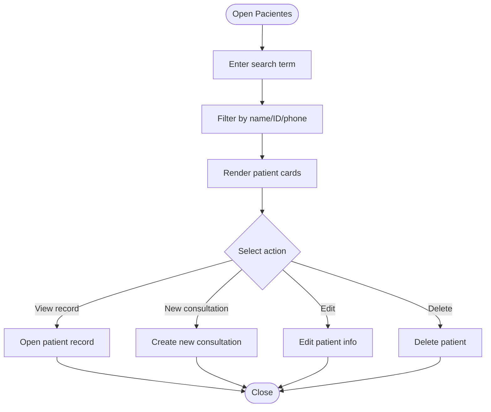
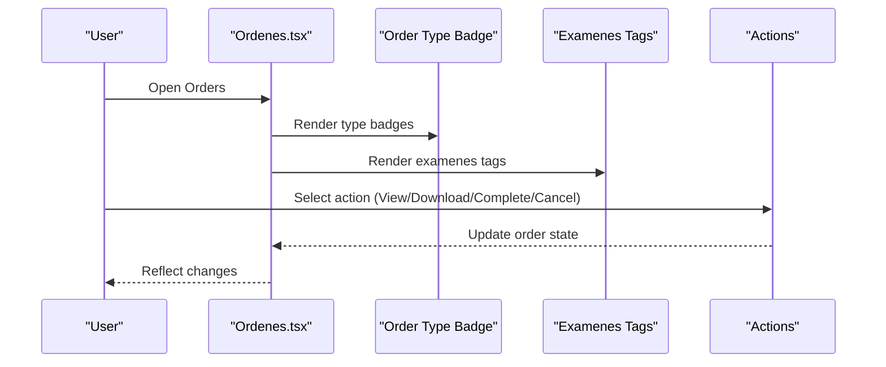
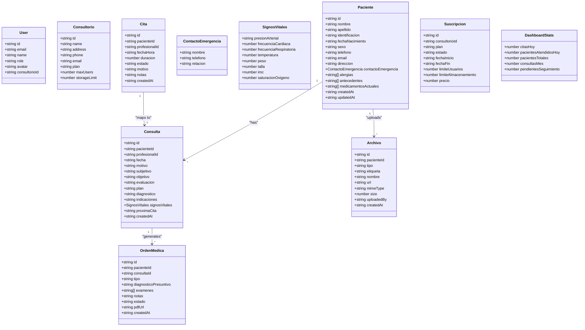
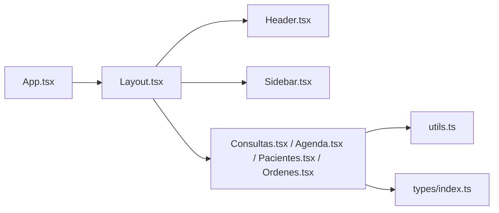

# Medical Consultation

<cite>
**Referenced Files in This Document**
- [App.tsx](file://src/App.tsx)
- [Layout.tsx](file://src/components/layout/Layout.tsx)
- [Sidebar.tsx](file://src/components/layout/Sidebar.tsx)
- [Header.tsx](file://src/components/layout/Header.tsx)
- [Consultas.tsx](file://src/pages/Consultas.tsx)
- [Agenda.tsx](file://src/pages/Agenda.tsx)
- [Pacientes.tsx](file://src/pages/Pacientes.tsx)
- [Ordenes.tsx](file://src/pages/Ordenes.tsx)
- [utils.ts](file://src/lib/utils.ts)
- [index.ts](file://src/types/index.ts)
</cite>

## Table of Contents
1. [Introduction](#introduction)
2. [Project Structure](#project-structure)
3. [Core Components](#core-components)
4. [Architecture Overview](#architecture-overview)
5. [Detailed Component Analysis](#detailed-component-analysis)
6. [Dependency Analysis](#dependency-analysis)
7. [Performance Considerations](#performance-considerations)
8. [Privacy and Regulatory Compliance](#privacy-and-regulatory-compliance)
9. [Troubleshooting Guide](#troubleshooting-guide)
10. [Conclusion](#conclusion)

## Introduction
This document describes the Medical Consultation tracking system built with React and TypeScript. It focuses on the workflows for consultation documentation, vital signs recording, diagnostic planning, prescription generation, and clinical note management. It also explains the consultation lifecycle from scheduling to completion, template-based documentation, integration with patient medical histories, and relationships between consultations, orders, laboratory results, and follow-up appointments. Privacy considerations, audit trails, and regulatory compliance aspects are covered to guide secure and compliant use of the system.

## Project Structure
The frontend is organized around a routing-driven layout with reusable UI components and typed domain models. Key areas include:
- Routing and layout: App routes, shared layout, sidebar navigation, and header
- Domain pages: Consultations, Agenda (scheduling), Patients, Orders (laboratory/imaging)
- Shared utilities: Formatting helpers and ID generation
- Type definitions: Strongly typed models for patients, consultations, orders, and related entities

**Diagram sources**
- [App.tsx:11-35](file://src/App.tsx#L11-L35)
- [Layout.tsx:12-34](file://src/components/layout/Layout.tsx#L12-L34)
- [Sidebar.tsx:31-106](file://src/components/layout/Sidebar.tsx#L31-L106)
- [Header.tsx:19-83](file://src/components/layout/Header.tsx#L19-L83)
- [Consultas.tsx:77-230](file://src/pages/Consultas.tsx#L77-L230)
- [Agenda.tsx:34-177](file://src/pages/Agenda.tsx#L34-L177)
- [Pacientes.tsx:93-278](file://src/pages/Pacientes.tsx#L93-L278)
- [Ordenes.tsx:81-308](file://src/pages/Ordenes.tsx#L81-L308)
- [utils.ts:4-44](file://src/lib/utils.ts#L4-L44)
- [index.ts:1-128](file://src/types/index.ts#L1-L128)

**Section sources**
- [App.tsx:11-35](file://src/App.tsx#L11-L35)
- [Layout.tsx:12-34](file://src/components/layout/Layout.tsx#L12-L34)
- [Sidebar.tsx:31-106](file://src/components/layout/Sidebar.tsx#L31-L106)
- [Header.tsx:19-83](file://src/components/layout/Header.tsx#L19-L83)

## Core Components
This section outlines the primary components and their responsibilities in managing the medical consultation lifecycle.

- Consultations page: Displays consultation records, filtering by date and status, and provides actions such as viewing details, editing, accessing patient records, and generating orders.
- Agenda page: Manages appointment scheduling with calendar navigation, daily schedule display, and action menus for each appointment.
- Patients page: Lists patient profiles, highlights allergies and past visits, and offers actions to view records, create new consultations, and manage patient data.
- Orders page: Manages medical orders (laboratory, imaging, interconsultation), tracks status, and enables downloading results when available.
- Utilities: Provide formatting helpers for dates and ages, and ID generation utilities.
- Types: Define strongly typed models for patients, consultations, orders, appointments, and supporting entities.

Key implementation references:
- Consultations page rendering and filtering: [Consultas.tsx:77-230](file://src/pages/Consultas.tsx#L77-L230)
- Agenda calendar and schedule: [Agenda.tsx:34-177](file://src/pages/Agenda.tsx#L34-L177)
- Patients list and badges: [Pacientes.tsx:93-278](file://src/pages/Pacientes.tsx#L93-L278)
- Orders list and status badges: [Ordenes.tsx:81-308](file://src/pages/Ordenes.tsx#L81-L308)
- Utility functions: [utils.ts:4-44](file://src/lib/utils.ts#L4-L44)
- Domain types: [index.ts:1-128](file://src/types/index.ts#L1-L128)

**Section sources**
- [Consultas.tsx:77-230](file://src/pages/Consultas.tsx#L77-L230)
- [Agenda.tsx:34-177](file://src/pages/Agenda.tsx#L34-L177)
- [Pacientes.tsx:93-278](file://src/pages/Pacientes.tsx#L93-L278)
- [Ordenes.tsx:81-308](file://src/pages/Ordenes.tsx#L81-L308)
- [utils.ts:4-44](file://src/lib/utils.ts#L4-L44)
- [index.ts:1-128](file://src/types/index.ts#L1-L128)

## Architecture Overview
The system follows a client-side routing pattern with a shared layout and modular pages. The layout composes the sidebar and header, while pages implement domain-specific views. Utilities centralize formatting and ID generation. Type definitions enforce data contracts across components.

**Diagram sources**
- [App.tsx:11-35](file://src/App.tsx#L11-L35)
- [Layout.tsx:12-34](file://src/components/layout/Layout.tsx#L12-L34)
- [Sidebar.tsx:31-106](file://src/components/layout/Sidebar.tsx#L31-L106)
- [Header.tsx:19-83](file://src/components/layout/Header.tsx#L19-L83)
- [Consultas.tsx:77-230](file://src/pages/Consultas.tsx#L77-L230)
- [Agenda.tsx:34-177](file://src/pages/Agenda.tsx#L34-L177)
- [Pacientes.tsx:93-278](file://src/pages/Pacientes.tsx#L93-L278)
- [Ordenes.tsx:81-308](file://src/pages/Ordenes.tsx#L81-L308)
- [utils.ts:4-44](file://src/lib/utils.ts#L4-L44)
- [index.ts:1-128](file://src/types/index.ts#L1-L128)

## Detailed Component Analysis

### Consultations Lifecycle and Workflows
The Consultations page manages the lifecycle of a consultation from scheduling to completion:
- Filtering: By all, today, completed, or pending
- Status indicators: Completada, En curso, Pendiente
- Action menu: View details, edit, view patient record, generate order
- Timeline and metadata: Date/time, duration, reason, attending physician

**Diagram sources**
- [Consultas.tsx:77-230](file://src/pages/Consultas.tsx#L77-L230)

**Section sources**
- [Consultas.tsx:77-230](file://src/pages/Consultas.tsx#L77-L230)

### Agenda and Scheduling
The Agenda page provides a monthly calendar and daily schedule:
- Calendar navigation: Previous/Next month
- Daily schedule: Shows appointments with status badges (Atendida, En espera, Programada, Cancelada)
- Action menu: View/edit/cancel appointment

**Diagram sources**
- [Agenda.tsx:34-177](file://src/pages/Agenda.tsx#L34-L177)

**Section sources**
- [Agenda.tsx:34-177](file://src/pages/Agenda.tsx#L34-L177)

### Patient Records and Medical History Integration
The Patients page displays patient profiles and integrates with consultation history:
- Search: By name, ID, or phone
- Badges: Highlight allergies and conditions
- Last visit date and statistics
- Action menu: View record, new consultation, edit, delete

**Diagram sources**
- [Pacientes.tsx:93-278](file://src/pages/Pacientes.tsx#L93-L278)

**Section sources**
- [Pacientes.tsx:93-278](file://src/pages/Pacientes.tsx#L93-L278)

### Orders, Laboratory Results, and Interconsultations
The Orders page manages medical orders and results:
- Types: Laboratorio, Imagenología, Interconsulta
- Status: Pendiente, Completada, Cancelada
- Actions: View order, download PDF, mark as completed, cancel
- Results: Downloadable when available

**Diagram sources**
- [Ordenes.tsx:81-308](file://src/pages/Ordenes.tsx#L81-L308)

**Section sources**
- [Ordenes.tsx:81-308](file://src/pages/Ordenes.tsx#L81-L308)

### Data Models and Relationships
The type definitions establish the core data model for the system, enabling template-based documentation and integration across modules.

**Diagram sources**
- [index.ts:1-128](file://src/types/index.ts#L1-L128)

**Section sources**
- [index.ts:1-128](file://src/types/index.ts#L1-L128)

## Dependency Analysis
The system exhibits clear separation of concerns:
- Routing depends on layout components
- Pages depend on utilities for formatting and ID generation
- Pages depend on type definitions for data contracts
- Sidebar and header are self-contained UI components reused across pages

**Diagram sources**
- [App.tsx:11-35](file://src/App.tsx#L11-L35)
- [Layout.tsx:12-34](file://src/components/layout/Layout.tsx#L12-L34)
- [Sidebar.tsx:31-106](file://src/components/layout/Sidebar.tsx#L31-L106)
- [Header.tsx:19-83](file://src/components/layout/Header.tsx#L19-L83)
- [Consultas.tsx:77-230](file://src/pages/Consultas.tsx#L77-L230)
- [Agenda.tsx:34-177](file://src/pages/Agenda.tsx#L34-L177)
- [Pacientes.tsx:93-278](file://src/pages/Pacientes.tsx#L93-L278)
- [Ordenes.tsx:81-308](file://src/pages/Ordenes.tsx#L81-L308)
- [utils.ts:4-44](file://src/lib/utils.ts#L4-L44)
- [index.ts:1-128](file://src/types/index.ts#L1-L128)

**Section sources**
- [App.tsx:11-35](file://src/App.tsx#L11-L35)
- [utils.ts:4-44](file://src/lib/utils.ts#L4-L44)
- [index.ts:1-128](file://src/types/index.ts#L1-L128)

## Performance Considerations
- Client-side filtering: Efficient for small to medium datasets; consider pagination or virtualization for larger lists.
- Date formatting: Centralized in utilities to avoid repeated computations.
- Badge rendering: Lightweight; ensure minimal re-renders by passing stable props.
- Calendar rendering: Grid-based; optimize DOM by avoiding unnecessary updates when switching months.
- Image assets: Use lazy loading for profile avatars and downloadable documents.

## Privacy and Regulatory Compliance
- Access control: Role-based navigation via Sidebar ensures appropriate access to features.
- Audit trail: Store creation timestamps and user identifiers in consultation and order records to enable auditability.
- Data minimization: Only collect necessary patient information; mask sensitive fields where appropriate.
- Secure downloads: Ensure order result downloads are served securely and logged.
- Retention policies: Implement automatic cleanup of old records per regulatory requirements.
- Consent management: Track patient consent for data sharing and document retention.

## Troubleshooting Guide
Common issues and resolutions:
- Filters not working: Verify filter logic in Consultas and Ordenes pages and ensure data keys match expectations.
- Date formatting errors: Confirm date strings are valid ISO formats and use provided formatting utilities.
- Missing actions: Ensure action handlers are wired up in dropdown menus and that state updates reflect UI changes.
- Calendar anomalies: Validate selected date and month calculations; confirm event rendering logic.

**Section sources**
- [Consultas.tsx:77-230](file://src/pages/Consultas.tsx#L77-L230)
- [Ordenes.tsx:81-308](file://src/pages/Ordenes.tsx#L81-L308)
- [utils.ts:8-26](file://src/lib/utils.ts#L8-L26)

## Conclusion
The Medical Consultation tracking system provides a structured foundation for managing consultations, scheduling, patient records, and orders. Its modular architecture, strong typing, and centralized utilities support maintainability and scalability. By implementing robust privacy controls, audit trails, and compliance measures, the system can meet healthcare regulatory requirements while delivering an efficient clinical workflow.