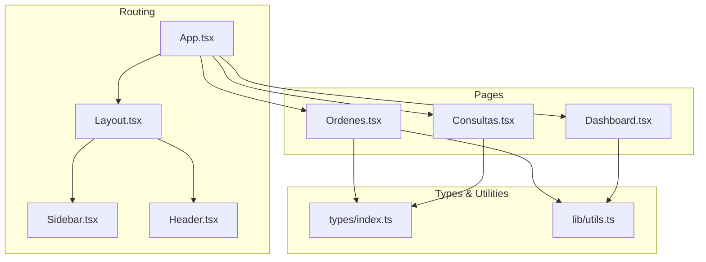
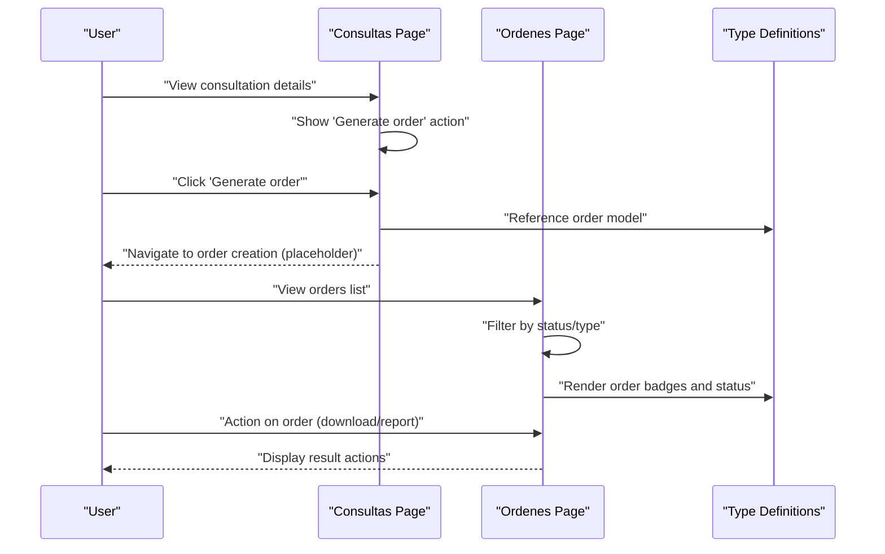
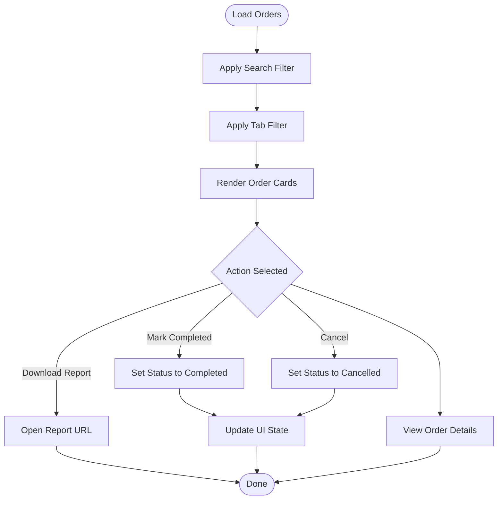
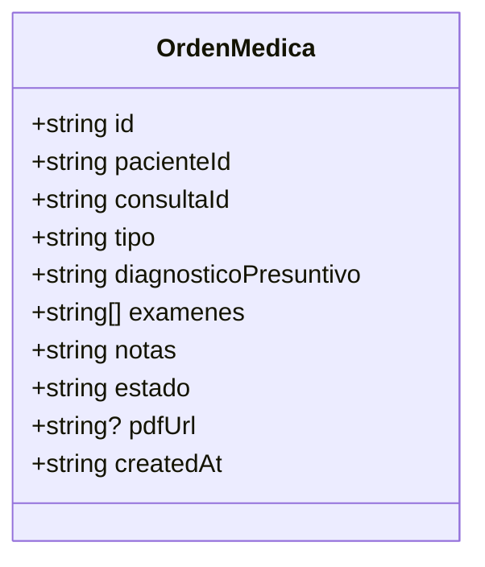
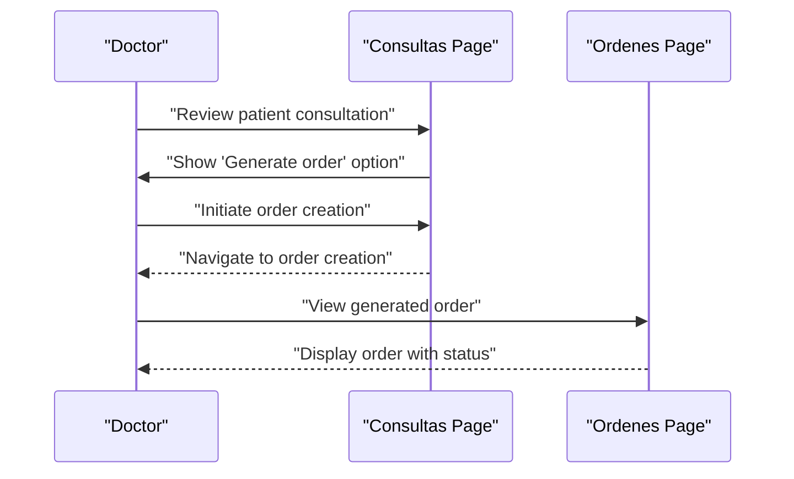
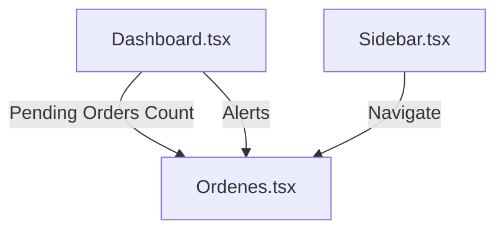
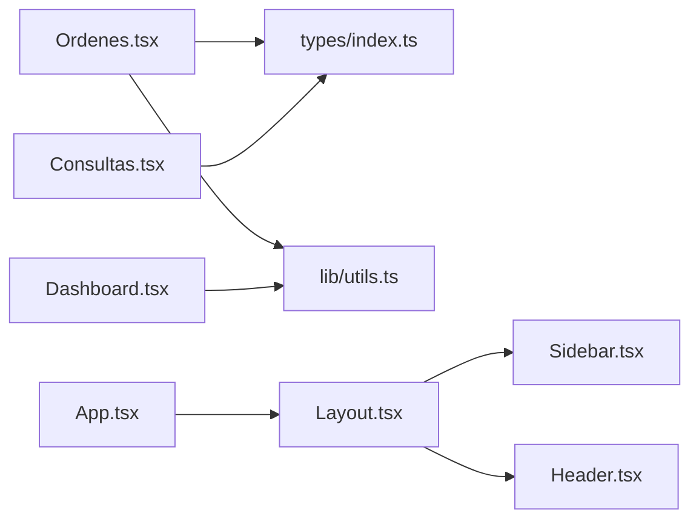

# Order Management

<cite>
**Referenced Files in This Document**
- [App.tsx](file://src/App.tsx)
- [Layout.tsx](file://src/components/layout/Layout.tsx)
- [Sidebar.tsx](file://src/components/layout/Sidebar.tsx)
- [Header.tsx](file://src/components/layout/Header.tsx)
- [Ordenes.tsx](file://src/pages/Ordenes.tsx)
- [Consultas.tsx](file://src/pages/Consultas.tsx)
- [Dashboard.tsx](file://src/pages/Dashboard.tsx)
- [index.ts](file://src/types/index.ts)
- [utils.ts](file://src/lib/utils.ts)
</cite>

## Table of Contents
1. [Introduction](#introduction)
2. [Project Structure](#project-structure)
3. [Core Components](#core-components)
4. [Architecture Overview](#architecture-overview)
5. [Detailed Component Analysis](#detailed-component-analysis)
6. [Dependency Analysis](#dependency-analysis)
7. [Performance Considerations](#performance-considerations)
8. [Troubleshooting Guide](#troubleshooting-guide)
9. [Conclusion](#conclusion)

## Introduction
This document describes the Order Management system within the NexaMed frontend application. It focuses on how medical orders are represented, tracked, and managed across three primary categories: laboratory tests, imaging studies, and interconsultations. The system integrates with patient consultations to derive orders, tracks order status through creation to completion, and provides reporting capabilities for completed orders. Administrative oversight is supported via dashboard statistics and navigation controls.

## Project Structure
The Order Management feature is primarily implemented in the frontend under the pages and components directories. The main order listing page is located at the routes configured in the application shell.

**Diagram sources**
- [App.tsx:11-35](file://src/App.tsx#L11-L35)
- [Layout.tsx:12-34](file://src/components/layout/Layout.tsx#L12-L34)
- [Sidebar.tsx:31-106](file://src/components/layout/Sidebar.tsx#L31-L106)
- [Header.tsx:19-83](file://src/components/layout/Header.tsx#L19-L83)
- [Ordenes.tsx:81-308](file://src/pages/Ordenes.tsx#L81-L308)
- [Consultas.tsx:77-231](file://src/pages/Consultas.tsx#L77-L231)
- [Dashboard.tsx:62-201](file://src/pages/Dashboard.tsx#L62-L201)
- [index.ts:71-82](file://src/types/index.ts#L71-L82)
- [utils.ts:8-44](file://src/lib/utils.ts#L8-L44)

**Section sources**
- [App.tsx:11-35](file://src/App.tsx#L11-L35)
- [Layout.tsx:12-34](file://src/components/layout/Layout.tsx#L12-L34)
- [Sidebar.tsx:31-106](file://src/components/layout/Sidebar.tsx#L31-L106)
- [Header.tsx:19-83](file://src/components/layout/Header.tsx#L19-L83)

## Core Components
- Order listing and filtering: The order page displays a searchable and filterable list of orders by status and type, with quick actions for viewing, downloading reports, and marking completion or cancellation.
- Order data model: Orders are typed with fields for patient association, diagnostic context, test lists, status, and optional report URLs.
- Integration with consultations: The consultation page exposes a "Generate order" action, establishing the link between clinical encounters and subsequent orders.
- Dashboard overview: The dashboard surfaces pending orders and related alerts to support administrative oversight.

Key implementation references:
- Order listing and actions: [Ordenes.tsx:81-308](file://src/pages/Ordenes.tsx#L81-L308)
- Order data model: [index.ts:71-82](file://src/types/index.ts#L71-L82)
- Consultation to order workflow: [Consultas.tsx:205-206](file://src/pages/Consultas.tsx#L205-L206)
- Dashboard pending orders indicator: [Dashboard.tsx:39-44](file://src/pages/Dashboard.tsx#L39-L44)

**Section sources**
- [Ordenes.tsx:81-308](file://src/pages/Ordenes.tsx#L81-L308)
- [index.ts:71-82](file://src/types/index.ts#L71-L82)
- [Consultas.tsx:205-206](file://src/pages/Consultas.tsx#L205-L206)
- [Dashboard.tsx:39-44](file://src/pages/Dashboard.tsx#L39-L44)

## Architecture Overview
The order management architecture centers on a React-based frontend with TypeScript type safety and Tailwind CSS styling. The application uses React Router for navigation and Radix UI primitives for interactive components. Orders are modeled as in-memory data structures during development, with placeholders for PDF reports and status transitions.

**Diagram sources**
- [Consultas.tsx:205-206](file://src/pages/Consultas.tsx#L205-L206)
- [Ordenes.tsx:81-308](file://src/pages/Ordenes.tsx#L81-L308)
- [index.ts:71-82](file://src/types/index.ts#L71-L82)

## Detailed Component Analysis

### Order Listing and Status Tracking
The order listing page provides:
- Search by patient name or order ID
- Tabbed filters for all, pending, completed, and cancelled orders
- Visual indicators for order type (laboratory, imaging, interconsultation) and status
- Action menu for viewing, downloading reports, marking as completed, and cancellation

**Diagram sources**
- [Ordenes.tsx:81-308](file://src/pages/Ordenes.tsx#L81-L308)

**Section sources**
- [Ordenes.tsx:81-308](file://src/pages/Ordenes.tsx#L81-L308)

### Order Data Model and Type Safety
Orders are strongly typed with fields for identification, patient linkage, diagnostic context, requested tests, status, and optional report URL. This ensures consistent rendering and future integration with backend APIs.

**Diagram sources**
- [index.ts:71-82](file://src/types/index.ts#L71-L82)

**Section sources**
- [index.ts:71-82](file://src/types/index.ts#L71-L82)

### Integration with Patient Consultations
The consultation page exposes a "Generate order" action, indicating that orders originate from clinical encounters. This establishes a clear workflow from diagnosis and assessment to order creation.

**Diagram sources**
- [Consultas.tsx:205-206](file://src/pages/Consultas.tsx#L205-L206)
- [Ordenes.tsx:81-308](file://src/pages/Ordenes.tsx#L81-L308)

**Section sources**
- [Consultas.tsx:205-206](file://src/pages/Consultas.tsx#L205-L206)
- [Ordenes.tsx:81-308](file://src/pages/Ordenes.tsx#L81-L308)

### Administrative Oversight and Reporting
Administrative visibility is provided through:
- Dashboard statistics including pending orders count
- Notification alerts highlighting pending results and follow-ups
- Centralized navigation to order management from the sidebar

**Diagram sources**
- [Dashboard.tsx:39-44](file://src/pages/Dashboard.tsx#L39-L44)
- [Dashboard.tsx:184-198](file://src/pages/Dashboard.tsx#L184-L198)
- [Sidebar.tsx:22-29](file://src/components/layout/Sidebar.tsx#L22-L29)
- [Ordenes.tsx:81-308](file://src/pages/Ordenes.tsx#L81-L308)

**Section sources**
- [Dashboard.tsx:39-44](file://src/pages/Dashboard.tsx#L39-L44)
- [Dashboard.tsx:184-198](file://src/pages/Dashboard.tsx#L184-L198)
- [Sidebar.tsx:22-29](file://src/components/layout/Sidebar.tsx#L22-L29)

## Dependency Analysis
The order management components depend on shared UI primitives and type definitions. The order page relies on utility functions for date formatting and uses tabbed navigation for filtering.

**Diagram sources**
- [Ordenes.tsx:81-308](file://src/pages/Ordenes.tsx#L81-L308)
- [index.ts:71-82](file://src/types/index.ts#L71-L82)
- [utils.ts:8-44](file://src/lib/utils.ts#L8-L44)
- [Consultas.tsx:77-231](file://src/pages/Consultas.tsx#L77-L231)
- [Dashboard.tsx:62-201](file://src/pages/Dashboard.tsx#L62-L201)
- [App.tsx:11-35](file://src/App.tsx#L11-L35)
- [Layout.tsx:12-34](file://src/components/layout/Layout.tsx#L12-L34)
- [Sidebar.tsx:31-106](file://src/components/layout/Sidebar.tsx#L31-L106)
- [Header.tsx:19-83](file://src/components/layout/Header.tsx#L19-L83)

**Section sources**
- [Ordenes.tsx:81-308](file://src/pages/Ordenes.tsx#L81-L308)
- [Consultas.tsx:77-231](file://src/pages/Consultas.tsx#L77-L231)
- [Dashboard.tsx:62-201](file://src/pages/Dashboard.tsx#L62-L201)
- [App.tsx:11-35](file://src/App.tsx#L11-L35)
- [Layout.tsx:12-34](file://src/components/layout/Layout.tsx#L12-L34)
- [Sidebar.tsx:31-106](file://src/components/layout/Sidebar.tsx#L31-L106)
- [Header.tsx:19-83](file://src/components/layout/Header.tsx#L19-L83)

## Performance Considerations
- Client-side filtering: The order list applies search and tab filters locally. For large datasets, consider pagination or server-side filtering.
- Rendering optimization: Memoization of derived data (counts, filtered lists) can improve re-render performance.
- Image and asset loading: Placeholder report URLs should be lazy-loaded to avoid blocking initial render.

## Troubleshooting Guide
Common issues and resolutions:
- Empty order list after filtering: Verify search terms and selected tabs; ensure data structure matches expected keys.
- Status badges not updating: Confirm state updates propagate to the order list and that the status mapping logic is applied consistently.
- Navigation to order creation: The consultation page exposes a "Generate order" action; ensure routing and navigation are properly configured.

**Section sources**
- [Ordenes.tsx:85-94](file://src/pages/Ordenes.tsx#L85-L94)
- [Consultas.tsx:205-206](file://src/pages/Consultas.tsx#L205-L206)

## Conclusion
The Order Management system provides a clear, type-safe foundation for managing laboratory, imaging, and interconsultation orders. It integrates with consultations to create orders, offers robust filtering and status tracking, and supports administrative oversight through dashboards and navigation. Future enhancements should focus on backend integration, real-time updates, and scalable client-side data handling.