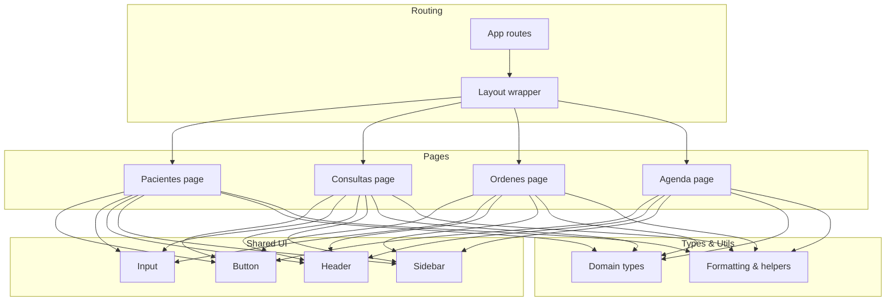
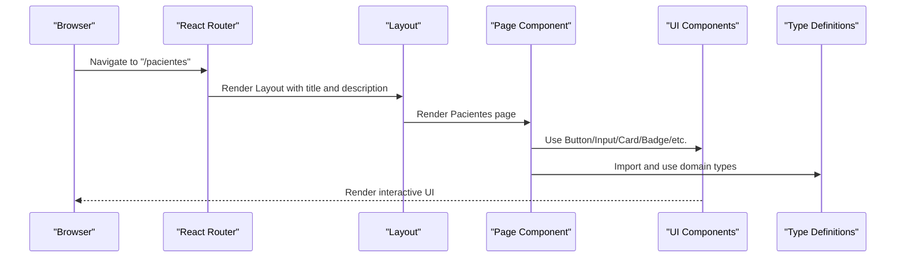
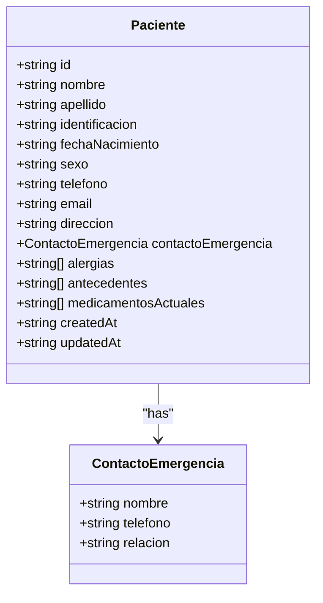
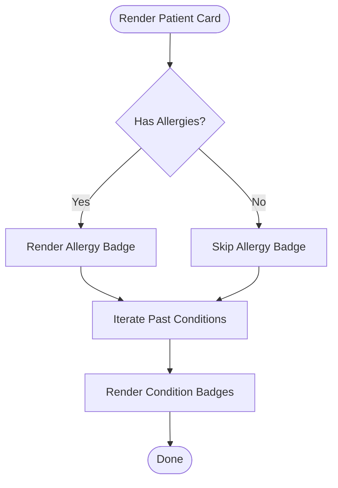
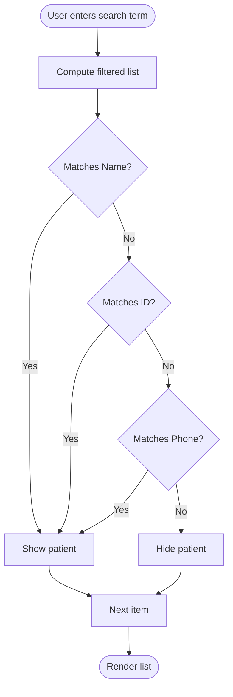
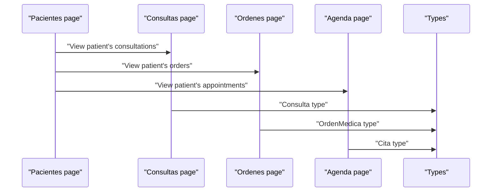
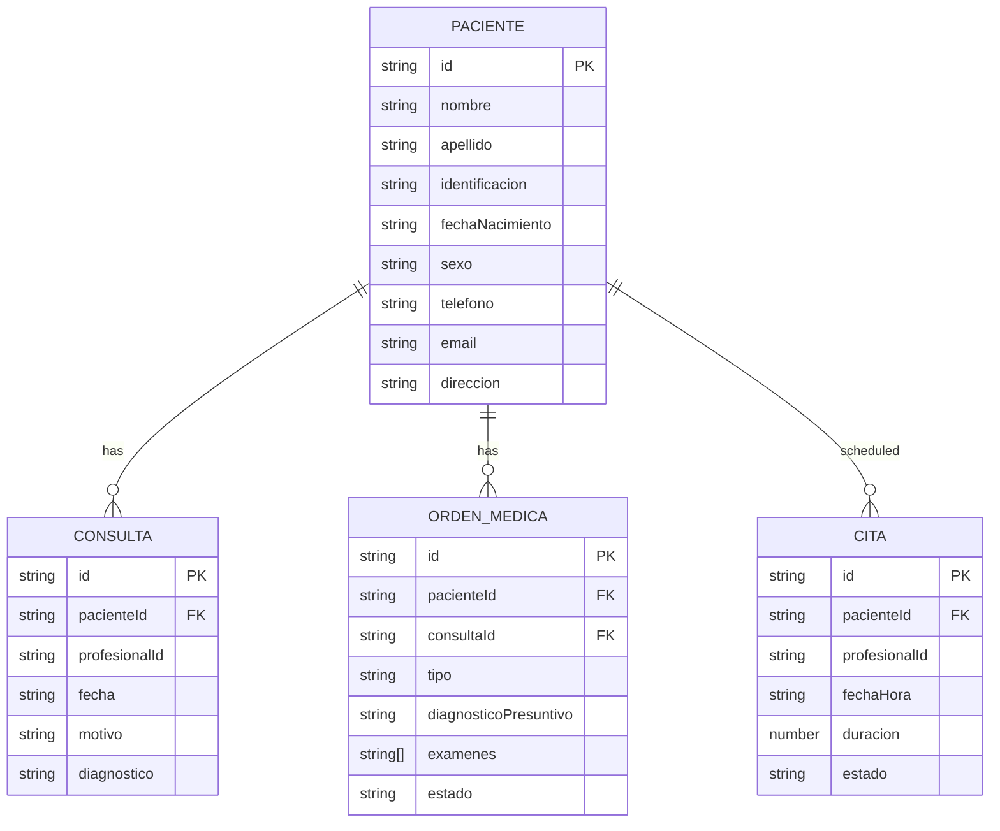
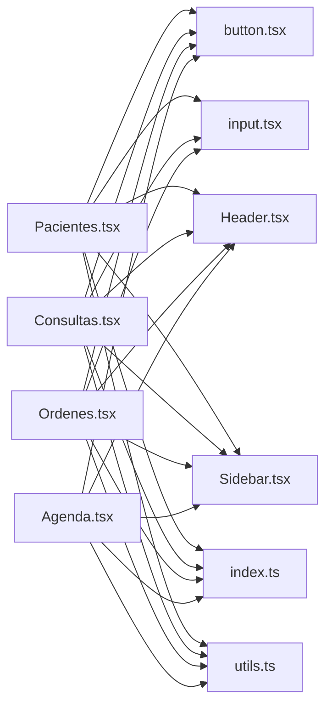

# Patient Management

<cite>
**Referenced Files in This Document**
- [Pacientes.tsx](file://src/pages/Pacientes.tsx)
- [Consultas.tsx](file://src/pages/Consultas.tsx)
- [Ordenes.tsx](file://src/pages/Ordenes.tsx)
- [Agenda.tsx](file://src/pages/Agenda.tsx)
- [index.ts](file://src/types/index.ts)
- [utils.ts](file://src/lib/utils.ts)
- [Layout.tsx](file://src/components/layout/Layout.tsx)
- [Header.tsx](file://src/components/layout/Header.tsx)
- [Sidebar.tsx](file://src/components/layout/Sidebar.tsx)
- [button.tsx](file://src/components/ui/button.tsx)
- [input.tsx](file://src/components/ui/input.tsx)
- [App.tsx](file://src/App.tsx)
- [main.tsx](file://src/main.tsx)
</cite>

## Table of Contents
1. [Introduction](#introduction)
2. [Project Structure](#project-structure)
3. [Core Components](#core-components)
4. [Architecture Overview](#architecture-overview)
5. [Detailed Component Analysis](#detailed-component-analysis)
6. [Dependency Analysis](#dependency-analysis)
7. [Performance Considerations](#performance-considerations)
8. [Troubleshooting Guide](#troubleshooting-guide)
9. [Conclusion](#conclusion)

## Introduction
This document describes the Patient Management system implemented in the frontend codebase. It focuses on how patients are represented, searched, filtered, and linked to clinical workflows such as consultations, medical orders, and appointments. The system currently uses mock data and local state to demonstrate functionality. The documentation covers:
- Patient registration and profile representation
- Medical history tracking via allergies, past conditions, and current medications
- Contact information maintenance
- Demographic filtering and search
- Medical record organization across consultations, orders, and agenda
- Data privacy considerations
- Form validation patterns and data lifecycle management
- Integration points with appointment scheduling

## Project Structure
The frontend is organized around feature-based pages with shared UI components and utilities:
- Pages: Pacientes, Consultas, Ordenes, Agenda, Dashboard, Login, Configuracion
- Shared UI components: button, input, card, dropdown-menu, tabs, avatar, badge, separator
- Layout: Header, Sidebar, and a wrapping Layout component
- Types: Strongly typed domain models for patients, consultations, orders, agendas, and related entities
- Utilities: Formatting helpers and ID generation

**Diagram sources**
- [App.tsx:11-35](file://src/App.tsx#L11-L35)
- [Layout.tsx:12-34](file://src/components/layout/Layout.tsx#L12-L34)
- [Pacientes.tsx:93-279](file://src/pages/Pacientes.tsx#L93-L279)
- [Consultas.tsx:77-231](file://src/pages/Consultas.tsx#L77-L231)
- [Ordenes.tsx:81-309](file://src/pages/Ordenes.tsx#L81-L309)
- [Agenda.tsx:34-178](file://src/pages/Agenda.tsx#L34-L178)
- [index.ts:21-41](file://src/types/index.ts#L21-L41)
- [utils.ts:8-39](file://src/lib/utils.ts#L8-L39)

**Section sources**
- [App.tsx:11-35](file://src/App.tsx#L11-L35)
- [Layout.tsx:12-34](file://src/components/layout/Layout.tsx#L12-L34)
- [Sidebar.tsx:22-29](file://src/components/layout/Sidebar.tsx#L22-L29)

## Core Components
This section outlines the primary building blocks used in patient management.

- Patient model and related entities
  - The patient entity includes personal details, contact info, emergency contact, and health history arrays (allergies, past conditions, current medications). It also tracks creation/update timestamps.
  - Related entities include Consulta (clinical encounter), OrdenMedica (medical order), Archivo (document), and Cita (appointment).

- UI primitives
  - Button and Input components provide consistent styling and behavior across pages.
  - Cards, Badges, Dropdown menus, and Tabs are used to render lists, actions, and filters.

- Utilities
  - Date formatting and age calculation helpers support consistent presentation of temporal data.

**Section sources**
- [index.ts:21-41](file://src/types/index.ts#L21-L41)
- [index.ts:43-58](file://src/types/index.ts#L43-L58)
- [index.ts:71-82](file://src/types/index.ts#L71-L82)
- [index.ts:84-95](file://src/types/index.ts#L84-L95)
- [index.ts:97-107](file://src/types/index.ts#L97-L107)
- [button.tsx:6-31](file://src/components/ui/button.tsx#L6-L31)
- [input.tsx:7-21](file://src/components/ui/input.tsx#L7-L21)
- [utils.ts:8-39](file://src/lib/utils.ts#L8-L39)

## Architecture Overview
The system follows a client-side routing pattern with a shared layout. Each page encapsulates its own state and rendering logic, using shared UI components and types. Mock data is used locally to simulate operations.

**Diagram sources**
- [App.tsx:18-19](file://src/App.tsx#L18-L19)
- [Layout.tsx:12-34](file://src/components/layout/Layout.tsx#L12-L34)
- [Pacientes.tsx:93-279](file://src/pages/Pacientes.tsx#L93-L279)
- [index.ts:21-41](file://src/types/index.ts#L21-L41)

## Detailed Component Analysis

### Patient Registration and Profile Representation
- Data model
  - The patient entity includes identifiers, demographics, contact details, emergency contact, and health history arrays. Creation and update timestamps are included for lifecycle tracking.
- Profile rendering
  - The Pacientes page displays patient cards with avatar initials, full name, ID, calculated age, contact info, badges for allergies and past conditions, and action dropdowns.

**Diagram sources**
- [index.ts:21-41](file://src/types/index.ts#L21-L41)

**Section sources**
- [index.ts:21-41](file://src/types/index.ts#L21-L41)
- [Pacientes.tsx:25-91](file://src/pages/Pacientes.tsx#L25-L91)
- [Pacientes.tsx:187-262](file://src/pages/Pacientes.tsx#L187-L262)

### Medical History Tracking
- Health history arrays
  - Allergies, past conditions (antecedentes), and current medications are modeled as arrays within the patient entity.
- Presentation
  - The Pacientes page renders allergy and condition badges per patient, enabling quick visual identification of risk factors and chronic conditions.

**Diagram sources**
- [Pacientes.tsx:222-234](file://src/pages/Pacientes.tsx#L222-L234)
- [index.ts:36-38](file://src/types/index.ts#L36-L38)

**Section sources**
- [index.ts:36-38](file://src/types/index.ts#L36-L38)
- [Pacientes.tsx:222-234](file://src/pages/Pacientes.tsx#L222-L234)

### Allergy Management
- Model
  - Allergies are stored as a string array on the patient entity.
- UI
  - Allergy badges are rendered prominently on patient cards, using a distinct variant to highlight potential risks.

**Section sources**
- [index.ts:36](file://src/types/index.ts#L36)
- [Pacientes.tsx:224-227](file://src/pages/Pacientes.tsx#L224-L227)

### Contact Information Maintenance
- Model
  - Contact details include phone, email, and address. Emergency contact information is modeled as a nested object.
- UI
  - Contact info is displayed inline with icons for phone and mail, ensuring quick scanning.

**Section sources**
- [index.ts:28-35](file://src/types/index.ts#L28-L35)
- [Pacientes.tsx:204-218](file://src/pages/Pacientes.tsx#L204-L218)

### Demographic Filtering and Search
- Search logic
  - The Pacientes page filters patients by combining name, ID, and phone number against the search term.
- UI
  - A search input with a dedicated icon and filter button provide intuitive controls.

**Diagram sources**
- [Pacientes.tsx:97-101](file://src/pages/Pacientes.tsx#L97-L101)

**Section sources**
- [Pacientes.tsx:94-101](file://src/pages/Pacientes.tsx#L94-L101)
- [Pacientes.tsx:107-127](file://src/pages/Pacientes.tsx#L107-L127)

### Medical Record Organization
- Consultations
  - The Consultas page organizes clinical encounters with type and status badges, date/time formatting, and action dropdowns. Filtering supports tabs for all, today, completed, and pending.
- Medical Orders
  - The Ordenes page manages orders (laboratory, imaging, interconsultation) with status badges, icons per order type, and action buttons for downloading results when available.
- Agendas
  - The Agenda page presents a calendar view and daily schedule, linking appointments to patients with status indicators.

**Diagram sources**
- [Consultas.tsx:77-231](file://src/pages/Consultas.tsx#L77-L231)
- [Ordenes.tsx:81-309](file://src/pages/Ordenes.tsx#L81-L309)
- [Agenda.tsx:34-178](file://src/pages/Agenda.tsx#L34-L178)
- [index.ts:43-58](file://src/types/index.ts#L43-L58)
- [index.ts:71-82](file://src/types/index.ts#L71-L82)
- [index.ts:97-107](file://src/types/index.ts#L97-L107)

**Section sources**
- [Consultas.tsx:77-231](file://src/pages/Consultas.tsx#L77-L231)
- [Ordenes.tsx:81-309](file://src/pages/Ordenes.tsx#L81-L309)
- [Agenda.tsx:34-178](file://src/pages/Agenda.tsx#L34-L178)

### Data Privacy Considerations
- Local state and mock data
  - The current implementation uses local state and mock data. No external network requests are performed in these components.
- Recommendations
  - When integrating with backend APIs, ensure secure transport (HTTPS), input sanitization, and strict access controls. Limit exposure of sensitive fields to authorized roles only.
  - Implement audit logging for patient record modifications and maintain data retention policies aligned with local regulations.

[No sources needed since this section provides general guidance]

### Form Validation Patterns
- Current state
  - The Pacientes page does not implement explicit form validation; it consumes mock data and exposes action dropdowns.
- Recommended patterns
  - Use controlled components with validation helpers for required fields (name, ID, date of birth, sex).
  - Implement real-time validation feedback and submission handlers to manage creation/edit operations.
  - Apply consistent styling and error messaging using the shared Button and Input components.

[No sources needed since this section provides general guidance]

### Patient Data Lifecycle Management
- Creation and updates
  - The patient entity includes createdAt and updatedAt timestamps to track lifecycle events.
- Deletion
  - The Pacientes page includes a delete action in the dropdown menu, indicating lifecycle termination capability.
- Integration
  - When integrated with backend systems, ensure atomic updates and cascading effects across consultations, orders, and appointments.

**Section sources**
- [index.ts:39-40](file://src/types/index.ts#L39-L40)
- [Pacientes.tsx:253-255](file://src/pages/Pacientes.tsx#L253-L255)

### Integration with Appointment Scheduling
- Relationship
  - Patients are linked to consultations and orders via foreign keys (e.g., pacienteId). Appointments (Cita) connect patients to scheduled visits.
- UI integration
  - Action menus on patient cards offer navigation to create new consultations and access patient records from consultation/order listings.

**Diagram sources**
- [index.ts:21-41](file://src/types/index.ts#L21-L41)
- [index.ts:43-58](file://src/types/index.ts#L43-L58)
- [index.ts:71-82](file://src/types/index.ts#L71-L82)
- [index.ts:97-107](file://src/types/index.ts#L97-L107)

**Section sources**
- [index.ts:44-46](file://src/types/index.ts#L44-L46)
- [index.ts:73-75](file://src/types/index.ts#L73-L75)
- [index.ts:99-101](file://src/types/index.ts#L99-L101)
- [Pacientes.tsx:250-251](file://src/pages/Pacientes.tsx#L250-L251)
- [Consultas.tsx:204-206](file://src/pages/Consultas.tsx#L204-L206)
- [Ordenes.tsx:277-278](file://src/pages/Ordenes.tsx#L277-L278)

## Dependency Analysis
The following diagram shows how pages depend on shared UI components and types.

**Diagram sources**
- [Pacientes.tsx:12-22](file://src/pages/Pacientes.tsx#L12-L22)
- [Consultas.tsx:11-22](file://src/pages/Consultas.tsx#L11-L22)
- [Ordenes.tsx:15-26](file://src/pages/Ordenes.tsx#L15-L26)
- [Agenda.tsx:11-21](file://src/pages/Agenda.tsx#L11-L21)
- [index.ts:21-107](file://src/types/index.ts#L21-L107)
- [utils.ts:8-39](file://src/lib/utils.ts#L8-L39)

**Section sources**
- [Pacientes.tsx:12-22](file://src/pages/Pacientes.tsx#L12-L22)
- [Consultas.tsx:11-22](file://src/pages/Consultas.tsx#L11-L22)
- [Ordenes.tsx:15-26](file://src/pages/Ordenes.tsx#L15-L26)
- [Agenda.tsx:11-21](file://src/pages/Agenda.tsx#L11-L21)

## Performance Considerations
- Client-side filtering
  - Filtering and rendering are handled in memory. For large datasets, consider pagination, virtualized lists, and debounced search inputs.
- Rendering optimization
  - Memoize derived values (e.g., formatted dates, computed age) and avoid unnecessary re-renders by keeping state scoped to relevant components.
- Bundle size
  - Keep UI components and utilities modular to reduce initial load. Lazy-load heavy pages if needed.

[No sources needed since this section provides general guidance]

## Troubleshooting Guide
- Search yields no results
  - Verify the search term matches expected fields (name, ID, phone). Confirm the filter logic and that mock data contains matching entries.
- Age calculation appears incorrect
  - Ensure the date format is valid and the calculation helper receives a proper date string or Date object.
- Action dropdowns not visible
  - Check that the Button and DropdownMenu components are imported and rendered correctly within the card layout.

**Section sources**
- [Pacientes.tsx:97-101](file://src/pages/Pacientes.tsx#L97-L101)
- [utils.ts:28-39](file://src/lib/utils.ts#L28-L39)
- [Pacientes.tsx:243-258](file://src/pages/Pacientes.tsx#L243-L258)

## Conclusion
The Patient Management system demonstrates a clean separation of concerns with feature-based pages, reusable UI components, and strongly typed domain models. While the current implementation relies on mock data and local state, the architecture supports straightforward integration with backend services. By implementing robust form validation, privacy-compliant data handling, and scalable rendering patterns, the system can evolve into a production-ready patient management solution that connects seamlessly with consultations, orders, and appointment scheduling.