# Data Models and Types

<cite>
**Referenced Files in This Document**
- [index.ts](file://NexaMed-Frontend/src/types/index.ts)
- [utils.ts](file://NexaMed-Frontend/src/lib/utils.ts)
- [Pacientes.tsx](file://NexaMed-Frontend/src/pages/Pacientes.tsx)
- [Consultas.tsx](file://NexaMed-Frontend/src/pages/Consultas.tsx)
- [Agenda.tsx](file://NexaMed-Frontend/src/pages/Agenda.tsx)
- [Ordenes.tsx](file://NexaMed-Frontend/src/pages/Ordenes.tsx)
- [App.tsx](file://NexaMed-Frontend/src/App.tsx)
- [main.tsx](file://NexaMed-Frontend/src/main.tsx)
- [package.json](file://NexaMed-Frontend/package.json)
</cite>

## Table of Contents
1. [Introduction](#introduction)
2. [Project Structure](#project-structure)
3. [Core Components](#core-components)
4. [Architecture Overview](#architecture-overview)
5. [Detailed Component Analysis](#detailed-component-analysis)
6. [Dependency Analysis](#dependency-analysis)
7. [Performance Considerations](#performance-considerations)
8. [Troubleshooting Guide](#troubleshooting-guide)
9. [Conclusion](#conclusion)

## Introduction
This document provides comprehensive data model documentation for NexaMed’s TypeScript interfaces and type definitions. It focuses on core entity models used across the frontend application, including User, Consultorio, Paciente, Consulta, OrdenMedica, Cita, and Archivo. For each model, we describe field definitions, data types, validation rules, and business constraints. We also explain type safety implementation, form validation patterns, and data transformation utilities. The document includes examples of data structures, common operations, and integration with UI components, while addressing type guards, optional properties, and polymorphic data handling.

## Project Structure
The data models are centralized in a single module that exports all TypeScript interfaces used throughout the application. Pages consume these types to render UI components and manage state. Utility functions provide consistent formatting and transformations for dates and identifiers.

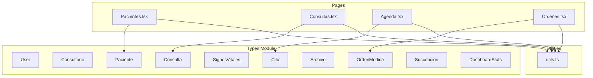

**Diagram sources**
- [index.ts:1-128](file://NexaMed-Frontend/src/types/index.ts#L1-L128)
- [Pacientes.tsx:1-279](file://NexaMed-Frontend/src/pages/Pacientes.tsx#L1-L279)
- [Consultas.tsx:1-231](file://NexaMed-Frontend/src/pages/Consultas.tsx#L1-L231)
- [Agenda.tsx:1-178](file://NexaMed-Frontend/src/pages/Agenda.tsx#L1-L178)
- [Ordenes.tsx:1-309](file://NexaMed-Frontend/src/pages/Ordenes.tsx#L1-L309)
- [utils.ts:1-44](file://NexaMed-Frontend/src/lib/utils.ts#L1-L44)

**Section sources**
- [index.ts:1-128](file://NexaMed-Frontend/src/types/index.ts#L1-L128)
- [Pacientes.tsx:1-279](file://NexaMed-Frontend/src/pages/Pacientes.tsx#L1-L279)
- [Consultas.tsx:1-231](file://NexaMed-Frontend/src/pages/Consultas.tsx#L1-L231)
- [Agenda.tsx:1-178](file://NexaMed-Frontend/src/pages/Agenda.tsx#L1-L178)
- [Ordenes.tsx:1-309](file://NexaMed-Frontend/src/pages/Ordenes.tsx#L1-L309)
- [utils.ts:1-44](file://NexaMed-Frontend/src/lib/utils.ts#L1-L44)

## Core Components
This section documents the primary data models and their fields, types, and constraints.

- User
  - Purpose: Represents system users (admin, doctor, assistant).
  - Fields:
    - id: string (UUID)
    - email: string (unique)
    - name: string
    - role: union literal 'admin' | 'doctor' | 'assistant'
    - avatar?: string
    - consultorioId?: string
  - Validation rules:
    - role must be one of the allowed literals.
    - email must be unique (business rule enforced by backend).
  - Business constraints:
    - Optional avatar and consultorioId indicate optional profile and clinic association.

- Consultorio
  - Purpose: Represents a medical clinic or practice.
  - Fields:
    - id: string
    - name: string
    - address: string
    - phone: string
    - email: string
    - plan: union literal 'individual' | 'consultorio' | 'premium'
    - maxUsers: number
    - storageLimit: number
  - Validation rules:
    - plan must be one of the allowed literals.
    - maxUsers and storageLimit must be non-negative integers.
  - Business constraints:
    - Plan determines feature limits and quotas.

- Paciente
  - Purpose: Represents a patient record.
  - Fields:
    - id: string
    - nombre: string
    - apellido: string
    - identificacion: string (national ID)
    - fechaNacimiento: string (ISO date)
    - sexo: union literal 'masculino' | 'femenino' | 'otro'
    - telefono: string
    - email: string
    - direccion: string
    - contactoEmergencia: object with fields:
      - nombre: string
      - telefono: string
      - relacion: string
    - alergias: string[]
    - antecedentes: string[]
    - medicamentosActuales: string[]
    - createdAt: string (ISO date)
    - updatedAt: string (ISO date)
  - Validation rules:
    - sexo must be one of the allowed literals.
    - fechaNacimiento must be a valid ISO date string.
    - contactoEmergencia fields are required when present.
  - Business constraints:
    - Arrays represent optional lists of allergies, past conditions, and current medications.

- Consulta
  - Purpose: Represents a medical consultation record.
  - Fields:
    - id: string
    - pacienteId: string
    - profesionalId: string
    - fecha: string (ISO date-time)
    - motivo: string
    - subjetivo: string
    - objetivo: string
    - evaluacion: string
    - plan: string
    - diagnostico: string
    - indicaciones: string
    - signosVitales?: SignosVitales
    - proximaCita?: string (ISO date)
    - createdAt: string (ISO date-time)
  - Validation rules:
    - fecha must be a valid ISO date-time string.
    - signosVitales is optional; if present, all numeric fields must be non-negative.
  - Business constraints:
    - Optional fields support flexible documentation of consultations.

- SignosVitales
  - Purpose: Captures vital signs during a consultation.
  - Fields:
    - presionArterial: string
    - frecuenciaCardiaca: number
    - frecuenciaRespiratoria: number
    - temperatura: number
    - peso: number
    - talla: number
    - imc?: number
    - saturacionOxigeno?: number
  - Validation rules:
    - All numeric fields must be non-negative.
    - Optional fields may be omitted.

- OrdenMedica
  - Purpose: Represents a medical order (laboratory, imaging, interconsultation, etc.).
  - Fields:
    - id: string
    - pacienteId: string
    - consultaId: string
    - tipo: union literal 'laboratorio' | 'imagenologia' | 'interconsulta' | 'otro'
    - diagnosticoPresuntivo: string
    - examenes: string[]
    - notas: string
    - estado: union literal 'pendiente' | 'completada' | 'cancelada'
    - pdfUrl?: string
    - createdAt: string (ISO date-time)
  - Validation rules:
    - tipo must be one of the allowed literals.
    - estado must be one of the allowed literals.
    - pdfUrl is optional.
  - Business constraints:
    - examenes array enumerates requested procedures/tests.

- Archivo
  - Purpose: Represents a stored file/document associated with a patient.
  - Fields:
    - id: string
    - pacienteId: string
    - tipo: union literal 'laboratorio' | 'imagenologia' | 'ecografia' | 'receta' | 'informe' | 'otro'
    - etiqueta: string
    - nombre: string
    - url: string
    - mimeType: string
    - size: number
    - uploadedBy: string
    - createdAt: string (ISO date-time)
  - Validation rules:
    - tipo must be one of the allowed literals.
    - size must be non-negative.
  - Business constraints:
    - Associates files with patients and categorizes by type.

- Cita
  - Purpose: Represents an appointment scheduled for a patient.
  - Fields:
    - id: string
    - pacienteId: string
    - profesionalId: string
    - fechaHora: string (ISO date-time)
    - duracion: number (minutes)
    - estado: union literal 'programada' | 'atendida' | 'cancelada' | 'ausente'
    - motivo: string
    - notas?: string
    - createdAt: string (ISO date-time)
  - Validation rules:
    - duracion must be positive.
    - estado must be one of the allowed literals.
  - Business constraints:
    - Notas are optional scheduling notes.

- Suscripcion
  - Purpose: Represents a subscription plan for a clinic.
  - Fields:
    - id: string
    - consultorioId: string
    - plan: union literal 'individual' | 'consultorio' | 'premium'
    - estado: union literal 'activa' | 'suspendida' | 'cancelada'
    - fechaInicio: string (ISO date)
    - fechaFin: string (ISO date)
    - limiteUsuarios: number
    - limiteAlmacenamiento: number
    - precio: number
  - Validation rules:
    - Plan and state must be one of the allowed literals.
    - Dates must be valid ISO dates.
    - Numerical limits must be non-negative.

- DashboardStats
  - Purpose: Aggregated statistics for dashboard views.
  - Fields:
    - citasHoy: number
    - pacientesAtendidosHoy: number
    - pacientesTotales: number
    - consultasMes: number
    - pendientesSeguimiento: number
  - Validation rules:
    - All fields must be non-negative integers.

**Section sources**
- [index.ts:1-128](file://NexaMed-Frontend/src/types/index.ts#L1-L128)

## Architecture Overview
The data models are consumed by page components to render UI and manage state. Utility functions provide consistent formatting and transformations for dates and identifiers. The routing module integrates pages with layouts.

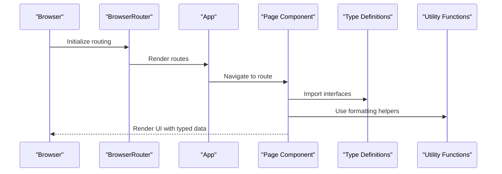

**Diagram sources**
- [main.tsx:1-14](file://NexaMed-Frontend/src/main.tsx#L1-L14)
- [App.tsx:1-38](file://NexaMed-Frontend/src/App.tsx#L1-L38)
- [Pacientes.tsx:1-279](file://NexaMed-Frontend/src/pages/Pacientes.tsx#L1-L279)
- [utils.ts:1-44](file://NexaMed-Frontend/src/lib/utils.ts#L1-L44)
- [index.ts:1-128](file://NexaMed-Frontend/src/types/index.ts#L1-L128)

## Detailed Component Analysis

### User Model
- Usage: Authentication and authorization across the app.
- Integration: Role-based UI and navigation.
- Type safety: Union literal for role ensures compile-time validation of allowed roles.

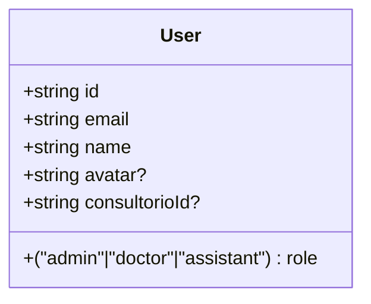

**Diagram sources**
- [index.ts:1-8](file://NexaMed-Frontend/src/types/index.ts#L1-L8)

**Section sources**
- [index.ts:1-8](file://NexaMed-Frontend/src/types/index.ts#L1-L8)

### Consultorio Model
- Usage: Clinic profile and plan configuration.
- Integration: Subscription and resource limit enforcement.
- Type safety: Union literals for plan and state ensure valid values.

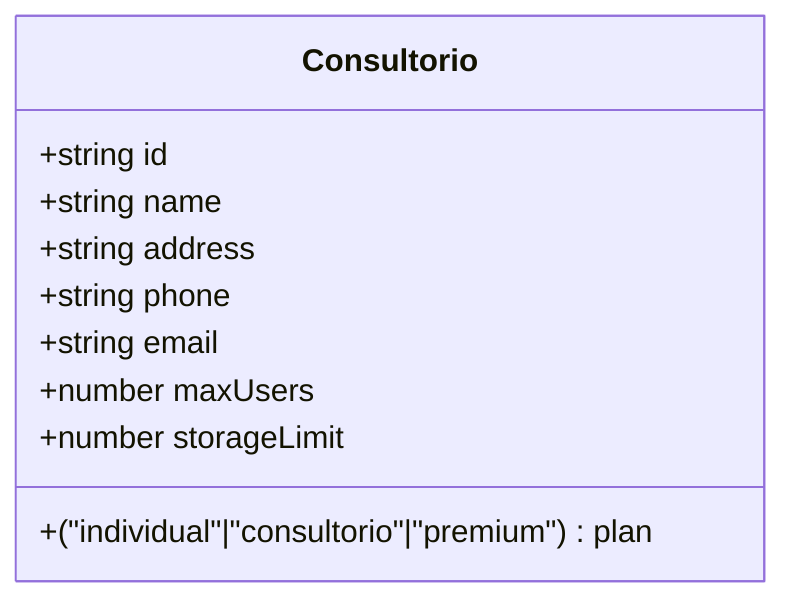

**Diagram sources**
- [index.ts:10-19](file://NexaMed-Frontend/src/types/index.ts#L10-L19)

**Section sources**
- [index.ts:10-19](file://NexaMed-Frontend/src/types/index.ts#L10-L19)

### Paciente Model
- Usage: Patient records and demographics.
- Integration: UI displays name, ID, contact, allergies, and history.
- Type safety: Union literal for sexo; arrays for optional lists.

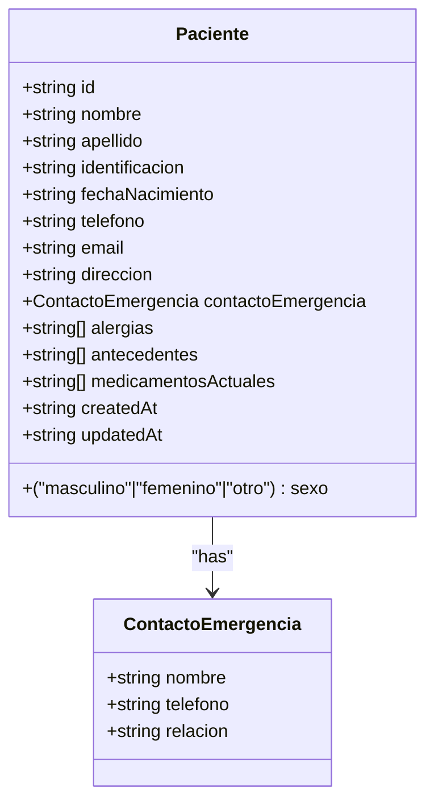

**Diagram sources**
- [index.ts:21-41](file://NexaMed-Frontend/src/types/index.ts#L21-L41)

**Section sources**
- [index.ts:21-41](file://NexaMed-Frontend/src/types/index.ts#L21-L41)
- [Pacientes.tsx:24-91](file://NexaMed-Frontend/src/pages/Pacientes.tsx#L24-L91)

### Consulta Model
- Usage: Medical consultation documentation.
- Integration: Vital signs, diagnosis, and follow-up scheduling.
- Type safety: Optional signosVitales and proximaCita support flexible entries.

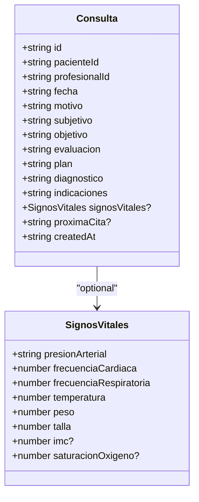

**Diagram sources**
- [index.ts:43-69](file://NexaMed-Frontend/src/types/index.ts#L43-L69)

**Section sources**
- [index.ts:43-69](file://NexaMed-Frontend/src/types/index.ts#L43-L69)
- [Consultas.tsx:24-75](file://NexaMed-Frontend/src/pages/Consultas.tsx#L24-L75)

### OrdenMedica Model
- Usage: Orders for laboratory, imaging, and interconsultations.
- Integration: Status tracking and optional PDF attachment.
- Type safety: Union literals for tipo and estado enforce valid states.

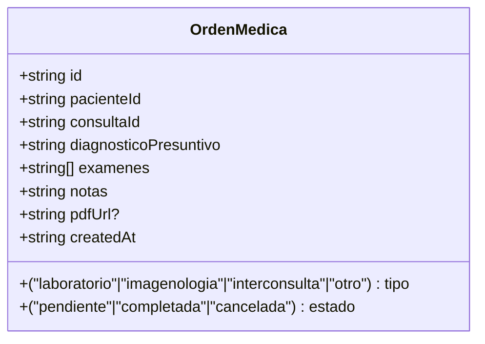

**Diagram sources**
- [index.ts:71-82](file://NexaMed-Frontend/src/types/index.ts#L71-L82)

**Section sources**
- [index.ts:71-82](file://NexaMed-Frontend/src/types/index.ts#L71-L82)
- [Ordenes.tsx:28-79](file://NexaMed-Frontend/src/pages/Ordenes.tsx#L28-L79)

### Archivo Model
- Usage: Stored documents and images linked to patients.
- Integration: File metadata and download URLs.
- Type safety: Union literal for tipo and non-negative size.

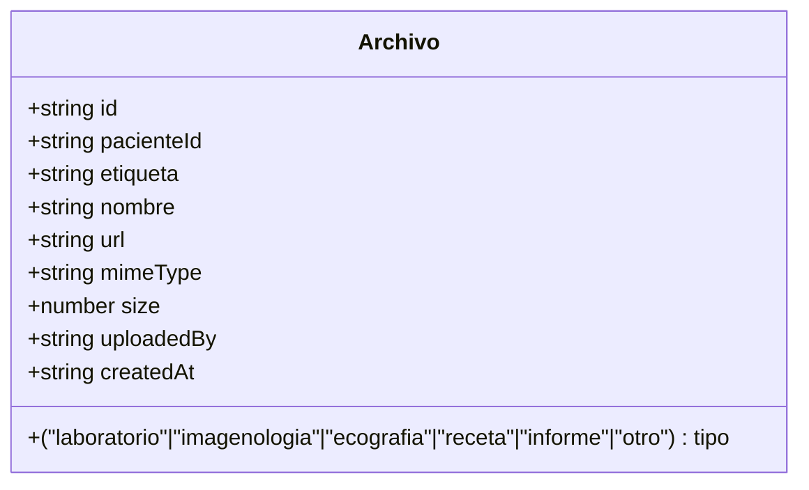

**Diagram sources**
- [index.ts:84-95](file://NexaMed-Frontend/src/types/index.ts#L84-L95)

**Section sources**
- [index.ts:84-95](file://NexaMed-Frontend/src/types/index.ts#L84-L95)

### Cita Model
- Usage: Appointment scheduling and management.
- Integration: Calendar views and status badges.
- Type safety: Union literal for estado and positive duration.

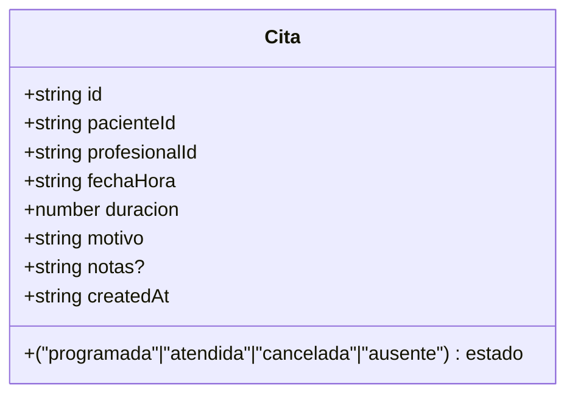

**Diagram sources**
- [index.ts:97-107](file://NexaMed-Frontend/src/types/index.ts#L97-L107)

**Section sources**
- [index.ts:97-107](file://NexaMed-Frontend/src/types/index.ts#L97-L107)
- [Agenda.tsx:23-32](file://NexaMed-Frontend/src/pages/Agenda.tsx#L23-L32)

### Suscripcion Model
- Usage: Subscription plan and billing information.
- Integration: Limits and pricing display.
- Type safety: Union literals for plan and estado.

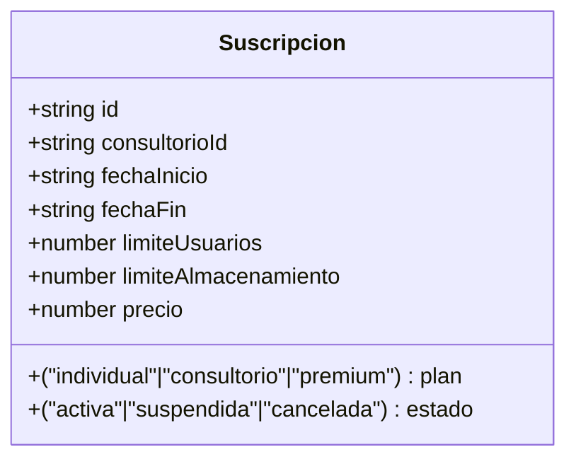

**Diagram sources**
- [index.ts:109-119](file://NexaMed-Frontend/src/types/index.ts#L109-L119)

**Section sources**
- [index.ts:109-119](file://NexaMed-Frontend/src/types/index.ts#L109-L119)

### DashboardStats Model
- Usage: Dashboard KPIs aggregation.
- Integration: Cards and metrics rendering.
- Type safety: Numeric fields validated as non-negative integers.

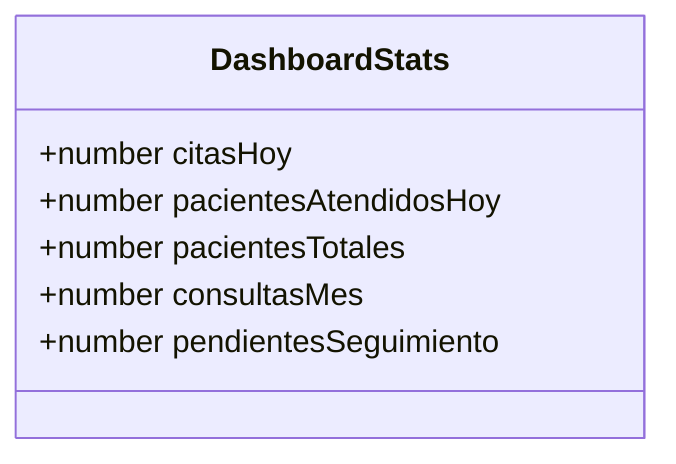

**Diagram sources**
- [index.ts:121-127](file://NexaMed-Frontend/src/types/index.ts#L121-L127)

**Section sources**
- [index.ts:121-127](file://NexaMed-Frontend/src/types/index.ts#L121-L127)

## Dependency Analysis
The application relies on React and Radix UI primitives for components, date-fns for calendar utilities, and Tailwind CSS for styling. The types module is a central dependency for all pages.

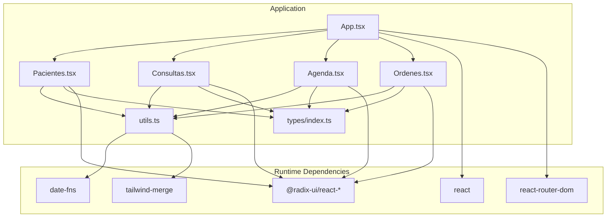

**Diagram sources**
- [package.json:12-32](file://NexaMed-Frontend/package.json#L12-L32)
- [App.tsx:1-38](file://NexaMed-Frontend/src/App.tsx#L1-L38)
- [Pacientes.tsx:1-279](file://NexaMed-Frontend/src/pages/Pacientes.tsx#L1-L279)
- [Consultas.tsx:1-231](file://NexaMed-Frontend/src/pages/Consultas.tsx#L1-L231)
- [Agenda.tsx:1-178](file://NexaMed-Frontend/src/pages/Agenda.tsx#L1-L178)
- [Ordenes.tsx:1-309](file://NexaMed-Frontend/src/pages/Ordenes.tsx#L1-L309)
- [utils.ts:1-44](file://NexaMed-Frontend/src/lib/utils.ts#L1-L44)
- [index.ts:1-128](file://NexaMed-Frontend/src/types/index.ts#L1-L128)

**Section sources**
- [package.json:12-32](file://NexaMed-Frontend/package.json#L12-L32)
- [App.tsx:1-38](file://NexaMed-Frontend/src/App.tsx#L1-L38)

## Performance Considerations
- Prefer union literal types for enums to enable exhaustive checks and reduce runtime errors.
- Use optional fields judiciously to minimize unnecessary data transfer and rendering overhead.
- Cache formatted dates and computed ages to avoid repeated computations in large lists.
- Keep arrays of strings (e.g., allergies, antecedentes) bounded to prevent excessive DOM rendering.

## Troubleshooting Guide
- Date parsing: Ensure ISO date strings are passed to formatting utilities to avoid invalid date errors.
- Age calculation: Verify birth dates are valid and not in the future to prevent negative ages.
- Optional fields: Guard against undefined when accessing optional properties (e.g., signosVitales, pdfUrl).
- Enum validation: Use union literals to prevent typos in state and type fields.

Common validations and utilities:
- Date formatting: Use provided helpers to format dates consistently across components.
- Age calculation: Compute age from birth date safely using the utility function.
- ID generation: Use the provided generator for temporary identifiers during creation flows.

**Section sources**
- [utils.ts:8-43](file://NexaMed-Frontend/src/lib/utils.ts#L8-L43)

## Conclusion
NexaMed’s TypeScript data models provide a robust foundation for type-safe development across the frontend. By leveraging union literals, optional properties, and structured interfaces, the application ensures predictable behavior and easier maintenance. Pages integrate these models seamlessly, while utility functions standardize formatting and transformations. Adhering to the documented constraints and patterns will help maintain consistency and reliability as the application evolves.