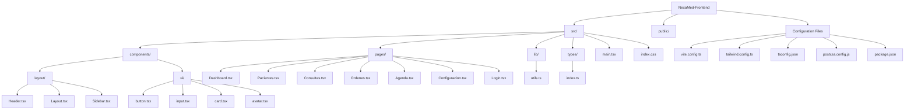

# Getting Started

<cite>
**Referenced Files in This Document**
- [package.json](file://NexaMed-Frontend/package.json)
- [vite.config.ts](file://NexaMed-Frontend/vite.config.ts)
- [tsconfig.json](file://NexaMed-Frontend/tsconfig.json)
- [tsconfig.node.json](file://NexaMed-Frontend/tsconfig.node.json)
- [tailwind.config.ts](file://NexaMed-Frontend/tailwind.config.ts)
- [postcss.config.js](file://NexaMed-Frontend/postcss.config.js)
- [index.html](file://NexaMed-Frontend/index.html)
- [src/main.tsx](file://NexaMed-Frontend/src/main.tsx)
- [src/App.tsx](file://NexaMed-Frontend/src/App.tsx)
- [src/lib/utils.ts](file://NexaMed-Frontend/src/lib/utils.ts)
- [src/index.css](file://NexaMed-Frontend/src/index.css)
- [src/components/layout/Layout.tsx](file://NexaMed-Frontend/src/components/layout/Layout.tsx)
- [src/components/layout/Header.tsx](file://NexaMed-Frontend/src/components/layout/Header.tsx)
- [src/components/ui/button.tsx](file://NexaMed-Frontend/src/components/ui/button.tsx)
- [src/types/index.ts](file://NexaMed-Frontend/src/types/index.ts)
- [src/pages/Dashboard.tsx](file://NexaMed-Frontend/src/pages/Dashboard.tsx)
</cite>

## Table of Contents
1. [Introduction](#introduction)
2. [Prerequisites](#prerequisites)
3. [Installation](#installation)
4. [Environment Configuration](#environment-configuration)
5. [First Run](#first-run)
6. [Development Server](#development-server)
7. [Project Structure](#project-structure)
8. [Common Development Commands](#common-development-commands)
9. [Hot Reload](#hot-reload)
10. [TypeScript Setup](#typescript-setup)
11. [Tailwind CSS Configuration](#tailwind-css-configuration)
12. [Navigation Guide](#navigation-guide)
13. [Browser Compatibility](#browser-compatibility)
14. [Recommended Development Tools](#recommended-development-tools)
15. [Troubleshooting](#troubleshooting)
16. [Conclusion](#conclusion)

## Introduction
Welcome to NexaMed, a modern healthcare management platform built with React, TypeScript, Vite, and Tailwind CSS. This guide will help you set up your development environment, understand the project structure, and start building features for the clinical management system.

NexaMed provides a comprehensive solution for private clinic management, including patient records, appointments, medical orders, and administrative workflows. The frontend follows modern React patterns with a component-based architecture and a cohesive design system.

## Prerequisites
Before you begin development, ensure you have the following tools installed:

### Node.js and Package Manager
- **Node.js**: Version 16.0.0 or higher (LTS recommended)
- **npm**: Comes bundled with Node.js (version 7.0.0 or higher)
- **Alternative**: Yarn package manager (version 1.22.0 or higher)

### Development Dependencies
- **Git**: For version control and repository access
- **Code Editor**: VS Code recommended with TypeScript extensions
- **Browser**: Latest Chrome, Firefox, or Edge for optimal development experience

### Optional but Recommended
- **ESLint**: For code quality and linting
- **Prettier**: For code formatting consistency
- **TypeScript**: For enhanced development experience

**Section sources**
- [package.json:12-47](file://NexaMed-Frontend/package.json#L12-L47)

## Installation
Follow these steps to set up the NexaMed development environment:

### Step 1: Clone the Repository
```bash
git clone https://github.com/your-repository/NexaMed.git
cd NexaMed/NexaMed-Frontend
```

### Step 2: Install Dependencies
Using npm:
```bash
npm install
```

Using yarn:
```bash
yarn install
```

### Step 3: Verify Installation
Check that all dependencies are properly installed by running:
```bash
npm list react react-dom
```

**Section sources**
- [package.json:6-11](file://NexaMed-Frontend/package.json#L6-L11)

## Environment Configuration
The project uses a modular configuration approach with separate files for different aspects of the build system.

### Build Configuration
The Vite configuration provides:
- React plugin for JSX/TSX support
- Path aliases for clean imports
- Development server settings

### TypeScript Configuration
The TypeScript setup includes:
- Strict type checking
- ES2020 target with DOM libraries
- Path mapping for imports
- React JSX transformation

### CSS Processing
PostCSS configuration enables:
- Tailwind CSS processing
- Autoprefixer for vendor prefixes
- Modern CSS features

**Section sources**
- [vite.config.ts:1-13](file://NexaMed-Frontend/vite.config.ts#L1-L13)
- [tsconfig.json:1-26](file://NexaMed-Frontend/tsconfig.json#L1-L26)
- [postcss.config.js:1-7](file://NexaMed-Frontend/postcss.config.js#L1-L7)

## First Run
After installation, start the development server:

### Starting the Development Server
```bash
npm run dev
```

The application will be available at:
- **Primary URL**: http://localhost:5173
- **Alternative URL**: http://127.0.0.1:5173

### Expected Behavior
- Application loads without errors
- React Developer Tools extension shows component tree
- Hot reload activates on file changes
- Browser automatically refreshes on save

### Initial Page Structure
The application bootstraps with:
- React Router for navigation
- Layout wrapper with sidebar and header
- Dashboard as the default route
- Responsive design with Tailwind CSS

**Section sources**
- [src/main.tsx:1-14](file://NexaMed-Frontend/src/main.tsx#L1-L14)
- [src/App.tsx:1-38](file://NexaMed-Frontend/src/App.tsx#L1-L38)

## Development Server
NexaMed uses Vite for fast development with the following configuration:

### Server Features
- **Hot Module Replacement (HMR)**: Instant updates without full page reload
- **Fast Bundle**: Optimized build pipeline for rapid iteration
- **TypeScript Support**: Native TS/TSX compilation
- **React Fast Refresh**: Preserves component state during edits

### Configuration Details
The Vite setup includes:
- React plugin for JSX transformation
- Path alias resolution (`@/` maps to `src/`)
- Development server port 5173
- HTTPS support for secure development

### Network Configuration
- **Default Port**: 5173
- **Host Binding**: Localhost only (127.0.0.1)
- **Cross-origin**: Disabled for security
- **Custom Host**: Can be configured via environment variables

**Section sources**
- [vite.config.ts:5-12](file://NexaMed-Frontend/vite.config.ts#L5-L12)

## Project Structure
The project follows a well-organized structure optimized for scalability and maintainability:



**Diagram sources**
- [src/main.tsx:1-14](file://NexaMed-Frontend/src/main.tsx#L1-L14)
- [src/App.tsx:1-38](file://NexaMed-Frontend/src/App.tsx#L1-L38)
- [src/components/layout/Layout.tsx:1-35](file://NexaMed-Frontend/src/components/layout/Layout.tsx#L1-L35)
- [src/components/ui/button.tsx:1-54](file://NexaMed-Frontend/src/components/ui/button.tsx#L1-L54)

### Directory Breakdown

#### Core Application (`src/`)
- **components/**: Reusable UI components organized by feature
- **pages/**: Route-specific page components
- **lib/**: Utility functions and helpers
- **types/**: TypeScript interface definitions
- **main.tsx**: Application entry point
- **index.css**: Global styles and Tailwind directives

#### Configuration Files
- **vite.config.ts**: Development server and build configuration
- **tailwind.config.ts**: Design system and utility customization
- **tsconfig.json**: TypeScript compiler options
- **postcss.config.js**: CSS processing pipeline

#### Public Assets (`public/`)
- Static assets served directly by the development server
- Favicons and application icons
- Environment-specific configurations

**Section sources**
- [src/App.tsx:1-38](file://NexaMed-Frontend/src/App.tsx#L1-L38)
- [src/components/layout/Layout.tsx:1-35](file://NexaMed-Frontend/src/components/layout/Layout.tsx#L1-L35)

## Common Development Commands
The project provides several npm scripts for different development tasks:

### Available Scripts
- **`npm run dev`**: Start development server with hot reload
- **`npm run build`**: Compile TypeScript and build production bundle
- **`npm run preview`**: Preview production build locally
- **`npm run lint`**: Run ESLint for code quality checks

### Development Workflow
1. **Start Development**: `npm run dev`
2. **Create New Component**: Add files to appropriate directory
3. **Test Changes**: Save files to trigger hot reload
4. **Build for Production**: `npm run build`
5. **Preview Build**: `npm run preview`

### Script Implementation Details
Each script serves a specific purpose in the development lifecycle:
- Development script uses Vite's React plugin
- Build script compiles TypeScript first, then bundles with Vite
- Preview script simulates production environment
- Lint script enforces coding standards

**Section sources**
- [package.json:6-11](file://NexaMed-Frontend/package.json#L6-L11)

## Hot Reload
NexaMed leverages Vite's advanced hot module replacement system for seamless development:

### How Hot Reload Works
1. **File Change Detection**: Vite monitors file system for modifications
2. **Module Replacement**: Changed modules are replaced without full reload
3. **State Preservation**: React component state maintained during updates
4. **CSS Updates**: Stylesheets hot-swapped without page refresh

### Supported File Types
- **TypeScript/JavaScript**: Automatic recompilation and reload
- **React Components**: Fast refresh with state preservation
- **CSS/Tailwind**: Instant style updates
- **Static Assets**: Automatic asset reloading

### Performance Benefits
- **Instant Feedback**: Near-instantaneous updates after saves
- **Development Speed**: Reduced iteration cycles
- **Error Isolation**: Specific module reloads prevent full page crashes
- **Bundle Optimization**: Development vs production optimizations

### Troubleshooting Hot Reload
If hot reload stops working:
1. Check browser console for Vite client errors
2. Verify file permissions and paths
3. Restart development server if necessary
4. Clear browser cache and disable ad blockers

**Section sources**
- [vite.config.ts:1-13](file://NexaMed-Frontend/vite.config.ts#L1-L13)

## TypeScript Setup
The project uses TypeScript for enhanced development experience and type safety:

### Compiler Configuration
The TypeScript setup includes:
- **Target**: ES2020 for modern JavaScript features
- **Strict Mode**: Enables comprehensive type checking
- **Path Mapping**: `@/*` resolves to `src/*` for clean imports
- **JSX Support**: React JSX transformation for component files

### Type Safety Features
- **Interface Definitions**: Comprehensive type contracts
- **Generic Components**: Type-safe reusable components
- **Utility Types**: Enhanced developer experience
- **Build-time Errors**: Catch issues before runtime

### Path Aliases
The configuration enables:
- **Clean Imports**: `import Button from '@/components/ui/button'`
- **Relative Paths**: Eliminates deep relative path complexity
- **Refactoring Support**: IDE refactoring works seamlessly
- **Import Organization**: Consistent import structure

**Section sources**
- [tsconfig.json:2-21](file://NexaMed-Frontend/tsconfig.json#L2-L21)
- [tsconfig.node.json](file://NexaMed-Frontend/tsconfig.node.json)

## Tailwind CSS Configuration
NexaMed uses Tailwind CSS for utility-first styling with a custom design system:

### Design System Features
The Tailwind configuration provides:
- **Dark Mode Support**: CSS variable-based dark mode
- **Medical Color Palette**: Custom color scheme for healthcare themes
- **Component Variants**: Tailwind classes for consistent UI
- **Animation Utilities**: Smooth transitions and micro-interactions

### Color System
Custom color tokens include:
- **Primary Medical Colors**: Blues and teals for healthcare branding
- **Semantic Colors**: Success, warning, and info states
- **Gradient Effects**: Subtle gradients for visual hierarchy
- **Shadow System**: Layered depth effects

### Typography and Spacing
- **Font Family**: Inter for clean, readable typography
- **Responsive Breakpoints**: Mobile-first responsive design
- **Container System**: Max-width containers for content areas
- **Spacing Scale**: Consistent margin and padding system

### CSS Architecture
The styling approach uses:
- **Layered CSS**: Base, components, and utilities separation
- **CSS Variables**: Dynamic theming support
- **Custom Properties**: Design token system
- **Animation Tokens**: Reusable motion patterns

**Section sources**
- [tailwind.config.ts:1-103](file://NexaMed-Frontend/tailwind.config.ts#L1-L103)
- [src/index.css:1-191](file://NexaMed-Frontend/src/index.css#L1-L191)

## Navigation Guide
Understanding the application navigation helps you move efficiently between different sections:

### Route Structure
The application uses React Router with nested layouts:

```mermaid
flowchart TD
A[/] --> B[Dashboard]
A --> C[Pacientes]
A --> D[Consultas]
A --> E[Ordenes]
A --> F[Agenda]
A --> G[Configuracion]
A --> H[Login]
B --> I[Layout Wrapper]
C --> I
D --> I
E --> I
F --> I
G --> I
I --> J[Sidebar Navigation]
I --> K[Header with Search]
I --> L[Main Content Area]
```

**Diagram sources**
- [src/App.tsx:11-35](file://NexaMed-Frontend/src/App.tsx#L11-L35)
- [src/components/layout/Layout.tsx:12-34](file://NexaMed-Frontend/src/components/layout/Layout.tsx#L12-L34)

### Navigation Patterns
- **Sidebar Navigation**: Persistent navigation with collapsible sections
- **Breadcrumbs**: Contextual navigation within pages
- **Header Actions**: Quick actions and user controls
- **Route Guards**: Protected routes and authentication flow

### Component Architecture
Navigation components work together:
- **Layout Component**: Wraps pages with consistent structure
- **Header Component**: Provides global navigation controls
- **Sidebar Component**: Handles main application navigation
- **Page Components**: Individual feature implementations

**Section sources**
- [src/App.tsx:1-38](file://NexaMed-Frontend/src/App.tsx#L1-L38)
- [src/components/layout/Layout.tsx:1-35](file://NexaMed-Frontend/src/components/layout/Layout.tsx#L1-L35)

## Browser Compatibility
NexaMed targets modern browsers with progressive enhancement:

### Supported Browsers
- **Chrome**: Latest 2 versions
- **Firefox**: Latest 2 versions
- **Safari**: Latest 2 versions
- **Edge**: Latest 2 versions

### Feature Requirements
- **ES2020+**: Modern JavaScript features
- **CSS Custom Properties**: Dynamic theming support
- **Fetch API**: Modern HTTP requests
- **URL Constructor**: Modern URL handling

### Polyfill Strategy
- **Modern Defaults**: No polyfills for current browsers
- **Progressive Enhancement**: Graceful degradation for older browsers
- **Feature Detection**: Runtime capability checks
- **Build Optimization**: Tree shaking removes unused features

### Testing Approach
- **Automated Testing**: Cross-browser testing in CI
- **Manual QA**: Regular testing on target browsers
- **Performance Monitoring**: Browser-specific performance metrics
- **Accessibility**: WCAG compliance across browsers

## Recommended Development Tools
Enhance your development experience with these recommended tools:

### Essential Extensions
- **ESLint**: Code quality and style enforcement
- **Prettier**: Automatic code formatting
- **Tailwind CSS IntelliSense**: CSS class completion
- **TypeScript Importer**: Automatic import generation
- **Bracket Pair Colorizer**: Code structure visualization

### Development Utilities
- **React Developer Tools**: Component inspection and profiling
- **Redux DevTools**: State management debugging
- **Postman**: API endpoint testing
- **Browser DevTools**: Performance and network analysis

### IDE Configuration
Recommended VS Code settings:
- **Auto Import**: Enable TypeScript auto imports
- **Format on Save**: Automatic code formatting
- **IntelliSense**: Enhanced type information
- **Error Lens**: Inline error diagnostics

### Performance Profiling
- **Lighthouse**: Web performance auditing
- **Web Vitals**: Real-user monitoring
- **Bundle Analyzer**: Build size optimization
- **Memory Profiler**: Memory usage analysis

## Troubleshooting
Common issues and their solutions:

### Installation Issues
**Problem**: Dependency installation fails
**Solution**: 
1. Clear npm cache: `npm cache clean --force`
2. Delete node_modules: `rm -rf node_modules`
3. Clear package lock: `rm package-lock.json`
4. Reinstall dependencies: `npm install`

**Problem**: Port 5173 already in use
**Solution**: 
1. Kill process using port: `lsof -ti:5173 | xargs kill -9`
2. Start server on different port: `npm run dev -- --port 5174`

### Build Issues
**Problem**: TypeScript compilation errors
**Solution**:
1. Check TypeScript version compatibility
2. Verify path mappings in tsconfig.json
3. Ensure all dependencies are installed
4. Clear TypeScript cache

**Problem**: Tailwind CSS not applying
**Solution**:
1. Verify Tailwind directives in index.css
2. Check content paths in tailwind.config.ts
3. Ensure PostCSS configuration is correct
4. Restart development server

### Runtime Issues
**Problem**: Hot reload not working
**Solution**:
1. Check browser console for Vite client errors
2. Verify file permissions
3. Disable browser extensions temporarily
4. Clear browser cache

**Problem**: Component imports failing
**Solution**:
1. Verify path aliases in tsconfig.json
2. Check file existence and extensions
3. Ensure proper export/import syntax
4. Restart TypeScript server

### Performance Issues
**Problem**: Slow development server
**Solution**:
1. Disable unnecessary browser extensions
2. Close other resource-intensive applications
3. Increase system RAM if possible
4. Check for antivirus interference

**Section sources**
- [package.json:6-11](file://NexaMed-Frontend/package.json#L6-L11)
- [vite.config.ts:1-13](file://NexaMed-Frontend/vite.config.ts#L1-L13)

## Conclusion
You're now ready to develop with NexaMed! The project provides a solid foundation with modern tooling, comprehensive type safety, and a well-structured component architecture. Key advantages include:

- **Rapid Development**: Vite's hot reload enables fast iteration
- **Type Safety**: Comprehensive TypeScript integration prevents runtime errors
- **Design System**: Tailwind CSS with custom medical-themed colors
- **Component Architecture**: Reusable, well-organized UI components
- **Modern Tooling**: ESLint, PostCSS, and automated build processes

To continue your development journey:
1. Explore the component library in `src/components/`
2. Review the page implementations in `src/pages/`
3. Study the utility functions in `src/lib/`
4. Examine the type definitions in `src/types/`
5. Test the navigation flow using the sidebar

Happy coding with NexaMed!