# Project Overview

<cite>
**Referenced Files in This Document**
- [package.json](file://NexaMed-Frontend/package.json)
- [vite.config.ts](file://NexaMed-Frontend/vite.config.ts)
- [tailwind.config.ts](file://NexaMed-Frontend/tailwind.config.ts)
- [src/main.tsx](file://NexaMed-Frontend/src/main.tsx)
- [src/App.tsx](file://NexaMed-Frontend/src/App.tsx)
- [src/types/index.ts](file://NexaMed-Frontend/src/types/index.ts)
- [src/lib/utils.ts](file://NexaMed-Frontend/src/lib/utils.ts)
- [src/components/layout/Layout.tsx](file://NexaMed-Frontend/src/components/layout/Layout.tsx)
- [src/components/layout/Header.tsx](file://NexaMed-Frontend/src/components/layout/Header.tsx)
- [src/components/layout/Sidebar.tsx](file://NexaMed-Frontend/src/components/layout/Sidebar.tsx)
- [src/pages/Dashboard.tsx](file://NexaMed-Frontend/src/pages/Dashboard.tsx)
- [src/pages/Pacientes.tsx](file://NexaMed-Frontend/src/pages/Pacientes.tsx)
- [src/pages/Consultas.tsx](file://NexaMed-Frontend/src/pages/Consultas.tsx)
- [src/pages/Ordenes.tsx](file://NexaMed-Frontend/src/pages/Ordenes.tsx)
- [src/pages/Agenda.tsx](file://NexaMed-Frontend/src/pages/Agenda.tsx)
</cite>

## Table of Contents
1. [Introduction](#introduction)
2. [Project Structure](#project-structure)
3. [Core Components](#core-components)
4. [Architecture Overview](#architecture-overview)
5. [Detailed Component Analysis](#detailed-component-analysis)
6. [Dependency Analysis](#dependency-analysis)
7. [Performance Considerations](#performance-considerations)
8. [Troubleshooting Guide](#troubleshooting-guide)
9. [Conclusion](#conclusion)

## Introduction
NexaMed is a modern web-based clinic management system designed to streamline daily operations for private medical practices and clinics. Its purpose is to digitize traditional healthcare workflows—such as patient registration, appointment scheduling, clinical consultations, medical orders, and administrative configuration—into a cohesive, efficient digital platform. The system targets healthcare providers who need a reliable, scalable solution to manage patient data, track appointments, document clinical encounters, and maintain administrative oversight.

Core value proposition:
- Centralized digital workflows that mirror real-world clinic operations
- Medical-themed UI/UX that feels familiar to healthcare professionals
- Modular feature set covering analytics, patient management, scheduling, consultation tracking, order management, and configuration
- Developer-friendly stack enabling rapid iteration and maintenance

## Project Structure
The frontend is organized around a clear separation of concerns:
- Application bootstrap and routing live in the root entry files
- Pages represent major functional areas (Dashboard, Patients, Consultations, Orders, Agenda, Configuration)
- A shared layout system provides consistent navigation and header behavior
- UI primitives and utilities support reusable components and cross-cutting concerns
- Strong typing via TypeScript models ensures data integrity across components

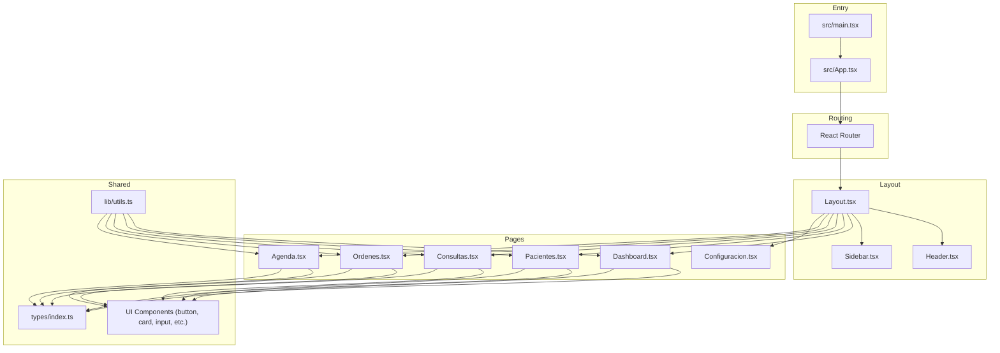

**Diagram sources**
- [src/main.tsx:1-14](file://NexaMed-Frontend/src/main.tsx#L1-L14)
- [src/App.tsx:1-38](file://NexaMed-Frontend/src/App.tsx#L1-L38)
- [src/components/layout/Layout.tsx:1-35](file://NexaMed-Frontend/src/components/layout/Layout.tsx#L1-L35)
- [src/components/layout/Header.tsx:1-84](file://NexaMed-Frontend/src/components/layout/Header.tsx#L1-L84)
- [src/components/layout/Sidebar.tsx:1-107](file://NexaMed-Frontend/src/components/layout/Sidebar.tsx#L1-L107)
- [src/pages/Dashboard.tsx:1-206](file://NexaMed-Frontend/src/pages/Dashboard.tsx#L1-L206)
- [src/pages/Pacientes.tsx:1-279](file://NexaMed-Frontend/src/pages/Pacientes.tsx#L1-L279)
- [src/pages/Consultas.tsx:1-231](file://NexaMed-Frontend/src/pages/Consultas.tsx#L1-L231)
- [src/pages/Ordenes.tsx:1-309](file://NexaMed-Frontend/src/pages/Ordenes.tsx#L1-L309)
- [src/pages/Agenda.tsx:1-178](file://NexaMed-Frontend/src/pages/Agenda.tsx#L1-L178)
- [src/types/index.ts:1-128](file://NexaMed-Frontend/src/types/index.ts#L1-L128)
- [src/lib/utils.ts:1-44](file://NexaMed-Frontend/src/lib/utils.ts#L1-L44)

**Section sources**
- [src/main.tsx:1-14](file://NexaMed-Frontend/src/main.tsx#L1-L14)
- [src/App.tsx:1-38](file://NexaMed-Frontend/src/App.tsx#L1-L38)
- [package.json:1-49](file://NexaMed-Frontend/package.json#L1-L49)
- [vite.config.ts:1-13](file://NexaMed-Frontend/vite.config.ts#L1-L13)
- [tailwind.config.ts:1-103](file://NexaMed-Frontend/tailwind.config.ts#L1-L103)

## Core Components
NexaMed’s core functionality revolves around five primary features, each implemented as a dedicated page component and supported by shared UI primitives and typed models:

- Dashboard analytics: Provides at-a-glance insights into clinic activity, including total patients, consultations scheduled for today, upcoming appointments, pending orders, recent patient visits, and operational reminders.
- Patient management: Enables searching, filtering, and viewing patient profiles with demographic details, allergies, past medical history, current medications, and last visit dates. Offers actions such as viewing records, creating new consultations, editing profiles, and deleting entries.
- Appointment scheduling: Presents a calendar-based agenda with month navigation, daily schedule display, and status indicators for scheduled, attended, pending, and missed appointments. Supports adding new appointments and managing existing ones.
- Consultation tracking: Manages clinical encounter records with categories (routine check-ups, follow-ups, preventive care, urgent cases), statuses (completed, in-progress, pending), and associated metadata such as attending physician, diagnosis, and timeline.
- Order management: Handles medical orders (laboratory tests, imaging, interconsultations) with status tracking (pending, completed, canceled), diagnostic context, requested procedures, and downloadable results where applicable.
- Configuration system: Hosts system settings and administrative controls (placeholder page present in routing).

These features share a consistent medical-themed design language, leveraging a cohesive color palette, typography, spacing, and interactive components to ensure familiarity and usability for healthcare professionals.

**Section sources**
- [src/pages/Dashboard.tsx:1-206](file://NexaMed-Frontend/src/pages/Dashboard.tsx#L1-L206)
- [src/pages/Pacientes.tsx:1-279](file://NexaMed-Frontend/src/pages/Pacientes.tsx#L1-L279)
- [src/pages/Agenda.tsx:1-178](file://NexaMed-Frontend/src/pages/Agenda.tsx#L1-L178)
- [src/pages/Consultas.tsx:1-231](file://NexaMed-Frontend/src/pages/Consultas.tsx#L1-L231)
- [src/pages/Ordenes.tsx:1-309](file://NexaMed-Frontend/src/pages/Ordenes.tsx#L1-L309)
- [src/App.tsx:11-35](file://NexaMed-Frontend/src/App.tsx#L11-L35)

## Architecture Overview
NexaMed employs a modern React + TypeScript + Vite stack with a component-driven architecture. The application initializes within a browser router context, renders a layout wrapper, and routes users to feature-specific pages. Shared utilities and UI components ensure consistency across the interface. Tailwind CSS provides a flexible, utility-first styling foundation, while Radix UI offers accessible, headless primitives for interactive elements.

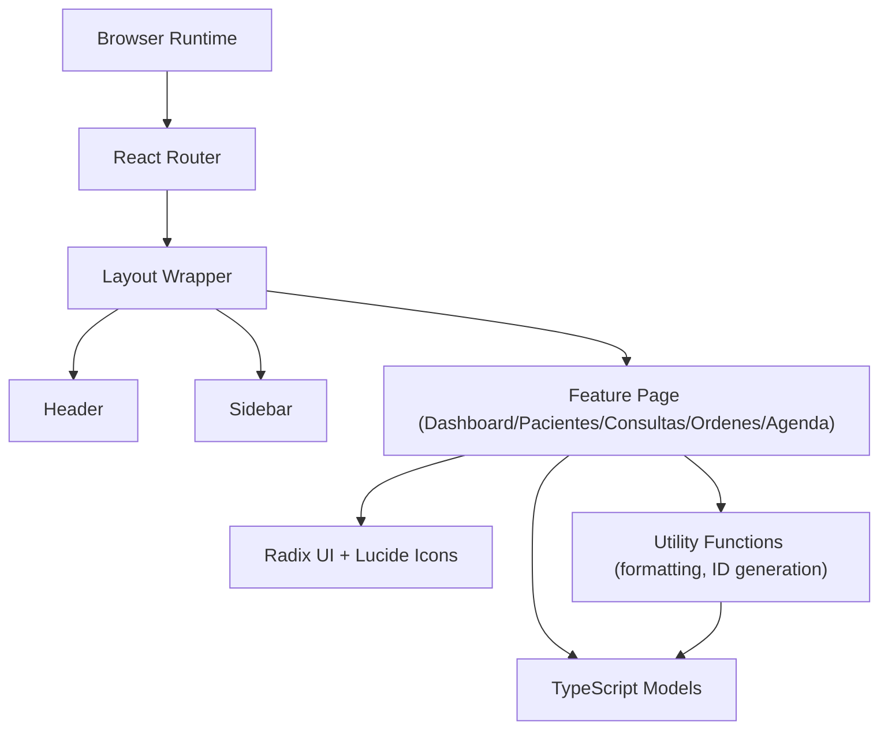

**Diagram sources**
- [src/main.tsx:7-13](file://NexaMed-Frontend/src/main.tsx#L7-L13)
- [src/App.tsx:11-35](file://NexaMed-Frontend/src/App.tsx#L11-L35)
- [src/components/layout/Layout.tsx:12-34](file://NexaMed-Frontend/src/components/layout/Layout.tsx#L12-L34)
- [src/components/layout/Header.tsx:19-83](file://NexaMed-Frontend/src/components/layout/Header.tsx#L19-L83)
- [src/components/layout/Sidebar.tsx:31-106](file://NexaMed-Frontend/src/components/layout/Sidebar.tsx#L31-L106)
- [src/lib/utils.ts:4-44](file://NexaMed-Frontend/src/lib/utils.ts#L4-L44)
- [src/types/index.ts:1-128](file://NexaMed-Frontend/src/types/index.ts#L1-L128)

## Detailed Component Analysis

### System Entry and Routing
The application bootstraps inside a strict mode provider wrapped by a browser router. Routes define the application’s navigation structure, with nested layouts applied to most pages to ensure consistent header and sidebar behavior.

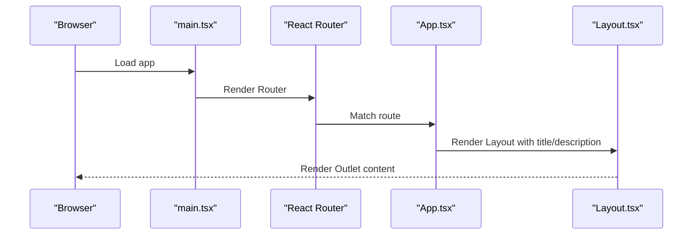

**Diagram sources**
- [src/main.tsx:7-13](file://NexaMed-Frontend/src/main.tsx#L7-L13)
- [src/App.tsx:11-35](file://NexaMed-Frontend/src/App.tsx#L11-L35)
- [src/components/layout/Layout.tsx:12-34](file://NexaMed-Frontend/src/components/layout/Layout.tsx#L12-L34)

**Section sources**
- [src/main.tsx:1-14](file://NexaMed-Frontend/src/main.tsx#L1-L14)
- [src/App.tsx:1-38](file://NexaMed-Frontend/src/App.tsx#L1-L38)

### Layout and Navigation
The layout composes a collapsible sidebar and a sticky header, providing persistent navigation and contextual metadata. The sidebar includes icons and labels for each major feature area, with active state highlighting and responsive behavior.

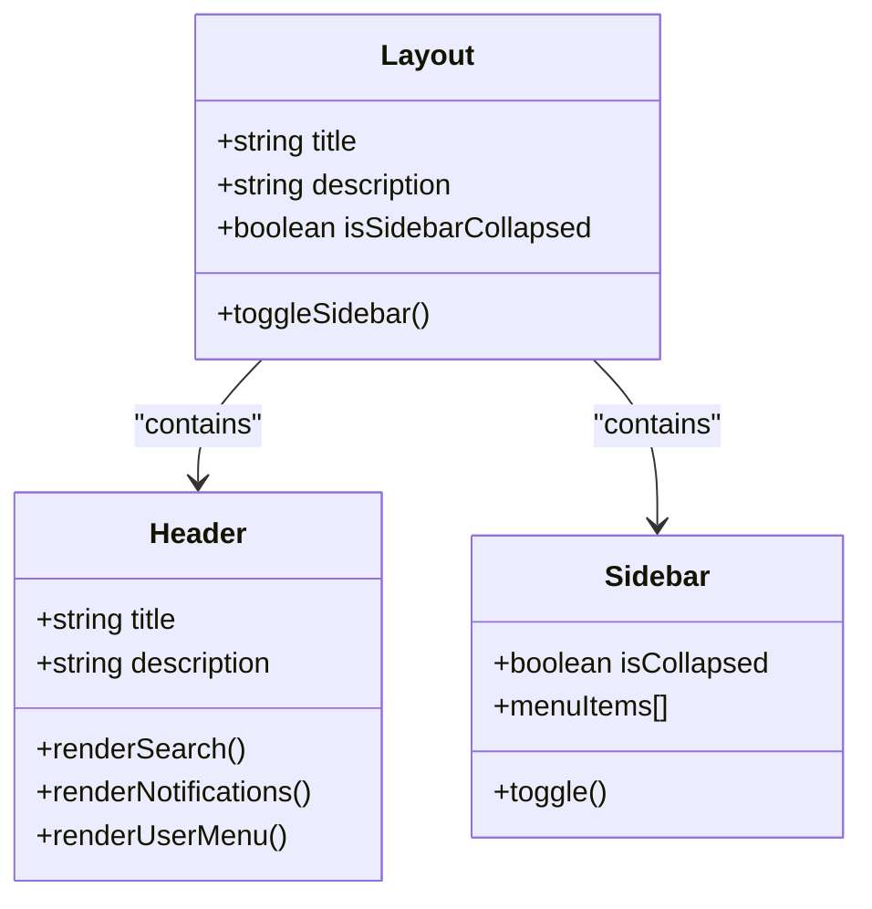

**Diagram sources**
- [src/components/layout/Layout.tsx:7-34](file://NexaMed-Frontend/src/components/layout/Layout.tsx#L7-L34)
- [src/components/layout/Header.tsx:14-83](file://NexaMed-Frontend/src/components/layout/Header.tsx#L14-L83)
- [src/components/layout/Sidebar.tsx:17-106](file://NexaMed-Frontend/src/components/layout/Sidebar.tsx#L17-L106)

**Section sources**
- [src/components/layout/Layout.tsx:1-35](file://NexaMed-Frontend/src/components/layout/Layout.tsx#L1-L35)
- [src/components/layout/Header.tsx:1-84](file://NexaMed-Frontend/src/components/layout/Header.tsx#L1-L84)
- [src/components/layout/Sidebar.tsx:1-107](file://NexaMed-Frontend/src/components/layout/Sidebar.tsx#L1-L107)

### Dashboard Analytics
The dashboard aggregates key metrics and presents them in a responsive grid. It surfaces counts for total patients, consultations scheduled for today, upcoming appointments, pending orders, and recent patient visits. It also displays actionable reminders and quick links to related views.

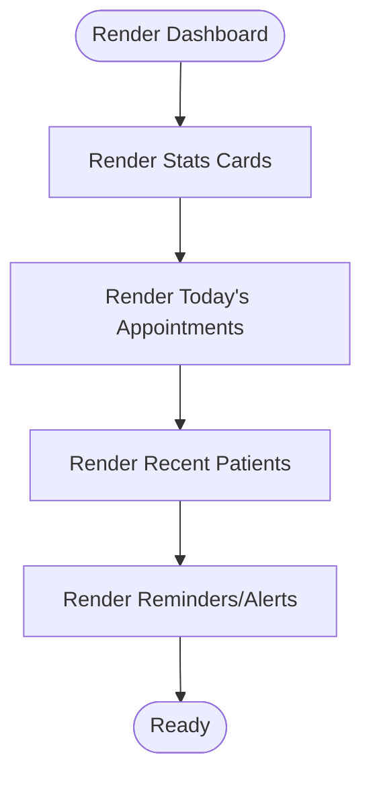

**Diagram sources**
- [src/pages/Dashboard.tsx:62-201](file://NexaMed-Frontend/src/pages/Dashboard.tsx#L62-L201)

**Section sources**
- [src/pages/Dashboard.tsx:1-206](file://NexaMed-Frontend/src/pages/Dashboard.tsx#L1-L206)

### Patient Management
The patient list supports search across names, identification numbers, and phone numbers, with filtering and action menus per record. It includes summary statistics for total patients, those with known allergies, long-term non-visits, and new registrations this month.

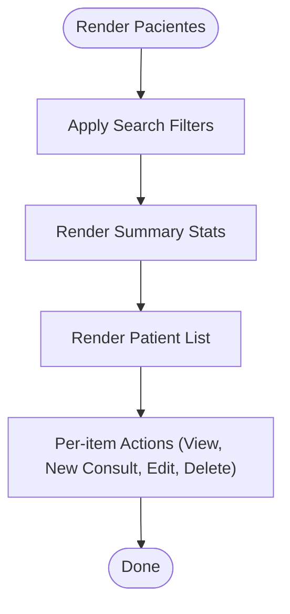

**Diagram sources**
- [src/pages/Pacientes.tsx:93-278](file://NexaMed-Frontend/src/pages/Pacientes.tsx#L93-L278)

**Section sources**
- [src/pages/Pacientes.tsx:1-279](file://NexaMed-Frontend/src/pages/Pacientes.tsx#L1-L279)

### Consultation Tracking
The consultations view organizes clinical records by type and status, with tabbed navigation to filter by all, today, completed, or pending. Each record displays patient, date/time, type, status, diagnosis, and attending physician, with contextual actions.

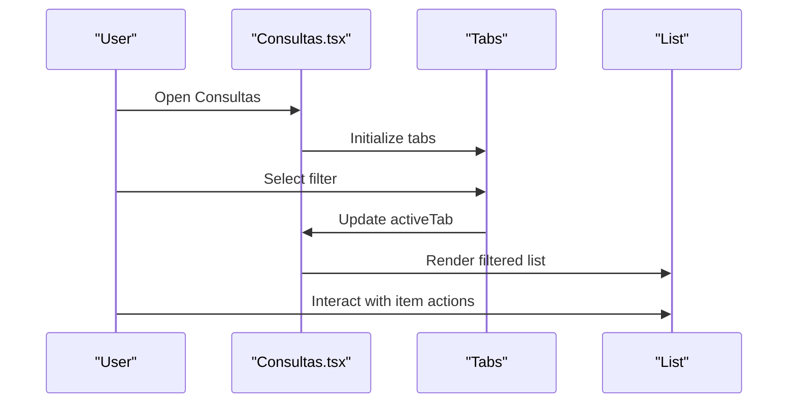

**Diagram sources**
- [src/pages/Consultas.tsx:77-230](file://NexaMed-Frontend/src/pages/Consultas.tsx#L77-L230)

**Section sources**
- [src/pages/Consultas.tsx:1-231](file://NexaMed-Frontend/src/pages/Consultas.tsx#L1-L231)

### Order Management
The orders module categorizes requests by type (laboratory, imaging, interconsultation) and tracks status with appropriate visual indicators. It provides summary cards, filtering, and actions such as marking as completed or canceling.

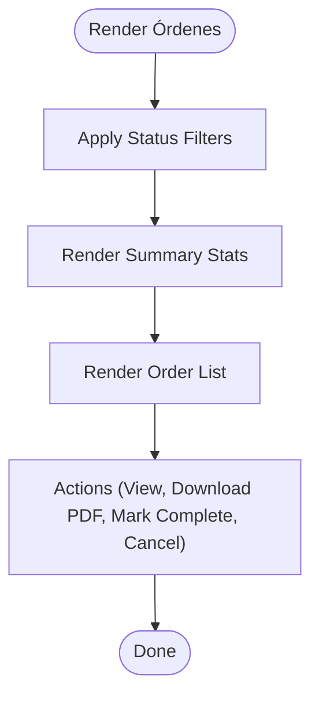

**Diagram sources**
- [src/pages/Ordenes.tsx:81-308](file://NexaMed-Frontend/src/pages/Ordenes.tsx#L81-L308)

**Section sources**
- [src/pages/Ordenes.tsx:1-309](file://NexaMed-Frontend/src/pages/Ordenes.tsx#L1-L309)

### Appointment Scheduling
The agenda integrates a month-view calendar with a daily schedule panel. Users can navigate months, select a date, and manage appointments with status badges and action menus.

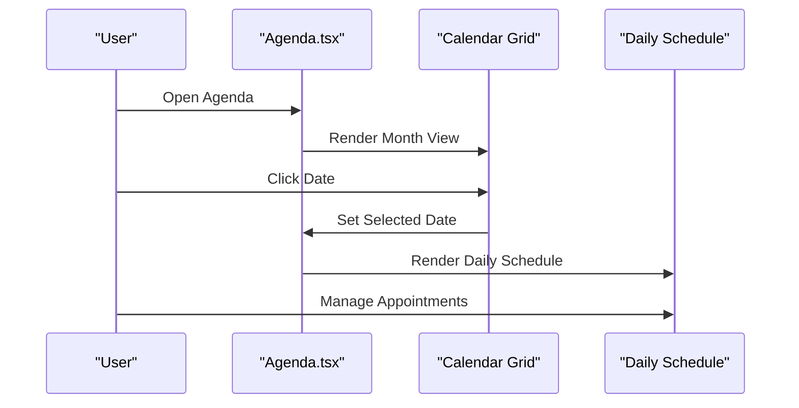

**Diagram sources**
- [src/pages/Agenda.tsx:34-177](file://NexaMed-Frontend/src/pages/Agenda.tsx#L34-L177)

**Section sources**
- [src/pages/Agenda.tsx:1-178](file://NexaMed-Frontend/src/pages/Agenda.tsx#L1-L178)

### Data Models and Utilities
TypeScript models define the domain entities for users, clinics, patients, consultations, vital signs, medical orders, files, appointments, subscriptions, and dashboard statistics. Utility functions centralize formatting, age calculation, and ID generation, ensuring consistent behavior across components.

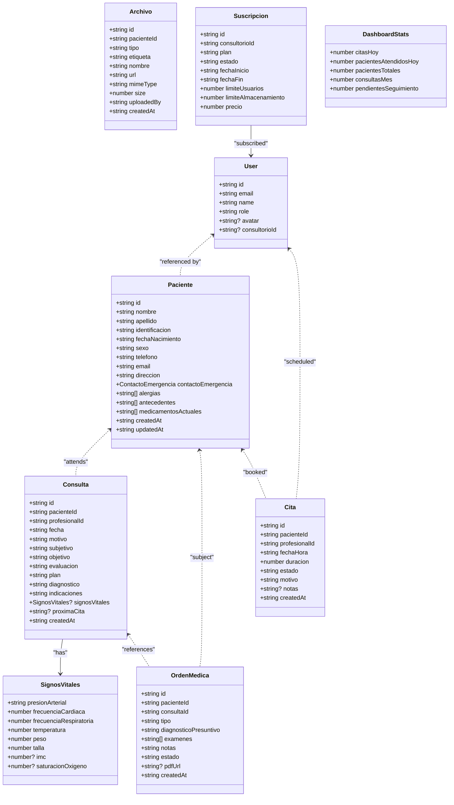

**Diagram sources**
- [src/types/index.ts:1-128](file://NexaMed-Frontend/src/types/index.ts#L1-L128)

**Section sources**
- [src/types/index.ts:1-128](file://NexaMed-Frontend/src/types/index.ts#L1-L128)
- [src/lib/utils.ts:8-44](file://NexaMed-Frontend/src/lib/utils.ts#L8-L44)

## Dependency Analysis
NexaMed leverages a curated set of libraries to deliver a robust, accessible, and visually consistent experience:
- React and React DOM for component rendering and DOM management
- React Router for declarative client-side routing
- Radix UI primitives for accessible, headless components (dialogs, dropdowns, tabs, etc.)
- Lucide React for a comprehensive, medical-themed iconography
- Tailwind CSS with custom animations and a dedicated medical color palette
- date-fns for internationalized date formatting and manipulation
- Recharts for lightweight data visualization in analytics contexts

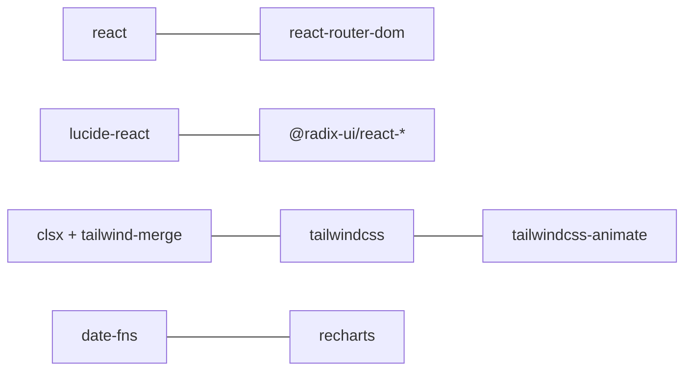

**Diagram sources**
- [package.json:12-32](file://NexaMed-Frontend/package.json#L12-L32)

**Section sources**
- [package.json:1-49](file://NexaMed-Frontend/package.json#L1-L49)

## Performance Considerations
- Component-level animations: The layout and pages utilize subtle fade and slide transitions to enhance perceived performance and reduce jarring UI shifts.
- Minimal re-renders: Pages rely on local state for filters and tabs, keeping updates scoped and predictable.
- Utility functions: Centralized formatting and ID generation avoid duplication and reduce bundle overhead.
- Tailwind utilities: Utility-first CSS minimizes custom styles and promotes reuse, aiding maintainability and build performance.

[No sources needed since this section provides general guidance]

## Troubleshooting Guide
Common issues and resolutions:
- Routing problems: Verify route definitions and ensure the layout wrapper is applied to protected pages.
- Styling inconsistencies: Confirm Tailwind content paths and custom color tokens are correctly configured.
- Date formatting errors: Ensure date-fns locale is imported and used consistently for localized outputs.
- Missing icons: Validate Lucide React installation and icon usage within components.

**Section sources**
- [tailwind.config.ts:5-103](file://NexaMed-Frontend/tailwind.config.ts#L5-L103)
- [src/lib/utils.ts:8-26](file://NexaMed-Frontend/src/lib/utils.ts#L8-L26)

## Conclusion
NexaMed delivers a focused, medical-centered clinic management solution built on a modern React + TypeScript + Vite foundation. Its modular pages, shared layout, and strong typing enable efficient development and maintenance. By digitizing traditional workflows—patient registration, scheduling, clinical documentation, order management, and administration—the system empowers private practices and clinics to operate more efficiently while maintaining a professional, familiar interface for healthcare teams.