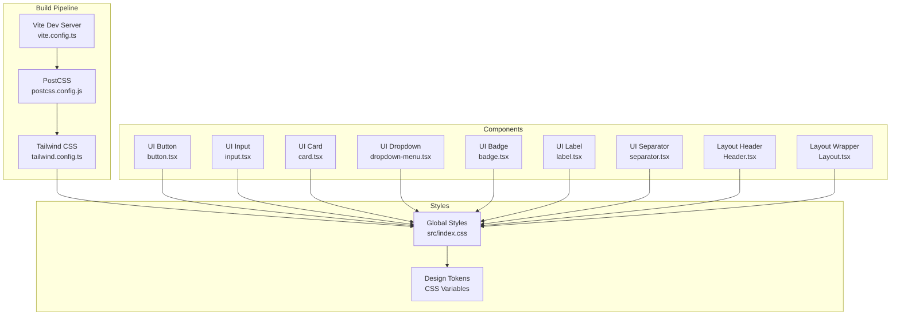
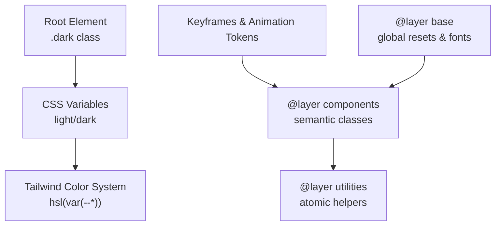
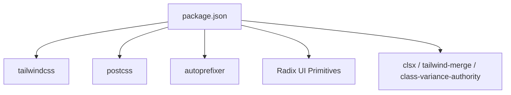

# Styling and Theming

<cite>
**Referenced Files in This Document**
- [tailwind.config.ts](file://NexaMed-Frontend/tailwind.config.ts)
- [index.css](file://NexaMed-Frontend/src/index.css)
- [postcss.config.js](file://NexaMed-Frontend/postcss.config.js)
- [package.json](file://NexaMed-Frontend/package.json)
- [vite.config.ts](file://NexaMed-Frontend/vite.config.ts)
- [utils.ts](file://NexaMed-Frontend/src/lib/utils.ts)
- [button.tsx](file://NexaMed-Frontend/src/components/ui/button.tsx)
- [input.tsx](file://NexaMed-Frontend/src/components/ui/input.tsx)
- [card.tsx](file://NexaMed-Frontend/src/components/ui/card.tsx)
- [dropdown-menu.tsx](file://NexaMed-Frontend/src/components/ui/dropdown-menu.tsx)
- [badge.tsx](file://NexaMed-Frontend/src/components/ui/badge.tsx)
- [label.tsx](file://NexaMed-Frontend/src/components/ui/label.tsx)
- [separator.tsx](file://NexaMed-Frontend/src/components/ui/separator.tsx)
- [Header.tsx](file://NexaMed-Frontend/src/components/layout/Header.tsx)
- [Layout.tsx](file://NexaMed-Frontend/src/components/layout/Layout.tsx)
</cite>

## Table of Contents
1. [Introduction](#introduction)
2. [Project Structure](#project-structure)
3. [Core Components](#core-components)
4. [Architecture Overview](#architecture-overview)
5. [Detailed Component Analysis](#detailed-component-analysis)
6. [Dependency Analysis](#dependency-analysis)
7. [Performance Considerations](#performance-considerations)
8. [Troubleshooting Guide](#troubleshooting-guide)
9. [Conclusion](#conclusion)
10. [Appendices](#appendices)

## Introduction
This document describes NexaMed’s styling and theming system built with Tailwind CSS, PostCSS, and Vite. It explains the Tailwind configuration, the custom medical-themed color palette, animations, and responsive patterns. It also documents utility class usage, component styling approaches, theme customization, accessibility considerations, and best practices for extending the design system. The CSS architecture is organized into layers (base, components, utilities), and global styles are defined via CSS custom properties for light and dark modes.

## Project Structure
The styling pipeline is configured through Tailwind and PostCSS, processed by Vite during development and build. Global styles and design tokens live in a single CSS file, while individual UI components encapsulate reusable styling patterns.

**Diagram sources**
- [vite.config.ts:1-13](file://NexaMed-Frontend/vite.config.ts#L1-L13)
- [postcss.config.js:1-7](file://NexaMed-Frontend/postcss.config.js#L1-L7)
- [tailwind.config.ts:1-103](file://NexaMed-Frontend/tailwind.config.ts#L1-L103)
- [index.css:1-191](file://NexaMed-Frontend/src/index.css#L1-L191)
- [button.tsx:1-54](file://NexaMed-Frontend/src/components/ui/button.tsx#L1-L54)
- [input.tsx:1-25](file://NexaMed-Frontend/src/components/ui/input.tsx#L1-L25)
- [card.tsx:1-76](file://NexaMed-Frontend/src/components/ui/card.tsx#L1-L76)
- [dropdown-menu.tsx:1-190](file://NexaMed-Frontend/src/components/ui/dropdown-menu.tsx#L1-L190)
- [badge.tsx:1-42](file://NexaMed-Frontend/src/components/ui/badge.tsx#L1-L42)
- [label.tsx:1-24](file://NexaMed-Frontend/src/components/ui/label.tsx#L1-L24)
- [separator.tsx:1-29](file://NexaMed-Frontend/src/components/ui/separator.tsx#L1-L29)
- [Header.tsx:1-84](file://NexaMed-Frontend/src/components/layout/Header.tsx#L1-L84)
- [Layout.tsx:1-35](file://NexaMed-Frontend/src/components/layout/Layout.tsx#L1-L35)

**Section sources**
- [vite.config.ts:1-13](file://NexaMed-Frontend/vite.config.ts#L1-L13)
- [postcss.config.js:1-7](file://NexaMed-Frontend/postcss.config.js#L1-L7)
- [tailwind.config.ts:1-103](file://NexaMed-Frontend/tailwind.config.ts#L1-L103)
- [index.css:1-191](file://NexaMed-Frontend/src/index.css#L1-L191)

## Core Components
- Tailwind configuration defines content scanning, semantic color tokens, border radius tokens, keyframes, and animations. It enables the animation plugin and sets dark mode to class-based targeting.
- Global CSS establishes design tokens via CSS variables in both light and dark modes, plus layered styles for base, components, and utilities.
- Utility helpers unify class merging and formatting across components.

Key highlights:
- Dark mode via class targeting and semantic variable swapping.
- Medical-themed palette with 50–950 shades for consistent clinical branding.
- Component-level variants and transitions for interactive states.
- Utility functions for robust class composition.

**Section sources**
- [tailwind.config.ts:1-103](file://NexaMed-Frontend/tailwind.config.ts#L1-L103)
- [index.css:1-191](file://NexaMed-Frontend/src/index.css#L1-L191)
- [utils.ts:1-44](file://NexaMed-Frontend/src/lib/utils.ts#L1-L44)

## Architecture Overview
The styling architecture follows a layered approach:
- Base layer: global resets, typography, and root tokens.
- Components layer: reusable component styles and semantic class names.
- Utilities layer: atomic animation and transition helpers.

Design tokens are centralized in CSS variables and consumed by Tailwind’s color system. Dark mode toggles variables under a class applied to the document root.

**Diagram sources**
- [index.css:5-99](file://NexaMed-Frontend/src/index.css#L5-L99)
- [tailwind.config.ts:11-98](file://NexaMed-Frontend/tailwind.config.ts#L11-L98)

**Section sources**
- [index.css:1-191](file://NexaMed-Frontend/src/index.css#L1-L191)
- [tailwind.config.ts:1-103](file://NexaMed-Frontend/tailwind.config.ts#L1-L103)

## Detailed Component Analysis

### Tailwind Configuration
- Content scanning targets pages, components, app, and src directories.
- Theme extension:
  - Semantic color tokens mapped to CSS variables.
  - Border radius tokens derived from a shared radius variable.
  - Keyframes for accordion, fade-in, and slide-in.
  - Animation tokens bound to keyframes with easing and durations.
- Plugins include the animation plugin.

Best practices:
- Keep content globs aligned with component locations to avoid unused CSS.
- Centralize color tokens in CSS variables for maintainable light/dark switching.

**Section sources**
- [tailwind.config.ts:1-103](file://NexaMed-Frontend/tailwind.config.ts#L1-L103)

### Global Styles and Design Tokens
- Light and dark mode roots define semantic tokens for background, foreground, borders, rings, and the medical palette.
- Medical palette spans 50 to 950 for consistent brand application.
- Semantic tokens for success, warning, and info states.
- Shadow and transition tokens for elevations and motion.
- Gradient tokens for primary, subtle, and card backgrounds.
- Base layer applies border defaults, smooth scrolling, and font stack.
- Components layer defines reusable classes:
  - Gradient utilities and elegant shadows.
  - Text gradient effect.
  - Hover effects for cards.
  - Primary button styling with medical palette.
  - Input styling with medical-focused focus states.
  - Sidebar item active/inactive states.
  - Stat card layout and page header/title/description styles.
- Utilities layer exposes animation helpers bound to keyframes.

Accessibility and consistency:
- Use semantic tokens (primary, secondary, destructive) for roles.
- Prefer medical palette for clinical emphasis and warnings.
- Maintain contrast ratios against background/foreground tokens.

**Section sources**
- [index.css:5-99](file://NexaMed-Frontend/src/index.css#L5-L99)
- [index.css:117-191](file://NexaMed-Frontend/src/index.css#L117-L191)

### Utility Functions
- Class merging helper composes Tailwind classes safely.
- Formatting helpers for dates and ages support consistent data presentation.

Usage:
- Apply to component props to merge dynamic and static classes.
- Use for computed values and conditional styling.

**Section sources**
- [utils.ts:1-44](file://NexaMed-Frontend/src/lib/utils.ts#L1-L44)

### Button Component
- Variants include default, destructive, outline, secondary, ghost, link, and a dedicated medical variant.
- Sizes cover default, small, large, and icon.
- Focus and hover states leverage ring and shadow tokens.
- Uses class variance authority for variant composition and the class merging utility.

Guidelines:
- Prefer the medical variant for primary actions aligned with the clinical brand.
- Use destructive for negative actions and outline for secondary actions.

**Section sources**
- [button.tsx:1-54](file://NexaMed-Frontend/src/components/ui/button.tsx#L1-L54)

### Input Component
- Inherits base input styling with focus-visible ring and transition.
- Background and placeholder tokens ensure readability across themes.

Guidelines:
- Combine with medical-focused classes for form controls requiring clinical emphasis.

**Section sources**
- [input.tsx:1-25](file://NexaMed-Frontend/src/components/ui/input.tsx#L1-L25)

### Card Component Family
- Card container with border, background, and transition.
- CardHeader, CardTitle, CardDescription, CardContent, CardFooter provide structured composition.
- Consistent spacing and typography tokens.

Guidelines:
- Use for content grouping and stat cards with hover elevation.

**Section sources**
- [card.tsx:1-76](file://NexaMed-Frontend/src/components/ui/card.tsx#L1-L76)

### Dropdown Menu Component
- Implements Radix UI primitives with Tailwind classes.
- Uses animation tokens for open/close transitions and directional slide-ins.
- Focus and hover states rely on accent and foreground tokens.

Guidelines:
- Apply to menus requiring nested submenus and keyboard navigation.

**Section sources**
- [dropdown-menu.tsx:1-190](file://NexaMed-Frontend/src/components/ui/dropdown-menu.tsx#L1-L190)

### Badge Component
- Variants for default, secondary, destructive, outline, plus semantic success, warning, and info.
- Uses ring and shadow tokens for focus and elevation.

Guidelines:
- Use semantic badges for statuses and contextual information.

**Section sources**
- [badge.tsx:1-42](file://NexaMed-Frontend/src/components/ui/badge.tsx#L1-L42)

### Label Component
- Lightweight primitive wrapper with variant support.
- Focus and disabled states handled via peer utilities.

Guidelines:
- Pair with form controls for accessible labeling.

**Section sources**
- [label.tsx:1-24](file://NexaMed-Frontend/src/components/ui/label.tsx#L1-L24)

### Separator Component
- Horizontal or vertical orientation with border token.
- Minimal markup with consistent sizing.

Guidelines:
- Use for content dividers within cards and lists.

**Section sources**
- [separator.tsx:1-29](file://NexaMed-Frontend/src/components/ui/separator.tsx#L1-L29)

### Layout and Header Integration
- Layout manages sidebar collapse state and content margin transitions.
- Header integrates search input, notifications, and user menu with consistent spacing and tokens.
- Medical palette accents for notification indicators and avatar fallbacks.

Guidelines:
- Keep header content constrained and responsive using grid/flex utilities.

**Section sources**
- [Layout.tsx:1-35](file://NexaMed-Frontend/src/components/layout/Layout.tsx#L1-L35)
- [Header.tsx:1-84](file://NexaMed-Frontend/src/components/layout/Header.tsx#L1-L84)

## Dependency Analysis
The styling system depends on Tailwind and PostCSS, orchestrated by Vite. Dependencies include Radix UI primitives for accessible interactions and utility libraries for class composition.

**Diagram sources**
- [package.json:12-47](file://NexaMed-Frontend/package.json#L12-L47)

**Section sources**
- [package.json:1-49](file://NexaMed-Frontend/package.json#L1-L49)

## Performance Considerations
- Keep content globs precise to minimize scanned files and reduce build size.
- Prefer component-level variants and shared tokens to reduce duplication.
- Use animation tokens sparingly; long-running animations can impact performance.
- Consolidate utility classes with the merging helper to avoid redundant Tailwind rules.

## Troubleshooting Guide
Common issues and resolutions:
- Missing animations: Ensure the animation plugin is enabled and keyframes are defined.
- Dark mode not applying: Verify the dark class is toggled on the root element and CSS variables are present.
- Inconsistent colors: Confirm semantic tokens are used instead of hardcoded values.
- Excessive CSS: Narrow content globs and remove unused variants.

**Section sources**
- [tailwind.config.ts:99](file://NexaMed-Frontend/tailwind.config.ts#L99)
- [index.css:66-99](file://NexaMed-Frontend/src/index.css#L66-L99)

## Conclusion
NexaMed’s styling system leverages Tailwind’s utility-first approach with a cohesive set of design tokens, a custom medical palette, and layered CSS for scalability. By centralizing tokens, using component variants, and following accessibility guidelines, teams can maintain consistency and extend the design system effectively.

## Appendices

### Tailwind Configuration Reference
- Content scanning paths
- Semantic color tokens
- Border radius tokens
- Keyframes and animation tokens
- Plugin activation

**Section sources**
- [tailwind.config.ts:1-103](file://NexaMed-Frontend/tailwind.config.ts#L1-L103)

### Global Tokens Reference
- Light and dark mode variables
- Medical palette scale
- Semantic tokens (success, warning, info)
- Shadows and transitions
- Gradient tokens

**Section sources**
- [index.css:5-99](file://NexaMed-Frontend/src/index.css#L5-L99)

### Component Styling Patterns
- Variants and sizes for buttons and badges
- Composition with utility classes
- Accessible interactions with Radix UI

**Section sources**
- [button.tsx:1-54](file://NexaMed-Frontend/src/components/ui/button.tsx#L1-L54)
- [badge.tsx:1-42](file://NexaMed-Frontend/src/components/ui/badge.tsx#L1-L42)
- [dropdown-menu.tsx:1-190](file://NexaMed-Frontend/src/components/ui/dropdown-menu.tsx#L1-L190)