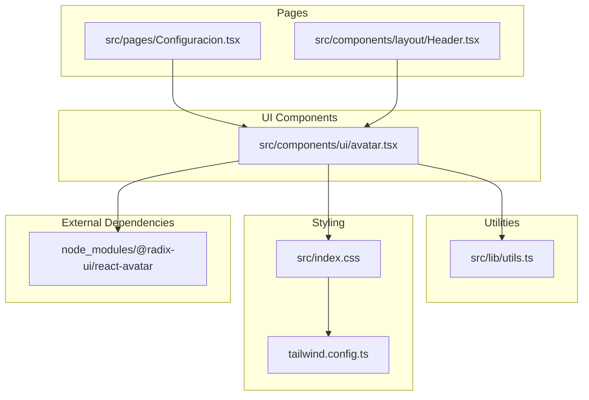
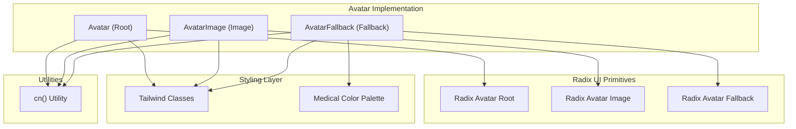
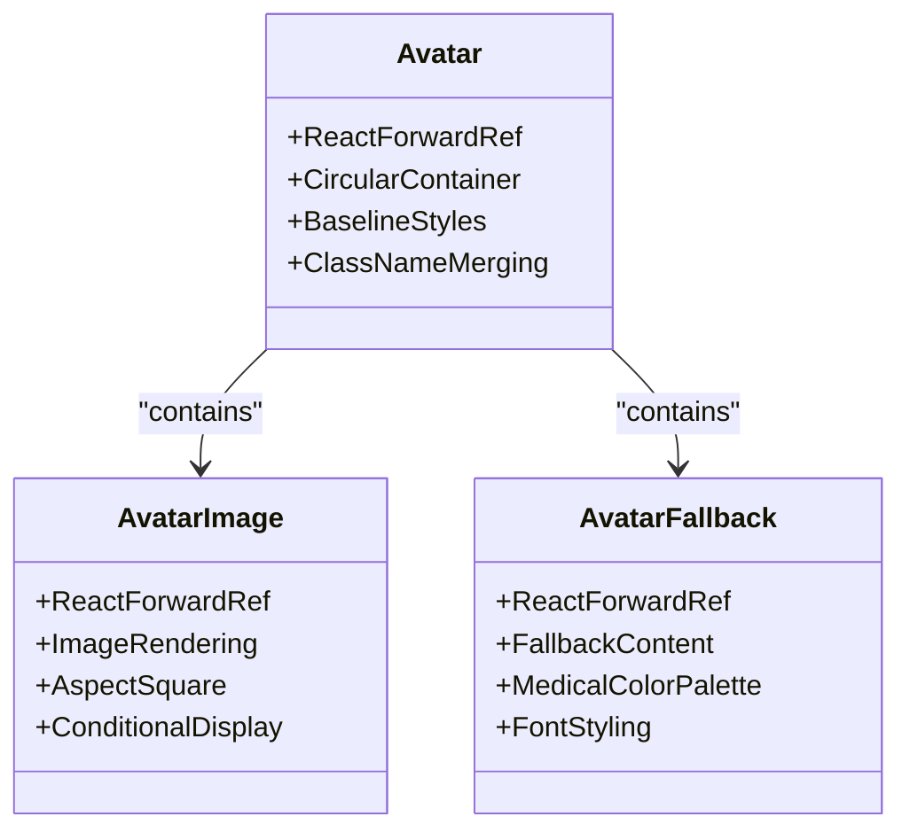
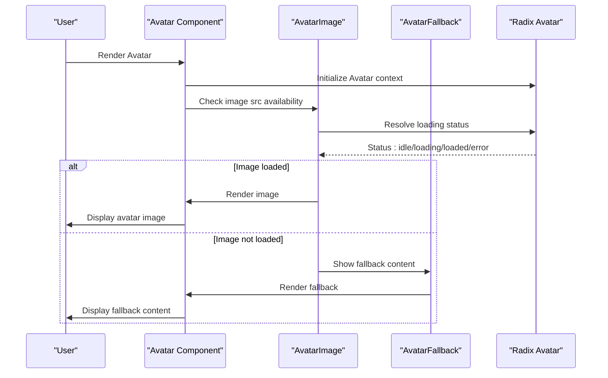
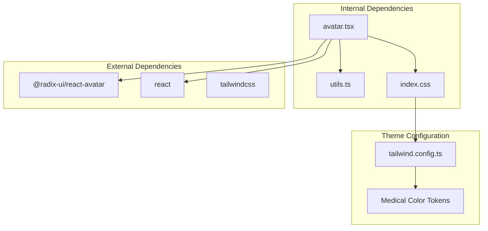

# Avatar Component

<cite>
**Referenced Files in This Document**
- [avatar.tsx](file://src/components/ui/avatar.tsx)
- [Configuracion.tsx](file://src/pages/Configuracion.tsx)
- [Header.tsx](file://src/components/layout/Header.tsx)
- [utils.ts](file://src/lib/utils.ts)
- [index.css](file://src/index.css)
- [tailwind.config.ts](file://tailwind.config.ts)
- [index.js (Radix Avatar)](file://node_modules/@radix-ui/react-avatar/dist/index.js)
</cite>

## Table of Contents
1. [Introduction](#introduction)
2. [Project Structure](#project-structure)
3. [Core Components](#core-components)
4. [Architecture Overview](#architecture-overview)
5. [Detailed Component Analysis](#detailed-component-analysis)
6. [Dependency Analysis](#dependency-analysis)
7. [Performance Considerations](#performance-considerations)
8. [Troubleshooting Guide](#troubleshooting-guide)
9. [Conclusion](#conclusion)
10. [Appendices](#appendices)

## Introduction
This document provides comprehensive documentation for the Avatar component used in the NexaMed frontend. It covers component variants, sizing, image handling, fallback mechanisms, integration with user profiles, accessibility features, and best practices for medical applications. The Avatar component is built using Radix UI primitives and styled with Tailwind CSS, ensuring consistent behavior and appearance across the application.

## Project Structure
The Avatar component is located under the UI components directory and integrates with utility functions and theme configuration. The component is used in profile-related pages and the application header.

**Diagram sources**
- [avatar.tsx:1-47](file://src/components/ui/avatar.tsx#L1-L47)
- [Configuracion.tsx:16-70](file://src/pages/Configuracion.tsx#L16-L70)
- [Header.tsx:1-20](file://src/components/layout/Header.tsx#L1-L20)
- [utils.ts:1-200](file://src/lib/utils.ts#L1-L200)
- [index.css:1-47](file://src/index.css#L1-L47)
- [tailwind.config.ts:45-87](file://tailwind.config.ts#L45-L87)

**Section sources**
- [avatar.tsx:1-47](file://src/components/ui/avatar.tsx#L1-L47)
- [Configuracion.tsx:16-70](file://src/pages/Configuracion.tsx#L16-L70)
- [Header.tsx:1-20](file://src/components/layout/Header.tsx#L1-L20)

## Core Components
The Avatar component consists of three primary parts:
- Avatar: The container that establishes the circular clipping area and baseline styles.
- AvatarImage: The image element that renders the user's avatar when available.
- AvatarFallback: The fallback content shown while the image is loading or unavailable.

Key characteristics:
- Circular clipping via rounded-full ensures avatar images appear as circles.
- Aspect ratio control via aspect-square maintains square image proportions inside the circular frame.
- Medical-themed fallback styling using the medical color palette for professional appearance.

Usage examples in the codebase demonstrate:
- Basic avatar with fallback text for initials.
- Integration with profile editing forms.
- Placement in the application header for user context.

**Section sources**
- [avatar.tsx:5-45](file://src/components/ui/avatar.tsx#L5-L45)
- [Configuracion.tsx:60-75](file://src/pages/Configuracion.tsx#L60-L75)
- [Header.tsx:1-20](file://src/components/layout/Header.tsx#L1-L20)

## Architecture Overview
The Avatar component leverages Radix UI primitives for robust accessibility and predictable behavior. The implementation wraps Radix components and applies Tailwind classes for consistent styling. Utility functions manage class merging, and the theme configuration provides semantic color tokens for medical branding.

**Diagram sources**
- [avatar.tsx:5-45](file://src/components/ui/avatar.tsx#L5-L45)
- [index.css:28-40](file://src/index.css#L28-L40)
- [tailwind.config.ts:54-66](file://tailwind.config.ts#L54-L66)
- [utils.ts:1-200](file://src/lib/utils.ts#L1-L200)

**Section sources**
- [avatar.tsx:1-47](file://src/components/ui/avatar.tsx#L1-L47)
- [index.css:28-40](file://src/index.css#L28-L40)
- [tailwind.config.ts:54-66](file://tailwind.config.ts#L54-L66)

## Detailed Component Analysis

### Component Structure and Responsibilities
The Avatar component is structured as a composition of three parts, each with distinct responsibilities:

**Diagram sources**
- [avatar.tsx:5-45](file://src/components/ui/avatar.tsx#L5-L45)

### Image Loading and Fallback Mechanisms
The component integrates with Radix UI's Avatar primitives to handle image loading states and fallback rendering. The loading lifecycle is managed internally, transitioning between idle, loading, loaded, and error states.

**Diagram sources**
- [avatar.tsx:5-45](file://src/components/ui/avatar.tsx#L5-L45)
- [index.js (Radix Avatar):1-200](file://node_modules/@radix-ui/react-avatar/dist/index.js#L1-L200)

### Accessibility Features
The Avatar component inherits accessibility benefits from Radix UI primitives:
- Semantic role and structure for screen readers
- Keyboard navigable contexts
- Focus management within avatar groups
- Proper ARIA attributes for dynamic content

Integration points:
- Avatar groups maintain consistent focus order
- Fallback content remains accessible during loading delays
- Image alt text should be provided when displaying user photos

**Section sources**
- [avatar.tsx:1-47](file://src/components/ui/avatar.tsx#L1-L47)
- [index.js (Radix Avatar):1-200](file://node_modules/@radix-ui/react-avatar/dist/index.js#L1-L200)

### Usage Examples and Configuration Patterns
The component is used in two primary contexts within the application:

1. Profile Settings Page
- Avatar with fallback initials for user profile editing
- Integration with upload controls and form layouts
- Responsive spacing and alignment within grid layouts

2. Application Header
- Compact avatar representation in navigation context
- Consistent sizing and styling with header elements
- Contextual user identification in toolbar layouts

Configuration patterns demonstrated:
- Basic avatar with minimal props
- Avatar with custom className overrides
- Avatar with fallback content for initials or icons
- Integration with form controls and buttons

**Section sources**
- [Configuracion.tsx:60-75](file://src/pages/Configuracion.tsx#L60-L75)
- [Header.tsx:1-20](file://src/components/layout/Header.tsx#L1-L20)

### Responsive Behavior
The Avatar component maintains consistent responsive behavior through:
- Fixed size classes (h-10, w-10) for standard avatar dimensions
- Aspect-ratio control ensuring square images fit within circular bounds
- Flexible container behavior with shrink-to-fit properties
- Tailwind utility classes enabling responsive scaling across breakpoints

Responsive considerations:
- Maintain aspect ratio regardless of container size
- Preserve circular clipping on smaller screens
- Ensure fallback content remains centered and readable
- Support dark mode and theme switching without visual regressions

**Section sources**
- [avatar.tsx:11-14](file://src/components/ui/avatar.tsx#L11-L14)
- [avatar.tsx:26-27](file://src/components/ui/avatar.tsx#L26-L27)
- [avatar.tsx:39-41](file://src/components/ui/avatar.tsx#L39-L41)

## Dependency Analysis
The Avatar component has a focused dependency graph with clear boundaries:

**Diagram sources**
- [avatar.tsx:1-47](file://src/components/ui/avatar.tsx#L1-L47)
- [utils.ts:1-200](file://src/lib/utils.ts#L1-L200)
- [index.css:28-40](file://src/index.css#L28-L40)
- [tailwind.config.ts:54-66](file://tailwind.config.ts#L54-L66)

Dependency characteristics:
- Low coupling with external libraries through Radix primitives
- Strong cohesion within the component implementation
- Clear separation between styling and logic
- Utilization of utility functions for consistent class merging

**Section sources**
- [avatar.tsx:1-47](file://src/components/ui/avatar.tsx#L1-L47)
- [utils.ts:1-200](file://src/lib/utils.ts#L1-L200)
- [tailwind.config.ts:54-66](file://tailwind.config.ts#L54-L66)

## Performance Considerations
Performance optimization strategies for the Avatar component:

1. Image Loading Optimization
- Lazy loading for off-screen avatars
- Efficient fallback rendering to minimize layout shifts
- Proper image sizing to avoid unnecessary bandwidth usage

2. Rendering Efficiency
- Minimal re-renders through proper prop handling
- Conditional rendering of fallback content
- Optimized class merging using utility functions

3. Memory Management
- Cleanup of event listeners in avatar image components
- Proper disposal of image resources when components unmount
- Avoidance of memory leaks in loading state management

Best practices:
- Provide appropriate alt text for accessibility
- Use efficient image formats and compression
- Implement proper error boundaries for failed image loads
- Consider implementing skeleton loading for better perceived performance

## Troubleshooting Guide
Common issues and solutions for the Avatar component:

1. Image Not Displaying
- Verify image URL validity and accessibility
- Check network connectivity and CORS policies
- Ensure proper image format support
- Confirm fallback content is visible during loading

2. Styling Issues
- Validate Tailwind class precedence and specificity
- Check for conflicting CSS overrides
- Verify theme configuration for medical color palette
- Ensure responsive breakpoints are properly configured

3. Accessibility Concerns
- Confirm proper alt text for screen readers
- Verify keyboard navigation support
- Check focus management in avatar groups
- Validate ARIA attributes for dynamic content

4. Performance Problems
- Monitor image loading performance
- Check for excessive re-renders
- Verify proper cleanup of event listeners
- Optimize fallback rendering logic

**Section sources**
- [avatar.tsx:1-47](file://src/components/ui/avatar.tsx#L1-L47)
- [index.js (Radix Avatar):1-200](file://node_modules/@radix-ui/react-avatar/dist/index.js#L1-L200)

## Conclusion
The Avatar component provides a robust, accessible, and performant solution for displaying user profiles throughout the NexaMed application. Its integration with Radix UI primitives ensures reliable behavior, while the medical-themed styling aligns with healthcare application requirements. The component's design supports both basic usage scenarios and advanced configurations, making it suitable for diverse use cases in medical applications.

Key strengths:
- Strong accessibility foundation through Radix UI
- Professional medical-themed styling
- Efficient image loading and fallback handling
- Consistent integration with Tailwind CSS utilities
- Flexible configuration options for various contexts

## Appendices

### Best Practices for Medical Applications
1. Privacy and Security
- Implement secure image storage and transmission
- Respect patient privacy in avatar display
- Use HTTPS for all image resources
- Consider anonymization for sensitive contexts

2. Accessibility Compliance
- Ensure adequate color contrast in fallback content
- Provide descriptive alt text for avatar images
- Support screen reader functionality
- Maintain keyboard navigation compatibility

3. Performance Optimization
- Implement lazy loading for avatar lists
- Use appropriate image compression
- Cache frequently accessed avatars
- Minimize layout shifts during loading

4. User Experience
- Provide clear feedback during image uploads
- Handle loading states gracefully
- Offer consistent avatar sizing across the application
- Support dark mode and theme customization

5. Integration Guidelines
- Maintain consistent avatar usage patterns
- Follow medical application design standards
- Ensure proper error handling and user feedback
- Document avatar configuration options for developers