# Badge Component

<cite>
**Referenced Files in This Document**
- [badge.tsx](file://src/components/ui/badge.tsx)
- [utils.ts](file://src/lib/utils.ts)
- [tailwind.config.ts](file://tailwind.config.ts)
- [index.css](file://src/index.css)
- [Agenda.tsx](file://src/pages/Agenda.tsx)
- [Consultas.tsx](file://src/pages/Consultas.tsx)
- [Ordenes.tsx](file://src/pages/Ordenes.tsx)
- [Pacientes.tsx](file://src/pages/Pacientes.tsx)
- [package.json](file://package.json)
</cite>

## Table of Contents
1. [Introduction](#introduction)
2. [Project Structure](#project-structure)
3. [Core Components](#core-components)
4. [Architecture Overview](#architecture-overview)
5. [Detailed Component Analysis](#detailed-component-analysis)
6. [Dependency Analysis](#dependency-analysis)
7. [Performance Considerations](#performance-considerations)
8. [Accessibility Considerations](#accessibility-considerations)
9. [Usage Examples](#usage-examples)
10. [Troubleshooting Guide](#troubleshooting-guide)
11. [Conclusion](#conclusion)

## Introduction

The Badge component is a fundamental UI element in the NexaMed healthcare application designed to display status information, labels, and metadata in a compact, visually distinct format. Built with React and Tailwind CSS, this component serves as a versatile indicator for various states and categories within the medical context, from appointment statuses to patient conditions and medical procedure types.

The component follows modern design principles with semantic color coding, responsive typography, and accessibility considerations tailored for healthcare environments where quick information processing is crucial. Its implementation leverages the class-variance-authority library for consistent styling and the cn utility function for efficient class merging.

## Project Structure

The Badge component is organized within the UI components architecture of the NexaMed frontend application:

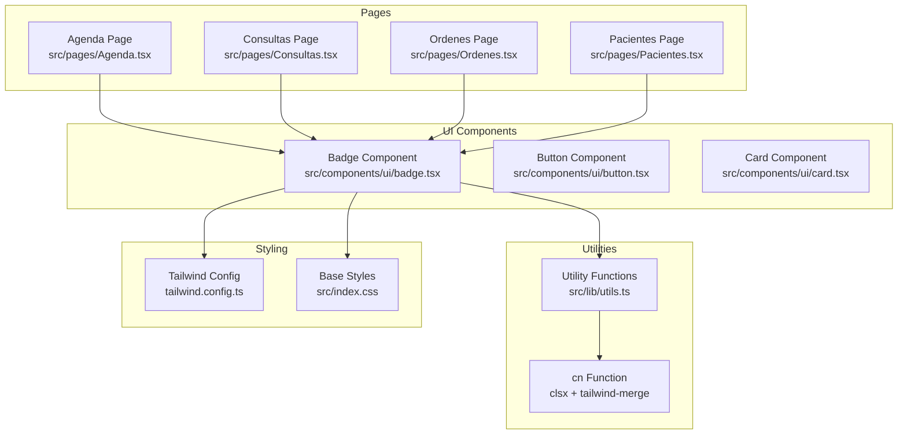

**Diagram sources**
- [badge.tsx:1-42](file://src/components/ui/badge.tsx#L1-L42)
- [utils.ts:1-44](file://src/lib/utils.ts#L1-L44)
- [tailwind.config.ts:1-103](file://tailwind.config.ts#L1-L103)
- [index.css:1-191](file://src/index.css#L1-L191)

**Section sources**
- [badge.tsx:1-42](file://src/components/ui/badge.tsx#L1-L42)
- [utils.ts:1-44](file://src/lib/utils.ts#L1-L44)
- [tailwind.config.ts:1-103](file://tailwind.config.ts#L1-L103)
- [index.css:1-191](file://src/index.css#L1-L191)

## Core Components

The Badge component consists of several key elements that work together to provide a flexible and accessible status indicator:

### Component Architecture

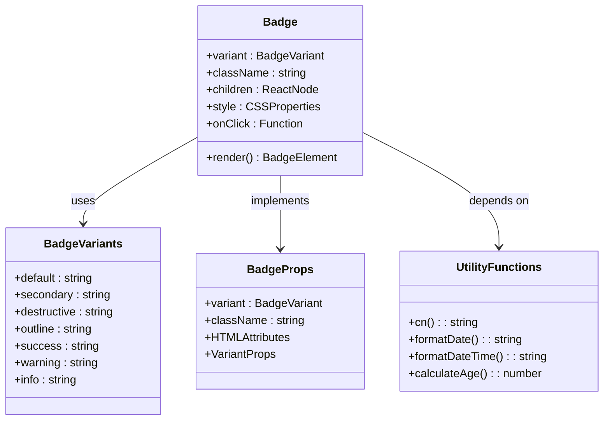

**Diagram sources**
- [badge.tsx:31-41](file://src/components/ui/badge.tsx#L31-L41)
- [badge.tsx:5-29](file://src/components/ui/badge.tsx#L5-L29)
- [utils.ts:4-6](file://src/lib/utils.ts#L4-L6)

### Variant System

The Badge component supports seven distinct variants, each designed for specific use cases within the medical domain:

| Variant | Purpose | Color Scheme | Usage Context |
|---------|---------|--------------|---------------|
| `default` | Primary status indicators | Primary color palette | General statuses, default selections |
| `secondary` | Supporting information | Secondary color palette | Additional details, supporting data |
| `destructive` | Critical/error states | Destructive/red palette | Critical conditions, errors, cancellations |
| `outline` | Neutral/neutral emphasis | Foreground color only | Categories, classifications, neutral states |
| `success` | Positive outcomes | Emerald/green palette | Completed actions, positive results |
| `warning` | Cautionary information | Amber/yellow palette | Pending states, warnings, pending actions |
| `info` | Informative content | Sky/blue palette | Informational messages, guidance |

**Section sources**
- [badge.tsx:8-27](file://src/components/ui/badge.tsx#L8-L27)
- [tailwind.config.ts:20-66](file://tailwind.config.ts#L20-L66)
- [index.css:28-44](file://src/index.css#L28-L44)

## Architecture Overview

The Badge component integrates seamlessly with the broader NexaMed application architecture through a well-defined pattern of composition and styling:

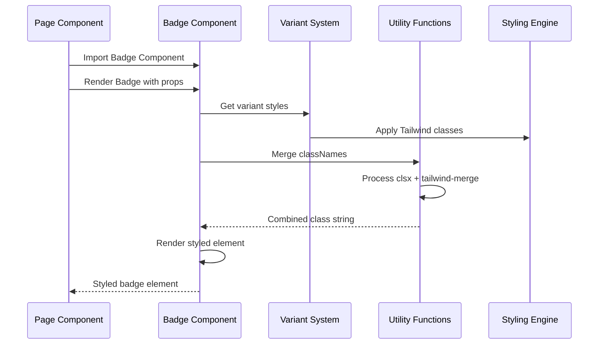

**Diagram sources**
- [badge.tsx:35-39](file://src/components/ui/badge.tsx#L35-L39)
- [badge.tsx:5-29](file://src/components/ui/badge.tsx#L5-L29)
- [utils.ts:4-6](file://src/lib/utils.ts#L4-L6)

### Styling Architecture

The component's styling system is built on a layered approach that ensures consistency and maintainability:

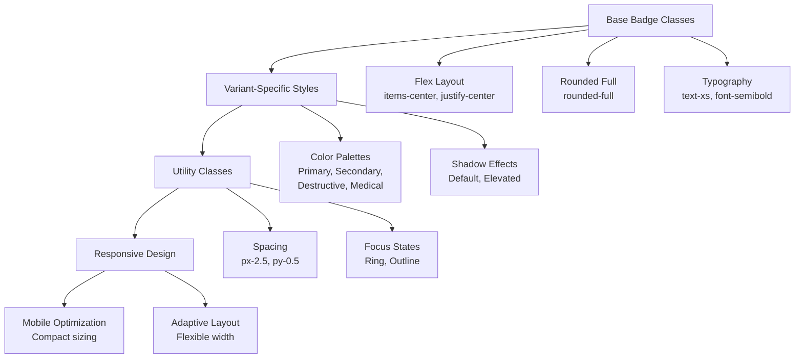

**Diagram sources**
- [badge.tsx:5-6](file://src/components/ui/badge.tsx#L5-L6)
- [index.css:28-44](file://src/index.css#L28-L44)
- [tailwind.config.ts:20-66](file://tailwind.config.ts#L20-L66)

**Section sources**
- [badge.tsx:1-42](file://src/components/ui/badge.tsx#L1-L42)
- [index.css:1-191](file://src/index.css#L1-L191)
- [tailwind.config.ts:1-103](file://tailwind.config.ts#L1-L103)

## Detailed Component Analysis

### Implementation Details

The Badge component is implemented using React's functional component pattern with TypeScript for type safety and enhanced developer experience:

#### Core Implementation Pattern

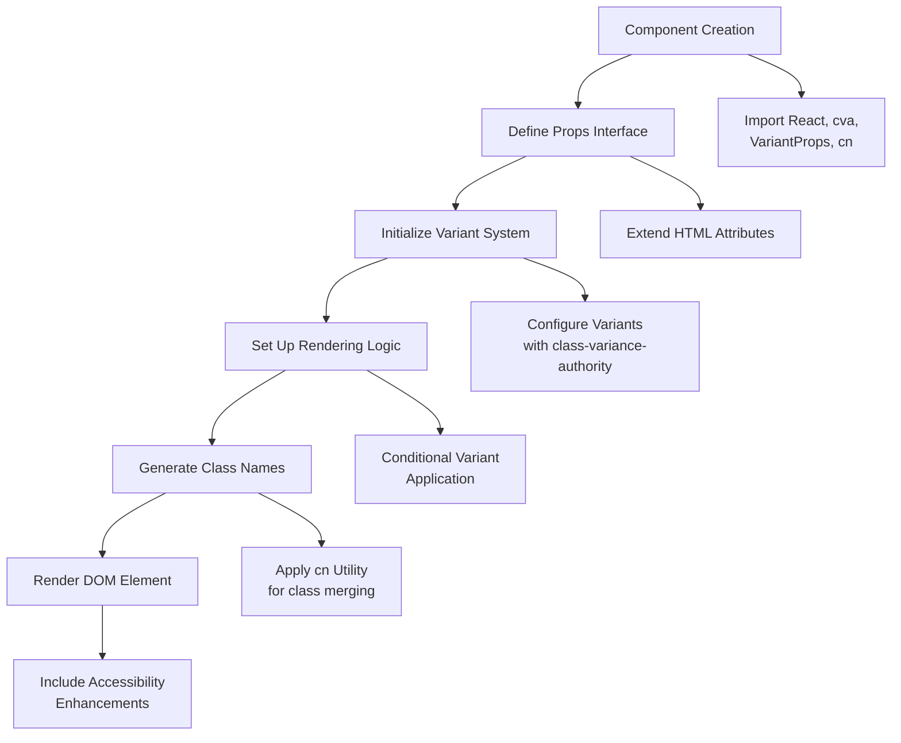

**Diagram sources**
- [badge.tsx:1-3](file://src/components/ui/badge.tsx#L1-L3)
- [badge.tsx:31-33](file://src/components/ui/badge.tsx#L31-L33)
- [badge.tsx:5-29](file://src/components/ui/badge.tsx#L5-L29)
- [badge.tsx:35-39](file://src/components/ui/badge.tsx#L35-L39)

#### Variant Configuration Analysis

The variant system utilizes class-variance-authority for dynamic styling based on component props:

| Property | Default Value | Secondary | Destructive | Outline | Success | Warning | Info |
|----------|---------------|-----------|-------------|---------|---------|---------|------|
| Background | Primary | Secondary | Destructive | Transparent | Emerald 100 | Amber 100 | Sky 100 |
| Text Color | Primary Foreground | Secondary Foreground | Destructive Foreground | Foreground | Emerald 700 | Amber 700 | Sky 700 |
| Border | Transparent | Transparent | Transparent | Foreground | Transparent | Transparent | Transparent |
| Hover Effect | Primary 80% | Secondary 80% | Destructive 80% | None | Emerald 200 | Amber 200 | Sky 200 |
| Shadow | Default | None | None | None | None | None | None |

**Section sources**
- [badge.tsx:5-29](file://src/components/ui/badge.tsx#L5-L29)
- [tailwind.config.ts:20-66](file://tailwind.config.ts#L20-L66)
- [index.css:28-44](file://src/index.css#L28-L44)

### Color Palette Integration

The Badge component integrates with the comprehensive medical-themed color palette established for the NexaMed application:

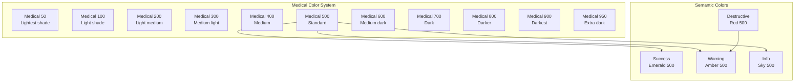

**Diagram sources**
- [index.css:28-44](file://src/index.css#L28-L44)
- [tailwind.config.ts:54-66](file://tailwind.config.ts#L54-L66)

**Section sources**
- [index.css:28-44](file://src/index.css#L28-L44)
- [tailwind.config.ts:54-66](file://tailwind.config.ts#L54-L66)

## Dependency Analysis

The Badge component has a minimal but strategic set of dependencies that contribute to its functionality and maintainability:

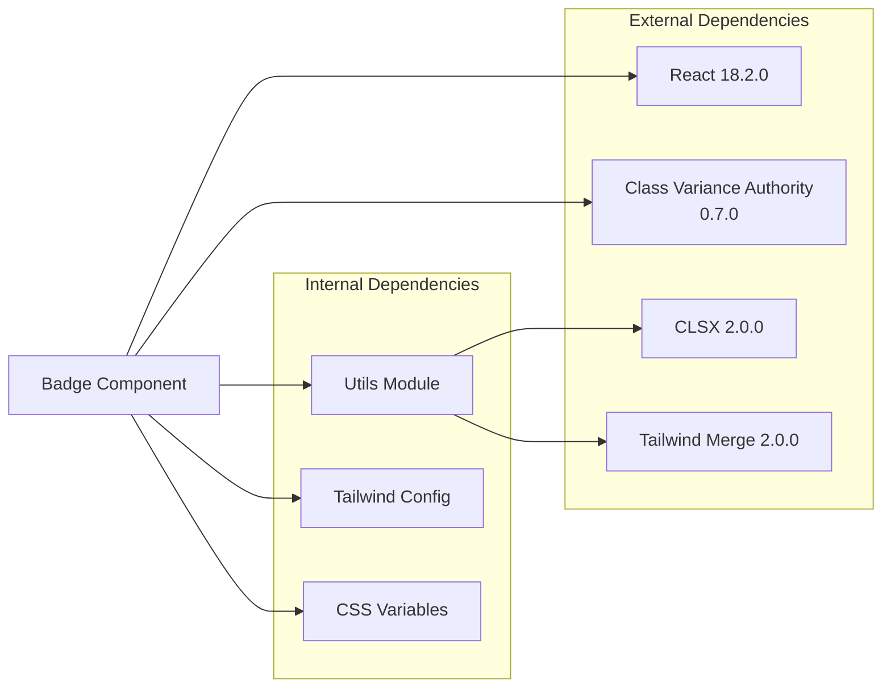

**Diagram sources**
- [package.json:12-31](file://package.json#L12-L31)
- [badge.tsx:1-3](file://src/components/ui/badge.tsx#L1-L3)
- [utils.ts:1-6](file://src/lib/utils.ts#L1-L6)

### Dependency Impact Analysis

| Dependency | Version | Purpose | Impact Level |
|------------|---------|---------|--------------|
| React | ^18.2.0 | Core framework | Critical |
| class-variance-authority | ^0.7.0 | Variant system | High |
| clsx | ^2.0.0 | Class merging | Medium |
| tailwind-merge | ^2.0.0 | Tailwind class merging | Medium |
| lucide-react | ^0.294.0 | Icons | Low |
| @radix-ui/react-* | Various | UI primitives | Low |

**Section sources**
- [package.json:12-31](file://package.json#L12-L31)
- [badge.tsx:1-3](file://src/components/ui/badge.tsx#L1-L3)

## Performance Considerations

The Badge component is optimized for performance through several key design decisions:

### Rendering Performance

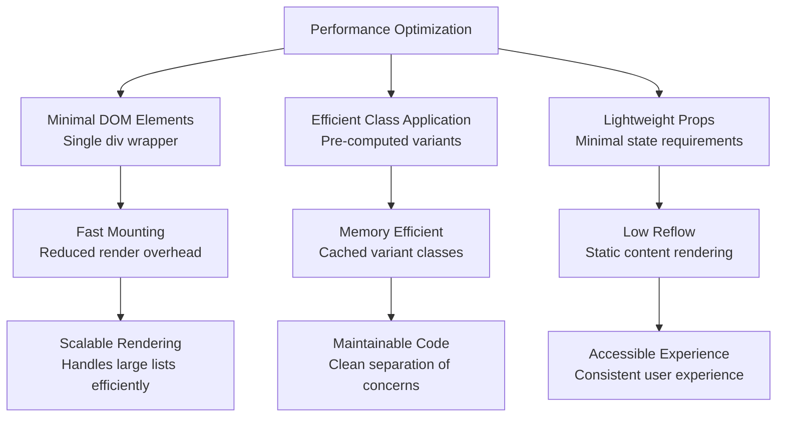

### Optimization Strategies

1. **Static Variant Classes**: All variant styles are pre-computed during component initialization, reducing runtime calculations
2. **Efficient Class Merging**: Uses clsx and tailwind-merge for optimal class combination performance
3. **Minimal DOM Structure**: Single div wrapper with no unnecessary nesting
4. **TypeScript Integration**: Compile-time type checking reduces runtime errors
5. **CSS-in-JS Benefits**: Dynamic styling through Tailwind classes maintains performance while providing flexibility

**Section sources**
- [badge.tsx:5-29](file://src/components/ui/badge.tsx#L5-L29)
- [utils.ts:4-6](file://src/lib/utils.ts#L4-L6)

## Accessibility Considerations

The Badge component incorporates several accessibility features essential for healthcare applications:

### WCAG Compliance Features

| Accessibility Aspect | Implementation | Healthcare Importance |
|---------------------|----------------|----------------------|
| **Color Contrast** | Automatic contrast ratios with semantic colors | Critical for medical readability |
| **Focus Management** | Built-in focus rings for keyboard navigation | Essential for clinical workflows |
| **Screen Reader Support** | Semantic HTML structure | Required for accessibility compliance |
| **Keyboard Navigation** | Native button semantics | Important for assistive technologies |
| **Responsive Design** | Flexible sizing and spacing | Supports various devices and needs |

### Medical-Specific Accessibility Features

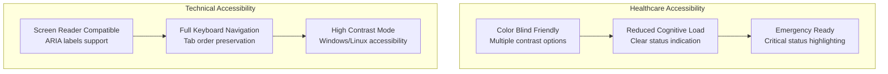

**Section sources**
- [badge.tsx:5-6](file://src/components/ui/badge.tsx#L5-L6)
- [index.css:28-44](file://src/index.css#L28-L44)

## Usage Examples

The Badge component is extensively used throughout the NexaMed application to display various types of information. Here are the primary usage patterns observed:

### Status Indicators

#### Appointment Status Badges
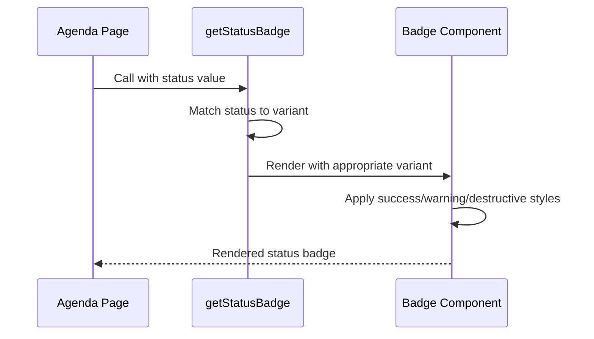

**Diagram sources**
- [Agenda.tsx:45-54](file://src/pages/Agenda.tsx#L45-L54)
- [Consultas.tsx:106-118](file://src/pages/Consultas.tsx#L106-L118)

#### Medical Procedure Badges
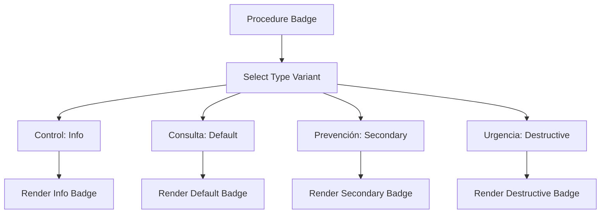

**Diagram sources**
- [Consultas.tsx:96-104](file://src/pages/Consultas.tsx#L96-L104)

### Patient Information Badges

#### Allergy and Medical History Badges
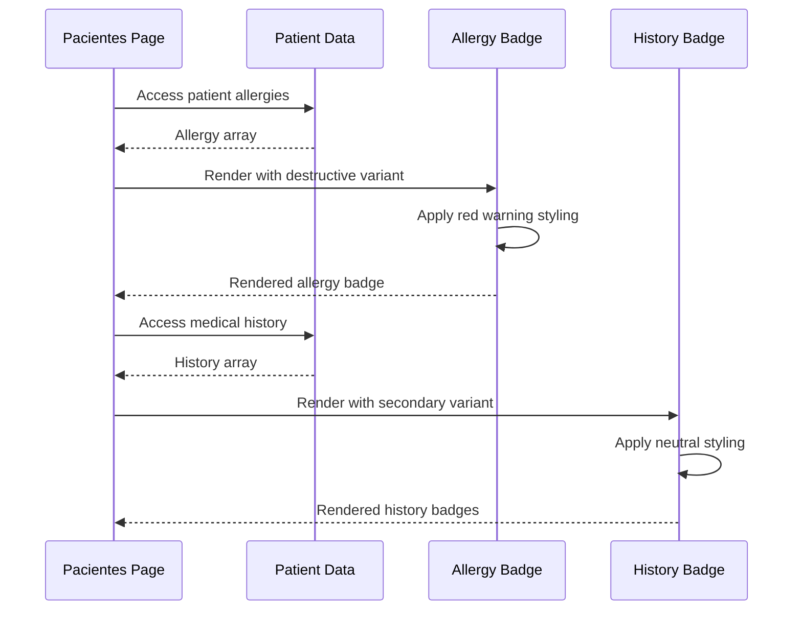

**Diagram sources**
- [Pacientes.tsx:222-234](file://src/pages/Pacientes.tsx#L222-L234)

### Laboratory and Imaging Results

#### Test Result Badges
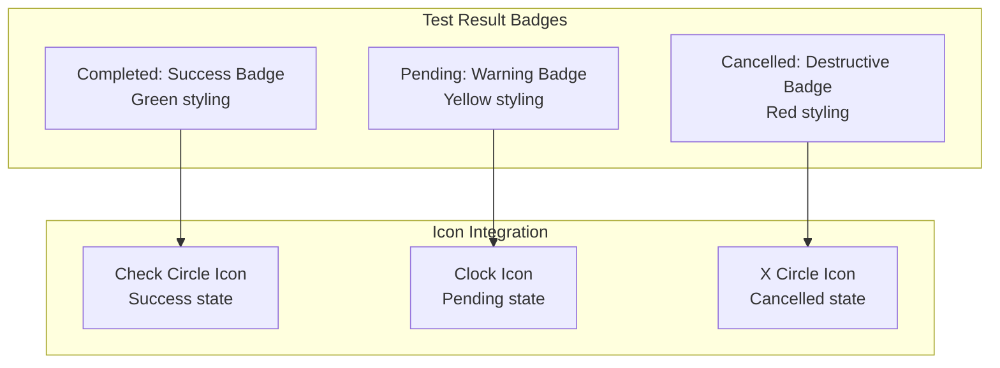

**Diagram sources**
- [Ordenes.tsx:115-130](file://src/pages/Ordenes.tsx#L115-L130)

**Section sources**
- [Agenda.tsx:45-54](file://src/pages/Agenda.tsx#L45-L54)
- [Consultas.tsx:96-118](file://src/pages/Consultas.tsx#L96-L118)
- [Pacientes.tsx:222-234](file://src/pages/Pacientes.tsx#L222-L234)
- [Ordenes.tsx:115-130](file://src/pages/Ordenes.tsx#L115-L130)

## Troubleshooting Guide

Common issues and solutions when working with the Badge component:

### Styling Issues

| Issue | Symptoms | Solution |
|-------|----------|----------|
| **Variant Not Applied** | Badge renders with default styling | Verify variant prop matches available options |
| **Color Contrast Problems** | Poor readability on certain backgrounds | Use semantic variants appropriate for background |
| **Layout Issues** | Misaligned with surrounding content | Check parent container flex properties |
| **Hover Effects Missing** | No visual feedback on interaction | Ensure proper variant selection |

### Performance Issues

| Performance Problem | Cause | Resolution |
|-------------------|-------|------------|
| **Slow Rendering** | Excessive re-renders | Memoize badge props and variants |
| **Bundle Size Growth** | Unused variants included | Tree-shake unused variant imports |
| **Memory Leaks** | Improper cleanup | Ensure proper event handler cleanup |

### Accessibility Issues

| Accessibility Problem | Symptoms | Fix |
|---------------------|----------|-------|
| **Screen Reader Issues** | No status announcement | Add aria-label with status text |
| **Keyboard Navigation** | Cannot tab to badge | Ensure interactive badges are focusable |
| **Color Dependence** | Status unclear without color | Include text labels alongside icons |

**Section sources**
- [badge.tsx:5-29](file://src/components/ui/badge.tsx#L5-L29)
- [utils.ts:4-6](file://src/lib/utils.ts#L4-L6)

## Conclusion

The Badge component in NexaMed represents a well-architected solution for displaying status information, labels, and metadata in healthcare applications. Its implementation demonstrates several key strengths:

### Key Achievements

1. **Comprehensive Variant System**: Seven distinct variants cover all common use cases in medical contexts
2. **Accessibility-First Design**: Built-in accessibility features meet healthcare requirements
3. **Performance Optimization**: Efficient rendering and minimal dependencies ensure smooth operation
4. **Medical-Themed Integration**: Seamless integration with the application's color palette and design system
5. **Extensive Usage Patterns**: Demonstrated effectiveness across multiple medical scenarios

### Best Practices for Medical Applications

The component's design provides valuable insights for healthcare UI development:

- **Semantic Color Coding**: Use appropriate colors for medical significance
- **Clear Status Communication**: Combine color, text, and icons for maximum clarity
- **Accessibility Compliance**: Ensure all users can interpret status information
- **Performance Considerations**: Optimize for large datasets and frequent updates
- **Contextual Relevance**: Choose variants that match the medical domain's needs

The Badge component successfully balances functionality, aesthetics, and accessibility requirements essential for effective healthcare applications. Its modular design and comprehensive variant system make it a valuable building block for creating intuitive, accessible medical interfaces.