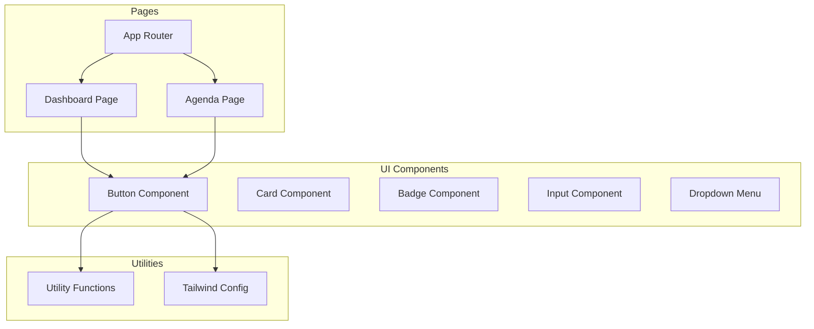
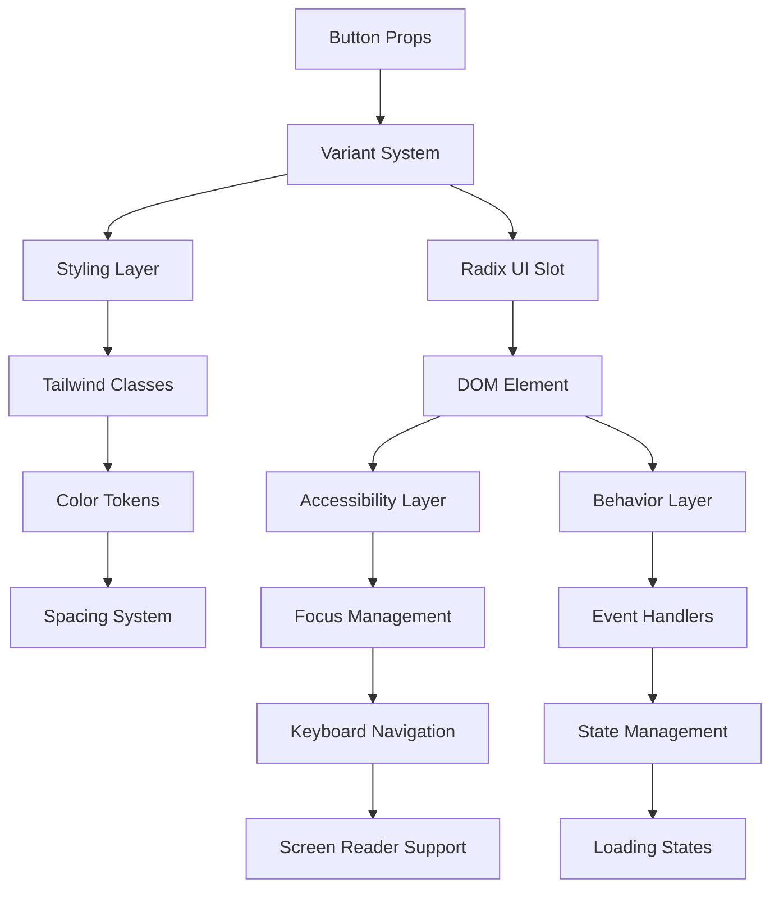
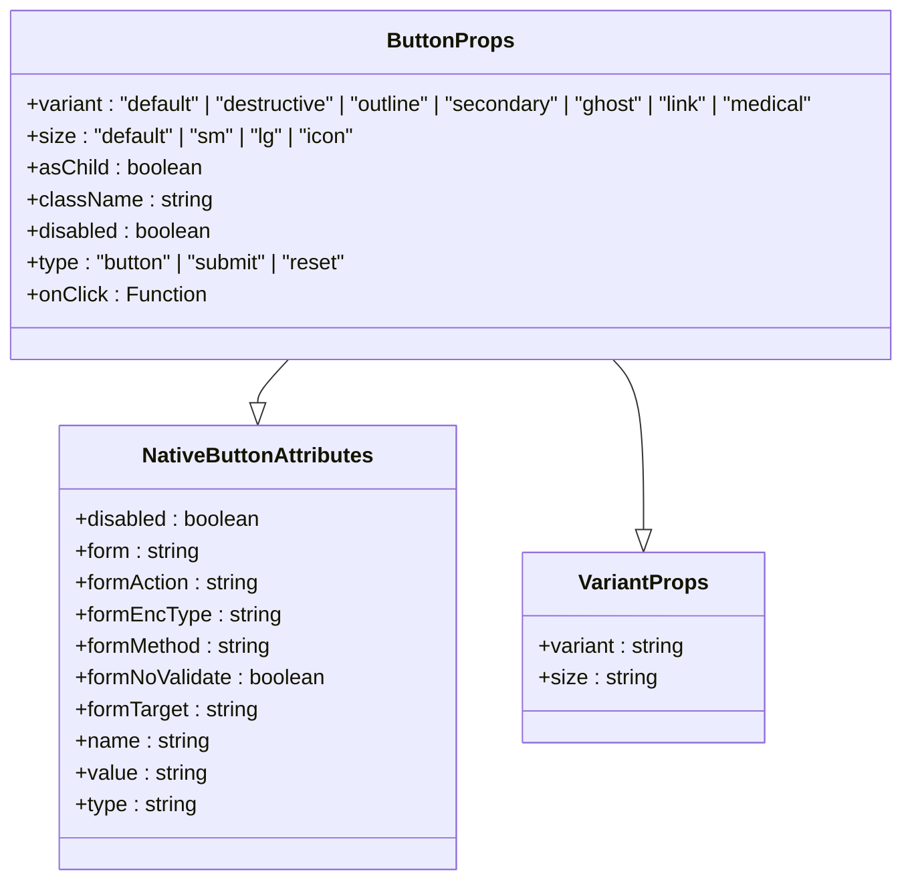
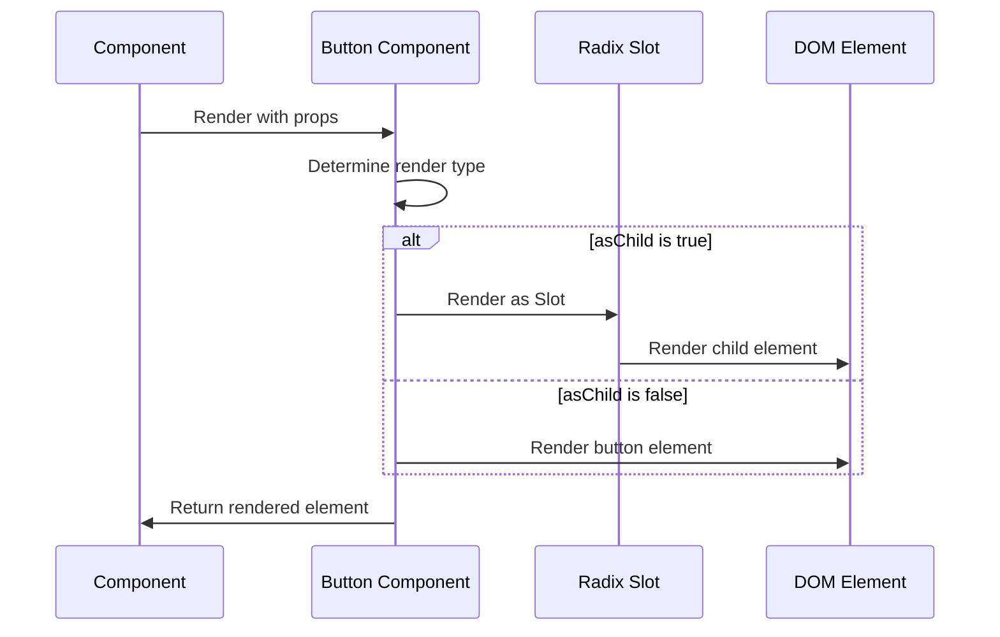
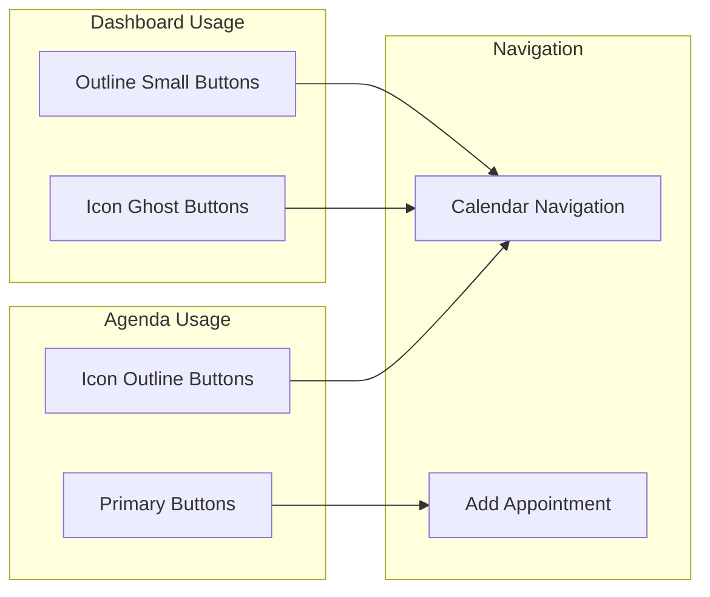
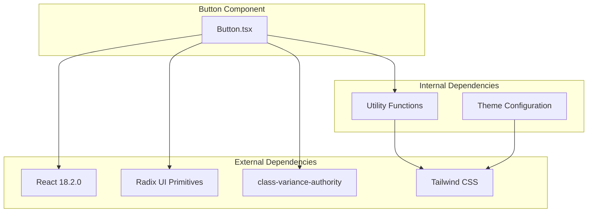

# Button Component

<cite>
**Referenced Files in This Document**
- [button.tsx](file://src/components/ui/button.tsx)
- [utils.ts](file://src/lib/utils.ts)
- [tailwind.config.ts](file://tailwind.config.ts)
- [package.json](file://package.json)
- [Dashboard.tsx](file://src/pages/Dashboard.tsx)
- [Agenda.tsx](file://src/pages/Agenda.tsx)
- [App.tsx](file://src/App.tsx)
</cite>

## Table of Contents
1. [Introduction](#introduction)
2. [Project Structure](#project-structure)
3. [Core Components](#core-components)
4. [Architecture Overview](#architecture-overview)
5. [Detailed Component Analysis](#detailed-component-analysis)
6. [Dependency Analysis](#dependency-analysis)
7. [Performance Considerations](#performance-considerations)
8. [Troubleshooting Guide](#troubleshooting-guide)
9. [Conclusion](#conclusion)

## Introduction
The Button component is a foundational UI element in the NexaMed frontend system. It provides a flexible, accessible, and visually consistent way to trigger actions across the application. Built with React and styled using Tailwind CSS, the component supports multiple visual variants, sizes, and states while maintaining semantic HTML and keyboard accessibility.

The component integrates seamlessly with Radix UI primitives for enhanced accessibility and composability, and leverages a variant system powered by class-variance-authority to ensure consistent styling across the application.

## Project Structure
The Button component resides in the UI components library alongside other foundational elements like cards, badges, and inputs. It follows a modular structure that promotes reusability and maintainability.

**Diagram sources**
- [button.tsx:1-54](file://src/components/ui/button.tsx#L1-L54)
- [utils.ts:1-44](file://src/lib/utils.ts#L1-L44)
- [tailwind.config.ts:1-103](file://tailwind.config.ts#L1-L103)
- [Dashboard.tsx:1-206](file://src/pages/Dashboard.tsx#L1-L206)
- [Agenda.tsx:1-178](file://src/pages/Agenda.tsx#L1-L178)
- [App.tsx:1-38](file://src/App.tsx#L1-L38)

**Section sources**
- [button.tsx:1-54](file://src/components/ui/button.tsx#L1-L54)
- [utils.ts:1-44](file://src/lib/utils.ts#L1-L44)
- [tailwind.config.ts:1-103](file://tailwind.config.ts#L1-L103)
- [Dashboard.tsx:1-206](file://src/pages/Dashboard.tsx#L1-L206)
- [Agenda.tsx:1-178](file://src/pages/Agenda.tsx#L1-L178)
- [App.tsx:1-38](file://src/App.tsx#L1-L38)

## Core Components
The Button component is implemented as a forwardRef component that accepts standard button attributes along with variant and size props. It uses Radix UI's Slot primitive to enable composition with other components.

Key characteristics:
- **TypeScript Integration**: Full type safety with React.ButtonHTMLAttributes and VariantProps
- **Radix UI Integration**: Uses @radix-ui/react-slot for flexible rendering
- **Tailwind CSS Styling**: Leverages utility classes for responsive design
- **Accessibility**: Inherits native button semantics and focus management
- **Composition**: Supports asChild prop for advanced use cases

**Section sources**
- [button.tsx:33-51](file://src/components/ui/button.tsx#L33-L51)

## Architecture Overview
The Button component follows a layered architecture that separates concerns between styling, behavior, and accessibility.

**Diagram sources**
- [button.tsx:6-31](file://src/components/ui/button.tsx#L6-L31)
- [button.tsx:39-50](file://src/components/ui/button.tsx#L39-L50)

## Detailed Component Analysis

### Props Interface and Type System
The Button component defines a comprehensive props interface that extends React's native button attributes while adding variant and size capabilities.

**Diagram sources**
- [button.tsx:33-37](file://src/components/ui/button.tsx#L33-L37)

### Variant System Implementation
The component uses class-variance-authority to define a sophisticated variant system with seven distinct visual styles and four size options.

#### Variant Definitions
| Variant | Purpose | Visual Characteristics |
|---------|---------|----------------------|
| `default` | Primary actions | Solid color with shadow, hover effect |
| `destructive` | Dangerous actions | Red palette with subtle shadow |
| `outline` | Secondary actions | Bordered with background, hover fills |
| `secondary` | Alternative actions | Light background, muted colors |
| `ghost` | Minimal actions | Transparent background, hover highlight |
| `link` | Inline actions | Text-only with underline decoration |
| `medical` | Healthcare-specific actions | Medical-themed blue palette |

#### Size Variations
| Size | Dimensions | Typography | Use Cases |
|------|------------|------------|-----------|
| `sm` | 32px height | Small text | Compact interfaces |
| `default` | 40px height | Base text | Standard usage |
| `lg` | 48px height | Large text | Emphasized actions |
| `icon` | Square proportions | Icon-only | Navigation, toolbar buttons |

**Section sources**
- [button.tsx:9-30](file://src/components/ui/button.tsx#L9-L30)

### Rendering Architecture
The component employs a dual-rendering strategy using Radix UI's Slot primitive for maximum flexibility.

**Diagram sources**
- [button.tsx:40-48](file://src/components/ui/button.tsx#L40-L48)

### State Management and Accessibility
The component handles various states through Tailwind's state selectors and maintains accessibility compliance.

#### State Handling
- **Disabled State**: Prevents interaction and reduces opacity
- **Hover State**: Provides visual feedback for interactive elements
- **Focus State**: Manages keyboard navigation and screen reader compatibility
- **Active State**: Handles click interactions and visual feedback

#### Accessibility Features
- Native button semantics preserved
- Focus ring management via Tailwind utilities
- Keyboard navigation support
- Screen reader compatibility maintained

**Section sources**
- [button.tsx:7](file://src/components/ui/button.tsx#L7)
- [button.tsx:40-48](file://src/components/ui/button.tsx#L40-L48)

### Usage Examples and Integration Patterns

#### Basic Usage Patterns
The Button component demonstrates extensive usage across the application:

**Diagram sources**
- [Dashboard.tsx:102-105](file://src/pages/Dashboard.tsx#L102-L105)
- [Dashboard.tsx:150-153](file://src/pages/Dashboard.tsx#L150-L153)
- [Agenda.tsx:61-74](file://src/pages/Agenda.tsx#L61-L74)
- [Agenda.tsx:76-79](file://src/pages/Agenda.tsx#L76-L79)
- [Agenda.tsx:159-161](file://src/pages/Agenda.tsx#L159-L161)

#### Advanced Integration Examples
The component integrates with other UI elements and follows consistent design patterns:

**Section sources**
- [Dashboard.tsx:102-153](file://src/pages/Dashboard.tsx#L102-L153)
- [Agenda.tsx:61-79](file://src/pages/Agenda.tsx#L61-L79)
- [Agenda.tsx:159-168](file://src/pages/Agenda.tsx#L159-L168)

## Dependency Analysis
The Button component relies on several external libraries and internal utilities to function effectively.

**Diagram sources**
- [package.json:12-31](file://package.json#L12-L31)
- [button.tsx:1-4](file://src/components/ui/button.tsx#L1-L4)
- [utils.ts:1-6](file://src/lib/utils.ts#L1-L6)
- [tailwind.config.ts:20-66](file://tailwind.config.ts#L20-L66)

### Library Dependencies
The component utilizes modern React patterns and established UI libraries:

| Dependency | Version | Purpose | Integration |
|------------|---------|---------|-------------|
| react | ^18.2.0 | Core framework | Native button semantics |
| @radix-ui/react-slot | ^1.0.2 | Flexible rendering | Composition patterns |
| class-variance-authority | ^0.7.0 | Variant system | Style management |
| clsx | ^2.0.0 | Class merging | Utility function |
| tailwind-merge | ^2.0.0 | Tailwind optimization | Style deduplication |

**Section sources**
- [package.json:12-31](file://package.json#L12-L31)
- [button.tsx:1-4](file://src/components/ui/button.tsx#L1-L4)

## Performance Considerations
The Button component is optimized for performance through several design decisions:

### Rendering Optimizations
- **ForwardRef Implementation**: Eliminates unnecessary wrapper components
- **Memoized Variants**: Uses class-variance-authority for efficient style computation
- **Conditional Rendering**: Radix Slot enables dynamic element selection

### Bundle Size Impact
- **Minimal Dependencies**: Only essential packages included
- **Tree Shaking**: Unused variants don't increase bundle size
- **Utility-First Approach**: Tailwind classes compiled during build

### Runtime Performance
- **CSS-in-JS Alternative**: Pure Tailwind classes avoid runtime styling overhead
- **Event Delegation**: Native event handling without additional wrappers
- **Memory Efficiency**: Stateless component design

## Troubleshooting Guide

### Common Issues and Solutions

#### Variant Styling Problems
**Issue**: Custom className overrides variant styles unexpectedly
**Solution**: Ensure proper class ordering and use the variant system consistently

#### Accessibility Concerns
**Issue**: Screen reader compatibility issues with custom implementations
**Solution**: Leverage the component's built-in accessibility features and avoid overriding focus management

#### Integration Challenges
**Issue**: Conflicts with parent component styling
**Solution**: Use the component's className prop strategically and avoid global style overrides

### Debugging Tips
1. **Inspect Generated Classes**: Use browser dev tools to verify applied styles
2. **Test Keyboard Navigation**: Ensure focus states work correctly
3. **Validate Semantic Markup**: Confirm proper button semantics are maintained

**Section sources**
- [button.tsx:7](file://src/components/ui/button.tsx#L7)
- [button.tsx:40-48](file://src/components/ui/button.tsx#L40-L48)

## Conclusion
The Button component represents a well-architected solution for interactive elements in the NexaMed frontend system. Its design balances flexibility with consistency, providing developers with a robust foundation for building accessible and visually appealing user interfaces.

Key strengths include:
- **Comprehensive Variant System**: Seven distinct visual styles for diverse use cases
- **Radix UI Integration**: Enhanced accessibility and composability
- **Type Safety**: Full TypeScript support with clear prop interfaces
- **Performance Optimization**: Efficient rendering and minimal bundle impact
- **Consistent Design Language**: Aligned with the application's medical-themed aesthetic

The component serves as a cornerstone of the UI system, enabling consistent user experiences across all application pages while maintaining the flexibility needed for specialized use cases.