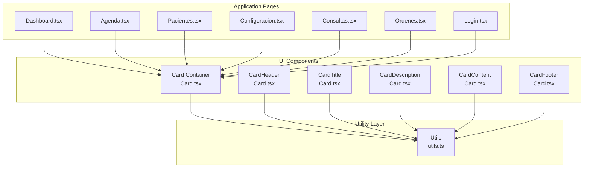
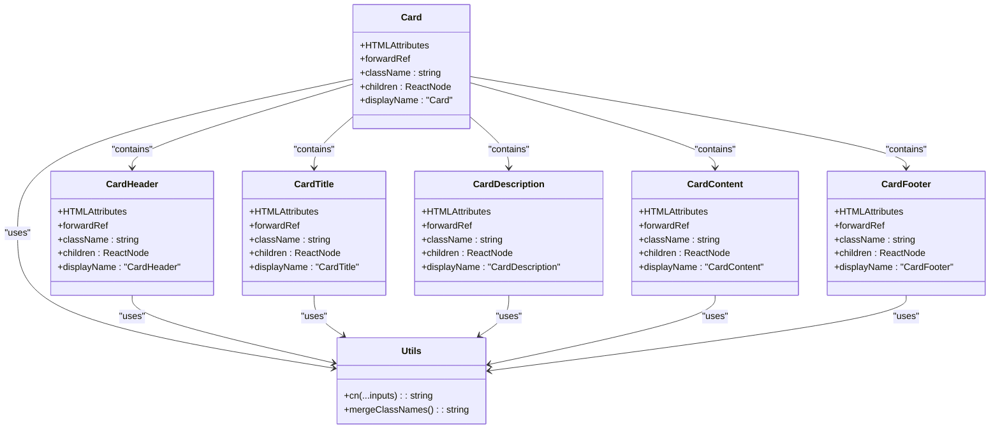

# Card Component

<cite>
**Referenced Files in This Document**
- [card.tsx](file://src/components/ui/card.tsx)
- [utils.ts](file://src/lib/utils.ts)
- [Dashboard.tsx](file://src/pages/Dashboard.tsx)
- [Agenda.tsx](file://src/pages/Agenda.tsx)
- [Pacientes.tsx](file://src/pages/Pacientes.tsx)
- [Configuracion.tsx](file://src/pages/Configuracion.tsx)
- [Consultas.tsx](file://src/pages/Consultas.tsx)
- [Ordenes.tsx](file://src/pages/Ordenes.tsx)
- [Login.tsx](file://src/pages/Login.tsx)
</cite>

## Table of Contents
1. [Introduction](#introduction)
2. [Project Structure](#project-structure)
3. [Core Components](#core-components)
4. [Architecture Overview](#architecture-overview)
5. [Detailed Component Analysis](#detailed-component-analysis)
6. [Usage Examples](#usage-examples)
7. [Styling Approach](#styling-approach)
8. [Component Composition Pattern](#component-composition-pattern)
9. [Responsive Design Considerations](#responsive-design-considerations)
10. [Best Practices](#best-practices)
11. [Troubleshooting Guide](#troubleshooting-guide)
12. [Conclusion](#conclusion)

## Introduction

The Card component system is a foundational UI pattern in the NexaMed Frontend application designed to display structured information in a consistent, accessible, and visually appealing manner. This system follows React's composition pattern, providing individual components that work together to create flexible card layouts suitable for various medical dashboard contexts.

The Card system consists of six primary components: Card (container), CardHeader, CardTitle, CardDescription, CardContent, and CardFooter. Each component serves a specific semantic purpose while maintaining consistent styling and accessibility standards throughout the application.

## Project Structure

The Card component system is organized within the UI components directory alongside other reusable interface elements. The implementation leverages Tailwind CSS utility classes for consistent styling and follows React's forwardRef pattern for enhanced accessibility and ref forwarding capabilities.



**Diagram sources**
- [card.tsx:1-75](file://src/components/ui/card.tsx#L1-L75)
- [utils.ts:1-50](file://src/lib/utils.ts#L1-L50)

**Section sources**
- [card.tsx:1-75](file://src/components/ui/card.tsx#L1-L75)

## Core Components

The Card component system provides six distinct components, each serving a specific role in structuring card-based content:

### Card Container
The primary container component that establishes the base styling and structural foundation for all card layouts. It provides rounded corners, border styling, background color, and subtle shadow effects while maintaining accessibility compliance.

### CardHeader
Organizes header content within cards, establishing proper spacing and layout for titles and descriptions. It manages vertical spacing between header elements and ensures consistent padding.

### CardTitle
Semantic heading component optimized for card titles, featuring appropriate font weights, sizing, and typography hierarchy. It supports both h2 and h3 semantic levels depending on context.

### CardDescription
Supporting text component designed for explanatory content within cards. It provides muted foreground colors and appropriate sizing for secondary information.

### CardContent
Main content area component that manages internal spacing and layout for primary card content. It handles top padding removal to maintain visual continuity with header elements.

### CardFooter
Footer area component optimized for action buttons, metadata, or supporting information. It provides flexbox alignment capabilities and maintains consistent spacing.

**Section sources**
- [card.tsx:4-73](file://src/components/ui/card.tsx#L4-L73)

## Architecture Overview

The Card component system follows a hierarchical composition pattern where individual components build upon shared utility functions and styling conventions. The architecture emphasizes separation of concerns, reusability, and maintainability through consistent prop interfaces and styling approaches.



**Diagram sources**
- [card.tsx:4-73](file://src/components/ui/card.tsx#L4-L73)
- [utils.ts:1-50](file://src/lib/utils.ts#L1-L50)

## Detailed Component Analysis

### Card Container Implementation

The Card component serves as the foundational container that establishes the visual identity and structural framework for all card-based layouts. It incorporates transition effects, border styling, and background color management through Tailwind CSS utility classes.

Key implementation characteristics include:
- Rounded corner styling with consistent radius values
- Border establishment with appropriate contrast ratios
- Background color assignment using semantic color tokens
- Shadow effects for depth perception
- Transition animations for interactive states
- Ref forwarding for enhanced accessibility
- Prop spreading for extensibility

### CardHeader Component

The CardHeader component manages the header section of cards, providing consistent spacing and layout for title and description elements. It establishes vertical spacing using flexbox column direction and maintains appropriate padding values.

Implementation features:
- Flexbox column layout for vertical stacking
- Space management between child elements
- Consistent padding values for visual balance
- Semantic HTML structure support
- Ref forwarding capabilities

### CardTitle Component

The CardTitle component provides semantic heading functionality optimized for card contexts. It applies appropriate typography scales, font weights, and spacing to ensure content hierarchy and readability.

Typography and styling characteristics:
- Font weight adjustments for emphasis
- Leading and tracking modifications
- Semantic heading level support
- Responsive sizing considerations
- Color accessibility compliance

### CardDescription Component

The CardDescription component handles secondary text content within cards, providing muted color treatment and appropriate sizing for supporting information.

Design considerations:
- Muted foreground color assignment
- Reduced opacity for secondary importance
- Appropriate font sizing for context
- Line height optimization for readability
- Responsive text scaling

### CardContent Component

The CardContent component manages the primary content area of cards, handling spacing and layout considerations that maintain visual continuity with header elements.

Layout and spacing features:
- Top padding removal for seamless integration
- Consistent internal spacing
- Flexible content area support
- Responsive layout considerations
- Accessibility compliance

### CardFooter Component

The CardFooter component provides specialized footer functionality for action buttons, metadata, or supporting information within cards.

Functional characteristics:
- Flexbox alignment capabilities
- Consistent spacing management
- Action-oriented layout support
- Responsive footer behavior
- Interactive element accommodation

**Section sources**
- [card.tsx:4-73](file://src/components/ui/card.tsx#L4-L73)

## Usage Examples

The Card component system is extensively utilized across various pages in the NexaMed application, demonstrating different layout patterns and content organization approaches.

### Basic Card Layout Example

The most common usage pattern combines CardHeader with CardTitle and CardContent for straightforward information presentation:

```typescript
// Example structure from multiple pages
<Card>
  <CardHeader>
    <CardTitle>Appointment Details</CardTitle>
  </CardHeader>
  <CardContent>
    <p>Patient information and appointment scheduling details</p>
  </CardContent>
</Card>
```

### Enhanced Card with Description

Cards frequently incorporate CardDescription for additional context and explanatory information:

```typescript
// Used in Dashboard and Configuracion pages
<Card>
  <CardHeader>
    <CardTitle>Patient Statistics</CardTitle>
    <CardDescription>Monthly patient count and trends</CardDescription>
  </CardHeader>
  <CardContent>
    <div className="grid grid-cols-2 gap-4">
      <div>Statistics data</div>
      <div>Visual charts</div>
    </div>
  </CardContent>
</Card>
```

### Action-Oriented Card Layout

Cards with CardFooter are commonly used for forms, quick actions, or interactive elements:

```typescript
// Used in Login and other interactive pages
<Card>
  <CardHeader>
    <CardTitle>Login</CardTitle>
    <CardDescription>Enter credentials to access the system</CardDescription>
  </CardHeader>
  <CardContent>
    <form className="space-y-4">
      {/* Form fields */}
    </form>
  </CardContent>
  <CardFooter>
    <Button type="submit">Sign In</Button>
  </CardFooter>
</Card>
```

### Minimal Card Pattern

Some pages utilize simplified card layouts focusing on content without decorative elements:

```typescript
// Used in Pacientes page for clean data presentation
<Card>
  <CardContent>
    <div className="space-y-2">
      <p>Patient records and basic information</p>
    </div>
  </CardContent>
</Card>
```

**Section sources**
- [Dashboard.tsx:1-50](file://src/pages/Dashboard.tsx#L1-L50)
- [Agenda.tsx:1-50](file://src/pages/Agenda.tsx#L1-L50)
- [Pacientes.tsx:1-50](file://src/pages/Pacientes.tsx#L1-L50)
- [Configuracion.tsx:1-50](file://src/pages/Configuracion.tsx#L1-L50)
- [Consultas.tsx:1-50](file://src/pages/Consultas.tsx#L1-L50)
- [Ordenes.tsx:1-50](file://src/pages/Ordenes.tsx#L1-L50)
- [Login.tsx:1-50](file://src/pages/Login.tsx#L1-L50)

## Styling Approach

The Card component system employs a comprehensive styling strategy that balances consistency, accessibility, and visual appeal through Tailwind CSS utility classes and shared utility functions.

### Utility Function Integration

The styling system leverages a centralized utility function for class name merging and conditional styling:

```typescript
// Import and usage pattern
import { cn } from "@/lib/utils"
// Used throughout all Card components for consistent class management
```

### Tailwind CSS Integration

Each component applies Tailwind utility classes for consistent styling across the application:

- **Color System**: Uses semantic color tokens (bg-card, text-card-foreground, text-muted-foreground)
- **Spacing System**: Implements consistent padding and margin utilities
- **Typography System**: Applies appropriate font sizes, weights, and line heights
- **Layout System**: Utilizes flexbox and grid utilities for responsive layouts
- **Effect System**: Incorporates transitions, shadows, and border radius utilities

### Responsive Design Principles

The styling approach incorporates responsive design patterns through Tailwind's responsive prefixes and flexible layout utilities, ensuring cards adapt appropriately across different screen sizes and device orientations.

**Section sources**
- [card.tsx:10-13](file://src/components/ui/card.tsx#L10-L13)
- [utils.ts:1-50](file://src/lib/utils.ts#L1-L50)

## Component Composition Pattern

The Card component system exemplifies React's composition pattern through coordinated component relationships and shared prop interfaces. Each component maintains consistent prop interfaces while serving distinct semantic purposes.

### Prop Interface Consistency

All Card components share a common prop interface pattern:
- **className**: Optional string for additional styling
- **ref**: Forwarded ref for DOM access and accessibility
- **children**: React node children for content rendering
- **...props**: Spread operator for additional HTML attributes

### Component Relationship Hierarchy

The components establish a clear hierarchical relationship:
1. **Card** (root container)
2. **CardHeader** (header section)
3. **CardTitle** (primary heading)
4. **CardDescription** (supporting text)
5. **CardContent** (main content)
6. **CardFooter** (footer actions)

### Ref Forwarding Implementation

Each component utilizes React.forwardRef for enhanced accessibility and DOM manipulation capabilities, enabling proper focus management and programmatic access to underlying elements.

**Section sources**
- [card.tsx:4-73](file://src/components/ui/card.tsx#L4-L73)

## Responsive Design Considerations

The Card component system incorporates responsive design principles to ensure optimal user experience across various devices and screen sizes.

### Flexible Layout Patterns

Components utilize responsive layout utilities that adapt to different viewport sizes:
- **Mobile-First Approach**: Base styles optimized for smaller screens
- **Progressive Enhancement**: Additional styles applied for larger screens
- **Flexible Spacing**: Padding and margins adjust based on screen size

### Typography Responsiveness

Text components implement responsive typography scaling:
- **Font Size Adjustments**: Appropriate scaling for different devices
- **Line Height Optimization**: Readability maintained across screen sizes
- **Viewport-Based Sizing**: Flexible sizing relative to screen dimensions

### Content Adaptation Strategies

The system accommodates content adaptation through:
- **Grid Layouts**: Flexible grid systems for content arrangement
- **Stacking Patterns**: Vertical stacking for mobile optimization
- **Overflow Management**: Proper handling of long content

## Best Practices

### Component Usage Guidelines

When implementing Card components, follow these established patterns:

1. **Semantic Structure**: Always use CardHeader with CardTitle for proper semantic hierarchy
2. **Content Organization**: Place primary content in CardContent for consistent spacing
3. **Action Placement**: Position interactive elements in CardFooter for clear user expectations
4. **Accessibility Compliance**: Leverage built-in ref forwarding for focus management
5. **Consistent Styling**: Utilize shared utility functions for uniform appearance

### Performance Considerations

The component system is optimized for performance through:
- **Minimal Re-renders**: Efficient prop passing and state management
- **CSS Optimization**: Utility-first approach reduces custom CSS overhead
- **Bundle Size**: Shared utilities minimize code duplication

### Accessibility Standards

Components meet accessibility requirements through:
- **Semantic HTML**: Proper heading hierarchy and element usage
- **Keyboard Navigation**: Full keyboard accessibility support
- **Screen Reader Compatibility**: ARIA labels and roles where appropriate
- **Focus Management**: Proper focus order and visibility

## Troubleshooting Guide

### Common Implementation Issues

**Issue**: Inconsistent spacing between header and content
**Solution**: Ensure CardHeader is properly paired with CardContent and avoid manual padding overrides

**Issue**: Color contrast problems in different themes
**Solution**: Use semantic color tokens (bg-card, text-card-foreground) instead of hardcoded colors

**Issue**: Mobile layout breakage
**Solution**: Test responsive breakpoints and ensure proper use of responsive utility classes

**Issue**: Ref forwarding not working
**Solution**: Verify forwardRef implementation and proper ref handling in parent components

### Debugging Strategies

1. **Inspect Generated Classes**: Use browser dev tools to examine applied Tailwind classes
2. **Validate Semantic Structure**: Ensure proper heading hierarchy and content organization
3. **Test Accessibility**: Run automated accessibility tests to identify compliance issues
4. **Cross-Browser Testing**: Verify consistent behavior across different browser environments

**Section sources**
- [card.tsx:1-75](file://src/components/ui/card.tsx#L1-L75)

## Conclusion

The Card component system in NexaMed provides a robust, accessible, and maintainable foundation for displaying structured information throughout the application. Through careful component composition, consistent styling approaches, and adherence to accessibility standards, the system enables developers to create cohesive user experiences across diverse medical dashboard contexts.

The implementation demonstrates best practices in React component design, utility-first styling, and responsive development. By following the established patterns and guidelines, developers can extend the system effectively while maintaining consistency and accessibility across the entire application ecosystem.