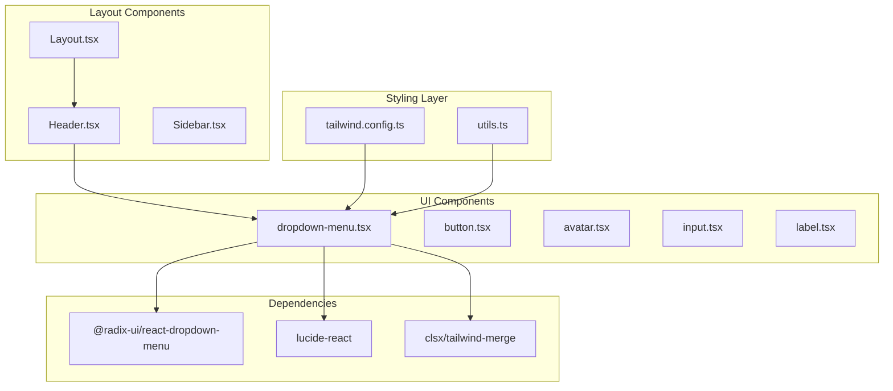
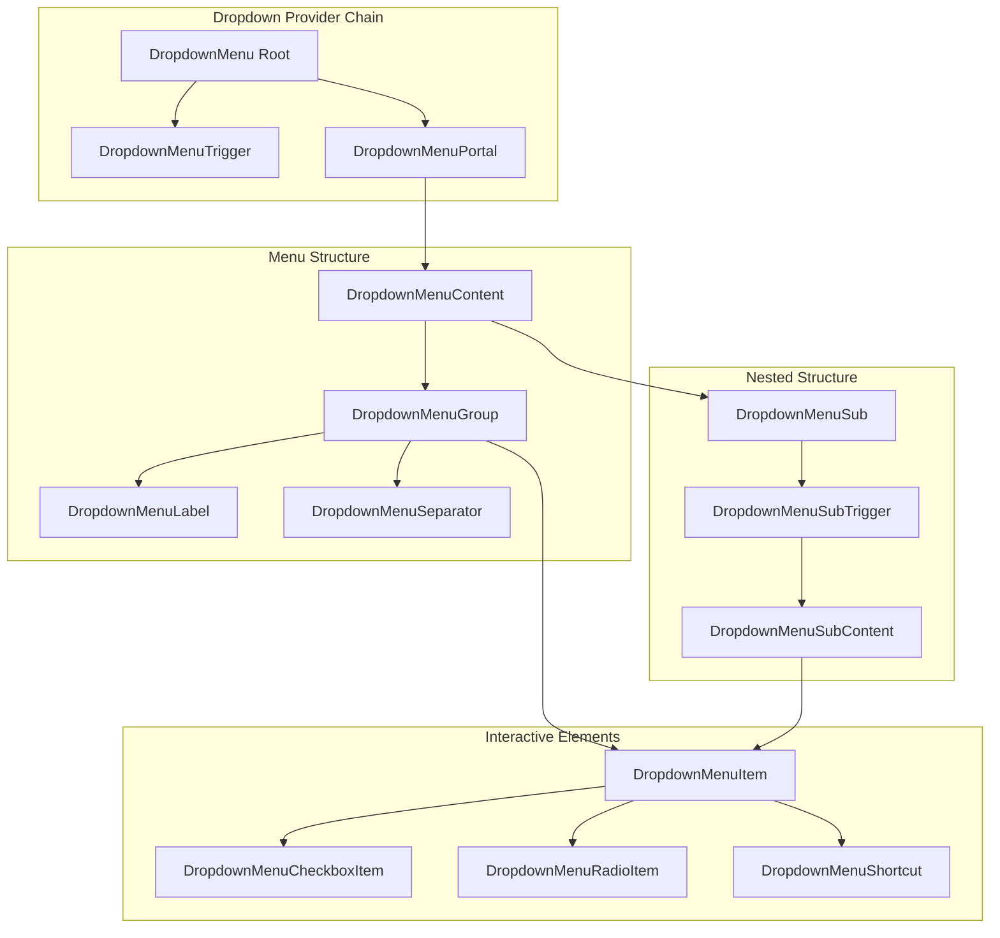
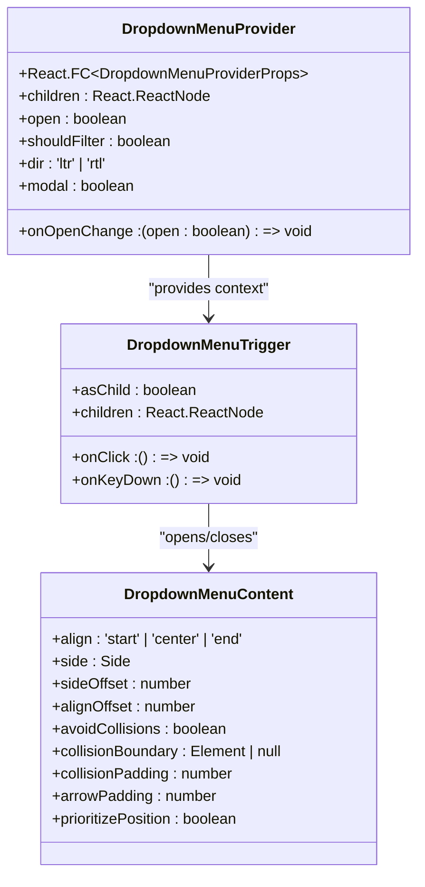
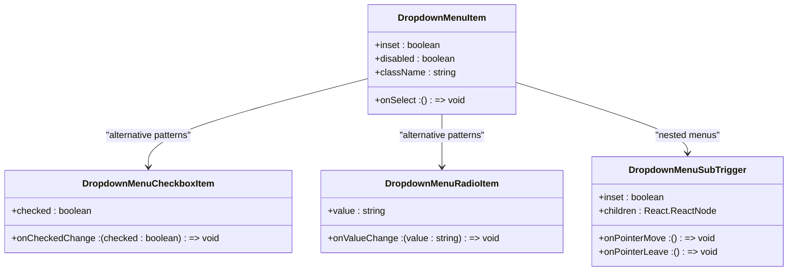
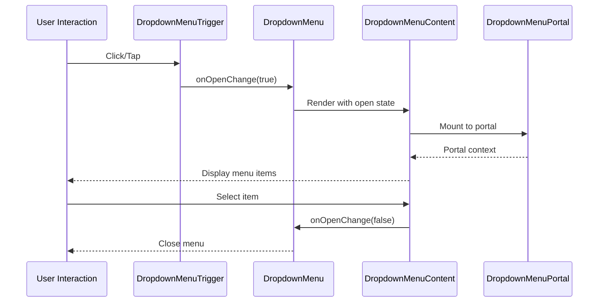
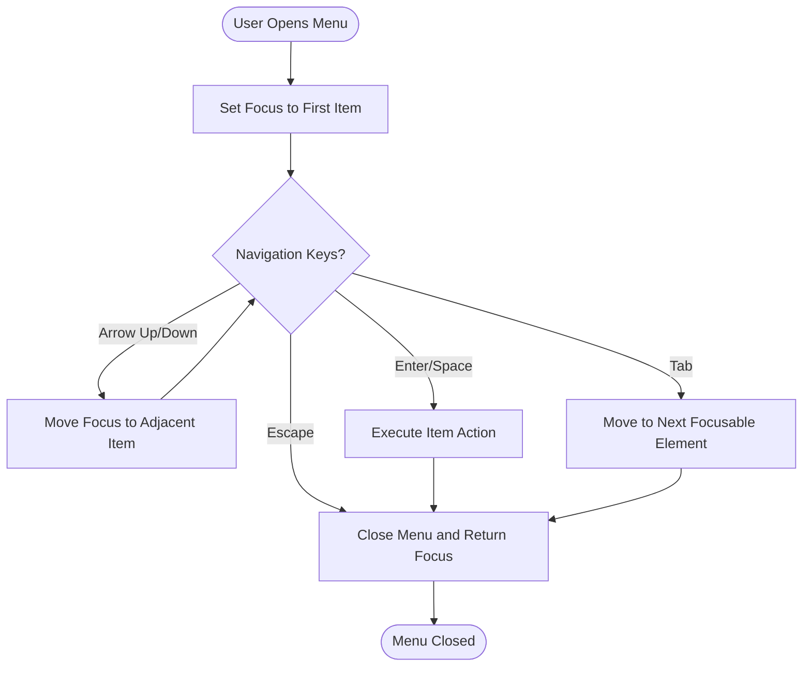
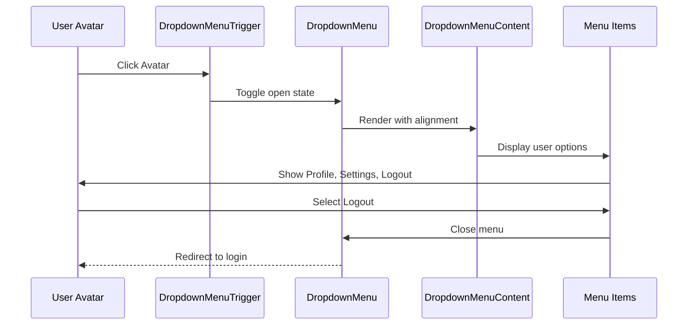
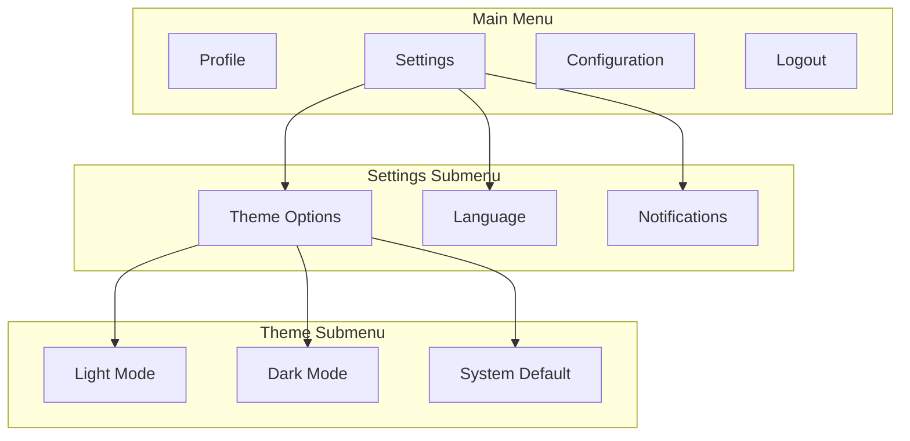

# Dropdown Menu Component

<cite>
**Referenced Files in This Document**
- [dropdown-menu.tsx](file://src/components/ui/dropdown-menu.tsx)
- [Header.tsx](file://src/components/layout/Header.tsx)
- [Layout.tsx](file://src/components/layout/Layout.tsx)
- [utils.ts](file://src/lib/utils.ts)
- [package.json](file://package.json)
- [tailwind.config.ts](file://tailwind.config.ts)
- [main.tsx](file://src/main.tsx)
</cite>

## Table of Contents
1. [Introduction](#introduction)
2. [Project Structure](#project-structure)
3. [Core Components](#core-components)
4. [Architecture Overview](#architecture-overview)
5. [Detailed Component Analysis](#detailed-component-analysis)
6. [Integration with Radix UI](#integration-with-radix-ui)
7. [Keyboard Navigation and Accessibility](#keyboard-navigation-and-accessibility)
8. [Usage Examples](#usage-examples)
9. [Best Practices](#best-practices)
10. [Performance Considerations](#performance-considerations)
11. [Troubleshooting Guide](#troubleshooting-guide)
12. [Conclusion](#conclusion)

## Introduction

The Dropdown Menu component system is a comprehensive implementation of Radix UI's dropdown menu primitives, designed to provide accessible and customizable dropdown functionality for the NexaMed healthcare application. This system enables users to access contextual actions, navigation options, and settings through intuitive dropdown interfaces.

The component library integrates seamlessly with the application's design system, utilizing Tailwind CSS for styling and maintaining consistency with the medical-themed color palette. Built with TypeScript for type safety and React hooks for state management, the dropdown system provides robust functionality while maintaining excellent accessibility standards.

## Project Structure

The dropdown menu system is organized within the UI components structure, following the established pattern of the application's component architecture:

**Diagram sources**
- [dropdown-menu.tsx:1-190](file://src/components/ui/dropdown-menu.tsx#L1-L190)
- [Header.tsx:1-84](file://src/components/layout/Header.tsx#L1-L84)
- [tailwind.config.ts:1-103](file://tailwind.config.ts#L1-L103)

**Section sources**
- [dropdown-menu.tsx:1-190](file://src/components/ui/dropdown-menu.tsx#L1-L190)
- [Header.tsx:1-84](file://src/components/layout/Header.tsx#L1-L84)

## Core Components

The dropdown menu system consists of several specialized components, each serving a specific purpose in creating comprehensive dropdown functionality:

### Primary Components

| Component | Purpose | Key Features |
|-----------|---------|--------------|
| **DropdownMenu** | Root provider component | Manages global dropdown state and context |
| **DropdownMenuTrigger** | Activation element | Handles click and keyboard events |
| **DropdownMenuContent** | Container for menu items | Provides positioning and animations |
| **DropdownMenuItem** | Interactive menu items | Supports icons, shortcuts, and disabled states |
| **DropdownMenuSeparator** | Visual divider | Creates clear section boundaries |

### Advanced Components

| Component | Purpose | Key Features |
|-----------|---------|--------------|
| **DropdownMenuSub** | Sub-menu container | Enables nested dropdown functionality |
| **DropdownMenuSubTrigger** | Sub-menu activation | Includes chevron indicators |
| **DropdownMenuSubContent** | Nested menu container | Inherits positioning behavior |
| **DropdownMenuCheckboxItem** | Toggle options | Provides checkbox-style selections |
| **DropdownMenuRadioItem** | Single selection | Radio button styled items |
| **DropdownMenuLabel** | Section headers | Organizes related menu items |
| **DropdownMenuShortcut** | Keyboard shortcuts | Displays shortcut indicators |

**Section sources**
- [dropdown-menu.tsx:6-189](file://src/components/ui/dropdown-menu.tsx#L6-L189)

## Architecture Overview

The dropdown menu system follows a hierarchical architecture pattern that mirrors Radix UI's design principles:

**Diagram sources**
- [dropdown-menu.tsx:6-189](file://src/components/ui/dropdown-menu.tsx#L6-L189)

The architecture ensures proper event propagation, maintains accessibility compliance, and provides flexible customization options through the styling system.

## Detailed Component Analysis

### DropdownMenu Provider Component

The root provider component serves as the foundation for all dropdown functionality, managing global state and coordinating interactions between child components.

**Diagram sources**
- [dropdown-menu.tsx:6-65](file://src/components/ui/dropdown-menu.tsx#L6-L65)

### Interactive Element Components

The interactive components provide various interaction patterns for different use cases:

**Diagram sources**
- [dropdown-menu.tsx:67-128](file://src/components/ui/dropdown-menu.tsx#L67-L128)

**Section sources**
- [dropdown-menu.tsx:6-189](file://src/components/ui/dropdown-menu.tsx#L6-L189)

## Integration with Radix UI

The dropdown menu system leverages Radix UI's robust foundation while extending it with custom styling and functionality:

### Dependency Integration

The system integrates with the following Radix UI packages:

| Package | Version | Purpose |
|---------|---------|---------|
| @radix-ui/react-dropdown-menu | ^2.0.6 | Core dropdown functionality |
| @radix-ui/react-dialog | ^1.0.5 | Modal behavior support |
| @radix-ui/react-slot | ^1.0.2 | Polymorphic component support |
| @radix-ui/react-label | ^2.0.2 | Accessible labeling |

### Implementation Pattern

The integration follows Radix UI's primitive pattern, wrapping each primitive with custom styling and behavior:

**Diagram sources**
- [dropdown-menu.tsx:6-65](file://src/components/ui/dropdown-menu.tsx#L6-L65)

**Section sources**
- [package.json:21-21](file://package.json#L21-L21)
- [dropdown-menu.tsx:1-5](file://src/components/ui/dropdown-menu.tsx#L1-L5)

## Keyboard Navigation and Accessibility

The dropdown menu system implements comprehensive keyboard navigation and accessibility features following WCAG guidelines:

### Keyboard Interaction Patterns

| Action | Key Combination | Behavior |
|--------|----------------|----------|
| Open Menu | Enter, Space, Arrow Down | Opens dropdown menu |
| Navigate Items | Arrow Up/Down | Moves focus between items |
| Select Item | Enter, Space | Executes item action |
| Close Menu | Escape | Closes dropdown and returns focus |
| Move to Next Level | Arrow Right | Opens sub-menu |
| Move to Previous Level | Arrow Left | Closes sub-menu |

### Accessibility Features

The system includes built-in accessibility enhancements:

- **ARIA Support**: Proper roles, labels, and states
- **Focus Management**: Automatic focus trapping and restoration
- **Screen Reader**: Comprehensive announcements and descriptions
- **High Contrast**: Full compatibility with OS themes
- **Reduced Motion**: Respect system motion preferences

### Focus Management Implementation

**Diagram sources**
- [dropdown-menu.tsx:67-128](file://src/components/ui/dropdown-menu.tsx#L67-L128)

**Section sources**
- [dropdown-menu.tsx:67-128](file://src/components/ui/dropdown-menu.tsx#L67-L128)

## Usage Examples

### Basic User Menu Implementation

The most common implementation is the user profile dropdown shown in the header component:

**Diagram sources**
- [Header.tsx:49-78](file://src/components/layout/Header.tsx#L49-L78)

### Nested Menu Structure Example

The system supports complex nested menu structures for advanced functionality:

**Diagram sources**
- [dropdown-menu.tsx:13-47](file://src/components/ui/dropdown-menu.tsx#L13-L47)

### Advanced Menu Patterns

The dropdown system supports various advanced patterns:

#### Checkbox Menu Items
- Toggle preferences and options
- Multi-selection capabilities
- Visual indication of current state

#### Radio Menu Items  
- Single selection from multiple options
- Exclusive grouping behavior
- Clear visual hierarchy

#### Icon Integration
- Lucide React icons for visual cues
- Consistent spacing and alignment
- Scalable icon sizing

**Section sources**
- [Header.tsx:49-78](file://src/components/layout/Header.tsx#L49-L78)
- [dropdown-menu.tsx:85-128](file://src/components/ui/dropdown-menu.tsx#L85-L128)

## Best Practices

### Menu Organization Principles

1. **Logical Grouping**: Organize related actions into cohesive groups
2. **Priority Ordering**: Place frequently used actions in accessible positions
3. **Clear Hierarchy**: Use separators and labels to establish visual hierarchy
4. **Consistent Spacing**: Maintain uniform padding and alignment

### User Experience Guidelines

- **Accessibility First**: Ensure all interactions work via keyboard
- **Visual Feedback**: Provide clear hover, focus, and active states
- **Performance**: Keep menu content lightweight and responsive
- **Mobile Considerations**: Test touch interactions and screen sizes

### Design System Integration

The dropdown menu seamlessly integrates with the application's design system:

- **Color Palette**: Uses medical-themed colors (#0d9488, #0284c7, etc.)
- **Typography**: Consistent font sizes and weights
- **Spacing**: Aligned with Tailwind spacing scale
- **Animations**: Smooth transitions with fade and slide effects

### Performance Optimization

- **Conditional Rendering**: Only render visible content
- **Event Delegation**: Efficient event handling
- **Memory Management**: Proper cleanup of event listeners
- **Bundle Size**: Minimal dependencies and imports

**Section sources**
- [tailwind.config.ts:54-66](file://tailwind.config.ts#L54-L66)
- [utils.ts:4-6](file://src/lib/utils.ts#L4-L6)

## Performance Considerations

### Bundle Optimization

The dropdown menu system is optimized for minimal bundle impact:

- **Tree Shaking**: Only imported components are included
- **Lazy Loading**: Content loads on demand
- **Minimal Dependencies**: Core functionality with essential additions
- **Efficient Styling**: Tailwind utility classes for compact CSS

### Runtime Performance

- **Event Bubbling**: Optimized event handling prevents unnecessary re-renders
- **Portal Rendering**: Content renders outside DOM tree for better performance
- **State Management**: Efficient state updates with minimal re-renders
- **Animation Performance**: Hardware-accelerated transitions

### Memory Management

- **Cleanup Functions**: Proper removal of event listeners
- **Context Providers**: Efficient context value updates
- **Component Unmounting**: Clean disposal of resources
- **Reference Management**: Proper React ref handling

## Troubleshooting Guide

### Common Issues and Solutions

#### Menu Not Opening
**Symptoms**: Clicking trigger has no effect
**Causes**: 
- Missing DropdownMenu provider
- Incorrect trigger configuration
- CSS conflicts blocking pointer events

**Solutions**:
- Verify DropdownMenu provider wraps trigger and content
- Check for CSS `pointer-events: none` styles
- Ensure proper z-index stacking context

#### Focus Issues
**Symptoms**: Keyboard navigation not working properly
**Causes**:
- Missing focus management
- Conflicting focus traps
- Incorrect ARIA attributes

**Solutions**:
- Verify focus management implementation
- Check for conflicting focus trap libraries
- Validate ARIA role and attribute combinations

#### Styling Problems
**Symptoms**: Menu appears incorrectly styled
**Causes**:
- Tailwind configuration conflicts
- CSS specificity issues
- Missing utility classes

**Solutions**:
- Verify Tailwind configuration includes component paths
- Check CSS specificity overrides
- Ensure proper utility class application

### Debugging Tools

- **React DevTools**: Inspect component props and state
- **Browser DevTools**: Examine computed styles and layout
- **Console Logging**: Track event handler execution
- **Accessibility Audit**: Validate ARIA compliance

**Section sources**
- [dropdown-menu.tsx:1-190](file://src/components/ui/dropdown-menu.tsx#L1-L190)

## Conclusion

The Dropdown Menu component system represents a comprehensive implementation of accessible, customizable dropdown functionality for the NexaMed healthcare application. Built on Radix UI's robust foundation and enhanced with custom styling and behavior, the system provides excellent user experience while maintaining strict accessibility standards.

Key strengths of the implementation include:

- **Accessibility Compliance**: Full WCAG 2.1 AA compliance with comprehensive keyboard navigation
- **Flexible Architecture**: Support for nested menus, checkboxes, radio buttons, and custom content
- **Performance Optimization**: Lightweight implementation with efficient rendering and memory management
- **Design System Integration**: Seamless integration with Tailwind CSS and the application's medical-themed color palette
- **Developer Experience**: TypeScript support with clear interfaces and comprehensive documentation

The system successfully balances functionality, accessibility, and performance while providing a solid foundation for future enhancements and customizations. Its modular architecture ensures maintainability and extensibility for evolving application requirements.