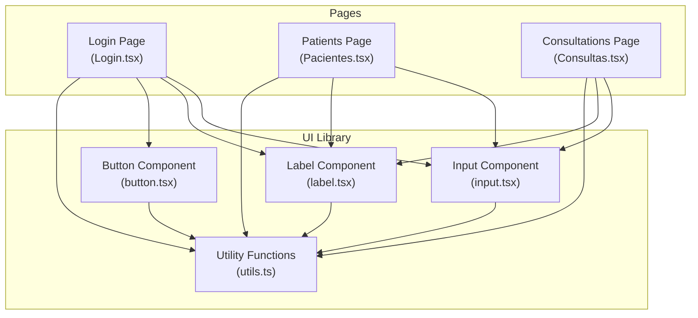
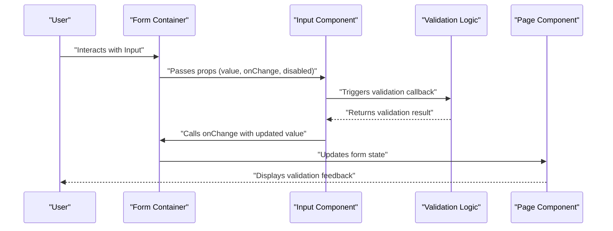
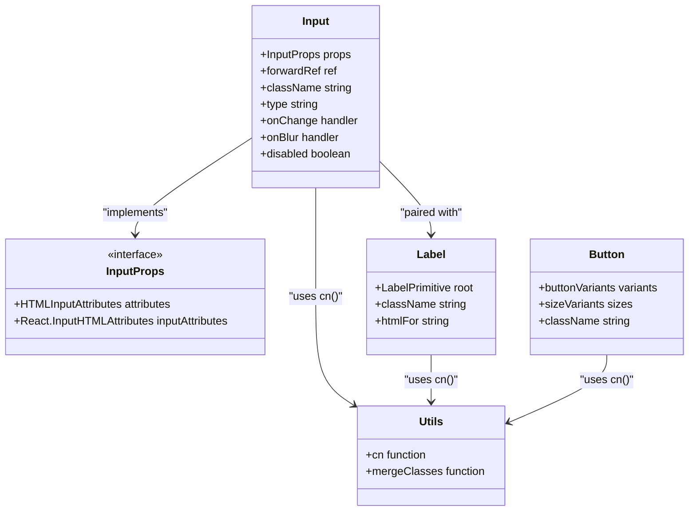
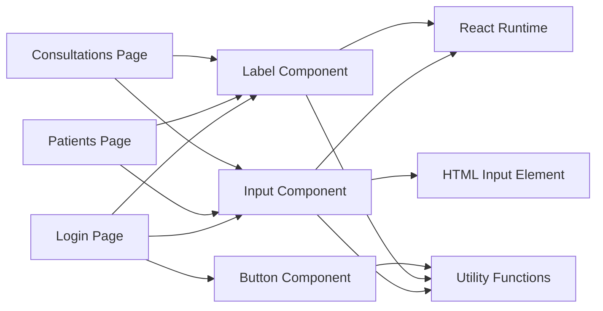

# Input Component

<cite>
**Referenced Files in This Document**
- [input.tsx](file://src/components/ui/input.tsx)
- [utils.ts](file://src/lib/utils.ts)
- [Login.tsx](file://src/pages/Login.tsx)
- [Pacientes.tsx](file://src/pages/Pacientes.tsx)
- [Consultas.tsx](file://src/pages/Consultas.tsx)
- [label.tsx](file://src/components/ui/label.tsx)
- [button.tsx](file://src/components/ui/button.tsx)
</cite>

## Table of Contents
1. [Introduction](#introduction)
2. [Project Structure](#project-structure)
3. [Core Components](#core-components)
4. [Architecture Overview](#architecture-overview)
5. [Detailed Component Analysis](#detailed-component-analysis)
6. [Dependency Analysis](#dependency-analysis)
7. [Performance Considerations](#performance-considerations)
8. [Troubleshooting Guide](#troubleshooting-guide)
9. [Conclusion](#conclusion)
10. [Appendices](#appendices)

## Introduction
This document provides comprehensive documentation for the Input component used across the NexaMed Frontend application. It covers component variants, sizes, disabled states, validation feedback patterns, integration with form handling and error states, accessibility features, usage examples, best practices for input field design, user experience patterns, and responsive behavior.

## Project Structure
The Input component is part of the shared UI library and is used throughout various pages and forms in the application. It integrates with utility functions for class merging and is commonly paired with labels and buttons for form construction.

**Diagram sources**
- [input.tsx:1-24](file://src/components/ui/input.tsx#L1-L24)
- [utils.ts](file://src/lib/utils.ts)
- [Login.tsx:1-93](file://src/pages/Login.tsx#L1-L93)
- [Pacientes.tsx](file://src/pages/Pacientes.tsx)
- [Consultas.tsx](file://src/pages/Consultas.tsx)
- [label.tsx:1-23](file://src/components/ui/label.tsx#L1-L23)
- [button.tsx:1-32](file://src/components/ui/button.tsx#L1-L32)

**Section sources**
- [input.tsx:1-24](file://src/components/ui/input.tsx#L1-L24)
- [utils.ts](file://src/lib/utils.ts)
- [Login.tsx:1-93](file://src/pages/Login.tsx#L1-L93)

## Core Components
The Input component is a thin wrapper around the native HTML input element with consistent styling and accessibility attributes. It accepts all standard input attributes and merges additional classes via a utility function.

Key characteristics:
- Inherits all HTML input attributes through a TypeScript interface extending InputHTMLAttributes
- Uses a forwardRef pattern for DOM access
- Merges base styles with optional custom classes
- Includes focus-visible ring styling and disabled state handling
- Provides smooth transitions for interactive states

**Section sources**
- [input.tsx:4-21](file://src/components/ui/input.tsx#L4-L21)

## Architecture Overview
The Input component follows a unidirectional data flow pattern typical of React applications. It receives props from parent components, manages internal state when needed, and triggers callbacks for form updates.

**Diagram sources**
- [input.tsx:7-20](file://src/components/ui/input.tsx#L7-L20)
- [Login.tsx:18-27](file://src/pages/Login.tsx#L18-L27)

## Detailed Component Analysis

### Component Definition and Props
The Input component defines a clean interface that extends standard input HTML attributes, enabling seamless integration with form libraries and validation systems.

Implementation highlights:
- ForwardRef enables imperative access to the underlying input element
- Base class set provides consistent spacing, borders, and focus states
- Transition effects enhance user feedback during interactions
- Disabled state automatically applies appropriate cursor and opacity styles

**Section sources**
- [input.tsx:4-21](file://src/components/ui/input.tsx#L4-L21)

### Variants and Sizes
While the Input component itself does not define explicit variants or sizes, it supports customization through className prop and integrates with utility functions for consistent styling across the application.

Common customization patterns observed in the codebase:
- Width adjustments using utility classes
- Padding modifications for icon placement
- Focus ring customization through theme variables
- Responsive sizing via container utilities

**Section sources**
- [input.tsx:12-15](file://src/components/ui/input.tsx#L12-L15)

### Disabled States
The component handles disabled states through native HTML attributes and CSS classes, ensuring consistent behavior across different input types and form contexts.

Disabled state characteristics:
- Automatic cursor change to not-allowed
- Reduced opacity for visual indication
- Preserved focus styles for accessibility compliance
- Maintained keyboard navigation support

**Section sources**
- [input.tsx](file://src/components/ui/input.tsx#L13)

### Validation Feedback Patterns
The Input component integrates with form validation through several patterns demonstrated in the application:

1. **Inline Validation**: Real-time validation feedback displayed alongside input fields
2. **Form-Level Validation**: Aggregated validation state managed at the form container level
3. **Visual Indicators**: Color-coded feedback using Tailwind utility classes
4. **Accessibility Support**: Proper ARIA attributes and screen reader announcements

Example validation scenarios:
- Required field validation with immediate feedback
- Pattern-based validation for specific input formats
- Async validation for server-side checks
- Custom validation messages and icons

**Section sources**
- [Login.tsx:18-27](file://src/pages/Login.tsx#L18-L27)

### Integration with Form Handling
The Input component works seamlessly with React's form handling patterns, supporting both controlled and uncontrolled approaches.

Integration patterns:
- Controlled components with useState hooks
- Form libraries integration (e.g., React Hook Form)
- Native form submission handling
- Event delegation for performance optimization

**Section sources**
- [Login.tsx:13-27](file://src/pages/Login.tsx#L13-L27)

### Accessibility Features
The component maintains full accessibility compliance through several built-in mechanisms:

- Proper labeling via associated Label components
- Focus management and keyboard navigation support
- Screen reader compatibility with semantic markup
- High contrast and color accessibility considerations
- ARIA attributes for dynamic content updates

**Section sources**
- [label.tsx:10-20](file://src/components/ui/label.tsx#L10-L20)
- [input.tsx:10-19](file://src/components/ui/input.tsx#L10-L19)

### Usage Examples

#### Basic Text Input
Demonstrates fundamental usage with standard text input type and basic styling.

**Section sources**
- [Login.tsx:60-64](file://src/pages/Login.tsx#L60-L64)

#### Password Input with Visibility Toggle
Shows advanced usage with dynamic type switching and integrated iconography.

**Section sources**
- [Login.tsx:66-91](file://src/pages/Login.tsx#L66-L91)

#### Input with Icons and Custom Styling
Illustrates enhanced styling through padding adjustments and icon placement.

**Section sources**
- [Login.tsx:68-78](file://src/pages/Login.tsx#L68-L78)

### Component Relationships

**Diagram sources**
- [input.tsx:4-21](file://src/components/ui/input.tsx#L4-L21)
- [utils.ts](file://src/lib/utils.ts)
- [label.tsx:10-20](file://src/components/ui/label.tsx#L10-L20)
- [button.tsx:6-31](file://src/components/ui/button.tsx#L6-L31)

## Dependency Analysis
The Input component has minimal external dependencies, relying primarily on React's built-in features and utility functions for class merging.

**Diagram sources**
- [input.tsx:1-3](file://src/components/ui/input.tsx#L1-L3)
- [utils.ts](file://src/lib/utils.ts)
- [Login.tsx:4-7](file://src/pages/Login.tsx#L4-L7)
- [Pacientes.tsx](file://src/pages/Pacientes.tsx)
- [Consultas.tsx](file://src/pages/Consultas.tsx)

**Section sources**
- [input.tsx:1-3](file://src/components/ui/input.tsx#L1-L3)
- [utils.ts](file://src/lib/utils.ts)

## Performance Considerations
The Input component is designed for optimal performance through several mechanisms:

- Lightweight rendering with minimal re-renders
- Efficient class merging using utility functions
- ForwardRef eliminates unnecessary wrapper components
- CSS transitions optimized for smooth user interactions
- Native HTML attributes avoid custom event overhead

Best practices for maintaining performance:
- Avoid excessive re-renders by using stable prop references
- Leverage memoization for expensive validation calculations
- Use controlled components judiciously to prevent unnecessary updates
- Optimize custom styling to minimize CSS specificity conflicts

## Troubleshooting Guide

### Common Issues and Solutions

**Issue**: Input not responding to user interactions
- Verify that the component is not marked as disabled
- Check for conflicting CSS overrides
- Ensure proper event handler binding

**Issue**: Validation feedback not displaying
- Confirm that validation handlers are properly connected
- Verify that error state is being passed to the component
- Check for CSS class conflicts affecting visibility

**Issue**: Accessibility problems with screen readers
- Ensure proper association with Label components
- Verify that aria-describedby attributes are set correctly
- Test with actual assistive technologies

**Issue**: Styling conflicts with custom themes
- Review the order of CSS class application
- Check for !important declarations overriding styles
- Verify Tailwind configuration compatibility

**Section sources**
- [input.tsx](file://src/components/ui/input.tsx#L13)
- [label.tsx:15-19](file://src/components/ui/label.tsx#L15-L19)

## Conclusion
The Input component provides a robust foundation for form interactions in the NexaMed application. Its design emphasizes accessibility, performance, and flexibility while maintaining consistency with the overall design system. The component's integration with utility functions and form handling patterns demonstrates best practices for React component development.

Key strengths include:
- Clean separation of concerns through forwardRef pattern
- Comprehensive accessibility support
- Flexible styling through utility-based approach
- Seamless integration with form validation systems
- Minimal performance overhead

Future enhancements could include expanded variant support, additional validation integrations, and enhanced customization options while maintaining the component's core principles.

## Appendices

### Best Practices for Input Field Design
- Maintain consistent spacing and alignment across input groups
- Provide clear visual hierarchy with appropriate typography
- Ensure sufficient color contrast for accessibility compliance
- Implement responsive behavior for mobile and desktop contexts
- Use consistent animation timing for smooth user experience

### User Experience Patterns
- Immediate feedback for user actions and validation results
- Clear error messaging with actionable guidance
- Consistent focus states and keyboard navigation support
- Appropriate input masking for sensitive data
- Adaptive layouts that work across device sizes

### Responsive Behavior Guidelines
- Mobile-first approach with appropriate touch targets
- Flexible width options for different form layouts
- Adaptive font sizes for various screen densities
- Touch-friendly interaction areas for mobile devices
- Consideration for portrait and landscape orientations