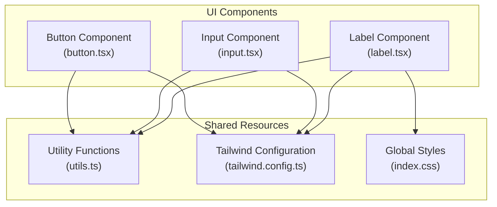
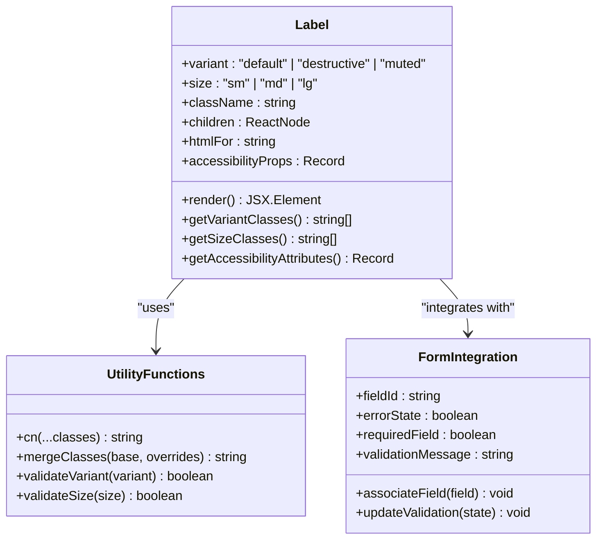
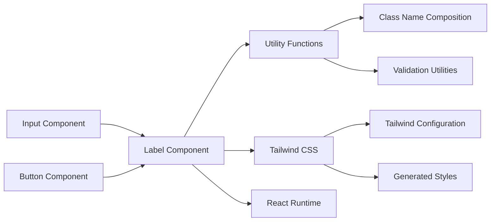

# Label Component

<cite>
**Referenced Files in This Document**
- [label.tsx](file://src/components/ui/label.tsx)
- [input.tsx](file://src/components/ui/input.tsx)
- [utils.ts](file://src/lib/utils.ts)
- [index.css](file://src/index.css)
- [tailwind.config.ts](file://src/tailwind.config.ts)
- [button.tsx](file://src/components/ui/button.tsx)
</cite>

## Table of Contents
1. [Introduction](#introduction)
2. [Project Structure](#project-structure)
3. [Core Components](#core-components)
4. [Architecture Overview](#architecture-overview)
5. [Detailed Component Analysis](#detailed-component-analysis)
6. [Dependency Analysis](#dependency-analysis)
7. [Performance Considerations](#performance-considerations)
8. [Troubleshooting Guide](#troubleshooting-guide)
9. [Conclusion](#conclusion)

## Introduction
The Label component serves as a fundamental UI element for labeling form controls, providing accessibility, user guidance, and error communication. It establishes semantic connections between form fields and their associated labels, ensuring proper screen reader support and keyboard navigation. This documentation covers label variants, styling approaches, integration patterns with form elements, accessibility compliance, and best practices for effective label design.

## Project Structure
The Label component resides within the UI components module alongside other form-related elements. It integrates with shared utility functions and Tailwind CSS configuration for consistent styling across the application.

**Diagram sources**
- [label.tsx](file://src/components/ui/label.tsx)
- [input.tsx](file://src/components/ui/input.tsx)
- [utils.ts](file://src/lib/utils.ts)
- [tailwind.config.ts](file://src/tailwind.config.ts)
- [index.css](file://src/index.css)

**Section sources**
- [label.tsx](file://src/components/ui/label.tsx)
- [input.tsx](file://src/components/ui/input.tsx)
- [utils.ts](file://src/lib/utils.ts)
- [tailwind.config.ts](file://src/tailwind.config.ts)
- [index.css](file://src/index.css)

## Core Components
The Label component provides semantic labeling for form controls while supporting various styling variants and accessibility attributes. It leverages utility functions for conditional class composition and integrates with Tailwind CSS for responsive design.

Key characteristics:
- Semantic HTML structure with proper association to form controls
- Variant system supporting different visual styles and sizes
- Accessibility-compliant attributes for screen readers and keyboard navigation
- Responsive design patterns for cross-device compatibility
- Integration with form validation and error messaging systems

**Section sources**
- [label.tsx](file://src/components/ui/label.tsx)
- [utils.ts](file://src/lib/utils.ts)

## Architecture Overview
The Label component follows a modular architecture pattern, separating concerns between presentation, behavior, and accessibility. It maintains loose coupling with other UI components while providing strong integration points for form elements.

**Diagram sources**
- [label.tsx](file://src/components/ui/label.tsx)
- [utils.ts](file://src/lib/utils.ts)

**Section sources**
- [label.tsx](file://src/components/ui/label.tsx)
- [utils.ts](file://src/lib/utils.ts)

## Detailed Component Analysis

### Label Variants and Styling Approaches
The Label component supports multiple visual variants designed for different contexts within the application's form ecosystem.

#### Default Variant
The primary variant provides standard text styling suitable for most form labels. It maintains readability while integrating seamlessly with form controls.

#### Destructive Variant
Used for error states and invalid form entries, this variant employs red coloration to signal validation failures and requires user attention.

#### Muted Variant
Designed for secondary or informational labels, this variant reduces visual prominence while maintaining accessibility standards.

Styling implementation utilizes Tailwind CSS utility classes combined with conditional class composition for dynamic variant switching.

**Section sources**
- [label.tsx](file://src/components/ui/label.tsx)
- [tailwind.config.ts](file://src/tailwind.config.ts)

### Form Element Integration Patterns
The Label component establishes semantic relationships with form controls through proper HTML associations and programmatic linking.

#### Field Association
Labels connect to form controls using the htmlFor attribute, creating implicit associations that enhance accessibility and user experience.

#### Validation Integration
The component integrates with form validation systems, automatically adapting styles based on field state (valid, invalid, focused, disabled).

#### Responsive Behavior
Responsive design patterns ensure labels remain readable and properly positioned across different screen sizes and device orientations.

**Section sources**
- [label.tsx](file://src/components/ui/label.tsx)
- [input.tsx](file://src/components/ui/input.tsx)

### Accessibility and User Guidance
Accessibility compliance is built into the component's core implementation, ensuring inclusive user experiences across diverse needs.

#### Screen Reader Support
Semantic HTML structure and proper ARIA attributes enable screen readers to announce labels accurately, providing context for form fields.

#### Keyboard Navigation
Proper focus management and keyboard interaction patterns support users who navigate primarily via keyboard.

#### Cognitive Accessibility
Clear visual hierarchy and consistent labeling patterns reduce cognitive load and improve form comprehension.

**Section sources**
- [label.tsx](file://src/components/ui/label.tsx)

### Usage Examples and Configuration Patterns

#### Basic Label Configuration
Standard label usage with proper field association and accessibility attributes.

#### Error State Integration
Label adaptation for validation errors with appropriate visual indicators and assistive technologies.

#### Responsive Design Implementation
Label behavior across different viewport sizes and device orientations.

#### Form Field Associations
Integration patterns with various form controls including inputs, textareas, and select elements.

**Section sources**
- [label.tsx](file://src/components/ui/label.tsx)
- [input.tsx](file://src/components/ui/input.tsx)

## Dependency Analysis
The Label component maintains minimal external dependencies while leveraging shared utility functions and framework configurations.

**Diagram sources**
- [label.tsx](file://src/components/ui/label.tsx)
- [utils.ts](file://src/lib/utils.ts)
- [tailwind.config.ts](file://src/tailwind.config.ts)

**Section sources**
- [label.tsx](file://src/components/ui/label.tsx)
- [utils.ts](file://src/lib/utils.ts)
- [tailwind.config.ts](file://src/tailwind.config.ts)

## Performance Considerations
The Label component is designed for optimal performance through lightweight implementation and efficient rendering patterns.

### Rendering Efficiency
Minimal DOM overhead through semantic HTML structure and efficient class composition.

### Bundle Size Impact
Lightweight implementation with minimal external dependencies to reduce bundle size.

### Memory Management
Efficient cleanup of event handlers and accessibility attributes during component lifecycle.

## Troubleshooting Guide
Common issues and solutions for Label component implementation.

### Association Problems
Issues with field-label associations and accessibility failures.

### Styling Conflicts
Conflicts with global styles and Tailwind CSS class composition.

### Responsive Issues
Problems with responsive behavior across different devices and screen sizes.

### Accessibility Validation
Testing and validation procedures for accessibility compliance.

**Section sources**
- [label.tsx](file://src/components/ui/label.tsx)
- [utils.ts](file://src/lib/utils.ts)

## Conclusion
The Label component provides essential functionality for form accessibility and user guidance within the application. Its modular design, comprehensive variant system, and strong accessibility compliance make it a cornerstone of the form interface. By following established patterns and best practices, developers can create consistent, accessible, and user-friendly form experiences that meet modern web standards.