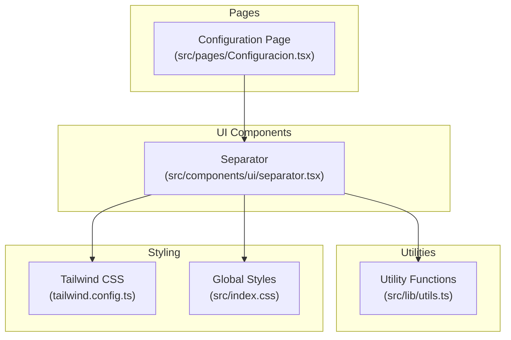
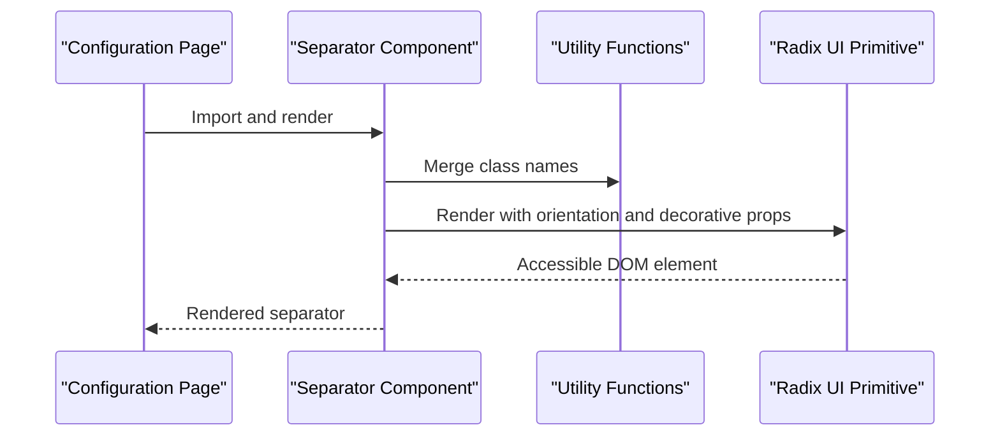
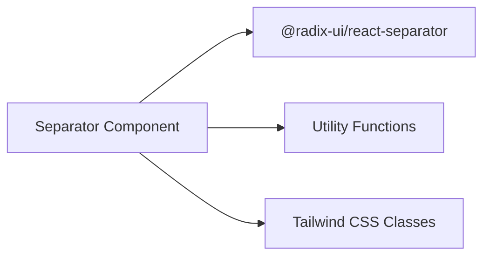

# Separator Component

<cite>
**Referenced Files in This Document**
- [separator.tsx](file://src/components/ui/separator.tsx)
- [Configuracion.tsx](file://src/pages/Configuracion.tsx)
- [utils.ts](file://src/lib/utils.ts)
- [package.json](file://package.json)
- [tailwind.config.ts](file://tailwind.config.ts)
- [index.css](file://src/index.css)
</cite>

## Table of Contents
1. [Introduction](#introduction)
2. [Project Structure](#project-structure)
3. [Core Components](#core-components)
4. [Architecture Overview](#architecture-overview)
5. [Detailed Component Analysis](#detailed-component-analysis)
6. [Dependency Analysis](#dependency-analysis)
7. [Performance Considerations](#performance-considerations)
8. [Troubleshooting Guide](#troubleshooting-guide)
9. [Conclusion](#conclusion)

## Introduction
The Separator component is a UI primitive used to visually separate sections of content while maintaining accessibility and semantic correctness. It provides a lightweight, configurable element that renders either horizontal or vertical dividers, commonly used in layouts, forms, navigation, and content organization scenarios. This documentation explains the component's variants, styling approaches, spacing considerations, and best practices for usage in medical interfaces.

## Project Structure
The Separator component is located within the UI components module and integrates with shared utility functions and Tailwind CSS for styling. The component is currently used in the Configuration page, demonstrating practical integration with other layout components.

**Diagram sources**
- [separator.tsx:1-28](file://src/components/ui/separator.tsx#L1-L28)
- [Configuracion.tsx:1-30](file://src/pages/Configuracion.tsx#L1-L30)
- [utils.ts:1-50](file://src/lib/utils.ts#L1-L50)
- [tailwind.config.ts:1-50](file://tailwind.config.ts#L1-L50)
- [index.css:1-50](file://src/index.css#L1-L50)

**Section sources**
- [separator.tsx:1-28](file://src/components/ui/separator.tsx#L1-L28)
- [Configuracion.tsx:1-30](file://src/pages/Configuracion.tsx#L1-L30)

## Core Components
The Separator component is a forward-ref wrapper around a Radix UI primitive, exposing orientation and decorative props with sensible defaults. It applies Tailwind utility classes for consistent sizing and color, inheriting design tokens from the global theme.

Key characteristics:
- Orientation variants: horizontal (default) and vertical
- Decorative flag: defaults to true for accessibility semantics
- Styling: uses a thin border-like appearance via background color and dimension classes
- Composition: leverages a shared utility function for merging class names

Implementation highlights:
- Props include orientation and decorative flags with default values
- Conditional class application based on orientation
- Forwarded ref for DOM access and integration with parent components
- Accessibility-aware defaults aligned with Radix UI primitives

**Section sources**
- [separator.tsx:5-26](file://src/components/ui/separator.tsx#L5-L26)

## Architecture Overview
The Separator component participates in a layered architecture where UI primitives integrate with utility functions and Tailwind CSS for styling. The component is consumed by page-level components, demonstrating its role in layout organization.

**Diagram sources**
- [Configuracion.tsx:1-30](file://src/pages/Configuracion.tsx#L1-L30)
- [separator.tsx:1-28](file://src/components/ui/separator.tsx#L1-L28)
- [utils.ts:1-50](file://src/lib/utils.ts#L1-L50)

## Detailed Component Analysis

### Component Definition and Props
The Separator component defines a minimal set of props with clear defaults:
- orientation: "horizontal" | "vertical" (default: "horizontal")
- decorative: boolean (default: true)
- className: optional string for additional styling
- Additional props passed through to the underlying primitive

Behavioral notes:
- Horizontal orientation renders a thin horizontal line spanning width
- Vertical orientation renders a thin vertical line spanning height
- Decorative flag ensures screen readers treat it as presentational
- Background color derives from the "border" token for consistent theming

**Section sources**
- [separator.tsx:9-21](file://src/components/ui/separator.tsx#L9-L21)

### Styling and Spacing
The component applies Tailwind utility classes for consistent spacing and visual presentation:
- Dimension classes: "h-[1px] w-full" for horizontal, "h-full w-[1px]" for vertical
- Background class: "bg-border" aligns with theme tokens
- Shrink behavior: "shrink-0" prevents unexpected resizing in flex layouts
- Optional className allows consumers to override styles safely

Spacing considerations:
- Thin borders (1px) minimize visual weight while maintaining separation clarity
- Full-width or full-height expansion ensures clean alignment within containers
- Flexibility to stack separators horizontally and vertically for complex layouts

**Section sources**
- [separator.tsx:17-21](file://src/components/ui/separator.tsx#L17-L21)

### Integration Patterns
The component is imported and rendered within the Configuration page, demonstrating typical usage patterns:
- Placement within form sections to separate logical groups
- Use alongside other UI components for consistent layout rhythm
- Responsive behavior inherited from container layouts

**Section sources**
- [Configuracion.tsx:1-30](file://src/pages/Configuracion.tsx#L1-L30)

### Accessibility and Semantic Role
The component defaults to decorative mode, ensuring assistive technologies interpret it as a visual separator rather than structural content. This aligns with accessibility best practices for non-essential dividers.

**Section sources**
- [separator.tsx:10-16](file://src/components/ui/separator.tsx#L10-L16)

### Medical Interface Best Practices
For medical applications, separators should:
- Maintain high contrast against backgrounds for readability
- Avoid introducing visual clutter in dense clinical interfaces
- Support clear visual hierarchy without overwhelming users
- Align with established medical UI conventions (e.g., section dividers in patient records)
- Preserve accessibility compliance for diverse user needs

[No sources needed since this section provides general guidance]

## Dependency Analysis
The Separator component relies on external and internal dependencies:
- Radix UI primitive for accessible, cross-platform separator behavior
- Utility functions for safe class name composition
- Tailwind CSS for styling and design token integration

**Diagram sources**
- [separator.tsx:1-3](file://src/components/ui/separator.tsx#L1-L3)
- [utils.ts:1-50](file://src/lib/utils.ts#L1-L50)

**Section sources**
- [separator.tsx:1-3](file://src/components/ui/separator.tsx#L1-L3)
- [package.json:1-50](file://package.json#L1-L50)

## Performance Considerations
- Lightweight rendering: The component uses minimal DOM nodes and simple CSS classes
- Efficient styling: Tailwind utility classes avoid runtime computation
- Ref forwarding: Enables efficient DOM access without extra wrappers
- Bundle impact: Minimal footprint due to small implementation and single dependency

[No sources needed since this section provides general guidance]

## Troubleshooting Guide
Common issues and resolutions:
- Incorrect orientation: Verify orientation prop value matches intended layout direction
- Visual overlap in flex containers: Ensure parent layout supports full-width or full-height expansion
- Accessibility warnings: Keep decorative flag enabled unless the separator carries meaningful content
- Styling conflicts: Use className overrides carefully; prefer theme tokens over hard-coded values
- Responsive behavior: Confirm container layouts adapt separators appropriately across breakpoints

**Section sources**
- [separator.tsx:10-21](file://src/components/ui/separator.tsx#L10-L21)

## Conclusion
The Separator component provides a focused, accessible solution for content separation across horizontal and vertical orientations. Its integration with utility functions and Tailwind CSS ensures consistent styling and performance, while its minimal API enables flexible usage in diverse contexts. For medical interfaces, the component supports clear visual hierarchy and accessibility requirements when applied thoughtfully within structured layouts.