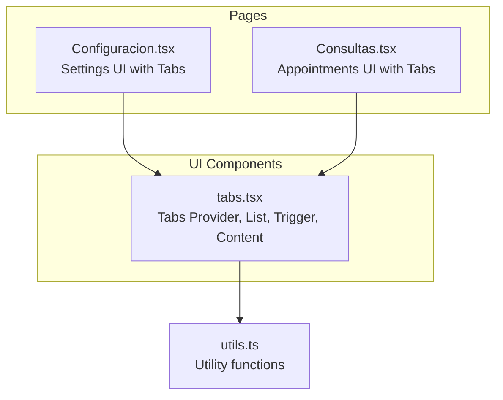
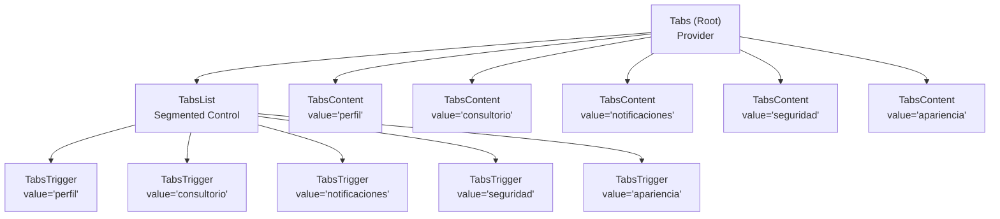
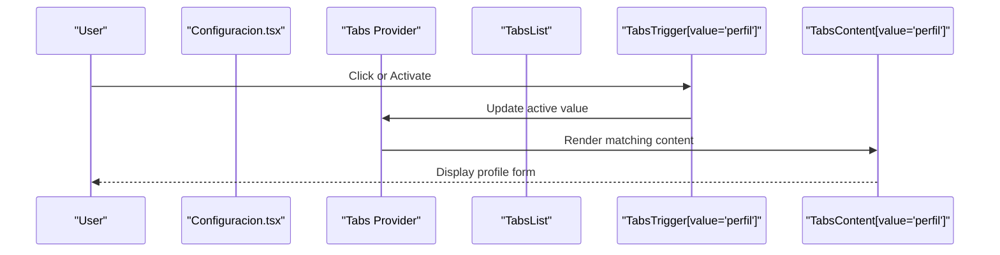
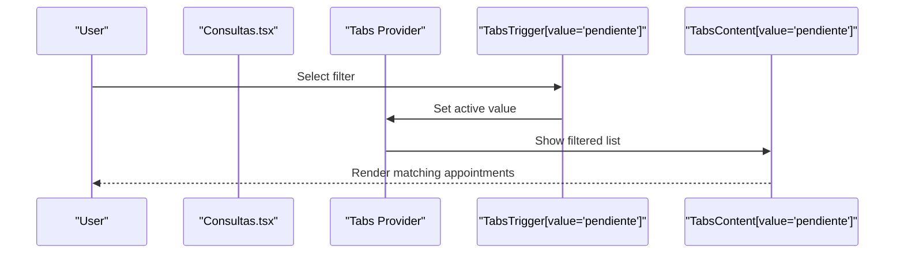
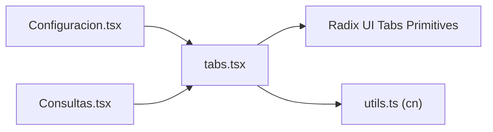

# Tabs Component

<cite>
**Referenced Files in This Document**
- [tabs.tsx](file://src/components/ui/tabs.tsx)
- [Configuracion.tsx](file://src/pages/Configuracion.tsx)
- [Consultas.tsx](file://src/pages/Consultas.tsx)
- [utils.ts](file://src/lib/utils.ts)
</cite>

## Table of Contents
1. [Introduction](#introduction)
2. [Project Structure](#project-structure)
3. [Core Components](#core-components)
4. [Architecture Overview](#architecture-overview)
5. [Detailed Component Analysis](#detailed-component-analysis)
6. [Dependency Analysis](#dependency-analysis)
7. [Performance Considerations](#performance-considerations)
8. [Troubleshooting Guide](#troubleshooting-guide)
9. [Conclusion](#conclusion)
10. [Appendices](#appendices)

## Introduction
This document provides comprehensive documentation for the Tabs component system used in the NexaMed frontend. It covers the Tabs provider, list, trigger, and content components, explains state management, keyboard navigation, and accessibility features. It also includes usage examples demonstrating different tab arrangements, dynamic content loading, and responsive behavior, along with best practices tailored for medical applications.

## Project Structure
The Tabs component is implemented as a thin wrapper around Radix UI's Tabs primitives. It is located under the UI components directory and is consumed by several pages, notably the configuration page and the consultations page.

**Diagram sources**
- [tabs.tsx:1-52](file://src/components/ui/tabs.tsx#L1-L52)
- [Configuracion.tsx:1-300](file://src/pages/Configuracion.tsx#L1-L300)
- [Consultas.tsx:1-100](file://src/pages/Consultas.tsx#L1-L100)
- [utils.ts:1-200](file://src/lib/utils.ts#L1-L200)

**Section sources**
- [tabs.tsx:1-52](file://src/components/ui/tabs.tsx#L1-L52)
- [Configuracion.tsx:1-300](file://src/pages/Configuracion.tsx#L1-L300)
- [Consultas.tsx:1-100](file://src/pages/Consultas.tsx#L1-L100)

## Core Components
The Tabs system consists of four primary parts:
- Tabs: The provider/root component that manages global state and exposes context to children.
- TabsList: The container for tab triggers, typically rendered as a segmented control.
- TabsTrigger: Individual tab buttons that activate content via their value prop.
- TabsContent: The content panel bound to a specific trigger value.

Implementation highlights:
- Uses Radix UI primitives for robust accessibility and keyboard navigation.
- Applies Tailwind-based styling classes for consistent visual behavior.
- Exposes forwardRef for DOM access and supports className composition.

Key behaviors:
- Active state is controlled centrally by the provider and reflected via data attributes.
- Focus management ensures keyboard navigation works predictably across triggers.
- Disabled triggers are handled gracefully with pointer-events and opacity adjustments.

**Section sources**
- [tabs.tsx:1-52](file://src/components/ui/tabs.tsx#L1-L52)

## Architecture Overview
The Tabs architecture leverages Radix UI's unstyled primitives to provide accessible, customizable tabbing behavior. The provider coordinates state, while list, trigger, and content components consume and render based on that state.

**Diagram sources**
- [tabs.tsx:5-50](file://src/components/ui/tabs.tsx#L5-L50)
- [Configuracion.tsx:33-293](file://src/pages/Configuracion.tsx#L33-L293)

## Detailed Component Analysis

### Provider and List
- Provider (Tabs): Central state manager for active tab value. It accepts children and maintains selection state.
- List (TabsList): Renders as a flex container with rounded background and muted styling. It hosts trigger buttons and aligns them horizontally.

Usage pattern:
- Place all triggers inside the list.
- Keep content panels outside the list to avoid layout conflicts.

Accessibility and keyboard navigation:
- Triggers receive focus and can be navigated using arrow keys.
- Activation occurs on Enter/Space or click.
- Disabled triggers are skipped during keyboard navigation.

**Section sources**
- [tabs.tsx:5-20](file://src/components/ui/tabs.tsx#L5-L20)

### Trigger
- Trigger (TabsTrigger): Individual interactive element with active state styling and focus rings.
- Active state styling is applied via data attributes set by the provider.
- Supports className composition for custom styling and responsive variants.

Responsive behavior:
- Example usage demonstrates hidden text on small screens with icons-only triggers for compact layouts.

**Section sources**
- [tabs.tsx:22-35](file://src/components/ui/tabs.tsx#L22-L35)
- [Configuracion.tsx:33-46](file://src/pages/Configuracion.tsx#L33-L46)

### Content
- Content (TabsContent): Panel that renders only when its associated trigger is active.
- Includes focus-visible ring styles for keyboard users.
- Can wrap complex content like cards and forms.

Dynamic content loading:
- Content panels can host async data fetching and conditional rendering without affecting other tabs.

**Section sources**
- [tabs.tsx:37-50](file://src/components/ui/tabs.tsx#L37-L50)
- [Configuracion.tsx:48-292](file://src/pages/Configuracion.tsx#L48-L292)

### Usage Examples

#### Example 1: Settings with Icon and Text
- Arrangement: Horizontal list with icon and text for larger screens, text hidden on smaller screens.
- Content panels: Profile, Office, Notifications, Security, Appearance.

**Diagram sources**
- [Configuracion.tsx:33-115](file://src/pages/Configuracion.tsx#L33-L115)
- [tabs.tsx:5-50](file://src/components/ui/tabs.tsx#L5-L50)

**Section sources**
- [Configuracion.tsx:33-115](file://src/pages/Configuracion.tsx#L33-L115)

#### Example 2: Appointments with Filter Tabs
- Arrangement: Horizontal tabs for filtering appointment lists.
- Dynamic content: Tab content updates based on selected filter value.

**Diagram sources**
- [Consultas.tsx:1-100](file://src/pages/Consultas.tsx#L1-L100)
- [tabs.tsx:5-50](file://src/components/ui/tabs.tsx#L5-L50)

**Section sources**
- [Consultas.tsx:1-100](file://src/pages/Consultas.tsx#L1-L100)

### Accessibility Features
- Keyboard navigation: Arrow keys move focus between triggers; Enter/Space activates.
- Focus management: Focusable triggers with visible focus rings.
- Screen reader support: Semantic roles and ARIA attributes provided by Radix UI.
- Disabled state: Properly indicated with reduced opacity and disabled pointer events.

Best practices:
- Always pair a trigger with a content panel sharing the same value.
- Use descriptive values and labels for screen readers.
- Ensure sufficient color contrast for active/inactive states.

**Section sources**
- [tabs.tsx:22-50](file://src/components/ui/tabs.tsx#L22-L50)

### State Management
- Centralized state: The provider holds the active value and propagates it down.
- Controlled activation: Changing the active value programmatically updates the UI.
- Data attributes: Active state is exposed via data attributes for styling hooks.

Complexity considerations:
- O(1) activation switching.
- Minimal re-rendering of content panels; only the active panel is mounted.

**Section sources**
- [tabs.tsx:5-50](file://src/components/ui/tabs.tsx#L5-L50)

### Responsive Behavior
- Icon-only triggers on small screens preserve usability while saving space.
- Tailwind utilities enable responsive text visibility and spacing.

Example pattern:
- Use hidden/sm:inline utilities to adapt text display based on breakpoint.

**Section sources**
- [Configuracion.tsx:33-46](file://src/pages/Configuracion.tsx#L33-L46)

### Best Practices for Medical Applications
- Clarity: Use concise, medical-appropriate labels for tabs (e.g., "Profile", "Office", "Security").
- Consistency: Maintain uniform spacing and typography across content panels.
- Accessibility: Ensure all triggers and content areas are keyboard accessible and screen-reader friendly.
- Performance: Lazy-load heavy content panels to minimize initial render time.
- Safety: Avoid destructive actions in inactive panels; confirm critical actions with modals.
- Privacy: Restrict sensitive content visibility to authorized users only.

[No sources needed since this section provides general guidance]

## Dependency Analysis
The Tabs component depends on Radix UI primitives and utility functions for class merging. Pages import Tabs and compose content panels as needed.

**Diagram sources**
- [tabs.tsx:1-5](file://src/components/ui/tabs.tsx#L1-L5)
- [utils.ts:1-200](file://src/lib/utils.ts#L1-L200)
- [Configuracion.tsx:1-300](file://src/pages/Configuracion.tsx#L1-L300)
- [Consultas.tsx:1-100](file://src/pages/Consultas.tsx#L1-L100)

**Section sources**
- [tabs.tsx:1-5](file://src/components/ui/tabs.tsx#L1-L5)
- [utils.ts:1-200](file://src/lib/utils.ts#L1-L200)

## Performance Considerations
- Prefer keeping inactive content mounted only if it needs to retain state; otherwise, allow unmounting to save memory.
- Use lightweight content in frequently accessed tabs to reduce render time.
- Avoid heavy computations in content panels during initial mount; defer where possible.
- Leverage CSS transitions for smooth activation effects without JavaScript overhead.

[No sources needed since this section provides general guidance]

## Troubleshooting Guide
Common issues and resolutions:
- Content not showing: Ensure each TabsContent has a matching value with a TabsTrigger inside the same Tabs provider.
- Triggers not activating: Verify the provider wraps both the list and content panels.
- Focus issues: Confirm focus-visible ring styles are applied and that disabled triggers are not focusable.
- Styling conflicts: Check className composition and ensure data-state selectors are not overridden unintentionally.

**Section sources**
- [tabs.tsx:5-50](file://src/components/ui/tabs.tsx#L5-L50)

## Conclusion
The Tabs component system in NexaMed provides a robust, accessible foundation for organizing complex medical interfaces. By leveraging Radix UI primitives and Tailwind-based styling, it enables flexible layouts, responsive designs, and strong keyboard navigation. Following the documented best practices ensures reliable user experiences across diverse medical workflows.

[No sources needed since this section summarizes without analyzing specific files]

## Appendices

### API Reference
- Tabs: Provider component managing active state.
- TabsList: Container for triggers.
- TabsTrigger: Interactive tab button with value binding.
- TabsContent: Panel content bound to a trigger value.

**Section sources**
- [tabs.tsx:5-50](file://src/components/ui/tabs.tsx#L5-L50)