# UI Component Library

<cite>
**Referenced Files in This Document**
- [button.tsx](file://src/components/ui/button.tsx)
- [input.tsx](file://src/components/ui/input.tsx)
- [card.tsx](file://src/components/ui/card.tsx)
- [badge.tsx](file://src/components/ui/badge.tsx)
- [dropdown-menu.tsx](file://src/components/ui/dropdown-menu.tsx)
- [tabs.tsx](file://src/components/ui/tabs.tsx)
- [avatar.tsx](file://src/components/ui/avatar.tsx)
- [label.tsx](file://src/components/ui/label.tsx)
- [separator.tsx](file://src/components/ui/separator.tsx)
- [utils.ts](file://src/lib/utils.ts)
</cite>

## Table of Contents
1. [Introduction](#introduction)
2. [Project Structure](#project-structure)
3. [Core Components](#core-components)
4. [Architecture Overview](#architecture-overview)
5. [Detailed Component Analysis](#detailed-component-analysis)
6. [Dependency Analysis](#dependency-analysis)
7. [Performance Considerations](#performance-considerations)
8. [Accessibility Considerations](#accessibility-considerations)
9. [Responsive Design Patterns](#responsive-design-patterns)
10. [Integration with Radix UI and Tailwind CSS](#integration-with-radix-ui-and-tailwind-css)
11. [Usage Examples](#usage-examples)
12. [Troubleshooting Guide](#troubleshooting-guide)
13. [Conclusion](#conclusion)

## Introduction
This document describes the NexaMed UI component library, focusing on primitive components used across the application. It explains each component's API, styling approach, customization options, accessibility characteristics, and responsive behavior. The library integrates Radix UI primitives for accessible interactions and Tailwind CSS utility classes for consistent styling, with a shared utility function for composing class names.

## Project Structure
The UI components are organized under a dedicated ui folder, grouped by primitive type. Each component file exports one or more React components and, where applicable, variant configurations. Shared utilities centralize class composition and formatting helpers.

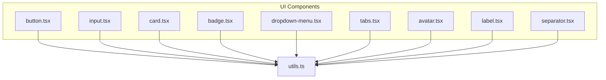

**Diagram sources**
- [button.tsx:1-54](file://src/components/ui/button.tsx#L1-L54)
- [input.tsx:1-25](file://src/components/ui/input.tsx#L1-L25)
- [card.tsx:1-76](file://src/components/ui/card.tsx#L1-L76)
- [badge.tsx:1-42](file://src/components/ui/badge.tsx#L1-L42)
- [dropdown-menu.tsx:1-190](file://src/components/ui/dropdown-menu.tsx#L1-L190)
- [tabs.tsx:1-53](file://src/components/ui/tabs.tsx#L1-L53)
- [avatar.tsx:1-48](file://src/components/ui/avatar.tsx#L1-L48)
- [label.tsx:1-24](file://src/components/ui/label.tsx#L1-L24)
- [separator.tsx:1-29](file://src/components/ui/separator.tsx#L1-L29)
- [utils.ts:1-44](file://src/lib/utils.ts#L1-L44)

**Section sources**
- [button.tsx:1-54](file://src/components/ui/button.tsx#L1-L54)
- [input.tsx:1-25](file://src/components/ui/input.tsx#L1-L25)
- [card.tsx:1-76](file://src/components/ui/card.tsx#L1-L76)
- [badge.tsx:1-42](file://src/components/ui/badge.tsx#L1-L42)
- [dropdown-menu.tsx:1-190](file://src/components/ui/dropdown-menu.tsx#L1-L190)
- [tabs.tsx:1-53](file://src/components/ui/tabs.tsx#L1-L53)
- [avatar.tsx:1-48](file://src/components/ui/avatar.tsx#L1-L48)
- [label.tsx:1-24](file://src/components/ui/label.tsx#L1-L24)
- [separator.tsx:1-29](file://src/components/ui/separator.tsx#L1-L29)
- [utils.ts:1-44](file://src/lib/utils.ts#L1-L44)

## Core Components
This section summarizes each primitive component’s purpose, props, and styling approach.

- Button
  - Purpose: Renders interactive buttons with multiple variants and sizes.
  - Key props: variant, size, asChild, plus standard button attributes.
  - Variants: default, destructive, outline, secondary, ghost, link, medical.
  - Sizes: default, sm, lg, icon.
  - Styling: Uses class variance authority for variants and sizes; integrates Tailwind utilities and focus-visible ring styles.
  - Accessibility: Inherits native button semantics; supports asChild to render as another element.

- Input
  - Purpose: Standard form input field with consistent focus and disabled states.
  - Key props: type, plus standard input attributes.
  - Styling: Tailwind utilities for padding, borders, focus rings, disabled states, and transitions.

- Card
  - Purpose: Container with header, title, description, content, and footer slots.
  - Key components: Card, CardHeader, CardTitle, CardDescription, CardContent, CardFooter.
  - Styling: Rounded container with background and border; spacing tailored per slot.

- Badge
  - Purpose: Label-like indicators with semantic variants.
  - Key props: variant, plus standard div attributes.
  - Variants: default, secondary, destructive, outline, success, warning, info.
  - Styling: Circular padding, border, and color variants via class variance authority.

- Dropdown Menu
  - Purpose: Accessible dropdown with menu, items, submenus, checkboxes, radios, labels, separators, and shortcuts.
  - Key components: Root, Trigger, Content, Item, CheckboxItem, RadioItem, Label, Separator, Portal, Sub, SubTrigger, SubContent, RadioGroup.
  - Styling: Tailwind utilities; animations powered by Radix primitives.
  - Accessibility: Full keyboard navigation, ARIA roles, and focus management.

- Tabs
  - Purpose: Tabbed interface with list, triggers, and content areas.
  - Key components: Root, List, Trigger, Content.
  - Styling: Background and active state styling for triggers; focus-visible rings.

- Avatar
  - Purpose: User or entity image with fallback initials.
  - Key components: Root, Image, Fallback.
  - Styling: Circular container with fallback background and typography.

- Label
  - Purpose: Associated text for form controls.
  - Key props: Inherits variant behavior via class variance authority.
  - Styling: Utility classes for typography and disabled state handling.

- Separator
  - Purpose: Visual divider for content blocks.
  - Key props: orientation, decorative.
  - Styling: Horizontal or vertical bar using border/background utilities.

**Section sources**
- [button.tsx:6-31](file://src/components/ui/button.tsx#L6-L31)
- [input.tsx:4-5](file://src/components/ui/input.tsx#L4-L5)
- [card.tsx:4-75](file://src/components/ui/card.tsx#L4-L75)
- [badge.tsx:5-29](file://src/components/ui/badge.tsx#L5-L29)
- [dropdown-menu.tsx:6-189](file://src/components/ui/dropdown-menu.tsx#L6-L189)
- [tabs.tsx:5-52](file://src/components/ui/tabs.tsx#L5-L52)
- [avatar.tsx:5-47](file://src/components/ui/avatar.tsx#L5-L47)
- [label.tsx:6-8](file://src/components/ui/label.tsx#L6-L8)
- [separator.tsx:5-26](file://src/components/ui/separator.tsx#L5-L26)

## Architecture Overview
The components follow a consistent pattern:
- Use Radix UI primitives for accessible base behavior.
- Compose Tailwind classes for styling and theme alignment.
- Centralize class merging with a utility function.
- Export typed props extending native HTML attributes.

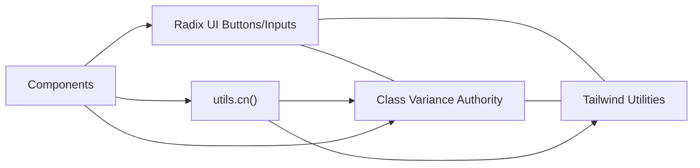

**Diagram sources**
- [button.tsx:1-54](file://src/components/ui/button.tsx#L1-L54)
- [input.tsx:1-25](file://src/components/ui/input.tsx#L1-L25)
- [badge.tsx:1-42](file://src/components/ui/badge.tsx#L1-L42)
- [tabs.tsx:1-53](file://src/components/ui/tabs.tsx#L1-L53)
- [utils.ts:4-6](file://src/lib/utils.ts#L4-L6)

**Section sources**
- [button.tsx:1-54](file://src/components/ui/button.tsx#L1-L54)
- [input.tsx:1-25](file://src/components/ui/input.tsx#L1-L25)
- [badge.tsx:1-42](file://src/components/ui/badge.tsx#L1-L42)
- [tabs.tsx:1-53](file://src/components/ui/tabs.tsx#L1-L53)
- [utils.ts:1-44](file://src/lib/utils.ts#L1-L44)

## Detailed Component Analysis

### Button
- API summary
  - Props: variant (enum), size (enum), asChild (boolean), plus standard button HTML attributes.
  - Exports: Button, buttonVariants.
- Styling approach
  - Base: Flex layout, centering, rounded corners, medium font, transitions.
  - Variants: Color and shadow combinations per variant.
  - Sizes: Height, padding, and text sizing per size.
  - Focus: Ring focus-visible outline integrated.
- Customization
  - Pass additional className to augment defaults.
  - Use asChild to render as a different element (e.g., Link) while preserving styling.
- Accessibility
  - Native button semantics; supports disabled state and focus-visible ring.

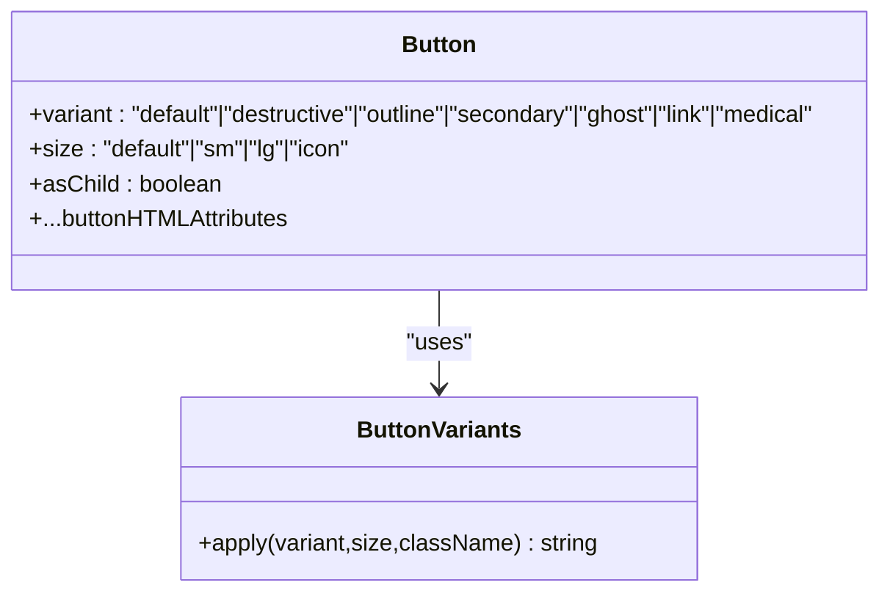

**Diagram sources**
- [button.tsx:33-51](file://src/components/ui/button.tsx#L33-L51)

**Section sources**
- [button.tsx:6-31](file://src/components/ui/button.tsx#L6-L31)
- [button.tsx:33-51](file://src/components/ui/button.tsx#L33-L51)

### Input
- API summary
  - Props: type (string), plus standard input HTML attributes.
  - Exports: Input.
- Styling approach
  - Consistent height, padding, border, placeholder, focus ring, disabled cursor/opacity, transitions.
- Customization
  - Extend className to override defaults.

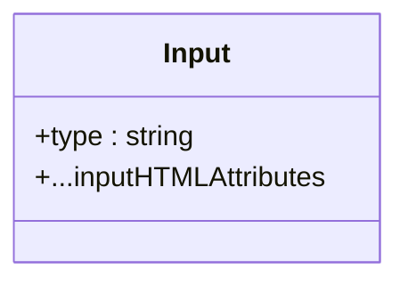

**Diagram sources**
- [input.tsx:4-22](file://src/components/ui/input.tsx#L4-L22)

**Section sources**
- [input.tsx:7-22](file://src/components/ui/input.tsx#L7-L22)

### Card
- API summary
  - Components: Card, CardHeader, CardTitle, CardDescription, CardContent, CardFooter.
  - All accept standard HTML attributes.
- Styling approach
  - Base card: rounded border, background, subtle shadow, transitions.
  - Slots: header/footer/content spacing; title typography; description muted text.
- Customization
  - className augments defaults for each slot.

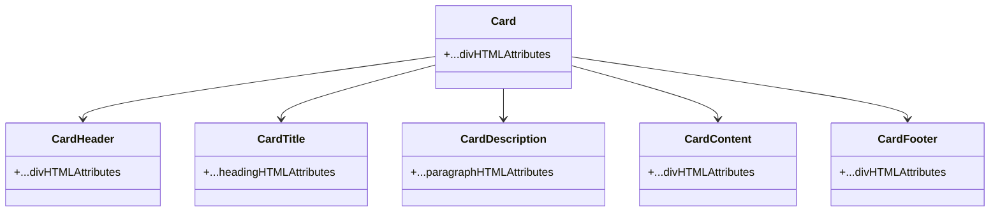

**Diagram sources**
- [card.tsx:4-75](file://src/components/ui/card.tsx#L4-L75)

**Section sources**
- [card.tsx:4-75](file://src/components/ui/card.tsx#L4-L75)

### Badge
- API summary
  - Props: variant (enum), plus standard div HTML attributes.
  - Exports: Badge, badgeVariants.
- Styling approach
  - Circular padding, border, and color variants.
- Customization
  - className merges with variant styles.

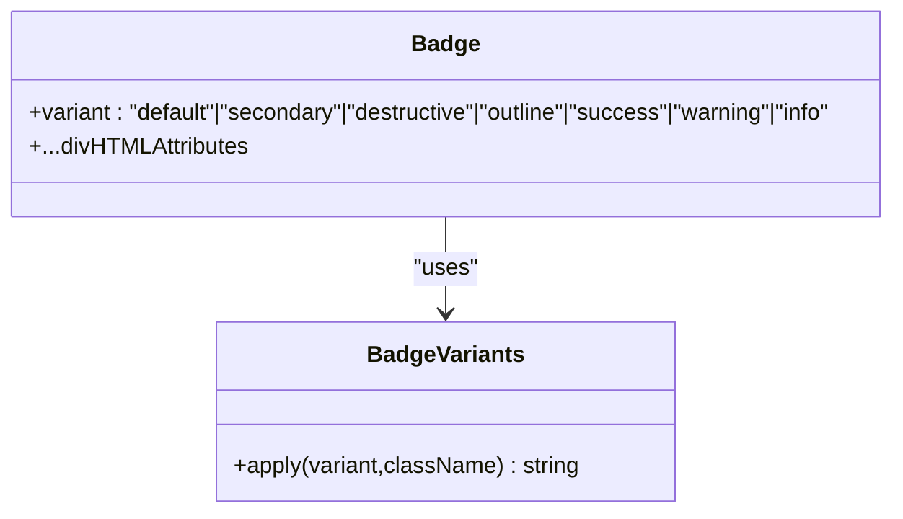

**Diagram sources**
- [badge.tsx:31-39](file://src/components/ui/badge.tsx#L31-L39)

**Section sources**
- [badge.tsx:5-29](file://src/components/ui/badge.tsx#L5-L29)
- [badge.tsx:31-39](file://src/components/ui/badge.tsx#L31-L39)

### Dropdown Menu
- API summary
  - Components: Root, Trigger, Content, Item, CheckboxItem, RadioItem, Label, Separator, Portal, Sub, SubTrigger, SubContent, RadioGroup.
  - Props include inset booleans for indented items and sideOffset for content placement.
- Styling approach
  - Tailwind utilities for background, borders, shadows, and animations driven by Radix open/closed states.
- Customization
  - className augments base styles; icons indicate selection states.

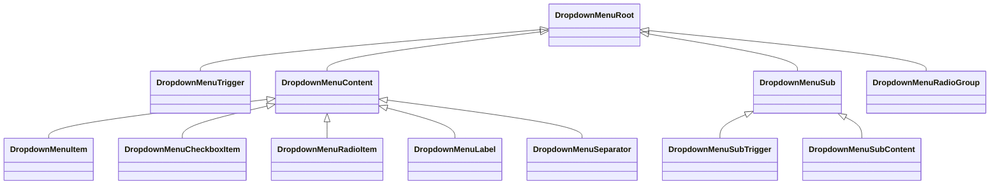

**Diagram sources**
- [dropdown-menu.tsx:6-189](file://src/components/ui/dropdown-menu.tsx#L6-L189)

**Section sources**
- [dropdown-menu.tsx:13-189](file://src/components/ui/dropdown-menu.tsx#L13-L189)

### Tabs
- API summary
  - Components: Root, List, Trigger, Content.
  - Active state styling applied via data attribute.
- Styling approach
  - Background for list; active trigger gets background and foreground colors with shadow.

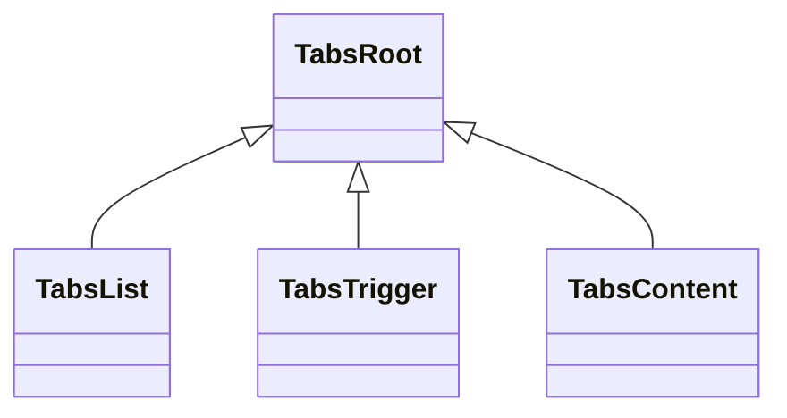

**Diagram sources**
- [tabs.tsx:5-52](file://src/components/ui/tabs.tsx#L5-L52)

**Section sources**
- [tabs.tsx:7-50](file://src/components/ui/tabs.tsx#L7-L50)

### Avatar
- API summary
  - Components: Root, Image, Fallback.
- Styling approach
  - Circular container; fallback uses themed background and text.

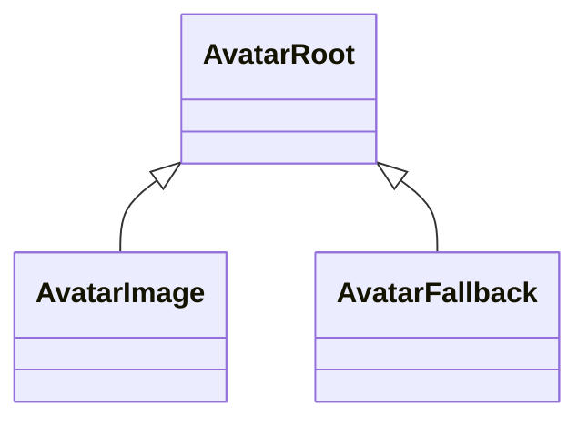

**Diagram sources**
- [avatar.tsx:5-47](file://src/components/ui/avatar.tsx#L5-L47)

**Section sources**
- [avatar.tsx:5-47](file://src/components/ui/avatar.tsx#L5-L47)

### Label
- API summary
  - Props: Inherits variant behavior via class variance authority.
  - Exports: Label.
- Styling approach
  - Typography and disabled state handling via utility classes.

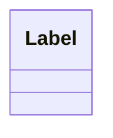

**Diagram sources**
- [label.tsx:10-20](file://src/components/ui/label.tsx#L10-L20)

**Section sources**
- [label.tsx:6-8](file://src/components/ui/label.tsx#L6-L8)
- [label.tsx:10-20](file://src/components/ui/label.tsx#L10-L20)

### Separator
- API summary
  - Props: orientation ("horizontal" | "vertical"), decorative (boolean).
  - Exports: Separator.
- Styling approach
  - Single pixel thickness aligned horizontally or vertically.

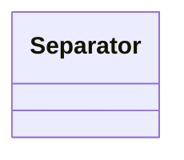

**Diagram sources**
- [separator.tsx:5-26](file://src/components/ui/separator.tsx#L5-L26)

**Section sources**
- [separator.tsx:5-26](file://src/components/ui/separator.tsx#L5-L26)

## Dependency Analysis
- Internal dependencies
  - All components depend on the shared utility function for class merging.
- External dependencies
  - Radix UI primitives for accessible base behavior.
  - Class Variance Authority for variant composition.
  - Lucide React for icons in dropdown components.

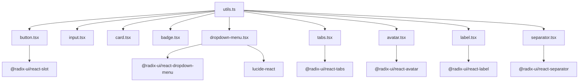

**Diagram sources**
- [utils.ts:1-6](file://src/lib/utils.ts#L1-L6)
- [button.tsx:1-4](file://src/components/ui/button.tsx#L1-L4)
- [dropdown-menu.tsx:1-4](file://src/components/ui/dropdown-menu.tsx#L1-L4)
- [avatar.tsx:1-3](file://src/components/ui/avatar.tsx#L1-L3)
- [label.tsx:1-3](file://src/components/ui/label.tsx#L1-L3)
- [tabs.tsx:1-3](file://src/components/ui/tabs.tsx#L1-L3)
- [separator.tsx:1-3](file://src/components/ui/separator.tsx#L1-L3)

**Section sources**
- [utils.ts:1-6](file://src/lib/utils.ts#L1-L6)
- [button.tsx:1-4](file://src/components/ui/button.tsx#L1-L4)
- [dropdown-menu.tsx:1-4](file://src/components/ui/dropdown-menu.tsx#L1-L4)
- [avatar.tsx:1-3](file://src/components/ui/avatar.tsx#L1-L3)
- [label.tsx:1-3](file://src/components/ui/label.tsx#L1-L3)
- [tabs.tsx:1-3](file://src/components/ui/tabs.tsx#L1-L3)
- [separator.tsx:1-3](file://src/components/ui/separator.tsx#L1-L3)

## Performance Considerations
- Prefer passing minimal className overrides to avoid excessive concatenation.
- Reuse variant tokens rather than duplicating inline styles.
- Use asChild judiciously to avoid unnecessary DOM nodes.
- Keep dropdown content lightweight to minimize animation overhead.

## Accessibility Considerations
- Buttons: Native button semantics; disabled state supported; focus-visible ring ensures keyboard operability.
- Inputs: Proper focus rings and disabled states; use Label to associate labels with inputs.
- Dropdowns: Keyboard navigation, ARIA roles, and portal rendering for proper z-index stacking.
- Tabs: Data attributes manage active state; focus-visible rings for keyboard navigation.
- Avatars: Semantic fallbacks; images support loading/error handling via Radix primitives.
- Labels: Leverage Radix label semantics for form controls.
- Separators: Decorative vs structural intent controlled via prop.

## Responsive Design Patterns
- Components rely on utility classes for padding, spacing, and typography scales; adjust className to adapt to breakpoints.
- Use container utilities to constrain widths and center content where appropriate.
- Avoid fixed widths in favor of max-width and padding for mobile-first layouts.

## Integration with Radix UI and Tailwind CSS
- Radix UI
  - Provides accessible base behavior (focus management, ARIA, keyboard navigation).
  - Components wrap primitives to apply consistent styling.
- Tailwind CSS
  - Utility classes compose base styles, variants, and responsive modifiers.
  - The shared utility function merges classes safely, preventing conflicts.

## Usage Examples
Below are example references for typical usage patterns. Replace placeholders with your data and handlers.

- Button
  - Example reference: [button usage example:39-50](file://src/components/ui/button.tsx#L39-L50)
- Input
  - Example reference: [input usage example:7-22](file://src/components/ui/input.tsx#L7-L22)
- Card
  - Example reference: [card usage example:4-75](file://src/components/ui/card.tsx#L4-L75)
- Badge
  - Example reference: [badge usage example:35-39](file://src/components/ui/badge.tsx#L35-L39)
- Dropdown Menu
  - Example reference: [dropdown usage example:6-189](file://src/components/ui/dropdown-menu.tsx#L6-L189)
- Tabs
  - Example reference: [tabs usage example:5-52](file://src/components/ui/tabs.tsx#L5-L52)
- Avatar
  - Example reference: [avatar usage example:5-47](file://src/components/ui/avatar.tsx#L5-L47)
- Label
  - Example reference: [label usage example:10-20](file://src/components/ui/label.tsx#L10-L20)
- Separator
  - Example reference: [separator usage example:5-26](file://src/components/ui/separator.tsx#L5-L26)

## Troubleshooting Guide
- Class conflicts
  - Symptom: Styles overwritten unexpectedly.
  - Resolution: Use the shared utility function to merge classes; avoid duplicating base styles.
  - Reference: [utility function:4-6](file://src/lib/utils.ts#L4-L6)
- Variant mismatches
  - Symptom: Unexpected colors or sizes.
  - Resolution: Verify variant and size tokens match exported enums.
  - References:
    - [Button variants:9-24](file://src/components/ui/button.tsx#L9-L24)
    - [Badge variants:8-23](file://src/components/ui/badge.tsx#L8-L23)
- Disabled states
  - Symptom: Pointer events still active or opacity incorrect.
  - Resolution: Ensure disabled prop is passed; confirm Tailwind disabled utilities are present.
  - References:
    - [Button disabled](file://src/components/ui/button.tsx#L7)
    - [Input disabled:12-15](file://src/components/ui/input.tsx#L12-L15)
- Focus visibility
  - Symptom: Missing focus ring.
  - Resolution: Ensure focus-visible ring utilities are included; verify asChild does not suppress focus styles.
  - References:
    - [Button focus ring](file://src/components/ui/button.tsx#L7)
    - [Input focus ring:12-15](file://src/components/ui/input.tsx#L12-L15)
- Dropdown positioning
  - Symptom: Content clipped or misaligned.
  - Resolution: Adjust sideOffset; ensure Portal renders content outside clipping contexts.
  - Reference: [Dropdown content:52-64](file://src/components/ui/dropdown-menu.tsx#L52-L64)

**Section sources**
- [utils.ts:4-6](file://src/lib/utils.ts#L4-L6)
- [button.tsx:7-31](file://src/components/ui/button.tsx#L7-L31)
- [input.tsx:12-15](file://src/components/ui/input.tsx#L12-L15)
- [dropdown-menu.tsx:52-64](file://src/components/ui/dropdown-menu.tsx#L52-L64)

## Conclusion
The NexaMed UI component library provides accessible, theme-aligned primitives built on Radix UI and Tailwind CSS. Each component exposes a clear API, consistent variants, and safe class composition via a shared utility. By following the documented patterns and references, teams can maintain visual coherence and strong UX across the application.