# Manual de Usuario - NexaMed
## Sistema de Gestión Clínica Inteligente

---

## 1. Introducción

**NexaMed** es un sistema de gestión clínica diseñado para facilitar el manejo de pacientes, consultas, citas y órdenes médicas en consultorios y clínicas médicas.

### Acceso al Sistema
- **URL:** `https://nexamed.up.railway.app`
- **Credenciales:** Proporcionadas por el administrador del sistema
- **Navegadores recomendados:** Chrome, Firefox, Edge (últimas versiones)

---

## 2. Primer Inicio de Sesión

### 2.1 Pantalla de Login

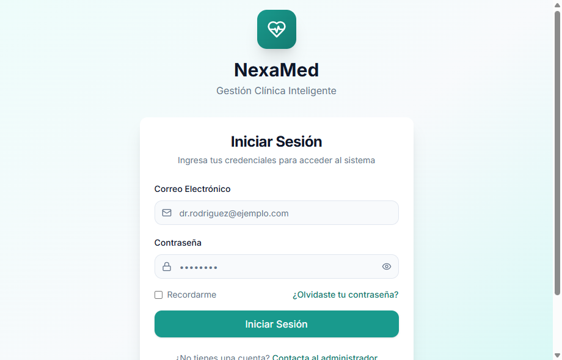

Al acceder al sistema, verá la pantalla de inicio de sesión con el logo de NexaMed.

**Pasos para iniciar sesión:**
1. Ingrese su **correo electrónico** en el campo "Email"
2. Ingrese su **contraseña** en el campo "Contraseña"
3. Haga clic en el botón **"Iniciar Sesión"**

> **Nota de seguridad:** Si olvida su contraseña, contacte al administrador del sistema. Por seguridad, no se permite la recuperación automática.

---

## 3. Dashboard Principal

### 3.1 Vista General

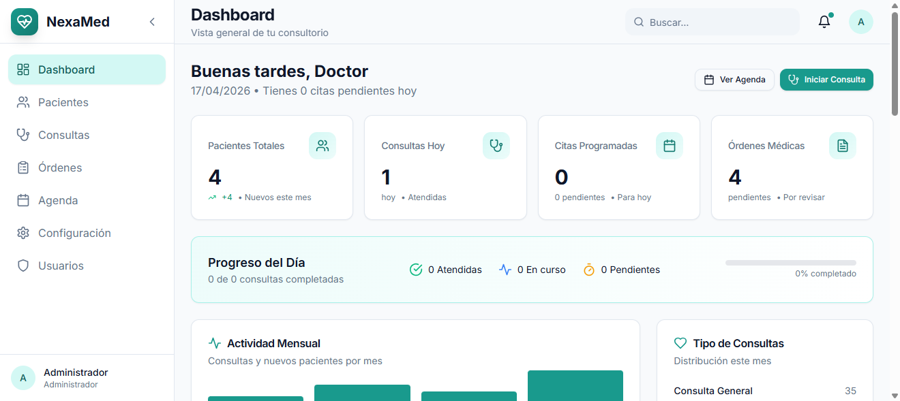

El Dashboard es la pantalla principal que se muestra después de iniciar sesión. Proporciona un resumen completo de la actividad del consultorio.

**Elementos principales:**

| Tarjeta | Descripción | Acción |
|---------|-------------|--------|
| **Total Pacientes** | Número total de pacientes registrados | Clic para ver lista completa |
| **Consultas Hoy** | Consultas programadas para hoy | Clic para ver detalles |
| **Citas Pendientes** | Citas que requieren confirmación | Clic para gestionar |
| **Órdenes Activas** | Órdenes médicas pendientes | Clic para revisar |

**Navegación:**
- Use el **menú lateral izquierdo** para acceder a todos los módulos
- El **panel superior** muestra el usuario actual y acceso a configuración
- La **sección de actividad reciente** muestra las últimas acciones en el sistema

---

## 4. Gestión de Pacientes

### 4.1 Lista de Pacientes

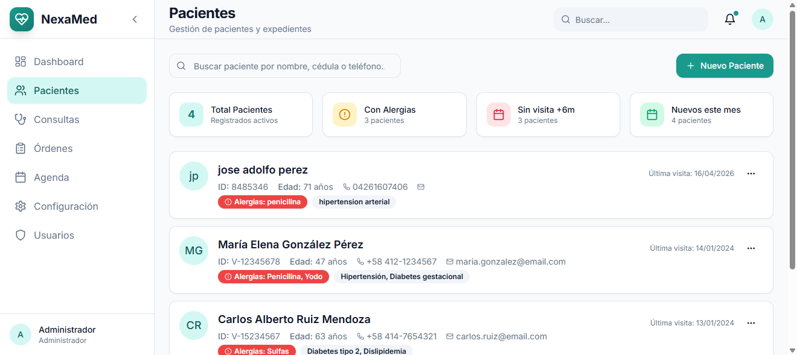

La vista de pacientes muestra todos los pacientes registrados en el sistema.

**Funciones disponibles:**
- **🔍 Buscador:** Encuentre pacientes por nombre, apellido o cédula
- **➕ Nuevo Paciente:** Botón verde superior para registrar un nuevo paciente
- **👁️ Ver:** Icono de ojo para ver detalles completos
- **✏️ Editar:** Icono de lápiz para modificar información
- **🗑️ Eliminar:** Icono de basura para eliminar (requiere confirmación)

**Columnas de información:**
- Nombre completo
- Cédula de identidad
- Teléfono
- Última visita
- Acciones disponibles

### 4.2 Crear Nuevo Paciente

El formulario de creación está organizado en **4 pestañas** para facilitar el registro:

#### Pestaña 1: Información Personal

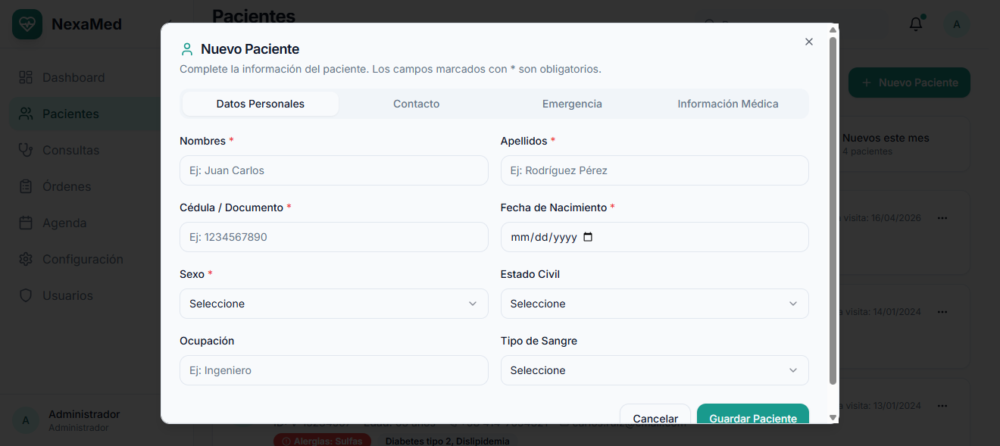

**Campos obligatorios:**
- ✅ Nombres
- ✅ Apellidos
- ✅ Cédula de Identidad
- ✅ Fecha de Nacimiento (use el selector de fecha)
- ✅ Sexo (Masculino/Femenino)

**Campos opcionales:**
- Estado civil
- Ocupación

#### Pestaña 2: Contacto

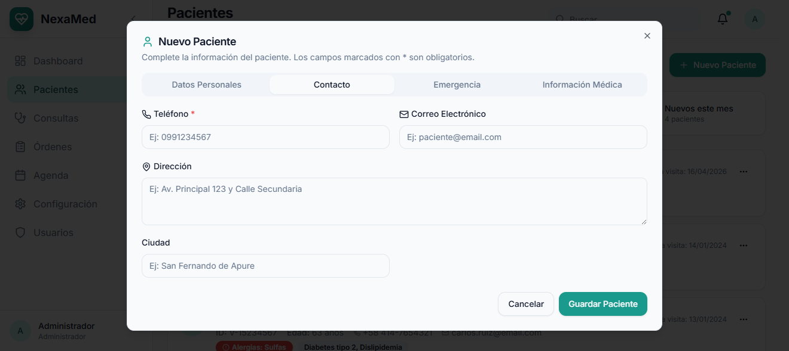

**Datos de contacto:**
- Teléfono principal
- Correo electrónico
- Dirección completa
- Ciudad

> **Tip:** Mantenga actualizada esta información para poder contactar al paciente cuando sea necesario.

#### Pestaña 3: Información Médica

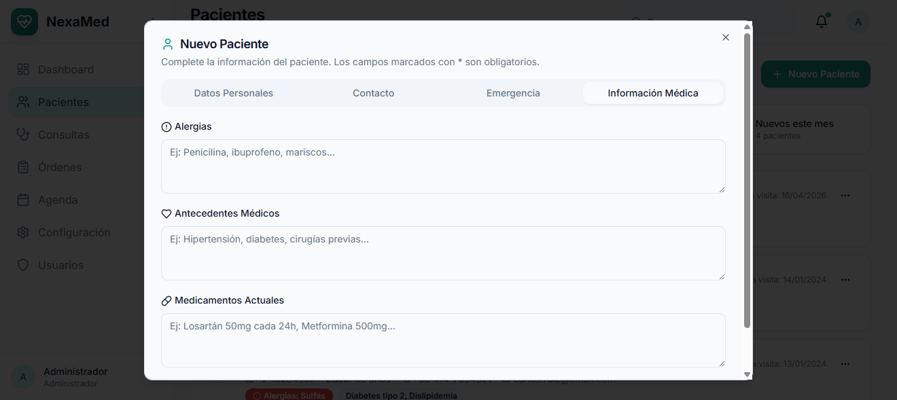

**Información clínica importante:**
- **Tipo de sangre:** Seleccione del dropdown (A+, A-, B+, B-, AB+, AB-, O+, O-)
- **Alergias:** Liste todas las alergias conocidas separadas por comas
- **Antecedentes médicos:** Enfermedades previas importantes
- **Medicamentos actuales:** Tratamientos en curso

#### Pestaña 4: Contacto de Emergencia

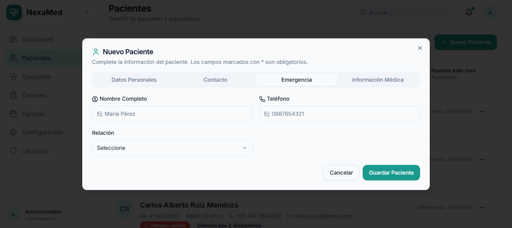

**Persona de contacto en caso de emergencia:**
- Nombre completo
- Teléfono
- Relación con el paciente (familiar, amigo, etc.)

**Para guardar:**
1. Complete todos los campos obligatorios
2. Navegue hasta la última pestaña
3. Haga clic en **"Guardar Paciente"**

### 4.3 Ver Detalles del Paciente

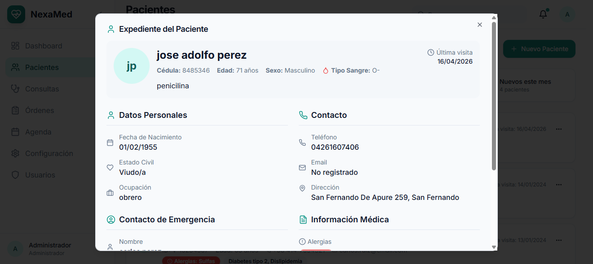

El modal de visualización muestra toda la información del paciente organizada por secciones:

- **Información Personal:** Datos básicos y demográficos
- **Información de Contacto:** Teléfonos y dirección
- **Información Médica:** Tipo de sangre, alergias, antecedentes
- **Contacto de Emergencia:** Persona responsable

Desde esta vista puede:
- **Editar:** Modificar cualquier información
- **Ir a Expediente:** Ver historial clínico completo
- **Cerrar:** Volver a la lista

### 4.4 Editar Paciente

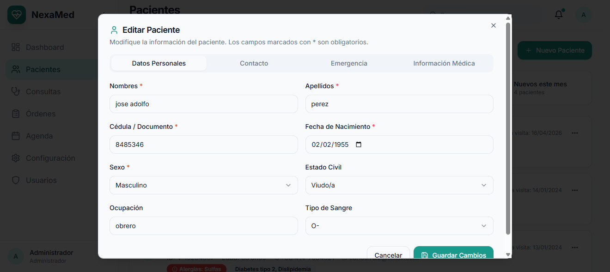

El formulario de edición tiene la misma estructura de 4 pestañas que la creación.

**Características:**
- Todos los campos vienen prellenados con la información actual
- Modifique solo los campos necesarios
- Los cambios se guardan al hacer clic en "Guardar Cambios"
- Puede cancelar sin guardar

### 4.5 Eliminar Paciente

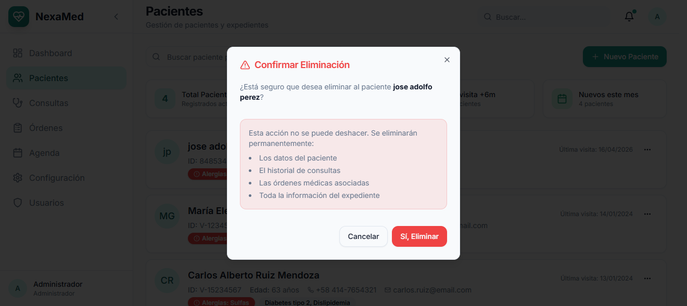

> **⚠️ Advertencia:** Esta acción es **irreversible**. El paciente y todo su historial serán eliminados permanentemente.

**Confirmación requerida:**
- Se muestra el nombre del paciente a eliminar
- Debe hacer clic en **"Eliminar"** para confirmar
- O en **"Cancelar"** para abortar la operación

---

## 5. Expediente Clínico

### 5.1 Vista del Expediente

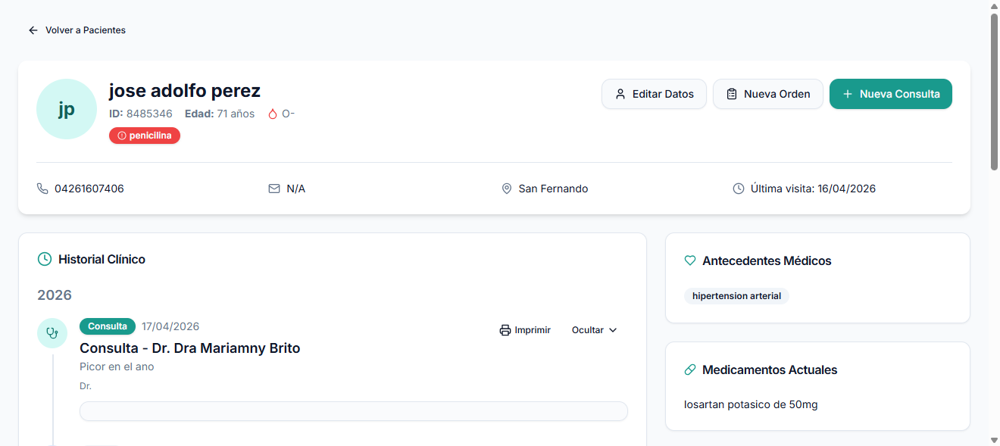

El expediente clínico es el corazón del sistema. Muestra el historial completo del paciente.

**Estructura del expediente:**

1. **Información del Paciente (parte superior)**
   - Nombre, cédula, edad
   - Tipo de sangre y alergias destacadas
   - Teléfono de contacto

2. **Acciones Rápidas**
   - **📝 Nueva Consulta:** Inicia una consulta médica
   - **📋 Nueva Orden:** Crea orden de laboratorio o imagenología
   - **✏️ Editar:** Modifica datos del paciente

3. **Timeline de Consultas**
   - Lista cronológica de todas las consultas
   - Muestra fecha, motivo y médico tratante
   - Clic para ver detalles de cada consulta

4. **Órdenes Médicas**
   - Historial de órdenes generadas
   - Estado de cada orden (activa/completada)

---

## 6. Consultas Médicas

### 6.1 Nueva Consulta (Formato SOAP)

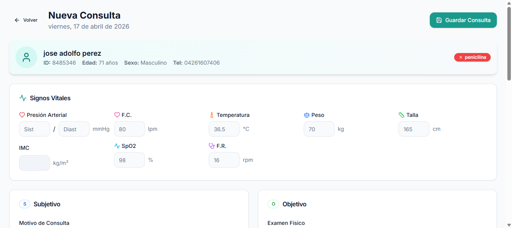

El sistema utiliza el formato **SOAP** estándar para el registro de consultas médicas.

**Estructura SOAP:**

| Sección | Campo | Descripción |
|---------|-------|-------------|
| **S** | Subjetivo | Síntomas que el paciente refiere |
| **O** | Objetivo | Hallazgos del examen físico |
| **A** | Análisis | Diagnóstico presuntivo o definitivo |
| **P** | Plan | Tratamiento, recetas, indicaciones |

**Signos Vitales (obligatorios):**
- Presión arterial (sistólica/diastólica)
- Frecuencia cardíaca (latidos por minuto)
- Frecuencia respiratoria (respiraciones por minuto)
- Temperatura (°C)
- Peso (kg) y Talla (m) - el IMC se calcula automático
- Saturación de oxígeno (%)

**Diagnósticos:**
- Agregue diagnósticos usando código CIE-10
- Especifique si es principal o secundario

**Medicamentos:**
- Nombre del medicamento
- Dosis y frecuencia
- Duración del tratamiento
- Indicaciones especiales

### 6.2 Imprimir Consulta

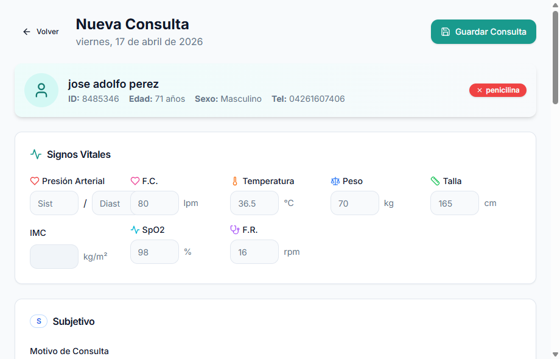

**Vista de impresión:**
- Formato limpio y profesional
- Incluye datos del consultorio (configurable)
- Información completa del paciente
- Signos vitales registrados
- Contenido SOAP completo
- Diagnósticos y medicamentos

**Para imprimir:**
1. Haga clic en el botón **"Imprimir"** (esquina superior derecha)
2. Use la función de impresión del navegador (Ctrl+P)
3. Seleccione "Guardar como PDF" si desea archivo digital

---

## 7. Órdenes Médicas

### 7.1 Tipos de Órdenes Disponibles

El sistema permite crear tres tipos de órdenes médicas:

1. **🧪 Laboratorio:** Exámenes de sangre, orina, química sanguínea, etc.
2. **🔬 Imagenología:** Rayos X, ultrasonido, tomografías, resonancias
3. **👨‍⚕️ Interconsulta:** Derivación a otras especialidades médicas

### 7.2 Crear Nueva Orden

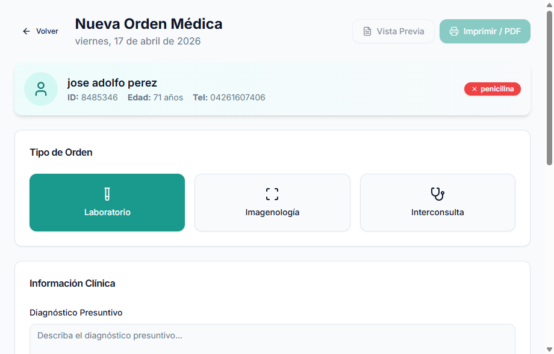

**Pasos para crear una orden:**

1. **Seleccione el Tipo de Orden**
   - Laboratorio (seleccionado por defecto)
   - Imagenología
   - Interconsulta

2. **Complete la Información Clínica**
   - Diagnóstico presuntivo
   - Prioridad: Normal o Urgente
   - Observaciones adicionales

3. **Seleccione los Exámenes**
   - Use el buscador para encontrar exámenes
   - Haga clic en el examen para agregarlo
   - Agregue indicaciones específicas por examen
   - Elimine exámenes con el botón X si es necesario

4. **Vista Previa**
   - Revise la orden antes de guardar
   - Verifique diagnóstico y exámenes seleccionados

5. **Guarde la Orden**
   - Haga clic en **"Guardar Orden"**
   - O en **"Imprimir / PDF"** para generar documento

### 7.3 Imprimir Orden

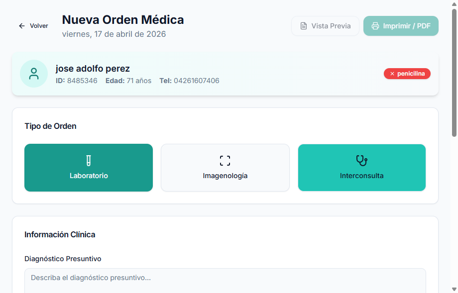

La orden impresa incluye:
- Encabezado con datos del consultorio
- Información del paciente
- Tipo de orden y número único
- Lista de exámenes solicitados
- Indicaciones del médico
- Espacio para firma

---

## 8. Agenda y Citas

### 8.1 Vista del Calendario

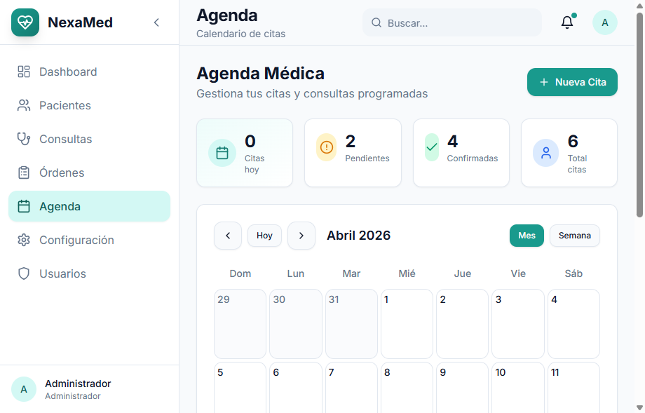

El módulo de agenda muestra un calendario interactivo con todas las citas programadas.

**Vistas disponibles:**
- **Mes:** Vista general del mes completo
- **Semana:** Detalle de la semana seleccionada
- **Día:** Agenda hora por hora

**Navegación:**
- Use las flechas para cambiar de mes/semana/día
- Haga clic en "Hoy" para volver a la fecha actual
- Los colores indican el estado de las citas

### 8.2 Crear Nueva Cita

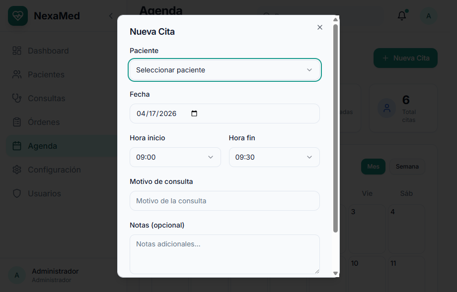

**Pasos para programar una cita:**

1. Haga clic en el día deseado o en el botón **"Nueva Cita"**

2. Complete el formulario:
   - **Paciente:** Busque y seleccione el paciente
   - **Fecha:** Seleccione del calendario
   - **Hora:** Elija la hora disponible
   - **Motivo:** Describa el motivo de la consulta
   - **Estado:** Pendiente o Confirmada

3. Haga clic en **"Guardar Cita"**

> **Validación:** El sistema no permite crear citas en fechas pasadas.

### 8.3 Estados de Cita

| Estado | Color | Descripción |
|--------|-------|-------------|
| **Pendiente** | 🟡 Amarillo | Cita programada, esperando confirmación |
| **Confirmada** | 🟢 Verde | Paciente confirmó asistencia |
| **Completada** | 🔵 Azul | Consulta realizada exitosamente |
| **Cancelada** | 🔴 Rojo | Cita cancelada por el paciente o médico |

**Cambio de estado:**
- Haga clic en la cita en el calendario
- Seleccione el nuevo estado del dropdown
- Guarde los cambios

---

## 9. Configuración

### 9.1 Perfil del Usuario

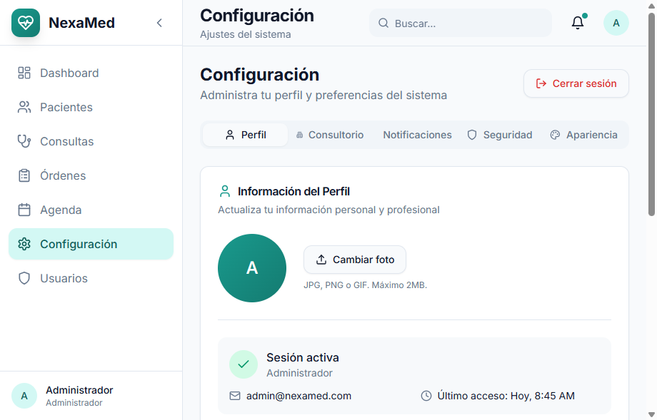

Acceda a Configuración desde el menú lateral para personalizar su cuenta.

**Datos que puede modificar:**
- **Nombre completo:** Su nombre como aparecerá en el sistema
- **Correo electrónico:** Para notificaciones y login
- **Teléfono:** Contacto profesional
- **Especialidad:** Su especialidad médica
- **Número de Registro:** Registro médico o colegiado
- **Biografía:** Información profesional adicional

**Para guardar cambios:**
1. Modifique los campos deseados
2. Haga clic en **"Guardar cambios"**
3. Espere la confirmación de éxito

### 9.2 Información del Consultorio

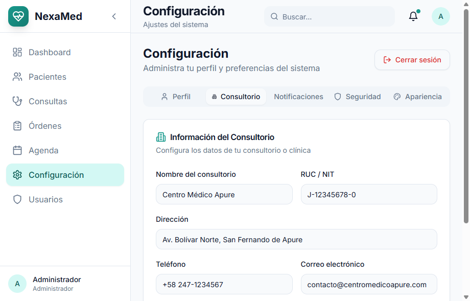

Estos datos aparecerán en todos los documentos impresos (recetas, órdenes, informes).

**Datos del consultorio:**
- **Nombre del consultorio:** Nombre oficial
- **RIF/RUC:** Identificación fiscal
- **Dirección:** Dirección completa
- **Teléfono:** Teléfono principal
- **Correo electrónico:** Email institucional
- **Horario de atención:** Horario de atención al público

> **⚠️ Importante:** Actualice estos datos para que aparezcan correctamente en las recetas y órdenes médicas.

### 9.3 Cambiar Contraseña

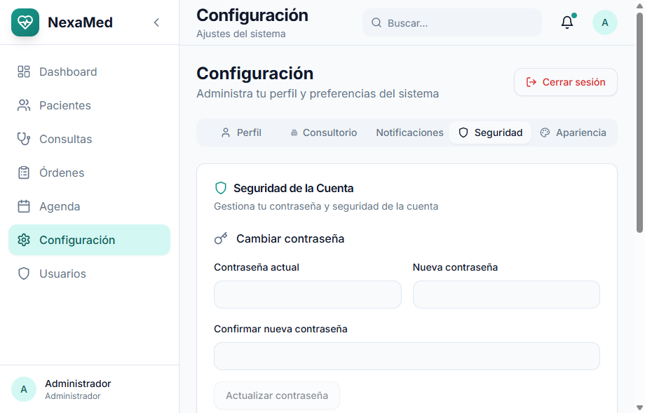

**Requisitos de seguridad:**
- Contraseña actual (para verificar identidad)
- Nueva contraseña (mínimo 6 caracteres)
- Confirmar nueva contraseña (debe coincidir)

**Pasos:**
1. Ingrese su contraseña actual
2. Escriba la nueva contraseña
3. Confirme la nueva contraseña
4. Haga clic en **"Actualizar contraseña"**

---

## 10. Gestión de Usuarios (Solo Administrador)

### 10.1 Lista de Usuarios

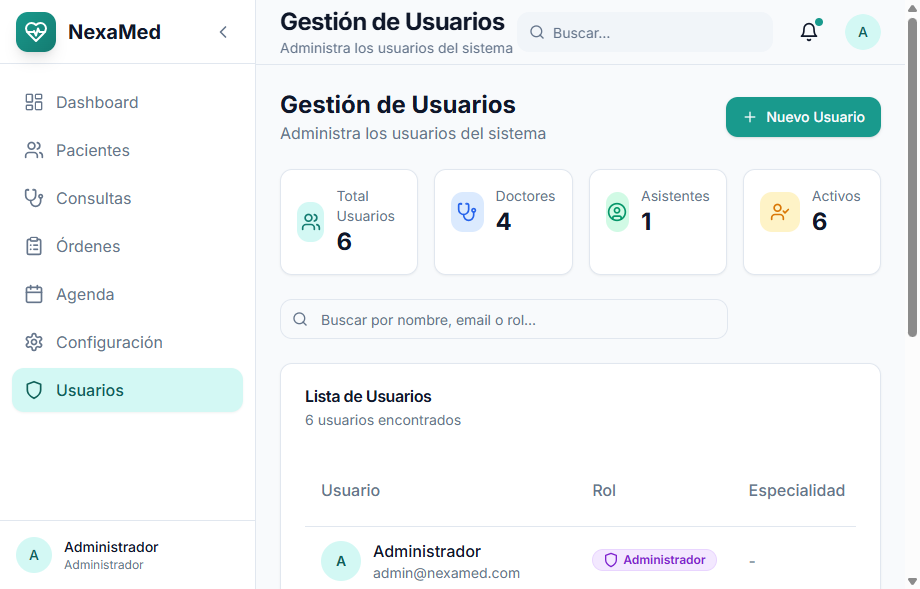

El administrador tiene acceso al módulo de gestión de usuarios para administrar el personal del consultorio.

**Funciones disponibles:**
- **Crear usuario:** Agregar nuevos médicos o asistentes
- **Editar permisos:** Modificar el rol de los usuarios
- **Activar/Desactivar:** Habilitar o deshabilitar cuentas
- **Restablecer contraseña:** Generar nueva contraseña temporal

### 10.2 Roles del Sistema

| Rol | Permisos | Uso recomendado |
|-----|----------|-----------------|
| **Administrador** | Acceso total a todas las funciones | Gerentes, dueños del consultorio |
| **Doctor** | Pacientes, consultas, órdenes, agenda | Médicos tratantes |
| **Asistente** | Pacientes, agenda, ver consultas (solo lectura) | Recepcionistas, asistentes médicos |

**Permisos detallados:**

**Administrador:**
- ✅ Todos los módulos
- ✅ Gestión de usuarios
- ✅ Configuración del sistema
- ✅ Reportes y estadísticas

**Doctor:**
- ✅ Crear/editar pacientes
- ✅ Consultas médicas completas
- ✅ Órdenes médicas
- ✅ Agenda de citas
- ❌ Gestión de usuarios

**Asistente:**
- ✅ Crear/editar pacientes
- ✅ Agenda de citas
- ✅ Ver consultas (solo lectura)
- ❌ Crear consultas
- ❌ Órdenes médicas
- ❌ Gestión de usuarios

---

## 11. Consejos y Buenas Prácticas

### 11.1 Navegación Eficiente

- **Use el buscador global:** Encuentre pacientes rápidamente sin navegar por listas
- **Dashboard como inicio:** Los accesos directos llevan a las funciones más usadas
- **Atajos de teclado:** 
  - `Ctrl + B`: Búsqueda rápida
  - `Esc`: Cerrar modales

### 11.2 Gestión de Pacientes

- **Mantenga datos actualizados:** Especialmente teléfonos y contacto de emergencia
- **Registre alergias:** Siempre pregunte y registre alergias en la primera visita
- **Antecedentes completos:** Un historial detallado mejora la atención médica
- **Verifique la cédula:** Evite duplicados verificando antes de crear

### 11.3 Consultas Médicas

- **Complete todos los campos SOAP:** Facilita el seguimiento del paciente
- **Signos vitales siempre:** Son obligatorios para estadísticas y control
- **Diagnósticos con CIE-10:** Use códigos estandarizados para reportes
- **Medicamentos claros:** Especifique dosis, frecuencia y duración completas

### 11.4 Órdenes Médicas

- **Indicaciones específicas:** Agregue instrucciones claras para cada examen
- **Prioridad apropiada:** Marque "Urgente" solo cuando sea necesario
- **Imprima siempre:** Entregue la orden impresa al paciente
- **Revise antes de guardar:** Verifique diagnóstico y exámenes seleccionados

### 11.5 Agenda de Citas

- **Confirme citas:** Cambie el estado a "Confirmada" cuando el paciente confirme
- **Bloquee horarios:** Use estados para organizar su disponibilidad
- **Evite sobrecarga:** No programe citas en horarios ya ocupados
- **Recordatorios:** El sistema muestra citas del día en el Dashboard

---

## 12. Soporte Técnico

### Contacto

| Canal | Información |
|-------|-------------|
| **Email** | soporte@nexamed.com |
| **Teléfono** | +58 247-1234567 |
| **WhatsApp** | +58 412-9876543 |

### Horario de Atención

- **Lunes a Viernes:** 8:00 AM - 5:00 PM
- **Sábados:** 9:00 AM - 1:00 PM
- **Emergencias:** 24/7 (solo para problemas críticos del sistema)

### Reporte de Problemas

Al reportar un problema, incluya:
1. Descripción detallada del error
2. Pasos para reproducirlo
3. Captura de pantalla (si aplica)
4. Navegador y versión utilizada
5. Usuario y fecha/hora del incidente

---

## Resumen de Accesos Rápidos

| Función | Ruta de Acceso | Atajo |
|---------|---------------|-------|
| Dashboard | Menú principal | Inicio |
| Lista de Pacientes | Menú lateral → Pacientes | `/pacientes` |
| Nuevo Paciente | Pacientes → "Nuevo Paciente" | Botón verde |
| Expediente Clínico | Pacientes → Icono "Ver" | Clic en paciente |
| Nueva Consulta | Expediente → "Nueva Consulta" | Botón azul |
| Nueva Orden | Expediente → "Nueva Orden" | Botón verde |
| Agenda de Citas | Menú lateral → Agenda | `/agenda` |
| Configuración | Menú lateral → Configuración | `/configuracion` |
| Cerrar Sesión | Configuración → "Cerrar sesión" | Botón rojo |

---

## Glosario de Términos

| Término | Descripción |
|---------|-------------|
| **SOAP** | Formato de registro médico: Subjetivo, Objetivo, Análisis, Plan |
| **CIE-10** | Clasificación Internacional de Enfermedades, 10ª revisión |
| **Orden Médica** | Documento que autoriza exámenes o procedimientos médicos |
| **Expediente Clínico** | Historial médico completo de un paciente |
| **Timeline** | Línea de tiempo cronológica de eventos médicos |

---

**Documento versión 2.0**  
**Fecha de elaboración:** Abril 2026  
**Sistema:** NexaMed v1.0 - Gestión Clínica Inteligente  
**Última actualización:** Abril 2026

---

© 2026 Centro Médico Apure - Todos los derechos reservados  
Desarrollado con ❤️ para el sector salud venezolano
