# Manual de Usuario - NexaMed
## Sistema de Gestión Clínica

---

## 1. Introducción

**NexaMed** es un sistema de gestión clínica diseñado para facilitar el manejo de pacientes, consultas, citas y órdenes médicas en consultorios y clínicas médicas.

### Acceso al Sistema
- URL: `https://nexamed.up.railway.app`
- Credenciales proporcionadas por el administrador

---

## 2. Primer Inicio de Sesión

### 2.1 Pantalla de Login

**Pasos para iniciar sesión:**
1. Ingrese su correo electrónico en el campo "Email"
2. Ingrese su contraseña en el campo "Contraseña"
3. Haga clic en el botón **"Iniciar Sesión"**

> **Nota:** Si olvida su contraseña, contacte al administrador del sistema.

---

## 3. Dashboard Principal

### 3.1 Vista General

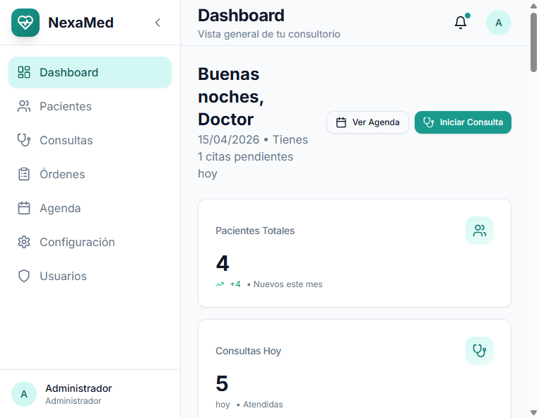

El Dashboard muestra un resumen de la actividad del consultorio:

- **Pacientes Totales**: Número total de pacientes registrados
- **Consultas Hoy**: Consultas programadas para el día actual
- **Citas Pendientes**: Citas que requieren confirmación
- **Órdenes Activas**: Órdenes médicas pendientes

**Navegación:**
Use el menú lateral izquierdo para acceder a los diferentes módulos del sistema.

---

## 4. Gestión de Pacientes

### 4.1 Lista de Pacientes

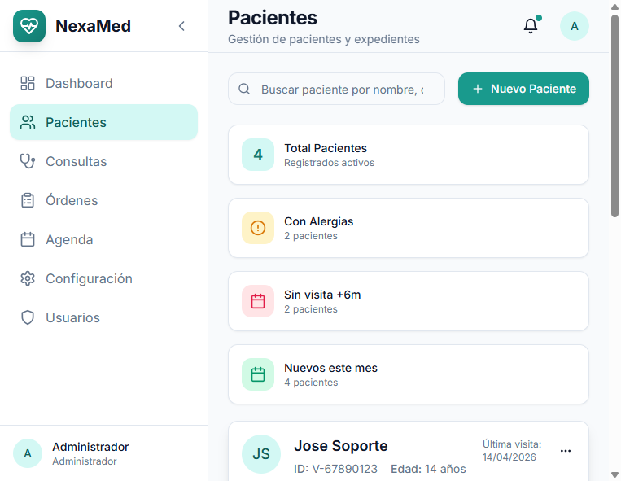

**Funciones disponibles:**
- **Buscar**: Use el campo de búsqueda para encontrar pacientes por nombre o cédula
- **Nuevo Paciente**: Botón verde para registrar un nuevo paciente
- **Ver/Editar/Eliminar**: Acciones disponibles por cada paciente

### 4.2 Crear Nuevo Paciente

El formulario de creación está organizado en pestañas:

#### Pestaña 1: Información Personal

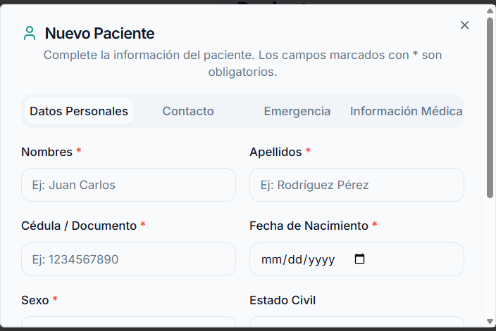

**Campos obligatorios:**
- Nombres y Apellidos
- Cédula de Identidad
- Fecha de Nacimiento
- Sexo

#### Pestaña 2: Contacto

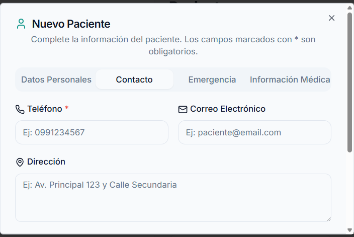

**Datos de contacto:**
- Teléfono principal
- Correo electrónico
- Dirección completa
- Ciudad

#### Pestaña 3: Información Médica

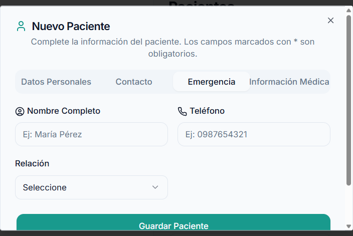

**Información clínica:**
- Tipo de sangre
- Alergias conocidas
- Antecedentes médicos
- Medicamentos actuales

#### Pestaña 4: Contacto de Emergencia

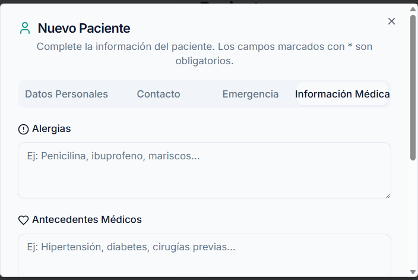

**Persona de contacto en caso de emergencia:**
- Nombre completo
- Teléfono
- Relación con el paciente

> **Tip:** Use los botones "Anterior" y "Siguiente" para navegar entre pestañas. El botón "Guardar" está disponible en la última pestaña.

### 4.3 Ver Detalles del Paciente

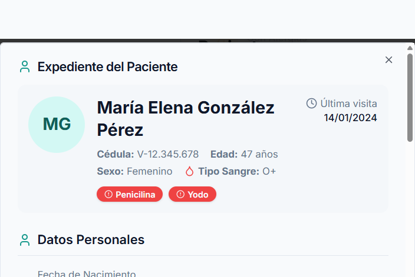

Muestra toda la información del paciente organizada por secciones.

### 4.4 Editar Paciente

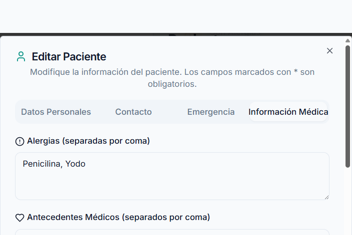

Permite modificar cualquier campo de la información del paciente.

### 4.5 Eliminar Paciente

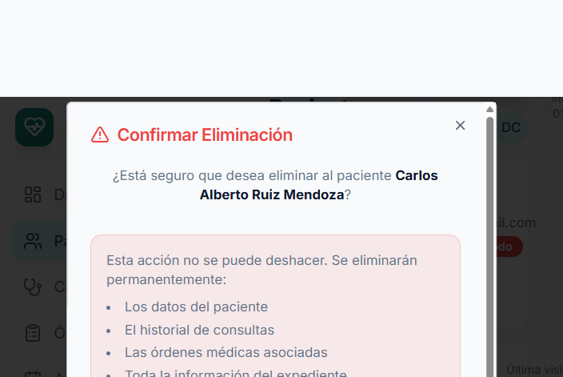

> **Advertencia:** Esta acción es irreversible. Se solicita confirmación antes de eliminar.

---

## 5. Expediente Clínico

### 5.1 Vista del Expediente

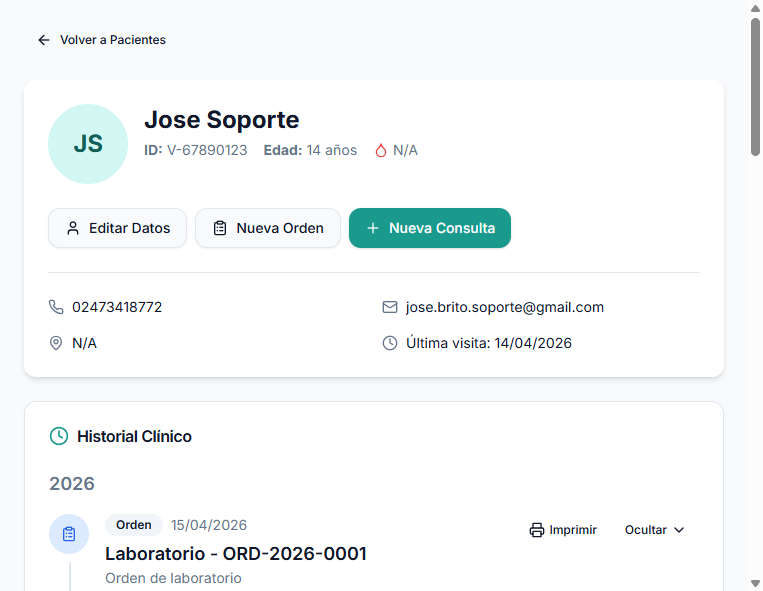

El expediente muestra:
- **Información del paciente** (parte superior)
- **Timeline de consultas** (centro)
- **Órdenes médicas** asociadas
- **Botones de acción** para nueva consulta u orden

**Acciones disponibles:**
- **Nueva Consulta**: Inicia una nueva consulta médica
- **Nueva Orden**: Crea orden de laboratorio, imagenología o interconsulta

---

## 6. Consultas Médicas

### 6.1 Nueva Consulta (Formato SOAP)

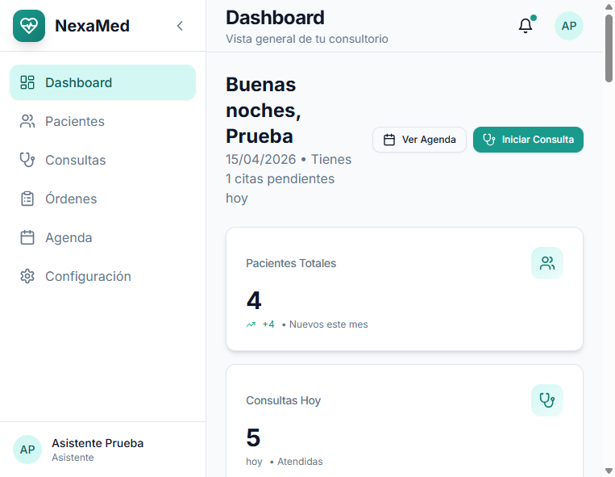

**Estructura SOAP:**

| Sección | Descripción |
|---------|-------------|
| **S - Subjetivo** | Síntomas que describe el paciente |
| **O - Objetivo** | Hallazgos del examen físico |
| **A - Análisis** | Diagnóstico presuntivo |
| **P - Plan** | Tratamiento y recomendaciones |

**Signos Vitales:**
- Presión arterial
- Frecuencia cardíaca
- Temperatura
- Peso y talla (IMC automático)
- Saturación de oxígeno

### 6.2 Imprimir Consulta

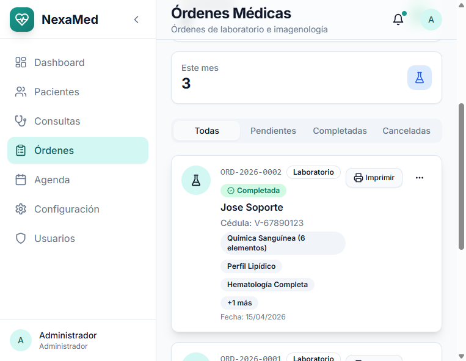

Haga clic en **"Imprimir"** para generar el informe médico en formato PDF.

---

## 7. Órdenes Médicas

### 7.1 Tipos de Órdenes

El sistema permite crear tres tipos de órdenes:

1. **Laboratorio**: Exámenes de sangre, orina, etc.
2. **Imagenología**: Rayos X, ultrasonido, tomografías
3. **Interconsulta**: Derivación a otras especialidades

### 7.2 Crear Orden de Laboratorio

**Pasos:**
1. Seleccione el tipo de orden (Laboratorio)
2. Ingrese el diagnóstico presuntivo
3. Seleccione la prioridad (Normal/Urgente)
4. Busque y agregue los exámenes solicitados
5. Agregue observaciones si es necesario
6. Haga clic en **"Guardar Orden"**

### 7.3 Imprimir Orden

Use el botón **"Imprimir / PDF"** para generar la orden en formato imprimible.

---

## 8. Agenda y Citas

### 8.1 Vista del Calendario

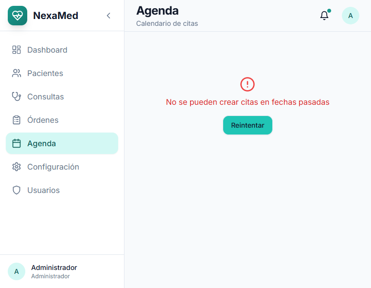

**Vistas disponibles:**
- Vista mensual
- Vista semanal
- Vista diaria

### 8.2 Crear Nueva Cita

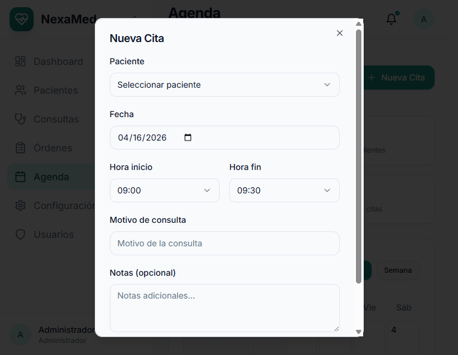

**Pasos:**
1. Haga clic en el día deseado o en el botón "Nueva Cita"
2. Seleccione el paciente
3. Elija la fecha y hora
4. Indique el motivo de la consulta
5. Seleccione el estado (Pendiente/Confirmada)

### 8.3 Estados de Cita

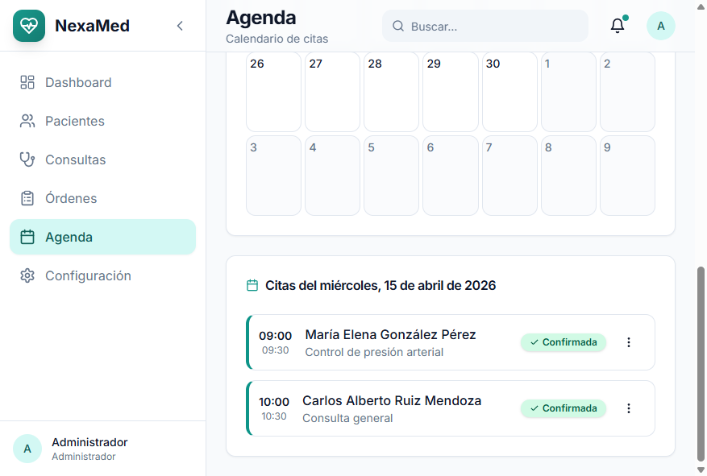

- **Pendiente**: Cita programada sin confirmar
- **Confirmada**: Paciente confirmó asistencia
- **Completada**: Consulta realizada
- **Cancelada**: Cita cancelada

> **Validación:** El sistema no permite crear citas en fechas pasadas.

---

## 9. Configuración

### 9.1 Perfil del Usuario

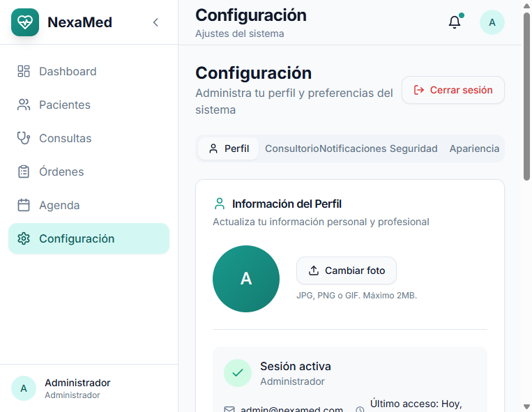

**Datos que puede modificar:**
- Nombre completo
- Correo electrónico
- Teléfono
- Especialidad médica
- Número de registro médico
- Biografía profesional

### 9.2 Información del Consultorio

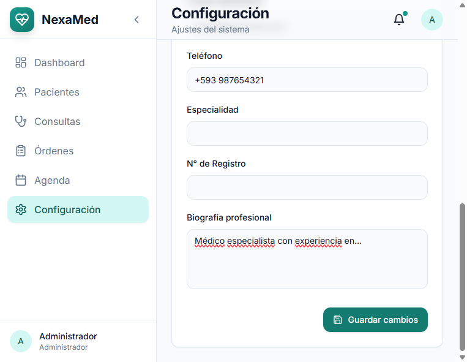

**Datos del consultorio:**
- Nombre del consultorio
- RIF/RUC
- Dirección completa
- Teléfono
- Correo electrónico
- Horario de atención

> **Importante:** Estos datos aparecerán en los documentos impresos (recetas, órdenes, informes).

### 9.3 Cambiar Contraseña

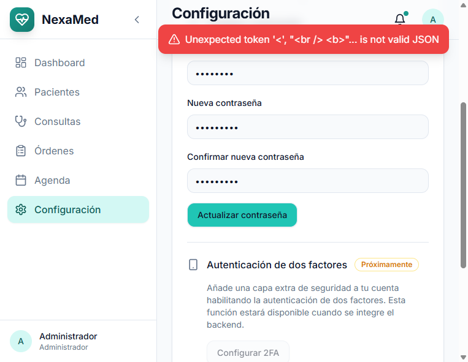

**Requisitos:**
- Contraseña actual
- Nueva contraseña (mínimo 6 caracteres)
- Confirmar nueva contraseña

---

## 10. Gestión de Usuarios (Solo Administrador)

### 10.1 Lista de Usuarios

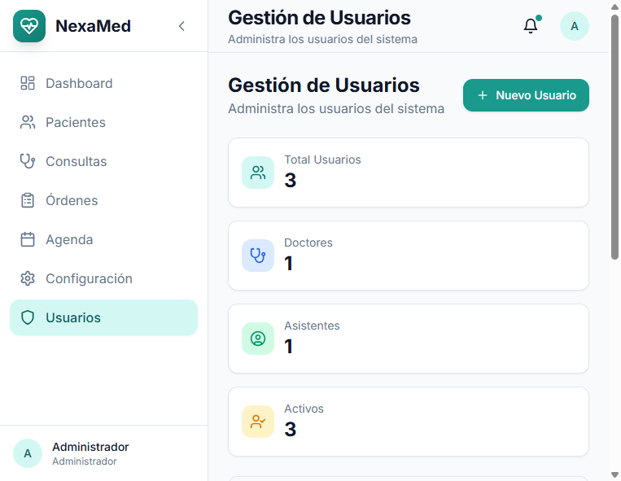

El administrador puede:
- Crear nuevos usuarios (médicos/asistentes)
- Modificar permisos
- Activar/desactivar cuentas
- Restablecer contraseñas

### 10.2 Roles del Sistema

| Rol | Permisos |
|-----|----------|
| **Administrador** | Acceso total al sistema |
| **Doctor** | Pacientes, consultas, órdenes, agenda |
| **Asistente** | Pacientes, agenda (solo lectura en consultas) |

---

## 11. Consejos y Buenas Prácticas

### 11.1 Navegación Rápida
- Use el **buscador global** para encontrar pacientes rápidamente
- Los **accesos directos** en el Dashboard llevan a las funciones más usadas

### 11.2 Gestión de Pacientes
- Mantenga actualizada la **información de contacto**
- Registre **alergias y antecedentes** de forma completa
- Use el **contacto de emergencia** para casos urgentes

### 11.3 Consultas
- Complete todos los campos **SOAP** para un mejor seguimiento
- Los **signos vitales** son obligatorios para estadísticas
- Use el **plan de tratamiento** detallado para recetas claras

### 11.4 Órdenes Médicas
- Especifique **indicaciones claras** para cada examen
- Marque como **"Urgente"** cuando sea necesario
- Imprima siempre la orden para el paciente

---

## 12. Soporte Técnico

### Contacto
- **Email:** soporte@nexamed.com
- **Teléfono:** +58 247-1234567

### Horario de Atención
Lunes a Viernes: 8:00 AM - 5:00 PM

---

## Resumen de Accesos Rápidos

| Función | Ruta de Acceso |
|---------|---------------|
| Dashboard | Menú principal |
| Pacientes | Menú lateral → Pacientes |
| Nueva Consulta | Expediente del paciente → "Nueva Consulta" |
| Nueva Orden | Expediente del paciente → "Nueva Orden" |
| Agenda | Menú lateral → Agenda |
| Configuración | Menú lateral → Configuración |

---

**Documento versión 1.0**  
**Fecha de elaboración:** Abril 2026  
**Sistema:** NexaMed v1.0
